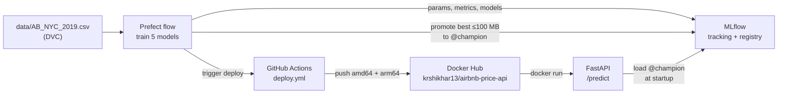

# NYC Airbnb Price Prediction: an end-to-end MLOps practice project

Predicts a New York City Airbnb listing's nightly price (USD) from its location, room type and booking activity. The model is deliberately modest. The point of the project is the **deployment flow around it**: versioned data, tracked experiments, a model registry, a containerised API, scheduled retraining, CI, and continuous deployment triggered by a new model.

**Full step-by-step walkthrough:** [`implementation.md`](implementation.md) covers every command, real output, bug and decision.
**Original spec:** [`Implementation_Plan_NYC_Airbnb_Price_Prediction.md`](Implementation_Plan_NYC_Airbnb_Price_Prediction.md)



## Results

Trained on 38,771 listings and evaluated on 9,693 held-out listings. Errors are in dollars.

| Model | RMSE | MAE | R² | Size |
|---|---|---|---|---|
| RandomForest, 100 trees | $77.53 | $43.39 | 0.479 | 326 MB |
| **RandomForest, 300 trees, depth 10 (champion)** | **$78.75** | **$43.81** | **0.463** | **39 MB** |
| GradientBoosting, 100, lr 0.1 | $81.13 | $44.90 | 0.430 | 3.9 MB |
| GradientBoosting, 200, lr 0.05 | $81.21 | $44.92 | 0.429 | 7.4 MB |
| LinearRegression (baseline) | $83.54 | $47.08 | 0.395 | 0.3 MB |

**Champion rule:** the lowest RMSE among models of **100 MB or less**. The API downloads the champion at startup and keeps it in memory. The unlimited-depth forest is $1.22 better but 8× larger, so the rule skips it and says so. RMSE decides because it penalises large dollar misses most.

## Key decisions

- **Log-price target, built into the model.** Price is heavily skewed (median $106, max $10,000), so models train on `log1p(price)`. `TransformedTargetRegressor` applies `expm1` inside `.predict()`, so every caller gets dollars and nobody can forget the conversion.
- **Cleaning:** drop `$0` prices (11 rows, data errors) and prices above $800 (≈ 99th percentile, 420 rows). Missing `reviews_per_month` means "no reviews", so it's filled with **0**, not the mean.
- **High-cardinality categorical:** `neighbourhood` has 221 values. It's one-hot encoded with `handle_unknown="ignore"`, so an unseen neighbourhood can't crash the API, and a test proves it.
- **The model isn't baked into the image.** The API loads `models:/AirbnbPriceModel@champion` at startup, so a new champion needs a restart, not a rebuild.
- **One shared module** (`features.py`) holds every cleaning and preprocessing rule, so the four training entry points can't drift apart.

## Project layout

| Path | Purpose |
|---|---|
| `features.py` | Load, clean, split, build the model, evaluate |
| `train.py` | Baseline LinearRegression, saved locally |
| `track_experiments.py` | The 5 configs, each logged as an MLflow run (plus model size) |
| `registry.py` | Selection rule, register, move the `@champion` alias |
| `orchestrate_training.py` | Prefect flow: load (with retries) → train ×5 → promote → trigger deploy |
| `schemas.py` / `main.py` | Pydantic validation (NYC bounds, etc.) and the FastAPI app |
| `Dockerfile`, `requirements-serve.txt` | API image: slim, non-root, fails fast if MLflow is down |
| `docker-compose.yml` | MLflow + API together; API gated on MLflow's healthcheck |
| `.github/workflows/ci.yml` | On every PR: throwaway MLflow → seed champion → tests → build image |
| `.github/workflows/deploy.yml` | On demand: build amd64 + arm64 and push to Docker Hub |
| `scripts/` | CI sample and seeding, and `trigger_deploy.py` (GitHub API) |
| `tests/` | 46 tests: features, schemas, API, tracking, registry, deploy trigger, real champion |

## Setup

```bash
uv venv --python 3.11 .venv
source .venv/bin/activate          # in every new terminal
uv pip install -r requirements.txt dvc
dvc pull                           # fetches data/AB_NYC_2019.csv from the DVC remote
```

> ⚠️ If `mlflow` or `prefect` fails with `cannot import name 'service' from 'google.protobuf'`, your terminal is running Anaconda's copy. Check `which mlflow`, then run `conda deactivate` and `source .venv/bin/activate`.

## Run it

**Quickest: Docker Compose** starts the MLflow server (host port 5001) and the API (host port 8001) together. The API waits until MLflow's healthcheck passes:

```bash
docker compose up -d          # MLflow UI → http://127.0.0.1:5001 · API → http://127.0.0.1:8001/docs
docker compose logs -f api    # watch it load @champion
docker compose down           # stop (data stays in ./mlflow.db and ./mlartifacts)
```

Compose reuses this folder's `mlflow.db` and `mlartifacts/`, so don't also run a host `mlflow server` at the same time. After promoting a new champion, run `docker compose restart api`.

**Or run each part by hand.** Each server needs its own terminal, with the venv active. This project runs MLflow on port **5001**, because macOS AirPlay Receiver uses 5000.

```bash
# Terminal 1: MLflow tracking server + registry
mlflow server --backend-store-uri sqlite:///mlflow.db --artifacts-destination ./mlartifacts \
  --host 0.0.0.0 --port 5001 \
  --allowed-hosts "localhost:*,127.0.0.1:*,host.docker.internal:*,mlflow-server:*"

# Terminal 2: Prefect server (for flow history and scheduling)
prefect server start

# Terminal 3: work
export MLFLOW_TRACKING_URI=http://127.0.0.1:5001
python train.py                    # baseline sanity check
python orchestrate_training.py     # retrain all 5 and promote the best to @champion
uvicorn main:app --port 8000       # API → http://127.0.0.1:8000/docs  (pick another port if 8000 is taken)
```

Scheduled weekly retraining (Mondays 03:00 UTC), active while this process runs:
```bash
python orchestrate_training.py --serve
```

Run the published image:
```bash
docker run -d -p 8001:8000 -e MLFLOW_TRACKING_URI=http://host.docker.internal:5001 \
  krshikhar13/airbnb-price-api:latest
curl -s localhost:8001/health
```

Example prediction:
```bash
curl -s -X POST localhost:8000/predict -H 'Content-Type: application/json' -d '{
  "neighbourhood_group": "Manhattan", "neighbourhood": "Midtown",
  "latitude": 40.7549, "longitude": -73.984, "room_type": "Entire home/apt",
  "minimum_nights": 2, "number_of_reviews": 20, "reviews_per_month": 1.0,
  "calculated_host_listings_count": 1, "availability_365": 180}'
# {"predicted_price":244.25,"currency":"USD"}
```

## Tests

```bash
pytest                                              # unit tests; registry tests skip without a server
MLFLOW_TRACKING_URI=http://127.0.0.1:5001 pytest    # + tests against the real @champion
```

## CI/CD

**CI:** every pull request runs `.github/workflows/ci.yml`.
1. The **test** job installs `requirements.txt` and starts a throwaway MLflow server. It then trains a quick baseline on the committed 2,000-row sample (`tests/fixtures/listings_sample.csv`), promotes it to `@champion`, and runs the full test suite.
2. The **build-image** job builds the API Docker image. It runs only if `test` passes, and doesn't push the image anywhere.

CI uses the sample because the real dataset lives in a DVC remote on a laptop, which GitHub's runners can't reach.

**CD:** `.github/workflows/deploy.yml` runs only when triggered, either from the Actions tab or by the Prefect flow after it promotes a new champion (`scripts/trigger_deploy.py`, which needs `GITHUB_REPO` and a fine-grained `GITHUB_TOKEN` with *Actions: Read and write*). It pushes `latest`, `model-v<N>` and the commit SHA to Docker Hub for both `linux/amd64` and `linux/arm64`. It needs the repository secrets `DOCKERHUB_USERNAME` and `DOCKERHUB_TOKEN`.

## Known limitations

- **Modest accuracy (R² ≈ 0.46).** The data has location, room type and booking activity, but nothing about size, bedrooms or amenities.
- **Artifact storage grows** by ~377 MB per retrain, mostly the oversized forest that is never promoted. Old runs need periodic cleanup (`mlflow gc`).
- **The DVC remote and MLflow server are local to one laptop.** A team setup would move both to shared storage (for example S3) and a hosted server.
