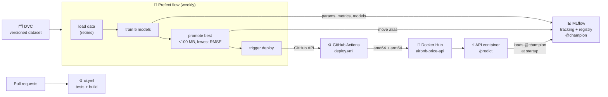

# MLOps from Scratch — NYC Airbnb Price Prediction

> **Project:** predict the nightly price (USD) of a New York City Airbnb listing
> **Dataset:** New York City Airbnb Open Data 2019 (`AB_NYC_2019.csv` — 48,895 listings, 16 columns, **regression**)
> **Goal:** build a complete, working MLOps system — by hand, in the terminal — and understand the *how* and the *why* of every step.
> **For:** anyone who can write basic Python and pandas, has trained a model in a notebook, and has never used Git-for-data, experiment trackers, Docker, orchestrators or CI/CD.
> **Time:** roughly 3–5 days at a relaxed pace (each chapter is 1–3 hours).
> **Platforms:** macOS (every command tested) · Windows via WSL2 (documented, marked 🪟 — see [Setting up on Windows](#setting-up-on-windows-wsl2))

By the end you will have:

- a Git repository with **versioned data** (DVC) and **46 automated tests**,
- **five tracked experiments** and a **model registry** with a `@champion` model chosen by a written rule,
- a **prediction API** (FastAPI) packaged as a **Docker image** published to Docker Hub for Intel and Apple Silicon,
- **scheduled retraining** (Prefect) that promotes a new champion and **triggers its own deployment**,
- **CI** that tests every pull request, and a **one-command local stack** (Docker Compose).

---

## Before We Start — What Is MLOps, and Why Does It Exist?

If you have only trained models in notebooks, words like *DVC, MLflow, Prefect, Docker Compose, GitHub Actions* can feel like a wall. So before any command, let's understand the problem they solve.

### The notebook reality

A typical notebook workflow:

1. Open `Untitled.ipynb`.
2. Load a CSV from your Downloads folder.
3. Clean it, train a model, evaluate.
4. See `RMSE: 78.7`. Feel good.
5. Close the notebook.

That's fine for exploring. It quietly depends on a long list of things that are true *today, on your laptop*: that exact CSV, your pandas version, your Python version, the random seed, the order you ran the cells in. Come back in six months and you usually can't reproduce your own result.

### The production reality

A model that other people rely on has to:

- **run somewhere other than your laptop** — a server, a container, the cloud;
- **answer requests from other software** — a website or app sends a listing, gets a price back;
- **be reproducible** — anyone can retrain it and get the same numbers;
- **be updatable** — new data arrives, the model is retrained and replaced *safely*;
- **be auditable** — *"which model served prices last Tuesday, and what data trained it?"*

A notebook does none of this. **MLOps** is the set of practices and tools that closes the gap.

### What MLOps actually is

MLOps is **DevOps for machine learning**. Some parts are ordinary software engineering; some exist only because ML depends on *data* and produces *models*:

| Need | Tool in this guide | ML-specific? |
|---|---|---|
| Version the code | Git + GitHub | no |
| Version the **data** | DVC | **yes** — a model is meaningless without the exact data it learned from |
| Record every training **experiment** | MLflow Tracking | **yes** — you train many models and must compare them |
| Manage **model versions** and which one is "live" | MLflow Model Registry | **yes** |
| Validate inputs, serve predictions | Pydantic + FastAPI | no |
| Package so it runs anywhere | Docker | no |
| Automate and schedule the pipeline | Prefect | partly |
| Test every change automatically; ship automatically | GitHub Actions (CI/CD) + Docker Hub | partly |
| Run the whole stack with one command | Docker Compose | no |

You'll add these **one at a time**, and each tool arrives only when you can feel the problem it solves.

### Why this project is a good teacher

It's a **regression** problem (predict a number), and the data is genuinely messy:

- `$0` prices (data errors) and prices up to `$10,000`;
- a heavily **skewed** target — most listings cost ~$100;
- missing values that *mean something* (no reviews → no review rate);
- a column (`neighbourhood`) with **221 different values**.

Real projects look like this, so you'll meet real problems — and this guide shows you the ones we actually hit while building it, and how to recognise and fix them.

---

## How to Use This Guide

**Read, then type.** Every step says what to do, *what it does*, and *what you should see*. If what you see differs, stop and check before moving on — the next step assumes this one worked.

**Conventions used throughout:**

| Symbol | Meaning |
|---|---|
| ```` ```bash ```` blocks | Commands to type in your terminal (from the project folder unless stated) |
| 📄 **File: `path`** | Create this file with **exactly** this content (copy the whole block) |
| 📄 **Append to: `path`** | Add this block to the **end** of an existing file |
| `Expected:` / output blocks | What you should see. IDs, timestamps and durations will differ; numbers like RMSE should match |
| ✅ **Checkpoint** | Commands that prove the chapter worked. **Don't continue until they pass** |
| 💡 | Why something is done this way |
| ⚠️ | A trap that catches people |
| 🧪 **See It Fail** | An optional exercise: break something on purpose and watch the safety net catch it |
| 🪟 | What's different on Windows (WSL2) |

**About the code.** Every file in this guide is the *final, working* version — exactly what's in the finished project. Where a line exists because of a real bug we hit, a 💡 note tells the story, and often a 🧪 exercise lets you remove the line and watch the bug happen. (Some files mention `implementation.md` in a comment — that's the original project's build log. In your copy you can ignore or delete those references.)

**About your numbers.** Because the dataset is byte-for-byte the same and every model uses a fixed random seed, your metrics should match this guide exactly (e.g. baseline RMSE `83.545`). If they don't, something differs — usually a package version. That's the point of pinning versions, which you'll do in Chapter 1.

**Personal values.** Wherever you see `<your-github-username>`, `<your-repo>` or `<your-dockerhub-username>`, use your own. The examples show the original project's values (GitHub `shikharkumar13`, Docker Hub `krshikhar13`).

---

## Prerequisites

### What you need

| Item | Why | Cost |
|---|---|---|
| A Mac (Apple Silicon or Intel) — or Windows 10/11 with WSL2 | Where everything runs | — |
| ~10 GB free disk | Python packages, Docker images, saved models | — |
| A **GitHub** account | Code hosting, CI/CD | free |
| A **Docker Hub** account (Chapter 12) | Publishing the API image | free |

No Kaggle account is needed — the dataset downloads directly.

### Install the tools (macOS)

1. **Homebrew** (the macOS package manager) — if `brew --version` fails, install it from https://brew.sh.
2. **Git** and **uv**:
   ```bash
   brew install git uv
   ```
   💡 **uv** is a very fast Python package and environment manager. It creates virtual environments and installs packages like `pip` — and it can download the exact Python version you need.
3. **Docker Desktop** — download from https://www.docker.com/products/docker-desktop/, install, and start it (whale icon in the menu bar).

### Pre-check

```bash
git --version        # Expected: git version 2.x
uv --version         # Expected: uv 0.x
docker --version     # Expected: Docker version 2x.x
docker info --format '{{.ServerVersion}}'   # Expected: a version number (Docker Desktop is running)
```

⚠️ **Other Pythons on your machine.** If you have **Anaconda** (or another Python distribution), it may provide its *own* copies of tools like `mlflow` and `prefect`. Running the wrong copy gives confusing errors — the classic one is `ImportError: cannot import name 'service' from 'google.protobuf'`. The fix is always the same: use the project's virtual environment (Chapter 1) and check with `which mlflow` that the path contains `.venv`. If your prompt shows `(base)`, run `conda deactivate` first.

### Setting up on Windows (WSL2)

🪟 *These Windows instructions follow the documented WSL2 setup but were not tested for this guide. The macOS path was.*

On Windows, you'll work inside **WSL2** — a real Ubuntu Linux that runs inside Windows. Every `bash` command in this guide then works almost unchanged.

1. **Install WSL2 + Ubuntu.** Open *PowerShell as Administrator*:
   ```powershell
   wsl --install
   ```
   Restart when asked, then open **Ubuntu** from the Start menu and create a Linux username and password.
2. **Install tools inside Ubuntu:**
   ```bash
   sudo apt update && sudo apt install -y git curl lsof
   curl -LsSf https://astral.sh/uv/install.sh | sh
   source ~/.bashrc     # or open a new Ubuntu terminal so `uv` is found
   ```
3. **Docker Desktop for Windows** — install it, then open *Settings → Resources → WSL integration* and switch **on** your Ubuntu distribution. In Ubuntu, `docker info` should now work.
4. **Keep the project inside Linux.** Create it under your Linux home (`~/…`), **not** under `/mnt/c/…`. Files on the Windows drive are much slower from Linux and cause permission problems with Docker (Chapter 13).
5. **Editor:** install VS Code with the *WSL* extension; from the project folder in Ubuntu, `code .` opens it.
6. **Browser:** URLs like `http://127.0.0.1:5001` work from your normal Windows browser.

Differences you'll see marked 🪟 later: installing tools (`apt`/scripts instead of Homebrew), port 5000 (normally free on Windows — we still use 5001 so every file matches), and how `git push` logs in to GitHub.

---

## Roadmap

| Part | Chapter | Tools | You build | Time |
|---|---|---|---|---|
| **1 Foundations** | 1. Project setup | Git, uv | Repository, virtual environment, pinned dependencies | 1 h |
| | 2. Data versioning | DVC | The dataset, versioned and restorable | 1 h |
| **2 Modelling code** | 3. Features & pipeline | pandas, scikit-learn, pytest | One shared module for cleaning and model building, with tests | 2–3 h |
| | 4. Baseline | scikit-learn | `train.py` — the number every model must beat | 1 h |
| **3 Serving** | 5. Input validation | Pydantic | Schemas that reject impossible listings | 1 h |
| | 6. Prediction API | FastAPI | `/health` and `/predict` | 1–2 h |
| **4 Experiments** | 7. Experiment tracking | MLflow | A tracking server and five logged experiments | 2 h |
| | 8. Model registry | MLflow Registry | A `@champion` model chosen by a written rule | 1–2 h |
| **5 Packaging & automation** | 9. Container | Docker | The API as a portable image | 1–2 h |
| | 10. Orchestration | Prefect | Scheduled retraining with retries | 2 h |
| **6 CI/CD** | 11. Continuous integration | GitHub, GitHub Actions | Tests on every pull request | 2 h |
| | 12. Continuous deployment | GitHub Actions, Docker Hub | A new champion publishes a new image by itself | 2 h |
| **7 Local stack** | 13. Compose | Docker Compose | MLflow + API with one command | 1 h |
| **8 Wrap-up** | 14. Definition of done | — | Proof that everything works, and a README | 1 h |

---

## What We Are Building — The Big Picture



Read it left to right: data (versioned) feeds a scheduled training flow; every experiment is recorded in MLflow; the best model gets the `@champion` label; that promotion triggers a build that publishes a new Docker image; the API — wherever it runs — loads whatever model holds `@champion`. Separately, every proposed code change is tested automatically before it can be merged.

### Your terminals

Several programs have to keep running while you work. Give each its own terminal window (or tab). **Every new terminal needs the virtual environment activated** — this is the #1 beginner stumble.

| Terminal | Runs | From chapter | Needs |
|---|---|---|---|
| **Work** | Everything you type | 1 | `source .venv/bin/activate`, `export MLFLOW_TRACKING_URI=http://127.0.0.1:5001` (from Ch 7) |
| **MLflow** | `mlflow server …` | 7 (replaced by Docker Compose in 13) | `source .venv/bin/activate` |
| **Prefect** | `prefect server start` | 10 | `source .venv/bin/activate` |

💡 An environment variable (`export NAME=value`) only exists in the terminal where you set it. If something "can't find the server" in a new terminal, that's usually why.
