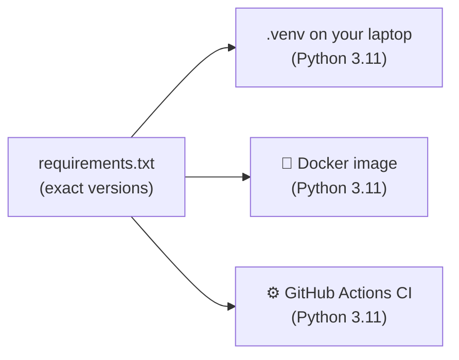
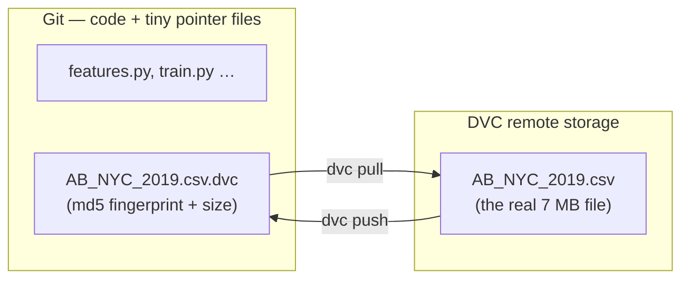

---

---

# PART 1 — Foundations

---

## Chapter 1 — Project Setup: Git, a Virtual Environment, Pinned Dependencies

### What Problem This Solves

Before any machine learning, three foundations:

1. **Git** — a history of every change to your code, so you can always see what changed, when, and go back.
2. **An isolated Python environment** — so this project's libraries can't clash with (or break) anything else on your machine.
3. **Pinned dependencies** — an exact list of library versions, so the code behaves identically on your laptop, in a Docker container, and on GitHub's servers.

Why does #3 matter so much for ML? A model saved by one version of scikit-learn may refuse to load — or silently behave differently — in another. "It worked on my machine" is usually a version difference.



One file of versions, three places that must agree.

### Concepts Before Any Code

- **Repository (repo):** a folder whose history Git tracks, stored in a hidden `.git/` folder.
- **Commit:** a saved snapshot of your files with a message. You'll commit at the end of every chapter.
- **Virtual environment (venv):** a private folder (`.venv/`) holding one Python version and one set of libraries for *this* project only.
- **Activating** a venv makes `python`, `pip`, `pytest`, `mlflow`… in *that terminal* point into `.venv/`. It's per terminal — every new terminal needs it again.
- **Pinning:** writing `package==exact.version` instead of just `package`.

### Step 1 — Create the project and initialise Git

```bash
mkdir NYC-Airbnb-Price-Prediction
cd NYC-Airbnb-Price-Prediction
git init -b main
```

Expected:
```
Initialized empty Git repository in /Users/you/NYC-Airbnb-Price-Prediction/.git/
```

**What this does:** creates the folder and Git's hidden database inside it. `-b main` names the first branch `main`, which is GitHub's default.

🪟 Create the folder inside your Linux home (e.g. `cd ~` first), not under `/mnt/c/`.

### Step 2 — Tell Git who you are (privately)

Every commit records an author name and **email**. When you publish the repository on GitHub (Chapter 11), those emails become **public**. GitHub gives every account a private "noreply" address to use instead.

1. On GitHub: **Settings → Emails** → tick **Keep my email addresses private**. GitHub then shows your address, shaped like `12345678+yourname@users.noreply.github.com`.
2. Set it for this repository:
   ```bash
   git config user.name "Your Name"
   git config user.email "12345678+yourname@users.noreply.github.com"
   git config user.email      # check: prints the noreply address
   ```

💡 Without `--global`, these settings apply to **this repository only** — your other projects keep their settings. Doing this *before* the first commit matters: once commits with your personal email are pushed, they stay in the public history. (If you already committed with a personal email, see Appendix B → "My personal email is in my commits".)

### Step 3 — Create and activate the virtual environment

```bash
uv venv --python 3.11 .venv
source .venv/bin/activate
python --version
which python
```

Expected:
```
Python 3.11.x
/Users/you/NYC-Airbnb-Price-Prediction/.venv/bin/python
```

**What this does:** `uv venv --python 3.11 .venv` creates a self-contained Python 3.11 in `.venv/` (uv downloads 3.11 if you don't have it). `source .venv/bin/activate` switches *this terminal* to it — your prompt usually shows `(.venv)`.

💡 **Why 3.11 exactly?** The Docker image in Chapter 9 uses Python 3.11. Laptop and container should match so models move between them cleanly.

⚠️ **Every new terminal starts without the venv.** If a command says `command not found: pytest` or `No module named ...`, run `source .venv/bin/activate` from the project folder.

### Step 4 — Pin the dependencies

<<<FILE:requirements.txt>>>

Install them:
```bash
uv pip install -r requirements.txt
uv pip install "dvc==3.67.1"
```

**What each library is for:**

| Library | Used for | Chapter |
|---|---|---|
| pandas, numpy | Loading and cleaning data | 3 |
| scikit-learn | Preprocessing and models | 3 |
| joblib | Saving the baseline model to a file | 4 |
| pydantic, fastapi, uvicorn | Validating input and serving predictions | 5–6 |
| pytest, httpx2 | Tests (`httpx2` powers FastAPI's test client) | 3+ |
| mlflow | Experiment tracking and model registry | 7–8 |
| prefect | Orchestration and scheduling | 10 |
| requests | Calling GitHub's API to trigger deployments | 10 |

💡 **How these pins were chosen.** The original project installed the latest versions, then *read back what was actually installed* and wrote those down — never guessing version numbers:
```bash
uv pip freeze | grep -iE '^(scikit-learn|pandas|...)=='
```
You're using those exact pins, which is why your results will match this guide.

💡 **Why `httpx2` and not `httpx`?** FastAPI's test client printed `StarletteDeprecationWarning: Using httpx with starlette.testclient is deprecated; install httpx2 instead`. A deprecation warning is a future error, so the project switched.

💡 **Why is DVC not in `requirements.txt`?** It's a tool *you* use to fetch data. The automated CI machines (Chapter 11) never run it, so leaving it out keeps their installs smaller. It's still pinned (to the version this guide was tested with), so its messages match the ones shown in Chapter 2.

### Step 5 — `.gitignore`: what Git must never track

<<<FILE:.gitignore|until:# Reference material>>>

**What this does:** every path listed here is invisible to Git.

| Entry | Why it's ignored |
|---|---|
| `.venv/` | Hundreds of MB, rebuildable from `requirements.txt` |
| `__pycache__/`, `*.pyc`, `.pytest_cache/` | Python and pytest caches |
| `models/` | Locally saved model files — the real ones live in MLflow (Chapter 7) |
| `mlruns/`, `mlartifacts/`, `mlflow.db`, `mlflow.log` | MLflow's data — a database, not source code |
| `.DS_Store`, `.env` | macOS clutter; `.env` files often hold secrets |

⚠️ **The `data/` trap.** It's tempting to ignore the whole `data/` folder. Don't: in Chapter 2, DVC puts a small *pointer file* (`data/AB_NYC_2019.csv.dvc`) in that folder, and Git **must** track it. DVC writes its own precise `data/.gitignore` for the big CSV instead. (Chapter 2 has a 🧪 exercise showing what goes wrong.)

### Step 6 — `pytest.ini`: configure the test runner

<<<FILE:pytest.ini>>>

**What this does:** `pythonpath = .` lets tests `import features`, `import main` and so on from the project folder; `testpaths = tests` tells plain `pytest` where to look.

### Step 7 — First commit

```bash
git add .gitignore requirements.txt pytest.ini
git status --short
git commit -m "chore: project scaffold, pinned requirements, pytest config"
```

`git status --short` should list exactly those three files with `A` (added) — and **not** `.venv/`.

### ✅ Checkpoint

```bash
git log --oneline          # 1 commit
python -c "import sklearn, pandas, mlflow, prefect, fastapi; print('imports ok')"
dvc --version              # 3.67.1
git config user.email      # your noreply address
```

### What You Should Have at the End of Chapter 1

```
NYC-Airbnb-Price-Prediction/
├── .git/              ← Git's database
├── .venv/             ← Python 3.11 + libraries   (NOT in Git)
├── .gitignore
├── pytest.ini
└── requirements.txt   ← 12 pinned libraries
```

**The mental shift:** your project is no longer "a folder on my laptop". It's a *recipe*: anyone with the repository and `requirements.txt` can recreate your exact environment.

---

## Chapter 2 — Data Versioning with DVC

### What Problem This Solves

Your dataset is a 7 MB CSV. Why not just commit it to Git?

- Git keeps **every version forever**. Clean the data ten times → ten copies in history, and every clone gets slower. GitHub rejects files over 100 MB outright.
- More importantly: **a model is only meaningful alongside the exact data it was trained on.** Six months from now, you must be able to answer *"which data trained this model?"* — and get that exact data back.

**DVC (Data Version Control)** solves this. Git tracks a tiny **pointer file** containing the data's fingerprint; the real file lives in separate storage.



### Concepts Before Any Code

- **MD5 hash (fingerprint):** a 32-character code computed from a file's bytes. Change one byte → completely different hash. Same hash → identical file.
- **Pointer file (`.dvc`):** a few lines of text: the hash, the size, the file name. This is what Git commits.
- **Cache (`.dvc/cache/`):** DVC's local copy of every version of your data.
- **Remote:** where DVC stores data outside your project — here a folder in your home directory; in a team, a cloud bucket (e.g. S3). `dvc push` uploads to it, `dvc pull` downloads from it.

### Step 1 — Download the dataset

The data is the public *New York City Airbnb Open Data* on Kaggle (`dgomonov/new-york-city-airbnb-open-data`). It downloads without an account:

```bash
mkdir -p data
curl -L -o data/airbnb.zip https://www.kaggle.com/api/v1/datasets/download/dgomonov/new-york-city-airbnb-open-data
python -m zipfile -e data/airbnb.zip data/
rm data/airbnb.zip data/New_York_City_.png
ls data
```

Expected:
```
AB_NYC_2019.csv
```

**What this does:** downloads the ZIP archive, unpacks it with Python's built-in `zipfile` module (works the same on macOS and Linux), and deletes the archive and a map image we don't need.

Now check it's **exactly** the file this guide was built with:

```bash
python -c "import hashlib; print(hashlib.md5(open('data/AB_NYC_2019.csv', 'rb').read()).hexdigest())"
```

Expected:
```
f772a1d8d29bae6e7a9beac0ae880a2b
```

💡 If your hash matches, your data is byte-for-byte identical to the original project's — so every number in this guide will match yours. If it doesn't match, the dataset may have been updated; the steps still work, but your metrics will differ slightly.

### Step 2 — Get to know the data

Never write cleaning code for data you haven't looked at. Save this as a throwaway script (it's not part of the project, so don't commit it):

📄 **File: `explore.py`** *(temporary)*

```python
import pandas as pd

df = pd.read_csv("data/AB_NYC_2019.csv")
print("shape:", df.shape)
print("\nmissing values per column:")
print(df.isna().sum()[lambda s: s > 0])
print("\nprice:", df["price"].describe()[["min", "50%", "max"]].to_dict())
print("price == 0:", (df["price"] == 0).sum(), "rows")
print("99th percentile price:", df["price"].quantile(0.99))
print("price > 800:", (df["price"] > 800).sum(), "rows")
print("\nreviews_per_month missing exactly when number_of_reviews == 0:",
      (df["reviews_per_month"].isna() == (df["number_of_reviews"] == 0)).all())
print("\ndistinct values:", df[["neighbourhood_group", "neighbourhood", "room_type"]].nunique().to_dict())
print("latitude range:", df["latitude"].min(), "to", df["latitude"].max())
print("longitude range:", df["longitude"].min(), "to", df["longitude"].max())
```

```bash
python explore.py
```

Expected:
```
shape: (48895, 16)

missing values per column:
name                    16
host_name               21
last_review          10052
reviews_per_month    10052
dtype: int64

price: {'min': 0.0, '50%': 106.0, 'max': 10000.0}
price == 0: 11 rows
99th percentile price: 799.0
price > 800: 420 rows

reviews_per_month missing exactly when number_of_reviews == 0: True

distinct values: {'neighbourhood_group': 5, 'neighbourhood': 221, 'room_type': 3}
latitude range: 40.49979 to 40.91306
longitude range: -74.24442 to -73.71299
```

**What this tells us — and the decisions it drives (implemented in Chapter 3):**

| Finding | Decision |
|---|---|
| 11 listings at `$0` | Data errors, not free stays → **drop** them |
| Median $106, 99th percentile $799, max $10,000 | Heavily **skewed** → drop the 420 listings above **$800**, and train on the *log* of price |
| `reviews_per_month` missing exactly when there are no reviews | Missing means "zero reviews per month" → fill with **0**, not the average |
| `name`, `host_name` have missing values | We don't use them anyway (free text / personal data) |
| `neighbourhood` has 221 values | A **high-cardinality** category — needs care (Chapter 3) |
| Latitude 40.50–40.91, longitude -74.24 to -73.71 | NYC's real range → used to reject impossible inputs (Chapter 5) |

```bash
rm explore.py
```

### Step 3 — Initialise DVC and track the CSV — *before* any `git add`

```bash
dvc init
dvc add data/AB_NYC_2019.csv
git status --short -uall
```

Expected:
```
A  .dvc/.gitignore
A  .dvc/config
A  .dvcignore
?? data/.gitignore
?? data/AB_NYC_2019.csv.dvc
```

**What `dvc add` did behind the scenes:**
1. Computed the file's MD5 hash.
2. Wrote the pointer file `data/AB_NYC_2019.csv.dvc`.
3. Copied the CSV into `.dvc/cache/`.
4. Wrote `data/.gitignore` containing `/AB_NYC_2019.csv`, so Git never sees the real file.

⚠️ **Order matters.** If you ran `git add -A` *before* `dvc add`, Git would stage the real CSV and it would live in your history forever. Always `dvc add` first, then confirm `git status` does **not** list `data/AB_NYC_2019.csv` itself.

Look at the pointer file:
```bash
cat data/AB_NYC_2019.csv.dvc
```
```yaml
outs:
- md5: f772a1d8d29bae6e7a9beac0ae880a2b
  size: 7077973
  hash: md5
  path: AB_NYC_2019.csv
```

The same hash you computed in Step 1. Ask Git *why* it ignores the CSV:
```bash
git check-ignore -v data/AB_NYC_2019.csv
# data/.gitignore:1:/AB_NYC_2019.csv	data/AB_NYC_2019.csv
```

### Step 4 — Configure a remote and push

```bash
mkdir -p ~/dvc-storage/nyc-airbnb-price
dvc remote add -d localremote ~/dvc-storage/nyc-airbnb-price
dvc push
```

Expected:
```
Setting 'localremote' as a default remote.
1 file pushed
```

**What this does:** registers a folder **outside** the project (so deleting the project doesn't delete your data backup) as the default (`-d`) remote, then uploads the data to it. The setting is saved in `.dvc/config`, which Git tracks.

💡 In a team, the remote would be shared storage, e.g. `dvc remote add -d storage s3://my-bucket/airbnb`. The commands don't change.

### Step 5 — Prove it: delete the data and get it back

This simulates a teammate (or future you) cloning the repository:

```bash
rm data/AB_NYC_2019.csv
ls data                  # only AB_NYC_2019.csv.dvc is left
dvc pull
python -c "import hashlib; print(hashlib.md5(open('data/AB_NYC_2019.csv', 'rb').read()).hexdigest())"
```

Expected:
```
A       data/AB_NYC_2019.csv
1 file added
f772a1d8d29bae6e7a9beac0ae880a2b
```

Same fingerprint — same data, byte for byte.

💡 `wc -l data/AB_NYC_2019.csv` says 49,081 lines, but pandas reads 48,895 rows. Some listing names contain line breaks inside quotes; `wc` counts raw lines, pandas counts real rows.

### 🧪 See It Fail — why `data/` must not be in `.gitignore`

Add `data/` as the last line of `.gitignore` in your editor, then:
```bash
git add data/AB_NYC_2019.csv.dvc
```
```
The following paths are ignored by one of your .gitignore files:
data
hint: Use -f if you really want to add them.
```
Git refuses to track the pointer file — your data would no longer be versioned. **Remove the `data/` line again**, and `git add` works.

### Step 6 — Commit the pointer and config (not the data)

```bash
git add .dvc .dvcignore data/AB_NYC_2019.csv.dvc data/.gitignore
git commit -m "data: track AB_NYC_2019.csv with DVC and a local remote"
```

### ✅ Checkpoint

```bash
dvc status                        # Data and pipelines are up to date.
git ls-files data                 # data/.gitignore and data/AB_NYC_2019.csv.dvc — NOT the CSV
git log --oneline                 # 2 commits
```

### What You Should Have at the End of Chapter 2

```
NYC-Airbnb-Price-Prediction/
├── .dvc/
│   ├── config              ← remote settings        (IN Git)
│   ├── .gitignore          ← hides cache/ and tmp/  (IN Git)
│   └── cache/              ← DVC's copy of the data (NOT in Git)
├── .dvcignore
├── data/
│   ├── AB_NYC_2019.csv     ← the real data          (NOT in Git)
│   ├── AB_NYC_2019.csv.dvc ← pointer file           (IN Git)
│   └── .gitignore          ← written by DVC
└── … (Chapter 1 files)
```

**Git tracks:** code, config and the pointer. **DVC's remote stores:** the CSV.

**The mental shift:** data is now versioned just like code. A Git commit plus `dvc pull` gives you back *exactly* the data that commit used.
