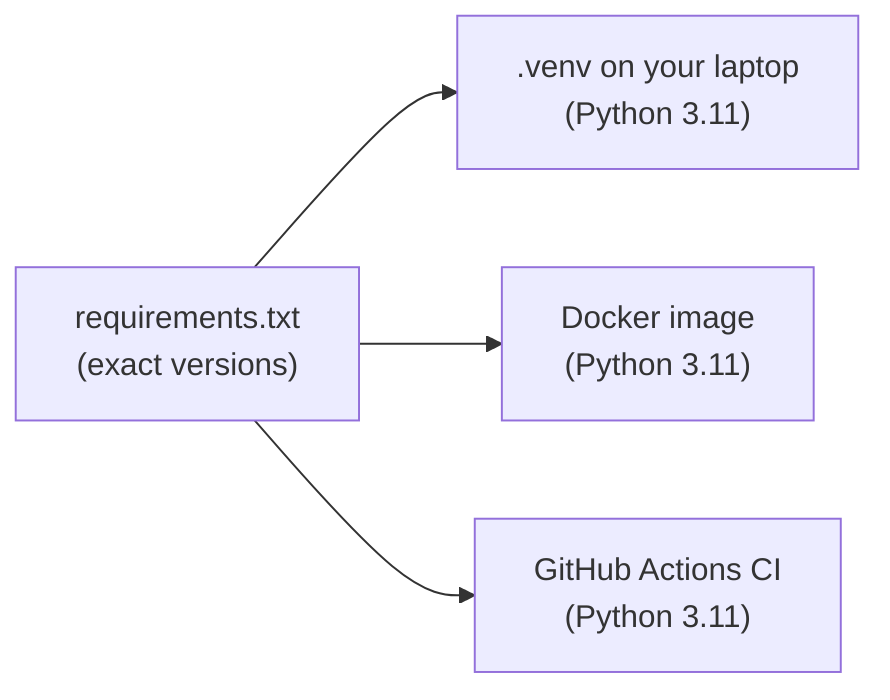

---

---

# Part 1: Foundations

---

## Chapter 1: Git, a virtual environment and pinned dependencies

### The problem

Before any machine learning, you need three foundations:

1. Git, which keeps a history of every change to your code so you can see what changed and when, and go back if you need to.
2. An isolated Python environment, so this project's libraries can't clash with (or break) anything else on your machine.
3. Pinned dependencies, an exact list of library versions, so the code behaves the same on your laptop, in a Docker container and on GitHub's servers.

The third one matters a lot for ML. A model saved with one version of scikit-learn may refuse to load in another version, or load and quietly behave differently. When something "worked on my machine", a version difference is usually the reason.



One file of versions feeds three places, and all three have to agree.

### Concepts

- **Repository (repo):** a folder whose history Git tracks. Git stores that history in a hidden `.git/` folder.
- **Commit:** a saved snapshot of your files, with a message. You'll commit at the end of every chapter.
- **Virtual environment (venv):** a private folder (`.venv/`) that holds one Python version and one set of libraries for this project only.
- **Activating** a venv makes `python`, `pip`, `pytest`, `mlflow` and so on point into `.venv/`, but only in that terminal. Every new terminal needs it again.
- **Pinning:** writing `package==exact.version` instead of just `package`.

### Step 1: Create the project and initialise Git

```bash
mkdir NYC-Airbnb-Price-Prediction
cd NYC-Airbnb-Price-Prediction
git init -b main
```

Expected:
```
Initialized empty Git repository in /Users/you/NYC-Airbnb-Price-Prediction/.git/
```

This creates the folder and Git's hidden database inside it. `-b main` names the first branch `main`, which matches GitHub's default.

> [!NOTE]
> **Windows:** create the folder inside your Linux home (run `cd ~` first), not under `/mnt/c/`.

### Step 2: Tell Git who you are, privately

Every commit records an author name and email. Once you publish the repository on GitHub (Chapter 11), anyone can read those emails. GitHub gives every account a private "noreply" address you can use instead.

1. On GitHub, go to Settings → Emails and tick "Keep my email addresses private". GitHub then shows your noreply address, which looks like `12345678+yourname@users.noreply.github.com`.
2. Set it for this repository:
   ```bash
   git config user.name "Your Name"
   git config user.email "12345678+yourname@users.noreply.github.com"
   git config user.email      # check: prints the noreply address
   ```

> [!TIP]
> Without `--global`, these settings apply only to this repository, so your other projects keep theirs. Do this before the first commit. Once commits with your personal email are pushed, they stay in the public history. (If you've already committed with a personal email, see Appendix B, "My personal email is in my commits".)

### Step 3: Create and activate the virtual environment

```bash
uv venv --python 3.11 .venv
source .venv/bin/activate
python --version
which python
```

Expected:
```
Python 3.11.x
/Users/you/NYC-Airbnb-Price-Prediction/.venv/bin/python
```

`uv venv --python 3.11 .venv` creates a self-contained Python 3.11 in `.venv/`, downloading 3.11 first if you don't have it. `source .venv/bin/activate` switches this terminal over to it, and your prompt usually starts showing `(.venv)`.

> [!TIP]
> **Why 3.11 exactly?** The Docker image in Chapter 9 uses Python 3.11. Your laptop and the container should match, so models move cleanly between them.

> [!WARNING]
> Every new terminal starts without the venv. If a command says `command not found: pytest` or `No module named ...`, run `source .venv/bin/activate` from the project folder.

### Step 4: Pin the dependencies

<<<FILE:requirements.txt>>>

Install them:
```bash
uv pip install -r requirements.txt
uv pip install "dvc==3.67.1"
```

What each library is for:

| Library | Used for | Chapter |
|---|---|---|
| pandas, numpy | Loading and cleaning data | 3 |
| scikit-learn | Preprocessing and models | 3 |
| joblib | Saving the baseline model to a file | 4 |
| pydantic, fastapi, uvicorn | Validating input and serving predictions | 5 and 6 |
| pytest, httpx2 | Tests (`httpx2` powers FastAPI's test client) | 3 onwards |
| mlflow | Experiment tracking and the model registry | 7 and 8 |
| prefect | Orchestration and scheduling | 10 |
| requests | Calling GitHub's API to trigger deployments | 10 |

> [!TIP]
> **Where these pins came from.** The original project installed the latest versions, then read back what was actually installed and wrote those numbers down, so nobody guessed a version:
> ```bash
> uv pip freeze | grep -iE '^(scikit-learn|pandas|...)=='
> ```
> You're using those exact pins, which is why your results will match this guide.

> [!TIP]
> **Why `httpx2` and not `httpx`?** FastAPI's test client printed `StarletteDeprecationWarning: Using httpx with starlette.testclient is deprecated; install httpx2 instead`. Today's deprecation warning is tomorrow's error, so the project switched.

> [!TIP]
> **Why isn't DVC in `requirements.txt`?** You use DVC to fetch data, and the CI machines (Chapter 11) never run it, so leaving it out keeps their installs smaller. It's still pinned to the version this guide was tested with, so its messages match the ones in Chapter 2.

### Step 5: Tell Git what to ignore

<<<FILE:.gitignore|until:# Reference material>>>

Git doesn't see any path listed here.

| Entry | Why it's ignored |
|---|---|
| `.venv/` | Hundreds of MB, and you can rebuild it from `requirements.txt` |
| `__pycache__/`, `*.pyc`, `.pytest_cache/` | Python and pytest caches |
| `models/` | Model files saved locally. The real ones live in MLflow (Chapter 7) |
| `mlruns/`, `mlartifacts/`, `mlflow.db`, `mlflow.log` | MLflow's data, which is a database rather than source code |
| `.DS_Store`, `.env` | macOS clutter, and `.env` files often hold secrets |

> [!WARNING]
> **The `data/` trap.** It's tempting to ignore the whole `data/` folder. Don't. In Chapter 2, DVC puts a small pointer file (`data/AB_NYC_2019.csv.dvc`) in that folder, and Git must track it. DVC writes its own `data/.gitignore` that covers just the big CSV. Chapter 2 has an exercise that shows what goes wrong.

### Step 6: Configure the test runner

<<<FILE:pytest.ini>>>

`pythonpath = .` lets tests `import features`, `import main` and so on from the project folder. `testpaths = tests` tells a plain `pytest` where to look.

### Step 7: First commit

```bash
git add .gitignore requirements.txt pytest.ini
git status --short
git commit -m "chore: project scaffold, pinned requirements, pytest config"
```

`git status --short` should list exactly those three files, each marked `A` (added). It should not list `.venv/`.

### Checkpoint

```bash
git log --oneline          # 1 commit
python -c "import sklearn, pandas, mlflow, prefect, fastapi; print('imports ok')"
dvc --version              # 3.67.1
git config user.email      # your noreply address
```

### Your project after Chapter 1

```
NYC-Airbnb-Price-Prediction/
├── .git/              ← Git's database
├── .venv/             ← Python 3.11 + libraries   (NOT in Git)
├── .gitignore
├── pytest.ini
└── requirements.txt   ← 12 pinned libraries
```

Anyone with this repository and `requirements.txt` can now recreate your exact environment.

---

## Chapter 2: Data versioning with DVC

### The problem

The dataset is a 7 MB CSV. Why not commit it to Git?

- Git keeps every version forever. Clean the data ten times and you have ten copies in the history, and every clone gets slower. GitHub also rejects files over 100 MB outright.
- More importantly, a model only makes sense alongside the exact data it was trained on. Six months from now you need to be able to answer "which data trained this model?" and get that data back.

DVC (Data Version Control) handles this. Git tracks a tiny pointer file that holds the data's fingerprint, and the real file lives in separate storage.


### Concepts

- **MD5 hash (fingerprint):** a 32-character code computed from a file's bytes. Change one byte and you get a completely different hash. The same hash means an identical file.
- **Pointer file (`.dvc`):** a few lines of text with the hash, the size and the file name. This is what Git commits.
- **Cache (`.dvc/cache/`):** DVC's local copy of every version of your data.
- **Remote:** where DVC stores data outside your project. Here it's a folder in your home directory. A team would use a cloud bucket such as S3. `dvc push` uploads to the remote and `dvc pull` downloads from it.

### Step 1: Download the dataset

The data is the public New York City Airbnb Open Data on Kaggle (`dgomonov/new-york-city-airbnb-open-data`). It downloads without an account:

```bash
mkdir -p data
curl -L -o data/airbnb.zip https://www.kaggle.com/api/v1/datasets/download/dgomonov/new-york-city-airbnb-open-data
python -m zipfile -e data/airbnb.zip data/
rm data/airbnb.zip data/New_York_City_.png
ls data
```

Expected:
```
AB_NYC_2019.csv
```

This downloads the ZIP archive and unpacks it with Python's built-in `zipfile` module, which works the same on macOS and Linux. Then it deletes the archive and a map image we don't need.

Now check that you have exactly the file this guide was built with:

```bash
python -c "import hashlib; print(hashlib.md5(open('data/AB_NYC_2019.csv', 'rb').read()).hexdigest())"
```

Expected:
```
f772a1d8d29bae6e7a9beac0ae880a2b
```

> [!TIP]
> If your hash matches, your data is byte-for-byte identical to the original project's, so every number in this guide will match yours. If it doesn't, the dataset may have been updated. The steps still work, but your metrics will be slightly different.

### Step 2: Get to know the data

Never write cleaning code for data you haven't looked at. Save this as a throwaway script. It isn't part of the project, so don't commit it.

**File: `explore.py`** *(temporary)*

```python
import pandas as pd

df = pd.read_csv("data/AB_NYC_2019.csv")
print("shape:", df.shape)
print("\nmissing values per column:")
print(df.isna().sum()[lambda s: s > 0])
print("\nprice:", df["price"].describe()[["min", "50%", "max"]].to_dict())
print("price == 0:", (df["price"] == 0).sum(), "rows")
print("99th percentile price:", df["price"].quantile(0.99))
print("price > 800:", (df["price"] > 800).sum(), "rows")
print("\nreviews_per_month missing exactly when number_of_reviews == 0:",
      (df["reviews_per_month"].isna() == (df["number_of_reviews"] == 0)).all())
print("\ndistinct values:", df[["neighbourhood_group", "neighbourhood", "room_type"]].nunique().to_dict())
print("latitude range:", df["latitude"].min(), "to", df["latitude"].max())
print("longitude range:", df["longitude"].min(), "to", df["longitude"].max())
```

```bash
python explore.py
```

Expected:
```
shape: (48895, 16)

missing values per column:
name                    16
host_name               21
last_review          10052
reviews_per_month    10052
dtype: int64

price: {'min': 0.0, '50%': 106.0, 'max': 10000.0}
price == 0: 11 rows
99th percentile price: 799.0
price > 800: 420 rows

reviews_per_month missing exactly when number_of_reviews == 0: True

distinct values: {'neighbourhood_group': 5, 'neighbourhood': 221, 'room_type': 3}
latitude range: 40.49979 to 40.91306
longitude range: -74.24442 to -73.71299
```

The output leads to these decisions, which you'll implement in Chapter 3:

| Finding | Decision |
|---|---|
| 11 listings cost `$0` | These are data errors, not free stays, so drop them |
| Median $106, 99th percentile $799, max $10,000 | The prices are heavily skewed, so drop the 420 listings above $800 and train on the log of the price |
| `reviews_per_month` is missing exactly when a listing has no reviews | Missing means zero reviews per month, so fill it with 0 rather than the average |
| `name` and `host_name` have missing values | We don't use them anyway (free text and personal data) |
| `neighbourhood` has 221 values | This is a high-cardinality category and needs some care (Chapter 3) |
| Latitude 40.50 to 40.91, longitude -74.24 to -73.71 | This is NYC's real range, which Chapter 5 uses to reject impossible inputs |

```bash
rm explore.py
```

### Step 3: Initialise DVC and track the CSV before any `git add`

```bash
dvc init
dvc add data/AB_NYC_2019.csv
git status --short -uall
```

Expected:
```
A  .dvc/.gitignore
A  .dvc/config
A  .dvcignore
?? data/.gitignore
?? data/AB_NYC_2019.csv.dvc
```

Behind the scenes, `dvc add`:
1. computed the file's MD5 hash,
2. wrote the pointer file `data/AB_NYC_2019.csv.dvc`,
3. copied the CSV into `.dvc/cache/`,
4. and wrote `data/.gitignore` containing `/AB_NYC_2019.csv`, so Git never sees the real file.

> [!WARNING]
> **Order matters.** If you ran `git add -A` before `dvc add`, Git would stage the real CSV and it would stay in your history forever. Always run `dvc add` first, then check that `git status` doesn't list `data/AB_NYC_2019.csv` itself.

Look at the pointer file:
```bash
cat data/AB_NYC_2019.csv.dvc
```
```yaml
outs:
- md5: f772a1d8d29bae6e7a9beac0ae880a2b
  size: 7077973
  hash: md5
  path: AB_NYC_2019.csv
```

It's the same hash you computed in Step 1. You can also ask Git why it ignores the CSV:
```bash
git check-ignore -v data/AB_NYC_2019.csv
# data/.gitignore:1:/AB_NYC_2019.csv	data/AB_NYC_2019.csv
```

### Step 4: Configure a remote and push

```bash
mkdir -p ~/dvc-storage/nyc-airbnb-price
dvc remote add -d localremote ~/dvc-storage/nyc-airbnb-price
dvc push
```

Expected:
```
Setting 'localremote' as a default remote.
1 file pushed
```

This registers a folder outside the project as the default (`-d`) remote, then uploads the data to it. Keeping it outside means that deleting the project doesn't delete your data backup. The setting is saved in `.dvc/config`, which Git tracks.

> [!TIP]
> A team would point the remote at shared storage instead, for example `dvc remote add -d storage s3://my-bucket/airbnb`. The commands stay the same.

### Step 5: Delete the data and get it back

This is what a teammate (or you, later) does after cloning the repository:

```bash
rm data/AB_NYC_2019.csv
ls data                  # only AB_NYC_2019.csv.dvc is left
dvc pull
python -c "import hashlib; print(hashlib.md5(open('data/AB_NYC_2019.csv', 'rb').read()).hexdigest())"
```

Expected:
```
A       data/AB_NYC_2019.csv
1 file added
f772a1d8d29bae6e7a9beac0ae880a2b
```

Same fingerprint, so it's the same data, byte for byte.

> [!TIP]
> `wc -l data/AB_NYC_2019.csv` reports 49,081 lines, but pandas reads 48,895 rows. Some listing names contain line breaks inside quotes. `wc` counts raw lines, while pandas counts real rows.

### See it fail: why `data/` must stay out of `.gitignore`

Add `data/` as the last line of `.gitignore` in your editor, then run:
```bash
git add data/AB_NYC_2019.csv.dvc
```
```
The following paths are ignored by one of your .gitignore files:
data
hint: Use -f if you really want to add them.
```
Git refuses to track the pointer file, which means your data is no longer versioned. Remove the `data/` line again and `git add` works.

### Step 6: Commit the pointer and config, not the data

```bash
git add .dvc .dvcignore data/AB_NYC_2019.csv.dvc data/.gitignore
git commit -m "data: track AB_NYC_2019.csv with DVC and a local remote"
```

### Checkpoint

```bash
dvc status                        # Data and pipelines are up to date.
git ls-files data                 # data/.gitignore and data/AB_NYC_2019.csv.dvc, but NOT the CSV
git log --oneline                 # 2 commits
```

### Your project after Chapter 2

```
NYC-Airbnb-Price-Prediction/
├── .dvc/
│   ├── config              ← remote settings        (IN Git)
│   ├── .gitignore          ← hides cache/ and tmp/  (IN Git)
│   └── cache/              ← DVC's copy of the data (NOT in Git)
├── .dvcignore
├── data/
│   ├── AB_NYC_2019.csv     ← the real data          (NOT in Git)
│   ├── AB_NYC_2019.csv.dvc ← pointer file           (IN Git)
│   └── .gitignore          ← written by DVC
└── … (Chapter 1 files)
```

Git now tracks the code, the config and the pointer, while DVC's remote stores the CSV. Checking out any commit and running `dvc pull` gives you back exactly the data that commit used.
