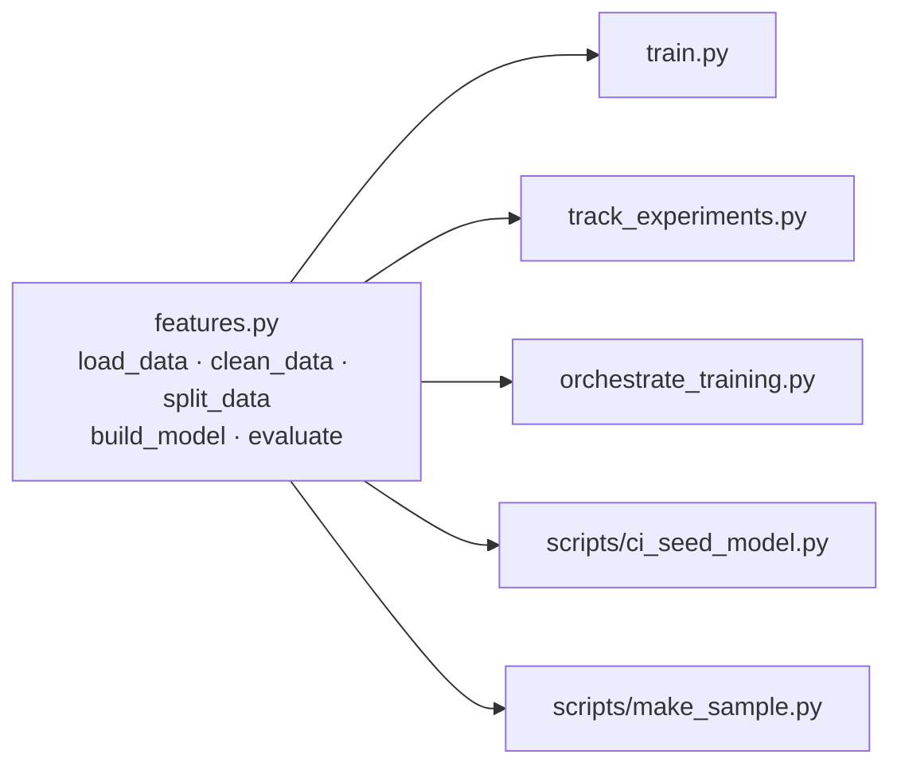
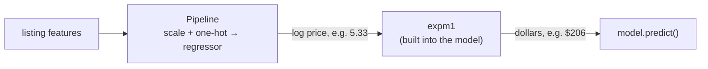

---

---

# PART 2 — Modelling Code

---

## Chapter 3 — One Shared Module for Cleaning and Model Building

### What Problem This Solves

Four different scripts will train models in this project:

| Script | Chapter | Purpose |
|---|---|---|
| `train.py` | 4 | Baseline |
| `track_experiments.py` | 7 | Five tracked experiments |
| `orchestrate_training.py` | 10 | Scheduled retraining |
| `scripts/ci_seed_model.py` | 11 | A quick model for automated tests |

If each had its own copy of the cleaning code, they'd drift apart ("I changed the outlier cutoff in one script but not the others") and results would stop being comparable. So every rule lives **once**, in `features.py`, and everything else imports it.



### Concepts Before Any Code

**Features used by the model:**

| Type | Columns | What happens to them |
|---|---|---|
| Numeric (7) | `latitude`, `longitude`, `minimum_nights`, `number_of_reviews`, `reviews_per_month`, `calculated_host_listings_count`, `availability_365` | `StandardScaler` — rescaled to mean 0, standard deviation 1 |
| Categorical (3) | `neighbourhood_group` (5 values), `neighbourhood` (221), `room_type` (3) | `OneHotEncoder` — one 0/1 column per value |
| Dropped (5) | `id`, `name`, `host_id`, `host_name`, `last_review` | Identifiers, free text or personal data |
| Target | `price` | Trained as `log1p(price)` |

**Pipeline and ColumnTransformer.** A scikit-learn `Pipeline` chains steps (preprocess → model) into *one object* with `.fit()` and `.predict()`. A `ColumnTransformer` applies different preprocessing to different columns. Because preprocessing lives *inside* the model object, whoever uses the model later (the API!) can't forget or misapply it.

**High-cardinality categoricals.** One-hot encoding `neighbourhood` creates 221 columns. That's fine for these models, but there's a real risk: one day the API will receive a neighbourhood that wasn't in the training data. `OneHotEncoder(handle_unknown="ignore")` turns an unknown value into all zeros instead of crashing.

**The log-price trick.** Most listings cost around $100, a few cost thousands. A model trained on raw prices gets dragged around by those few expensive ones. The logarithm squeezes the scale:

| Price | `log1p(price)` |
|---|---|
| $50 | 3.93 |
| $150 | 5.02 |
| $800 | 6.69 |

The model learns on the log scale; predictions are converted back with `expm1` (the exact inverse of `log1p`). **The danger:** forgetting to convert back — you'd report "RMSE = 0.5" or serve a price of "$5.30". So we never convert by hand: scikit-learn's **`TransformedTargetRegressor`** does it *inside* the model.



**Test-driven development (TDD).** Write a test describing what the code *should* do, run it and **watch it fail**, then write the code until it passes. Watching it fail first proves the test actually tests something.

**pytest fixtures.** A fixture is a function marked `@pytest.fixture` that prepares something tests need (a small dataset, a temporary database). Tests receive it by naming it as a parameter.

### What Changes in This Chapter

| File | Change |
|---|---|
| `tests/test_features.py` | New — 7 tests |
| `features.py` | New — the shared module |
| `scripts/__init__.py`, `scripts/make_sample.py` | New — creates a small sample of the data for automated tests |
| `tests/fixtures/listings_sample.csv` | New — generated, committed |
| `tests/conftest.py` | New — shared test fixtures |

### Step 1 — Write the tests first

Create the two folders this chapter's files go in:
```bash
mkdir -p tests scripts
```

<<<FILE:tests/test_features.py>>>

**Walk through it:**

1. **`raw_df` fixture** — six fake listings with all 16 CSV columns and the real quirks: a `$0` price, a `$10,000` outlier, and a listing with no reviews (so `reviews_per_month` is missing).
2. **Cleaning tests** — only `[50, 150, 300, 800]` survive; the missing review rate becomes `0`; `id`/`name`/… are gone.
3. **`test_log_target_inversion_matches_hand_computed_value`** — the most important test. A `DummyRegressor(strategy="mean")` simply predicts the average of what it was trained on. Trained on log prices, it predicts `mean(log1p(prices))` — so the dollar prediction *must* be `expm1(mean(log1p(prices)))` ≈ $206. If the conversion back were missing, it would return ≈ 5.3.
4. **`test_evaluate_returns_dollar_scale_metrics`** — RMSE must be in dollars (> 100 here), not log units.
5. **`test_split_data_is_reproducible_80_20`** — 80/20 ratio, same split every run. It uses fixtures from `conftest.py` (Step 4).
6. **`test_model_tolerates_unseen_neighbourhood`** — a neighbourhood called `"Nowhere Heights"` gets a price, not a crash.

Run them — before `features.py` exists:
```bash
pytest tests/test_features.py -q
```
Expected:
```
E   ModuleNotFoundError: No module named 'features'
```
✅ Failing for the right reason.

### Step 2 — Write `features.py`

<<<FILE:features.py>>>

**Walk through it:**

1. **Constants at the top** (`NUMERIC_FEATURES`, `CATEGORICAL_FEATURES`, `MAX_PRICE`, `RANDOM_STATE`) — every other file imports these, so there's one source of truth.
2. **`load_data(path=None)`** — with no path, reads the `DATA_PATH` environment variable, falling back to `data/AB_NYC_2019.csv`. That lets CI (Chapter 11) train on a small sample *without changing code*.
3. **`clean_data`** — the decisions from Chapter 2: fill missing review rates with `0`, keep prices in `(0, 800]`, keep only the model's columns. `df.copy()` avoids modifying the caller's DataFrame.
4. **`split_data`** — 80/20 with `random_state=42`: the same split every time, so different models are compared on the same test listings.
5. **`build_model(regressor)`** — takes *any* scikit-learn regressor and wraps it in the same preprocessing and log/exp conversion. Chapter 7 plugs in RandomForest and GradientBoosting with identical preprocessing — a fair comparison.
6. **`evaluate`** — RMSE, MAE and R² on the **dollar** scale (the model's `.predict()` already returns dollars).

### Step 3 — Create a small sample for automated tests

The full dataset lives in DVC storage on *your* machine. In Chapter 11, GitHub's servers will run your tests — and they can't reach your laptop. So we commit a small, random 2,000-row sample containing **only model columns** (no names, no IDs — no personal data).

<<<FILE:scripts/make_sample.py>>>

```bash
touch scripts/__init__.py
python -m scripts.make_sample
```
Expected:
```
wrote 2000 rows to tests/fixtures/listings_sample.csv
```

💡 **Why `python -m scripts.make_sample` and not `python scripts/make_sample.py`?** Running a file directly puts *its* folder (`scripts/`) first on Python's import path, so `import features` (in the project root) fails. `-m` runs it as a module *from the project root*. The empty `scripts/__init__.py` makes `scripts` a proper package.

Check what's in it:
```bash
python -c "import pandas as pd; s = pd.read_csv('tests/fixtures/listings_sample.csv'); print(s.shape); print(s.neighbourhood_group.value_counts().to_dict())"
```
Expected:
```
(2000, 11)
{'Manhattan': 858, 'Brooklyn': 827, 'Queens': 259, 'Bronx': 42, 'Staten Island': 14}
```
All five boroughs, and it keeps the real quirks (424 missing review rates, 15 prices above $800) — so cleaning is tested on realistic data. Same seed → you get the exact same 2,000 rows.

### Step 4 — Shared fixtures: `tests/conftest.py`

pytest automatically loads `conftest.py`; fixtures defined there are available to every test file.

<<<FILE:tests/conftest.py|until:def local_mlflow>>>

**What this does:**
- `SAMPLE_PATH` is built from `__file__` (this file's own location), so tests pass no matter which folder you run `pytest` from. (The original version used the relative path `"tests/fixtures/..."` and broke when run from elsewhere — a real bug found by an audit.)
- `scope="session"` loads the sample **once** for the whole test run, not once per test.
- `import mlflow` isn't used yet — a third fixture that needs it is added in Chapter 7.

### Step 5 — Run the tests

```bash
pytest -v
```
Expected (last line):
```
7 passed
```

### 🧪 See It Fail — do the tests really catch bugs?

A test suite only matters if it **fails when the code is wrong**. Try these one at a time: edit `features.py`, run `pytest -q`, see at least one failure, then **undo the edit**.

| Break this in `features.py` | Test that catches it |
|---|---|
| `inverse_func=np.expm1` → `inverse_func=lambda x: x` | `test_log_target_inversion_matches_hand_computed_value` |
| `.fillna(0.0)` → `.fillna(df["reviews_per_month"].mean())` | `test_clean_data_fills_missing_reviews_per_month_with_zero` |
| `(df[TARGET] > 0)` → `(df[TARGET] >= 0)` | `test_clean_data_drops_zero_and_outlier_prices` |
| `return df[FEATURES + [TARGET]]...` → `return df` | `test_clean_data_keeps_only_model_columns` |
| `test_size=0.2` → `test_size=0.5` | `test_split_data_is_reproducible_80_20` |
| `OneHotEncoder(handle_unknown="ignore")` → `OneHotEncoder()` | `test_model_tolerates_unseen_neighbourhood` |

When the original project did this exercise, every one of these deliberate bugs was caught.

### Step 6 — Commit

```bash
git add features.py scripts/__init__.py scripts/make_sample.py tests/
git commit -m "feat: shared cleaning/pipeline module with log-target model and CI sample"
```

### ✅ Checkpoint

```bash
pytest -q                                  # 7 passed
git ls-files tests                         # conftest.py, fixtures/listings_sample.csv, test_features.py
```

### What You Should Have at the End of Chapter 3

```
NYC-Airbnb-Price-Prediction/
├── features.py                      ← every cleaning + model-building rule
├── scripts/
│   ├── __init__.py
│   └── make_sample.py
├── tests/
│   ├── conftest.py                  ← sample_path, sample_splits
│   ├── fixtures/listings_sample.csv ← 2,000 rows, 142 KB, IN Git
│   └── test_features.py             ← 7 tests
└── … (Chapters 1–2)
```

**The mental shift:** rules live in one place, and tests prove they hold. Change a rule by accident and a test goes red immediately.

---

## Chapter 4 — The Baseline Model

### What Problem This Solves

Before adding tracking servers and containers, prove the **whole pipeline works end to end** on the real data: load → clean → split → train → score → save → reload. That's the job of a **baseline**: the simplest reasonable model, giving the number every later model has to beat. We use `LinearRegression` — fast, simple, hard to get wrong. If something breaks, it's the pipeline, not a fancy model.

### Concepts: three regression metrics

| Metric | Plain meaning | Better when |
|---|---|---|
| **RMSE** (root mean squared error) | Typical error in dollars — big misses count extra (errors are squared before averaging) | lower |
| **MAE** (mean absolute error) | Average miss in dollars: "on average we're off by $X" | lower |
| **R²** | Share of price variation explained. 1 = perfect, 0 = no better than always guessing the average, negative = worse | higher |

RMSE is always ≥ MAE; a big gap means a few large misses dominate the error.

### Step 1 — Write `train.py`

<<<FILE:train.py>>>

**Walk through it:**
- It's short because every rule lives in `features.py` — `train.py` only wires the steps together.
- `evaluate` uses the **test** set — listings the model never saw. Scoring on training data flatters the model.
- `joblib.dump` saves the whole fitted object (preprocessing + regressor + log/exp conversion) to one file.
- The reload-and-compare line proves the saved file really works — not just that *something* was written.
- There's no `expm1` anywhere: the model converts back to dollars itself (Chapter 3).

### Step 2 — Run it

```bash
python train.py
```
Expected:
```
rows after cleaning: 48464  (train=38771, test=9693)
rmse: 83.545
mae: 47.077
r2: 0.395
saved and reloaded models/model.pkl
```

**Where 48,464 comes from:** 48,895 − 11 (`$0`) − 420 (above $800).

### Step 3 — Is this any good? Three sanity checks

**1. Right scale?** RMSE $83.5 is "tens of dollars". ✅ If you saw `0.5` you'd be scoring log prices; `4,000` would mean the conversion is broken.

**2. Better than guessing?** Compare against a model that ignores every feature:
```bash
python - <<'EOF'
from sklearn.dummy import DummyRegressor
from features import build_model, clean_data, evaluate, load_data, split_data
X_train, X_test, y_train, y_test = split_data(clean_data(load_data()))
dummy = build_model(DummyRegressor(strategy="mean")).fit(X_train, y_train)
print({k: round(v, 3) for k, v in evaluate(dummy, X_test, y_test).items()})
EOF
```
Expected:
```
{'rmse': 110.907, 'mae': 71.068, 'r2': -0.065}
```

| Model | RMSE | MAE | R² |
|---|---|---|---|
| Always guess the typical price | $110.91 | $71.07 | -0.065 |
| **LinearRegression** | **$83.55** | **$47.08** | **0.395** |

The features carry real signal: the average miss drops from $71 to $47.

💡 Why is the "always guess" R² slightly *negative*? It learns on log prices, so its single guess is the log-average (~$110), below the plain dollar average that R² compares against.

**3. Do individual predictions make sense?**
```bash
python - <<'EOF'
import joblib, pandas as pd
m = joblib.load("models/model.pkl")
base = dict(latitude=40.7549, longitude=-73.9840, minimum_nights=2, number_of_reviews=20,
            reviews_per_month=1.0, calculated_host_listings_count=1, availability_365=180)
rows = pd.DataFrame([
    {**base, "neighbourhood_group": "Manhattan", "neighbourhood": "Midtown", "room_type": "Entire home/apt"},
    {**base, "neighbourhood_group": "Manhattan", "neighbourhood": "Midtown", "room_type": "Private room"},
    {**base, "neighbourhood_group": "Bronx", "neighbourhood": "Fordham",
     "latitude": 40.8615, "longitude": -73.8904, "room_type": "Shared room"},
])
for label, p in zip(["Midtown entire home", "Midtown private room", "Fordham (Bronx) shared room"], m.predict(rows)):
    print(f"{label:30s} ${p:,.2f}")
EOF
```
Expected:
```
Midtown entire home            $284.37
Midtown private room           $142.57
Fordham (Bronx) shared room    $36.18
```
Entire home > private room > Bronx shared room — as expected. ✅

**How good is R² = 0.40?** Modest. The data has location, room type and booking activity — nothing about size, bedrooms or amenities. The tree models in Chapter 7 will do better; now we know the number to beat.

### Step 4 — Commit the code (not the model)

```bash
git add train.py
git commit -m "feat: baseline LinearRegression training script (log-price target)"
```

`models/model.pkl` is ignored by `.gitignore` — it's a local sanity check. From Chapter 7 on, models are stored and versioned in MLflow.

### ✅ Checkpoint

```bash
python train.py | grep rmse       # rmse: 83.545
git status --short                # nothing (models/ is ignored)
```

**The mental shift:** you now have a *reference number*. Every future model is judged against RMSE $83.55 on the same 9,693 test listings.
