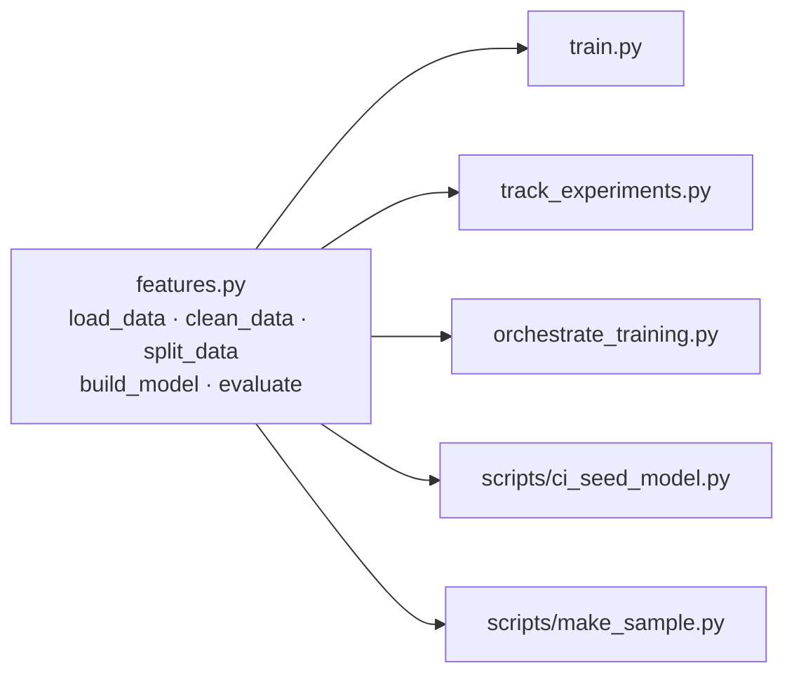
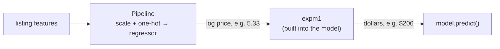

---

---

# Part 2: Modelling code

---

## Chapter 3: One shared module for cleaning and model building

### The problem

Four different scripts will train models in this project:

| Script | Chapter | Purpose |
|---|---|---|
| `train.py` | 4 | Baseline |
| `track_experiments.py` | 7 | Five tracked experiments |
| `orchestrate_training.py` | 10 | Scheduled retraining |
| `scripts/ci_seed_model.py` | 11 | A quick model for automated tests |

If each script had its own copy of the cleaning code, the copies would drift apart. Someone changes the outlier cutoff in one script and forgets the others, and the results stop being comparable. So every rule lives once, in `features.py`, and everything else imports it.



### Concepts

The model uses these features:

| Type | Columns | What happens to them |
|---|---|---|
| Numeric (7) | `latitude`, `longitude`, `minimum_nights`, `number_of_reviews`, `reviews_per_month`, `calculated_host_listings_count`, `availability_365` | `StandardScaler` rescales them to mean 0 and standard deviation 1 |
| Categorical (3) | `neighbourhood_group` (5 values), `neighbourhood` (221), `room_type` (3) | `OneHotEncoder` makes one 0/1 column per value |
| Dropped (5) | `id`, `name`, `host_id`, `host_name`, `last_review` | Identifiers, free text or personal data |
| Target | `price` | Trained as `log1p(price)` |

**Pipeline and ColumnTransformer.** A scikit-learn `Pipeline` chains steps (preprocess, then model) into one object with `.fit()` and `.predict()`. A `ColumnTransformer` applies different preprocessing to different columns. Because the preprocessing lives inside the model object, whoever uses the model later (the API, for one) can't forget it or apply it wrongly.

**High-cardinality categoricals.** One-hot encoding `neighbourhood` creates 221 columns. That's fine for these models, but it carries a real risk: sooner or later the API will receive a neighbourhood that wasn't in the training data. `OneHotEncoder(handle_unknown="ignore")` turns an unknown value into all zeros instead of crashing.

**The log-price trick.** Most listings cost around $100 and a few cost thousands. A model trained on raw prices gets pulled around by those few expensive listings. Taking the logarithm squeezes the scale:

| Price | `log1p(price)` |
|---|---|
| $50 | 3.93 |
| $150 | 5.02 |
| $800 | 6.69 |

The model learns on the log scale, and `expm1` (the exact inverse of `log1p`) converts predictions back. The danger is forgetting to convert back, which leaves you reporting "RMSE = 0.5" or serving a price of "$5.30". So we never convert by hand. scikit-learn's `TransformedTargetRegressor` does it inside the model.



**Test-driven development (TDD).** You write a test that describes what the code should do, run it and watch it fail, then write code until it passes. Seeing the test fail first proves it actually tests something.

**pytest fixtures.** A fixture is a function marked `@pytest.fixture` that prepares something tests need, such as a small dataset or a temporary database. A test gets the fixture by naming it as a parameter.

### What changes in this chapter

| File | Change |
|---|---|
| `tests/test_features.py` | New, with 7 tests |
| `features.py` | New, the shared module |
| `scripts/__init__.py`, `scripts/make_sample.py` | New. They create a small sample of the data for automated tests |
| `tests/fixtures/listings_sample.csv` | New. Generated, then committed |
| `tests/conftest.py` | New, with shared test fixtures |

### Step 1: Write the tests first

Create the two folders this chapter's files go in:
```bash
mkdir -p tests scripts
```

<<<FILE:tests/test_features.py>>>

How the tests work:

1. The `raw_df` fixture builds six fake listings with all 16 CSV columns and the real quirks: a `$0` price, a `$10,000` outlier, and a listing with no reviews (so `reviews_per_month` is missing).
2. The cleaning tests check that only `[50, 150, 300, 800]` survive, that the missing review rate becomes `0`, and that `id`, `name` and the other dropped columns are gone.
3. `test_log_target_inversion_matches_hand_computed_value` matters most. A `DummyRegressor(strategy="mean")` just predicts the average of what it was trained on. Trained on log prices, it predicts `mean(log1p(prices))`, so the dollar prediction must be `expm1(mean(log1p(prices)))`, about $206. If the conversion back were missing, you'd get about 5.3.
4. `test_evaluate_returns_dollar_scale_metrics` checks that RMSE comes out in dollars (over 100 here) and not in log units.
5. `test_split_data_is_reproducible_80_20` checks the 80/20 ratio and that the split is the same on every run. It uses fixtures from `conftest.py` (Step 4).
6. `test_model_tolerates_unseen_neighbourhood` checks that a neighbourhood called `"Nowhere Heights"` gets a price instead of crashing the model.

Run them before `features.py` exists:
```bash
pytest tests/test_features.py -q
```
Expected:
```
E   ModuleNotFoundError: No module named 'features'
```
That's the failure you want: the tests fail because the module doesn't exist yet.

### Step 2: Write `features.py`

<<<FILE:features.py>>>

How it works:

1. The constants at the top (`NUMERIC_FEATURES`, `CATEGORICAL_FEATURES`, `MAX_PRICE`, `RANDOM_STATE`) are imported by every other file, so they're defined in one place.
2. `load_data(path=None)` reads the `DATA_PATH` environment variable when you don't pass a path, and falls back to `data/AB_NYC_2019.csv`. That lets CI (Chapter 11) train on a small sample without changing any code.
3. `clean_data` applies the decisions from Chapter 2: fill missing review rates with `0`, keep prices in `(0, 800]`, and keep only the model's columns. `df.copy()` avoids modifying the caller's DataFrame.
4. `split_data` does an 80/20 split with `random_state=42`. The split is the same every time, so every model gets compared on the same test listings.
5. `build_model(regressor)` takes any scikit-learn regressor and wraps it in the same preprocessing and log/exp conversion. Chapter 7 plugs in RandomForest and GradientBoosting with identical preprocessing, which keeps the comparison fair.
6. `evaluate` computes RMSE, MAE and R² in dollars, since the model's `.predict()` already returns dollars.

### Step 3: Create a small sample for automated tests

The full dataset lives in DVC storage on your machine. In Chapter 11, GitHub's servers will run your tests, and they can't reach your laptop. So we commit a small random sample of 2,000 rows. It contains only the model's columns, with no names or IDs, so there's no personal data in it.

<<<FILE:scripts/make_sample.py>>>

```bash
touch scripts/__init__.py
python -m scripts.make_sample
```
Expected:
```
wrote 2000 rows to tests/fixtures/listings_sample.csv
```

> [!TIP]
> **Why `python -m scripts.make_sample` and not `python scripts/make_sample.py`?** Running a file directly puts its own folder (`scripts/`) first on Python's import path, and then `import features` (which lives in the project root) fails. `-m` runs it as a module from the project root. The empty `scripts/__init__.py` makes `scripts` a proper package.

Check what's in it:
```bash
python -c "import pandas as pd; s = pd.read_csv('tests/fixtures/listings_sample.csv'); print(s.shape); print(s.neighbourhood_group.value_counts().to_dict())"
```
Expected:
```
(2000, 11)
{'Manhattan': 858, 'Brooklyn': 827, 'Queens': 259, 'Bronx': 42, 'Staten Island': 14}
```
All five boroughs are there, and the sample keeps the real quirks (424 missing review rates and 15 prices above $800), so the cleaning code gets tested on realistic data. Because the seed is fixed, you get exactly the same 2,000 rows.

### Step 4: Shared fixtures in `tests/conftest.py`

pytest loads `conftest.py` automatically, and every test file can use the fixtures defined there.

<<<FILE:tests/conftest.py|until:def local_mlflow>>>

A few things to notice:
- `SAMPLE_PATH` is built from `__file__` (the file's own location), so the tests pass no matter which folder you run `pytest` from. The first version used the relative path `"tests/fixtures/..."` and broke when run from anywhere else. An audit caught it.
- `scope="session"` loads the sample once for the whole test run instead of once per test.
- `import mlflow` isn't used yet. Chapter 7 adds a third fixture that needs it.

### Step 5: Run the tests

```bash
pytest -v
```
Expected (last line):
```
7 passed
```

### See it fail: do the tests catch bugs?

A test suite is only useful if it fails when the code is wrong. Try these one at a time: make the edit in `features.py`, run `pytest -q`, check that at least one test fails, then undo the edit.

| Break this in `features.py` | Test that catches it |
|---|---|
| `inverse_func=np.expm1` → `inverse_func=lambda x: x` | `test_log_target_inversion_matches_hand_computed_value` |
| `.fillna(0.0)` → `.fillna(df["reviews_per_month"].mean())` | `test_clean_data_fills_missing_reviews_per_month_with_zero` |
| `(df[TARGET] > 0)` → `(df[TARGET] >= 0)` | `test_clean_data_drops_zero_and_outlier_prices` |
| `return df[FEATURES + [TARGET]]...` → `return df` | `test_clean_data_keeps_only_model_columns` |
| `test_size=0.2` → `test_size=0.5` | `test_split_data_is_reproducible_80_20` |
| `OneHotEncoder(handle_unknown="ignore")` → `OneHotEncoder()` | `test_model_tolerates_unseen_neighbourhood` |

When the original project ran this exercise, the tests caught every one of these bugs.

### Step 6: Commit

```bash
git add features.py scripts/__init__.py scripts/make_sample.py tests/
git commit -m "feat: shared cleaning/pipeline module with log-target model and CI sample"
```

### Checkpoint

```bash
pytest -q                                  # 7 passed
git ls-files tests                         # conftest.py, fixtures/listings_sample.csv, test_features.py
```

### Your project after Chapter 3

```
NYC-Airbnb-Price-Prediction/
├── features.py                      ← every cleaning + model-building rule
├── scripts/
│   ├── __init__.py
│   └── make_sample.py
├── tests/
│   ├── conftest.py                  ← sample_path, sample_splits
│   ├── fixtures/listings_sample.csv ← 2,000 rows, 142 KB, IN Git
│   └── test_features.py             ← 7 tests
└── … (Chapters 1 and 2)
```

Every rule now lives in one place, and if you change one by accident, a test fails straight away.

---

## Chapter 4: The baseline model

### The problem

Before adding tracking servers and containers, check that the whole pipeline works end to end on the real data: load, clean, split, train, score, save and reload. That's what a baseline is for. It's the simplest reasonable model, and it gives you the number every later model has to beat. We use `LinearRegression` because it's fast, simple and hard to get wrong. If something breaks, the problem is in the pipeline and not in a fancy model.

### Concepts: three regression metrics

| Metric | Plain meaning | Better when |
|---|---|---|
| RMSE (root mean squared error) | The typical error in dollars. Errors are squared before averaging, so big misses count extra | Lower |
| MAE (mean absolute error) | The average miss in dollars: "on average we're off by $X" | Lower |
| R² | The share of price variation the model explains. 1 is perfect, 0 is no better than always guessing the average, and negative is worse than that | Higher |

RMSE is always at least as large as MAE. A big gap between them means a few large misses dominate the error.

### Step 1: Write `train.py`

<<<FILE:train.py>>>

Notes on the script:
- It's short because every rule lives in `features.py`. `train.py` only wires the steps together.
- `evaluate` uses the test set, which holds listings the model never saw. Scoring on the training data would flatter the model.
- `joblib.dump` saves the whole fitted object (preprocessing, regressor and log/exp conversion) to one file.
- The reload-and-compare line proves the saved file really works, instead of only proving that something was written.
- There's no `expm1` anywhere, because the model converts back to dollars itself (Chapter 3).

### Step 2: Run it

```bash
python train.py
```
Expected:
```
rows after cleaning: 48464  (train=38771, test=9693)
rmse: 83.545
mae: 47.077
r2: 0.395
saved and reloaded models/model.pkl
```

The 48,464 comes from 48,895 rows, minus 11 at `$0` and 420 above $800.

### Step 3: Three sanity checks

**Is the scale right?** An RMSE of $83.5 is in the tens of dollars, which is what you'd expect. If you saw `0.5`, you'd be scoring log prices, and `4,000` would mean the conversion is broken.

**Is it better than guessing?** Compare it with a model that ignores every feature:
```bash
python - <<'EOF'
from sklearn.dummy import DummyRegressor
from features import build_model, clean_data, evaluate, load_data, split_data
X_train, X_test, y_train, y_test = split_data(clean_data(load_data()))
dummy = build_model(DummyRegressor(strategy="mean")).fit(X_train, y_train)
print({k: round(v, 3) for k, v in evaluate(dummy, X_test, y_test).items()})
EOF
```
Expected:
```
{'rmse': 110.907, 'mae': 71.068, 'r2': -0.065}
```

| Model | RMSE | MAE | R² |
|---|---|---|---|
| Always guess the typical price | $110.91 | $71.07 | -0.065 |
| LinearRegression | $83.55 | $47.08 | 0.395 |

The features carry real signal: the average miss drops from $71 to $47.

> [!TIP]
> Why is R² slightly negative for the "always guess" model? It learns on log prices, so its single guess is the log average (about $110). That's below the plain dollar average that R² compares against.

**Do individual predictions make sense?**
```bash
python - <<'EOF'
import joblib, pandas as pd
m = joblib.load("models/model.pkl")
base = dict(latitude=40.7549, longitude=-73.9840, minimum_nights=2, number_of_reviews=20,
            reviews_per_month=1.0, calculated_host_listings_count=1, availability_365=180)
rows = pd.DataFrame([
    {**base, "neighbourhood_group": "Manhattan", "neighbourhood": "Midtown", "room_type": "Entire home/apt"},
    {**base, "neighbourhood_group": "Manhattan", "neighbourhood": "Midtown", "room_type": "Private room"},
    {**base, "neighbourhood_group": "Bronx", "neighbourhood": "Fordham",
     "latitude": 40.8615, "longitude": -73.8904, "room_type": "Shared room"},
])
for label, p in zip(["Midtown entire home", "Midtown private room", "Fordham (Bronx) shared room"], m.predict(rows)):
    print(f"{label:30s} ${p:,.2f}")
EOF
```
Expected:
```
Midtown entire home            $284.37
Midtown private room           $142.57
Fordham (Bronx) shared room    $36.18
```
The entire home costs the most, then the private room, then the shared room in the Bronx, which is the order you'd expect.

How good is an R² of 0.40? It's modest. The data describes location, room type and booking activity, but says nothing about size, bedrooms or amenities. The tree models in Chapter 7 do better, and now you know the number they have to beat.

### Step 4: Commit the code, not the model

```bash
git add train.py
git commit -m "feat: baseline LinearRegression training script (log-price target)"
```

`.gitignore` excludes `models/model.pkl`. It's only a local sanity check. From Chapter 7 on, MLflow stores and versions the models.

### Checkpoint

```bash
python train.py | grep rmse       # rmse: 83.545
git status --short                # nothing (models/ is ignored)
```

From here on, every model gets judged against an RMSE of $83.55 on the same 9,693 test listings.
