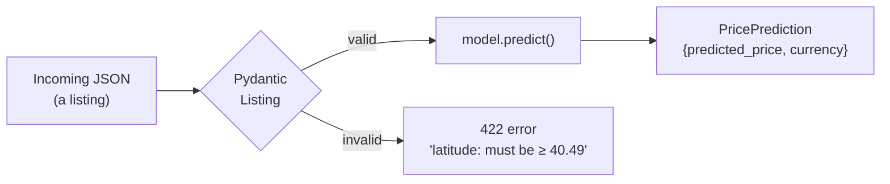
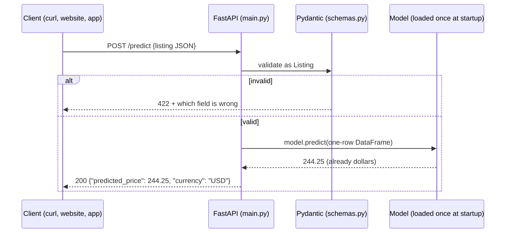

---

---

# Part 3: Serving predictions

---

## Chapter 5: Input validation with Pydantic

### The problem

Soon anyone will be able to send a listing to your API and get a price back. People and programs send bad data: a typo in `room_type`, `minimum_nights: 0`, a latitude with the sign flipped. A machine-learning model never complains about any of it. Give it nonsense and it returns a confident-looking price that means nothing.

Pydantic checks data against a declared shape before it reaches the model. You describe a valid listing once, and every request gets checked automatically. FastAPI (Chapter 6) uses these descriptions directly, so a bad request gets a clear `422` error that says what's wrong.



### Concepts

- A Pydantic model is a Python class whose type hints are the validation rules.
- `Literal["a", "b"]` means the value must be exactly one of these strings.
- In `Field(..., ge=1)`, the `...` means the field is required, and `ge`/`le` mean "greater than or equal" and "less than or equal".
- Invalid data raises a `ValidationError` that lists every problem.

The rules, and the reason for each:

| Field | Rule | Why |
|---|---|---|
| `neighbourhood_group` | One of the 5 boroughs | Only 5 exist |
| `room_type` | One of 3 types | The data only has 3 |
| `neighbourhood` | Any non-empty text | 221 values is too many to list, and the model safely ignores unknown ones (Chapter 3) |
| `latitude` | 40.49 to 40.92 | NYC, padded slightly around the real data (40.4998 to 40.9131) |
| `longitude` | -74.26 to -73.70 | Same idea (real range -74.2444 to -73.7130) |
| `minimum_nights` | At least 1 | A booking is at least one night |
| `number_of_reviews`, `reviews_per_month` | At least 0 | Counts and rates can't be negative |
| `calculated_host_listings_count` | At least 1 | The host has at least this listing |
| `availability_365` | 0 to 365 | Days in a year |

> [!TIP]
> **Why bound latitude and longitude at all?** Without bounds, `latitude: -75` (Antarctica) or `longitude: 73.98` (the sign flipped, which puts it in China) would be accepted and priced. The model has never seen anything outside NYC, so its answer would be meaningless.

### Step 1: Tests first

<<<FILE:tests/test_schemas.py>>>

How the tests work:
- `@pytest.mark.parametrize` runs one test function 10 times, once per `(field, value)` pair. Each run takes a valid listing and breaks exactly one field, so a failure names the exact rule that's missing.
- `{**EXAMPLE_LISTING, field: value}` copies the valid example and overwrites one field.
- `pytest.raises(ValidationError)` passes only if Pydantic rejects the input.
- `test_listing_fields_match_model_features_exactly` ties the schema to `features.FEATURES`. If you add a feature to the model but forget the API, this test fails.

```bash
pytest tests/test_schemas.py -q      # ModuleNotFoundError: No module named 'schemas'
```

### Step 2: Write `schemas.py`

<<<FILE:schemas.py>>>

Notes:
- The fields match the model's 10 features, not the raw CSV. There's no `id`, `name` or `last_review`, because the model doesn't use them and the API shouldn't ask for them.
- `EXAMPLE_LISTING` lives here rather than in the tests, so the tests, the API docs and later chapters all share one known-good listing.
- `model_config = {"json_schema_extra": ...}` puts that example into FastAPI's interactive docs page, so the "Try it out" button starts with a valid request.

```bash
pytest tests/test_schemas.py -q      # 14 passed
```

### See it fail: break a rule on purpose

In `schemas.py`, change `minimum_nights: int = Field(..., ge=1)` to `ge=0`, then run:
```bash
pytest tests/test_schemas.py -q
```
```
E       Failed: DID NOT RAISE ValidationError
FAILED tests/test_schemas.py::test_invalid_value_is_rejected[minimum_nights-0]
1 failed, 13 passed
```
Exactly one test fails, and its name tells you which field and value. Change it back to `ge=1` and you're at `14 passed` again.

### Step 3: Make sure real listings get through

Strict validation carries the opposite risk: bounds so tight that they block real data. Check every cleaned training listing:
```bash
python - <<'EOF'
from pydantic import ValidationError
from features import FEATURES, clean_data, load_data
from schemas import Listing
df = clean_data(load_data())[FEATURES]
rejected = 0
for row in df.to_dict(orient="records"):
    try:
        Listing(**row)
    except ValidationError:
        rejected += 1
print(f"validated {len(df)} real listings, rejected {rejected}")
EOF
```
Expected:
```
validated 48464 real listings, rejected 0
```

### Step 4: Commit

```bash
git add schemas.py tests/test_schemas.py
git commit -m "feat: Listing/PricePrediction schemas with NYC bounds and tests"
```

### Checkpoint

```bash
pytest -q        # 21 passed (7 features + 14 schemas)
```

Bad input now gets rejected with a clear reason before it reaches the model, and every real listing still passes.

---

## Chapter 6: The prediction API with FastAPI

### The problem

A model sitting in a Python file is no use to a website, an app or another team. They need to ask over the network what a listing should cost and get an answer back. FastAPI turns the model into a web API: a program that listens for HTTP requests and replies with JSON.



### Concepts

**Endpoints.** `GET /health` answers "are you alive?", and `POST /predict` takes a listing and returns a price.

**Load the model once, at startup.** Loading can take seconds, so doing it on every request would be slow. FastAPI's lifespan function runs once when the server starts.

**Where the model comes from.** This is the big design choice. The obvious approach is `joblib.load("models/model.pkl")`, and we deliberately avoid it. A hardcoded file path ties the API to one specific file, and every new model would need someone to copy a file and redeploy. Instead, the API asks a model registry (built in Chapters 7 and 8) for whichever model currently holds the `champion` label:

```
models:/AirbnbPriceModel@champion
```

| Part | Meaning |
|---|---|
| `models:/` | Look this up in the MLflow Model Registry |
| `AirbnbPriceModel` | The registered model's name |
| `@champion` | An alias: a movable label that points at one version |

To ship a better model, you promote it, move the label and restart the API, and it serves the new model. You don't change code or rebuild anything. MLflow finds the registry through the `MLFLOW_TRACKING_URI` environment variable, so the same code works on your laptop, in CI and in Docker.

**Testing without the registry.** The registry doesn't exist yet. The API still has logic worth testing (validation, rounding, the response shape), so the tests swap the real model for a tiny fake one.

### Step 1: Tests first, with a fake model

<<<FILE:tests/test_api.py>>>

How the tests work:
- `FakeModel.predict` returns a fixed price and remembers what it received (`self.seen`), so a test can check exactly what the API sent to the model.
- `monkeypatch.setattr(main, "load_model", lambda: fake)` temporarily replaces `main.load_model` for one test, so startup "loads" the fake instead of contacting MLflow. pytest undoes the change afterwards.
- `TestClient` sends HTTP-style requests to the app in memory, with no server and no port. The `with` block is what runs the lifespan (startup) code.
- The five tests check that health answers, that `123.456` comes back as `123.46`, that the model receives exactly the 10 feature columns, that a negative model output is served as `0.0`, and that `room_type: "Castle"` gets HTTP `422`.

```bash
pytest tests/test_api.py -q         # ModuleNotFoundError: No module named 'main'
```

### Step 2: Write `main.py`

<<<FILE:main.py>>>

How it works:
1. `MODEL_URI` defaults to the registry address, and an environment variable can override it. That's handy for testing (see Step 3).
2. `load_model()` is its own function so that tests can replace it.
3. `lifespan` runs once at startup. It logs what it's loading and from where (the exercise below explains why that log line exists), loads the model into `app.state.model`, then `yield` hands control to the running server.
4. `predict(listing: Listing)` has its parameter typed as `Listing`, so FastAPI validates the JSON body automatically. Invalid input never reaches this function.
5. `pd.DataFrame([listing.model_dump()])` builds a one-row table, because scikit-learn models expect a table.
6. `max(price, 0.0)` stops the API from serving a negative price. Our log-price model can't produce one, but the API shouldn't rely on that.
7. There's no `expm1`, because the model converts back to dollars itself.

```bash
pytest -q        # 26 passed
```

### Step 3: Look at the interactive docs (optional preview)

The registry doesn't exist until Chapter 8, but you can already try the real loading code. Save the baseline model from Chapter 4 in MLflow's format to a temporary folder:

```bash
rm -rf /tmp/baseline_mlflow_model
python -c "import joblib, mlflow.sklearn; mlflow.sklearn.save_model(joblib.load('models/model.pkl'), '/tmp/baseline_mlflow_model')"
MODEL_URI=/tmp/baseline_mlflow_model uvicorn main:app --port 8000
```

Expected log:
```
INFO:     Loading /tmp/baseline_mlflow_model from sqlite:///…/mlflow.db
INFO:     Model loaded
INFO:     Application startup complete.
```

The "from sqlite:///…" part is only MLflow reporting its default location, and nothing gets created there. Now open http://127.0.0.1:8000/docs in your browser and go to POST /predict → Try it out → Execute. You should get `{"predicted_price": 284.37, "currency": "USD"}`, the same number as in Chapter 4. Change `latitude` to `-75` and execute again, and you get a `422` saying `Input should be greater than or equal to 40.49`.

Stop the server with Ctrl-C.

> [!TIP]
> If port 8000 is already in use (`address already in use`), pick another one, such as `--port 8002`.

### See it fail: the model registry is down

We ran into this while building the project. Point the API at a registry that isn't running:
```bash
MLFLOW_TRACKING_URI=http://127.0.0.1:5999 uvicorn main:app --port 8000
```
It prints `Loading models:/AirbnbPriceModel@champion from http://127.0.0.1:5999` and then seems to freeze. With MLflow's default settings it retries 7 times, waiting longer each time, and only gives up after about 4 minutes (247 seconds when we measured it). For a service, that looks exactly like "broken, and no idea why", which is why `main.py` logs before it starts loading.

Press Ctrl-C (if it doesn't respond, see the warning below). Then try again with two MLflow settings that cut the retrying short:
```bash
MLFLOW_TRACKING_URI=http://127.0.0.1:5999 MLFLOW_HTTP_REQUEST_MAX_RETRIES=3 MLFLOW_HTTP_REQUEST_TIMEOUT=10 uvicorn main:app --port 8000
```
```
INFO:     Loading models:/AirbnbPriceModel@champion from http://127.0.0.1:5999
mlflow.exceptions.MlflowException: API request to http://127.0.0.1:5999/... failed ...
ERROR:    Application startup failed. Exiting.
```
Now it fails clearly in about 14 seconds. The Docker image (Chapter 9) has these two settings built in.

> [!WARNING]
> A server stuck in startup may ignore Ctrl-C. Find it with `pgrep -fl uvicorn` and stop it with `kill -9 <pid>`.

### Step 4: Commit

```bash
git add main.py tests/test_api.py
git commit -m "feat: FastAPI app serving the registry champion, with startup logging"
```

### Checkpoint

```bash
pytest -q        # 26 passed (7 + 14 + 5)
```

### Your project after Part 3

```
NYC-Airbnb-Price-Prediction/
├── schemas.py              ← Listing, PricePrediction, EXAMPLE_LISTING
├── main.py                 ← /health, /predict; loads @champion at startup
├── tests/
│   ├── test_schemas.py     ← 14 tests
│   └── test_api.py         ← 5 tests with a FakeModel
└── … (Parts 1 and 2)
```

The API doesn't care which model it serves. It asks the registry for the champion, and choosing the champion becomes a separate, controlled step, which is Part 4.
