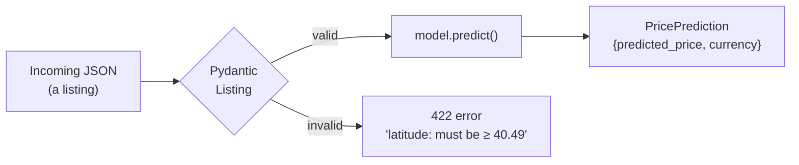
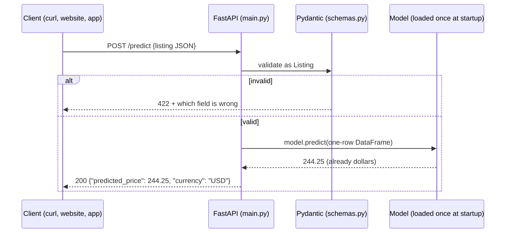

---

---

# PART 3 — Serving Predictions

---

## Chapter 5 — Input Validation with Pydantic

### What Problem This Solves

Soon, anyone will be able to send a listing to your API and get a price back. People — and programs — send bad data: a typo in `room_type`, `minimum_nights: 0`, a latitude with the sign flipped. A machine-learning model **never complains**: give it nonsense and it returns a confident-looking, meaningless price.

**Pydantic** checks data against a declared shape *before* it reaches the model. You describe a valid listing once; every request is checked automatically. FastAPI (Chapter 6) uses these descriptions directly, so a bad request gets a clear `422` error saying what's wrong.



### Concepts Before Any Code

- A **Pydantic model** is a Python class whose type hints *are* the validation rules.
- `Literal["a", "b"]` — the value must be exactly one of these strings.
- `Field(..., ge=1)` — `...` means *required*; `ge`/`le` mean *greater/less than or equal*.
- Invalid data raises `ValidationError` listing every problem.

The rules, and why:

| Field | Rule | Why |
|---|---|---|
| `neighbourhood_group` | one of the 5 boroughs | only 5 exist |
| `room_type` | one of 3 types | only 3 in the data |
| `neighbourhood` | any non-empty text | 221 values is too many to list; unknown ones are safely ignored by the model (Chapter 3) |
| `latitude` | 40.49 – 40.92 | NYC, slightly padded around the real data (40.4998 – 40.9131) |
| `longitude` | -74.26 – -73.70 | same (real: -74.2444 – -73.7130) |
| `minimum_nights` | ≥ 1 | a booking is at least one night |
| `number_of_reviews`, `reviews_per_month` | ≥ 0 | counts and rates can't be negative |
| `calculated_host_listings_count` | ≥ 1 | the host has at least this listing |
| `availability_365` | 0 – 365 | days in a year |

💡 **Why bound latitude/longitude at all?** Without bounds, `latitude: -75` (Antarctica) or `longitude: 73.98` (sign flipped — that's China) would be accepted and priced. The model has never seen anything outside NYC, so its answer would be meaningless.

### Step 1 — Tests first

<<<FILE:tests/test_schemas.py>>>

**Walk through it:**
- `@pytest.mark.parametrize` runs one test function **10 times**, once per `(field, value)` pair. Each run takes a *valid* listing and breaks exactly **one** field, so a failure names the exact rule that's missing.
- `{**EXAMPLE_LISTING, field: value}` copies the valid example and overwrites one field.
- `pytest.raises(ValidationError)` passes only if Pydantic **rejects** the input.
- `test_listing_fields_match_model_features_exactly` ties the schema to `features.FEATURES`: add a feature to the model but forget the API, and this fails.

```bash
pytest tests/test_schemas.py -q      # ModuleNotFoundError: No module named 'schemas'
```

### Step 2 — Write `schemas.py`

<<<FILE:schemas.py>>>

**Notes:**
- The fields match the **model's 10 features** — not the raw CSV. No `id`, `name` or `last_review`: the model doesn't use them, so the API doesn't ask for them.
- `EXAMPLE_LISTING` lives here (not in the tests) so tests, API docs and later chapters share one known-good listing.
- `model_config = {"json_schema_extra": ...}` puts that example into FastAPI's interactive docs page, so its "Try it out" button starts with a valid request.

```bash
pytest tests/test_schemas.py -q      # 14 passed
```

### 🧪 See It Fail — break a rule on purpose

In `schemas.py`, change `minimum_nights: int = Field(..., ge=1)` to `ge=0`, then:
```bash
pytest tests/test_schemas.py -q
```
```
E       Failed: DID NOT RAISE ValidationError
FAILED tests/test_schemas.py::test_invalid_value_is_rejected[minimum_nights-0]
1 failed, 13 passed
```
Exactly one test fails, and its name tells you which field and value. **Change it back to `ge=1`** → `14 passed`.

### Step 3 — Don't reject real listings

Strict validation has the opposite risk: bounds so tight they block real data. Check every cleaned training listing:
```bash
python - <<'EOF'
from pydantic import ValidationError
from features import FEATURES, clean_data, load_data
from schemas import Listing
df = clean_data(load_data())[FEATURES]
rejected = 0
for row in df.to_dict(orient="records"):
    try:
        Listing(**row)
    except ValidationError:
        rejected += 1
print(f"validated {len(df)} real listings, rejected {rejected}")
EOF
```
Expected:
```
validated 48464 real listings, rejected 0
```

### Step 4 — Commit

```bash
git add schemas.py tests/test_schemas.py
git commit -m "feat: Listing/PricePrediction schemas with NYC bounds and tests"
```

### ✅ Checkpoint

```bash
pytest -q        # 21 passed (7 features + 14 schemas)
```

**The mental shift:** the model is protected. Garbage is rejected at the door with a clear reason, and real data always gets through.

---

## Chapter 6 — The Prediction API with FastAPI

### What Problem This Solves

A model in a Python file is useless to a website, an app or another team. They need to ask *over the network* — "what should this listing cost?" — and get an answer. **FastAPI** turns the model into a **web API**: a program that listens for HTTP requests and replies with JSON.



### Concepts Before Any Code

**Endpoints.** `GET /health` answers "are you alive?"; `POST /predict` takes a listing and returns a price.

**Load the model once, at startup.** Loading can take seconds; doing it per request would be slow. FastAPI's **lifespan** function runs once when the server starts.

**Where does the model come from? The big design choice.** The obvious approach is `joblib.load("models/model.pkl")`. We deliberately avoid it: a hardcoded file path ties the API to one specific file, and every new model would need someone to copy a file and redeploy. Instead the API asks a **model registry** (built in Chapters 7–8) for *whichever model currently holds the `champion` label*:

```
models:/AirbnbPriceModel@champion
```

| Part | Meaning |
|---|---|
| `models:/` | look this up in the MLflow Model Registry |
| `AirbnbPriceModel` | the registered model's name |
| `@champion` | an **alias** — a movable label pointing at one version |

Promote a better model → move the label → restart the API → it serves the new model. **No code change, no rebuild.** Which registry? MLflow reads the `MLFLOW_TRACKING_URI` environment variable — so the same code works on your laptop, in CI and in Docker.

**Testing without the registry.** The registry doesn't exist yet. But the API has its own logic worth testing — validation, rounding, response shape — so the tests swap the real model for a tiny **fake** one.

### Step 1 — Tests first, with a fake model

<<<FILE:tests/test_api.py>>>

**Walk through it:**
- `FakeModel.predict` returns a fixed price and remembers what it received (`self.seen`), so a test can check exactly what the API sent to the model.
- `monkeypatch.setattr(main, "load_model", lambda: fake)` temporarily replaces `main.load_model` for one test, so startup "loads" the fake instead of contacting MLflow. pytest undoes it afterwards.
- `TestClient` sends HTTP-style requests to the app **in memory** — no server, no port. The `with` block is what runs the lifespan (startup) code.
- The five tests: health answers; `123.456` comes back as `123.46`; the model receives exactly the 10 feature columns; a negative model output is served as `0.0`; `room_type: "Castle"` gets HTTP `422`.

```bash
pytest tests/test_api.py -q         # ModuleNotFoundError: No module named 'main'
```

### Step 2 — Write `main.py`

<<<FILE:main.py>>>

**Walk through it:**
1. **`MODEL_URI`** — the registry address by default, overridable with an environment variable (handy for testing — see Step 4).
2. **`load_model()` as its own function** — this is what lets tests replace it.
3. **`lifespan`** — runs once at startup: logs *what* it's loading and *from where* (see the 🧪 below for why that log line exists), loads the model into `app.state.model`, then `yield` hands control to the running server.
4. **`predict(listing: Listing)`** — because the parameter is typed as `Listing`, FastAPI validates the JSON body automatically. Invalid input never reaches this function.
5. **`pd.DataFrame([listing.model_dump()])`** — scikit-learn models expect a table; this is a one-row table.
6. **`max(price, 0.0)`** — a price can't be negative. (Our log-price model can't produce one, but the API shouldn't rely on that.)
7. **No `expm1`** — the model converts back to dollars itself.

```bash
pytest -q        # 26 passed
```

### Step 3 — Look at the interactive docs (optional preview)

The registry doesn't exist until Chapter 8, but you can already try the *real* loading code with the baseline model from Chapter 4, saved in MLflow's format to a temporary folder:

```bash
rm -rf /tmp/baseline_mlflow_model
python -c "import joblib, mlflow.sklearn; mlflow.sklearn.save_model(joblib.load('models/model.pkl'), '/tmp/baseline_mlflow_model')"
MODEL_URI=/tmp/baseline_mlflow_model uvicorn main:app --port 8000
```

Expected log:
```
INFO:     Loading /tmp/baseline_mlflow_model from sqlite:///…/mlflow.db
INFO:     Model loaded
INFO:     Application startup complete.
```

(The "from sqlite:///…" part is just MLflow reporting its default location; nothing is created there.) Now, in your browser, open **http://127.0.0.1:8000/docs** → **POST /predict → Try it out → Execute**. You should get `{"predicted_price": 284.37, "currency": "USD"}` — the same number as Chapter 4. Change `latitude` to `-75` and execute again: a `422` explains `Input should be greater than or equal to 40.49`.

Stop the server with **Ctrl-C**.

💡 If port 8000 is already used by something else (`address already in use`), pick another: `--port 8002`.

### 🧪 See It Fail — what if the model registry is down?

This is a real problem found while building this project. Point the API at a registry that isn't running:
```bash
MLFLOW_TRACKING_URI=http://127.0.0.1:5999 uvicorn main:app --port 8000
```
It prints `Loading models:/AirbnbPriceModel@champion from http://127.0.0.1:5999` and then… appears frozen. With MLflow's default settings it retries 7 times with growing waits, and gives up only after about **4 minutes** (247 seconds when measured). For a service, that looks exactly like "broken, no idea why" — which is why `main.py` logs *before* loading.

Press Ctrl-C (if it ignores you, see the ⚠️ below), then try with two MLflow settings that shorten the retrying:
```bash
MLFLOW_TRACKING_URI=http://127.0.0.1:5999 MLFLOW_HTTP_REQUEST_MAX_RETRIES=3 MLFLOW_HTTP_REQUEST_TIMEOUT=10 uvicorn main:app --port 8000
```
```
INFO:     Loading models:/AirbnbPriceModel@champion from http://127.0.0.1:5999
mlflow.exceptions.MlflowException: API request to http://127.0.0.1:5999/... failed ...
ERROR:    Application startup failed. Exiting.
```
A clear failure in about 14 seconds. The Docker image (Chapter 9) bakes these two settings in.

⚠️ **A server stuck in startup may ignore Ctrl-C.** Find it with `pgrep -fl uvicorn` and stop it with `kill -9 <pid>`.

### Step 4 — Commit

```bash
git add main.py tests/test_api.py
git commit -m "feat: FastAPI app serving the registry champion, with startup logging"
```

### ✅ Checkpoint

```bash
pytest -q        # 26 passed (7 + 14 + 5)
```

### What You Should Have at the End of Part 3

```
NYC-Airbnb-Price-Prediction/
├── schemas.py              ← Listing, PricePrediction, EXAMPLE_LISTING
├── main.py                 ← /health, /predict; loads @champion at startup
├── tests/
│   ├── test_schemas.py     ← 14 tests
│   └── test_api.py         ← 5 tests with a FakeModel
└── … (Parts 1–2)
```

**The mental shift:** the API doesn't know or care *which* model it serves — it asks the registry for "the champion". Deciding *which* model is champion becomes a separate, controlled step (Part 4).
