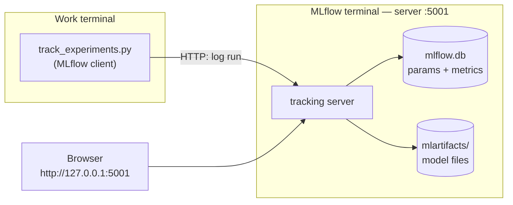
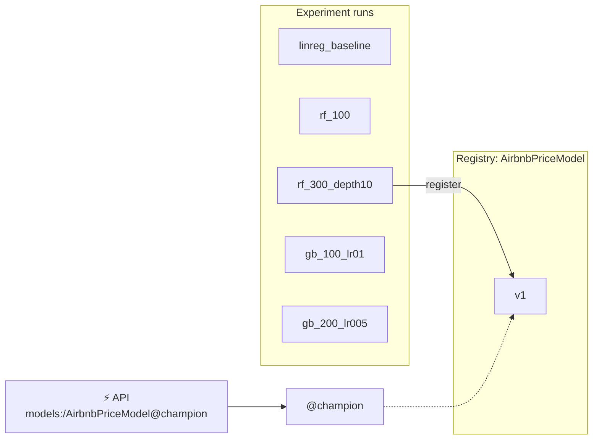

---

---

# PART 4 — Experiment Tracking and the Model Registry

---

## Chapter 7 — Experiment Tracking with MLflow

### What Problem This Solves

In Chapter 4 you trained one model and three numbers scrolled past in the terminal. Now you'll try five models. Without a system, you end up with a notebook of scribbles: *"was 78.7 the 300-tree forest with depth 10, or the 100-tree one? Which file is that model?"* Then someone asks *"can we use last Tuesday's model?"* and you genuinely don't know which one that was.

ML is an experimental science: try something, measure, try something else. The history of those experiments — settings, scores, the model itself — is part of the project. Losing it is like a chemist losing their lab notebook.

**MLflow Tracking** records every training attempt — a **run** — automatically: its settings (**parameters**), its scores (**metrics**) and the trained model (an **artifact**). A web UI lets you sort and compare runs side by side.

💡 **Why MLflow?** It's free, open source, self-hosted (no vendor lock-in) and the most widely used tracker. Alternatives (Weights & Biases, Neptune, Comet) work the same way conceptually — what you learn here transfers.

### Concepts Before Any Code

MLflow has two sides:

- **The tracking server** — a web server that receives logs and stores them in two places:
  - the **backend store** (`mlflow.db`, a SQLite database): run names, parameters, metrics — what the UI shows;
  - the **artifact store** (`mlartifacts/`): the saved model files.
- **The client** — a few lines in your training code (`mlflow.log_params(...)`, `mlflow.log_metrics(...)`, `mlflow.sklearn.log_model(...)`) that send data to the server over HTTP.



More vocabulary:
- **Experiment** — a named folder of runs (ours: `airbnb-price-prediction`).
- **Artifact proxying** — the server both stores *and hands out* model files over HTTP, so clients never need direct access to the folder. This is what lets a Docker container download a model in Chapter 9.

### What Changes in This Chapter

| File | Change |
|---|---|
| `registry.py` | New — MLflow names and helpers (the promotion half is explained in Chapter 8) |
| `track_experiments.py` | New — the five configurations, logged as runs |
| `tests/conftest.py` | Append a `local_mlflow` fixture |
| `tests/test_track_experiments.py` | New — 13 tests |

### Step 1 — Check the port (macOS)

MLflow's default port is 5000. On macOS, **AirPlay Receiver** usually holds it:
```bash
lsof -nP -iTCP:5000 -sTCP:LISTEN
```
If you see `ControlCe…` (ControlCenter), port 5000 is taken. You could switch AirPlay Receiver off, but **this guide uses port 5001 everywhere** instead.

🪟 On Windows port 5000 is normally free — use 5001 anyway, so every command and file in this guide matches.

### Step 2 — Start the MLflow server in its own terminal

The server must keep running while you work, so open a **new terminal window** (the "MLflow terminal"):

```bash
cd NYC-Airbnb-Price-Prediction          # your project folder
source .venv/bin/activate               # ⚠️ new terminal = activate again
which mlflow                            # must end in .venv/bin/mlflow
mlflow server \
  --backend-store-uri sqlite:///mlflow.db \
  --artifacts-destination ./mlartifacts \
  --host 0.0.0.0 --port 5001 \
  --allowed-hosts "localhost:*,127.0.0.1:*,host.docker.internal:*,mlflow-server:*"
```

Ready when you see:
```
INFO:     Uvicorn running on http://0.0.0.0:5001 (Press CTRL+C to quit)
```

**Each flag:**

| Flag | Meaning |
|---|---|
| `--backend-store-uri sqlite:///mlflow.db` | Run details go in `mlflow.db` in the project folder |
| `--artifacts-destination ./mlartifacts` | Model files go in `mlartifacts/`, and the server serves them over HTTP |
| `--host 0.0.0.0` | Accept connections from anywhere on this machine — including Docker containers (Chapter 9). `127.0.0.1` would accept only programs on the host itself |
| `--port 5001` | Avoids AirPlay's port 5000 |
| `--allowed-hosts ...` | Security allow-list of names clients may use to reach the server: your browser (`localhost`, `127.0.0.1`), Docker (`host.docker.internal`, Chapter 9) and Docker Compose (`mlflow-server`, Chapter 13) |

⚠️ If this fails with `ImportError: cannot import name 'service' from 'google.protobuf'`, the terminal is running another Python's `mlflow` (typically Anaconda's). Check `which mlflow`; run `conda deactivate`, then `source .venv/bin/activate`. Or call `.venv/bin/mlflow server …` directly.

Leave this terminal running. Back in your **work terminal**:
```bash
curl -s http://127.0.0.1:5001/health        # OK
export MLFLOW_TRACKING_URI=http://127.0.0.1:5001
```

💡 `export` makes every MLflow program in *this* terminal talk to your server. Set it again in any new work terminal.

**Check the allow-list** lets Docker-style names in and strangers out:
```bash
for h in host.docker.internal:5001 mlflow-server:5000 evil.example.com; do
  curl -s -o /dev/null -w "$h -> %{http_code}\n" -H "Host: $h" \
    "http://127.0.0.1:5001/api/2.0/mlflow/experiments/search?max_results=1"
done
```
```
host.docker.internal:5001 -> 200
mlflow-server:5000 -> 200
evil.example.com -> 403
```

💡 Quote URLs that contain `?` — unquoted, zsh treats `?` as a filename wildcard and fails with `no matches found`.

### Step 3 — `registry.py`: one home for MLflow names

<<<FILE:registry.py>>>

For now, focus on the top of the file:
- **`EXPERIMENT_NAME`, `MODEL_NAME`, `CHAMPION_ALIAS`** — every script uses these names, so they're defined once.
- **`require_tracking_uri()`** — if `MLFLOW_TRACKING_URI` isn't set, MLflow doesn't complain: it silently writes to a local database instead of your server, and you wonder why nothing appears in the UI. This turns that silent mistake into a clear message.

The rest (`SELECTION_METRIC`, `MAX_MODEL_SIZE_MB`, `pick_best`, `logged_model_uri`, `register_and_promote`) is how a model gets promoted — Chapter 8 explains it line by line.

### Step 4 — `track_experiments.py`: five runs, one loop

<<<FILE:track_experiments.py>>>

**Walk through it:**
1. **`CONFIGS`** — the five experiments as *data*: a run name → (model class, parameters). Adding a sixth experiment is one line.
2. **`with mlflow.start_run(run_name=...)`** — everything logged inside the block belongs to one run. If the code crashes inside, MLflow marks the run `FAILED` instead of leaving it half-finished.
3. **`build_model(model_class(**params))`** — the *same* preprocessing and log-price wrapping as the baseline. Only the regressor changes, so the comparison is fair.
4. **`log_params`** — the settings, plus `model_type` and `target_transform` so anyone reading the run later knows what it is.
5. **`log_metrics`** — RMSE/MAE/R² in dollars.
6. **`log_model(..., name="model")`** — uploads the whole fitted model. `input_example` saves three real rows alongside it, documenting the expected input.
7. **`model_size_mb`** — MLflow writes each model's exact size into its metadata file (`MLmodel`); reading it doesn't download the model. You'll see why size matters in the results.
8. **`n_jobs=-1`** — random forests train on all CPU cores; **`random_state`** makes every run reproducible.

💡 **Why `SKOPS_TRUSTED_TYPES`?** MLflow 3 saves scikit-learn models in the **skops** format by default — a safer alternative to Python's `pickle`, which can run *any* code when a file is loaded (a malicious model file could take over your machine). skops only loads object types on an **allow-list**. Linear regression uses only allowed types; random forests and gradient boosting store their trees in `sklearn.tree._tree.Tree`, which skops blocks unless trusted. We trust **exactly that one type** — we create these files ourselves — and anything else unexpected is still blocked. MLflow stores the list with the model, so loading it later (the API) needs no extra setting. See it for yourself in the 🧪 below.

### Step 5 — A test fixture that never touches your real server

Unit tests must not write junk runs to your real MLflow server. Add a fixture that creates a **throwaway MLflow database in a temporary folder**, which pytest deletes afterwards:

<<<FILE:tests/conftest.py|from:def local_mlflow|title:append>>>

**What this does:** `tmp_path` is a fresh temporary folder per test; `monkeypatch.setenv` sets `MLFLOW_TRACKING_URI` only for that test; the `yield` hands the setup to the test, and the line after it restores the previous address.

### Step 6 — The tests

<<<FILE:tests/test_track_experiments.py>>>

Tests for this chapter (the registry tests are explained in Chapter 8):

| Test | What it proves |
|---|---|
| `test_configs_are_the_five_planned_runs` | Exactly the 5 planned run names, in order |
| `test_train_and_log_records_params_metrics_and_model` | A run gets the right name, params, metrics and size — and its model loads back and predicts positive prices |
| `test_every_config_can_be_logged_and_loaded_back` (×5) | **Every** config — not just LinearRegression — survives save → load |

```bash
pytest tests/test_track_experiments.py -q
```
Expected:
```
13 passed, … warnings
```

💡 **About the warnings.** `Inferred schema contains integer column(s)` is MLflow noting that integer columns can't hold missing values — fine here, because the API schema requires those fields. `Failed to resolve installed pip version` appears because uv-made environments don't include `pip`; MLflow just records it without a version. Both are harmless.

### 🧪 See It Fail — the skops crash

This is the real crash the original project hit. In `track_experiments.py`, temporarily delete the line `skops_trusted_types=SKOPS_TRUSTED_TYPES,`, then:
```bash
pytest tests/test_track_experiments.py -q -k every_config
```
```
skops.io.exceptions.UntrustedTypesFoundException: Untrusted types found in the file: ['sklearn.tree._tree.Tree'].
4 failed, 1 passed
```
All four tree models fail; linear regression (no trees) passes. That's also the lesson for tests: the original test only trained LinearRegression, so it missed this — **test every variant you actually use**. **Put the line back.**

### Step 7 — Run all five experiments on the real server

```bash
python track_experiments.py
```
Expected (about 45 seconds; run IDs will differ):
```
linreg_baseline  rmse=  83.54  mae= 47.08  r2=0.395  size=   0.3MB  run_id=…
rf_100           rmse=  77.53  mae= 43.39  r2=0.479  size= 326.0MB  run_id=…
rf_300_depth10   rmse=  78.75  mae= 43.81  r2=0.463  size=  39.3MB  run_id=…
gb_100_lr01      rmse=  81.13  mae= 44.90  r2=0.430  size=   3.9MB  run_id=…
gb_200_lr005     rmse=  81.21  mae= 44.92  r2=0.429  size=   7.4MB  run_id=…
```

⚠️ **Don't pipe this into `grep` to "clean up" the output while checking for success.** A pipe reports the exit code of its *last* command, so a Python crash can still look like success (exit code 0). The original project was fooled exactly this way once.

### Step 8 — Compare in the UI

Open **http://127.0.0.1:5001** → experiment **airbnb-price-prediction**. Tick all five runs → **Compare**. You'll see parameters and metrics side by side — this is the moment experiment tracking clicks.

| Run | RMSE | MAE | R² | Model size |
|---|---|---|---|---|
| rf_100 | **$77.53** | **$43.39** | **0.479** | **326 MB** |
| rf_300_depth10 | $78.75 | $43.81 | 0.463 | 39 MB |
| gb_100_lr01 | $81.13 | $44.90 | 0.430 | 3.9 MB |
| gb_200_lr005 | $81.21 | $44.92 | 0.429 | 7.4 MB |
| linreg_baseline | $83.54 | $47.08 | 0.395 | 0.3 MB |

**Reading the results:**
- All four tree models beat the baseline — they capture patterns a straight line can't (location effects aren't linear in latitude/longitude).
- RMSE and MAE rank the models the same way here (they don't always agree).
- The two gradient-boosting runs are nearly identical: half the learning rate with twice the trees lands in the same place.
- The gains are real but modest — the features don't describe size or amenities.
- **Look at the size column.** `rf_100` grows 100 trees with **no depth limit**: 326 MB. The runner-up is $1.22 worse but 8× smaller. Chapter 8 decides what to do about that.

### Step 9 — Commit

```bash
git add registry.py track_experiments.py tests/conftest.py tests/test_track_experiments.py
git commit -m "feat: MLflow experiment tracking for five regression configs"
```

`mlflow.db` and `mlartifacts/` stay out of Git (`.gitignore`) — they're the server's data, not source code.

### ✅ Checkpoint

```bash
pytest -q                                              # 39 passed
curl -s http://127.0.0.1:5001/health                   # OK
```
…and the UI shows 5 finished runs with params, metrics and a `model` artifact each.

**The mental shift:** results are no longer something you *remember*. Every run — its settings, scores and model — is recorded and comparable, forever.

---

## Chapter 8 — The Model Registry: Promoting a Champion

### What Problem This Solves

You have five runs. Which one should the API serve — and how does the API *find* it?

The **Model Registry** is MLflow's catalogue of approved models:
- a **registered model** is a named slot: `AirbnbPriceModel`;
- each time a run's model is registered into it, it gets a new **version**: v1, v2, v3…;
- an **alias** is a movable label pointing at one version: `@champion` → v1.

The API (Chapter 6) asks for `models:/AirbnbPriceModel@champion`. To ship a better model later, register it as v2 and move `@champion` — the API code never changes.



💡 **Aliases, not stages.** Older tutorials use "stages" (`Staging`, `Production`). That API is deprecated; aliases do the same job with any name you like.

### Step 1 — The decision: which model wins?

"Lowest RMSE" says `rf_100`. But sanity-check it:

| Run | RMSE | Size |
|---|---|---|
| rf_100 | **$77.53** | **326 MB** |
| rf_300_depth10 | $78.75 | 39 MB |

The API downloads the champion every time it starts and keeps it in memory; the Docker container, CI and every restart pay that cost. $1.22 of accuracy isn't worth 8× the size. **We choose `rf_300_depth10`.**

But a one-off manual pick isn't enough: in Chapter 10, retraining runs **automatically**. So the decision must be a **written, testable rule**:

> **Champion = the lowest RMSE among models no bigger than 100 MB.**

### Step 2 — How `registry.py` implements the rule

You created `registry.py` in Chapter 7. The lower half, explained:

**`pick_best(results)`** — `results` maps run ID → metrics:
1. keep only models within `MAX_MODEL_SIZE_MB` (100);
2. none left → raise an error (never quietly promote nothing, or something oversized);
3. choose the lowest RMSE among the rest;
4. if the overall lowest RMSE was excluded by size, **say so** (`note: … is over the 100 MB budget`);
5. if MAE would have picked differently, **say so** — RMSE decides, but disagreements are visible.

💡 **Why RMSE decides:** it punishes big dollar misses hardest. For a pricing tool, one $300 miss hurts more than three $100 misses.

**`best_run_id(experiment_name)`** — feeds `pick_best` from the server: only `FINISHED` runs; a run without a `model_size_mb` metric counts as infinitely big (it can't prove it fits the budget).

**`logged_model_uri(run_id)`** — in MLflow 3, a logged model is its own object with its own address (`models:/m-…`); the run just records which model it produced. We register that real address.

💡 The first version of this project registered `runs:/<run_id>/model` (the MLflow 2 style). It worked, but MLflow warned: *"Run … has no artifacts at artifact path 'model', registering model based on models:/m-… instead"* — it only worked through a compatibility fallback. Treat fallback warnings as bugs: a test now fails if that warning ever appears.

**`register_and_promote(run_id)`** — registers the model (creating the next version) and points `@champion` at it.

### Step 3 — The registry tests

These are already in `tests/test_track_experiments.py` (and passing):

| Test | What it proves |
|---|---|
| `test_pick_best_uses_lowest_rmse_within_size_budget` | A 326 MB model with the best RMSE is skipped; the 39 MB runner-up wins |
| `test_pick_best_prefers_rmse_when_mae_disagrees` | RMSE is the deciding metric |
| `test_pick_best_refuses_when_no_model_fits_the_budget` | Raises instead of promoting something oversized |
| `test_register_and_promote_sets_champion_alias` | `@champion` points at the new version, and it loads |
| `test_promoting_again_moves_the_alias` | A second promotion creates v2 and moves the alias |
| `test_register_uses_the_runs_logged_model_not_a_fallback` | No fallback warning; the version's source is `models:/m-…` |

### Step 4 — Promote

```bash
python registry.py
```
Expected (plus a few MLflow `INFO` lines):
```
note: <rf_100's run id> has a lower RMSE but is over the 100 MB budget
Successfully registered model 'AirbnbPriceModel'.
Created version '1' of model 'AirbnbPriceModel'.
registered AirbnbPriceModel v1 from run <rf_300_depth10's run id> -> @champion
```

In the UI: **Models → AirbnbPriceModel** shows version 1 with the alias `champion`.

### Step 5 — Tests against the *real* champion

Unit tests use a throwaway registry. This file checks the actual champion on your server — loaded through the registry address, not a file — and that its predictions make economic sense:

<<<FILE:tests/test_model_registry.py>>>

**Walk through it:**
- Regression has no "is it above 0.5?" check like classification. Instead: **direction** (a Manhattan entire home must cost more than a Bronx shared room) and **plausibility** (between $10 and $800).
- `Listing(**listing)` makes sure the test inputs are valid API inputs too.
- `pytestmark = pytest.mark.skipif(...)` skips the whole file, with a clear reason, when no server is configured — so the rest of the suite still runs anywhere.

```bash
pytest tests/test_model_registry.py -v                         # 3 passed
env -u MLFLOW_TRACKING_URI pytest tests/test_model_registry.py -v -rs
# SKIPPED [1] tests/test_model_registry.py:47: MLFLOW_TRACKING_URI not set; start the MLflow server to run registry tests
# SKIPPED [2] tests/test_model_registry.py:51: MLFLOW_TRACKING_URI not set; start the MLflow server to run registry tests
# 3 skipped
```

### Step 6 — Load the champion from a brand-new process

The real proof: a fresh Python process that knows nothing except the registry address.
```bash
python -c "
import mlflow.sklearn, pandas as pd
from schemas import EXAMPLE_LISTING
m = mlflow.sklearn.load_model('models:/AirbnbPriceModel@champion')
print(type(m).__name__, round(float(m.predict(pd.DataFrame([EXAMPLE_LISTING]))[0]), 2))"
```
Expected:
```
TransformedTargetRegressor 244.25
```

### Step 7 — Serve the champion through the API

```bash
uvicorn main:app --port 8000
```
```
INFO:     Loading models:/AirbnbPriceModel@champion from http://127.0.0.1:5001
INFO:     Model loaded
INFO:     Application startup complete.
```

In the browser: **http://127.0.0.1:8000/docs → POST /predict → Try it out**. Try these (change the fields shown):

| Listing | Predicted |
|---|---|
| The example (Midtown, Manhattan, entire home) | **$244.25** — same as Step 6 ✅ |
| `neighbourhood_group` Brooklyn, `neighbourhood` Williamsburg, `latitude` 40.7081, `longitude` -73.9571 | $190.16 |
| `room_type` Private room (Midtown) | $129.44 |
| Bronx, Fordham, 40.8615 / -73.8904, Shared room | $38.59 |

Manhattan > Brooklyn; entire home > private room > shared room. Stop with Ctrl-C.

### Step 8 — Commit

```bash
git add tests/test_model_registry.py
git commit -m "feat: register best run as AirbnbPriceModel@champion with a 100 MB size budget"
```

### ✅ Checkpoint

```bash
pytest -q                                   # 42 passed   (with MLFLOW_TRACKING_URI set)
env -u MLFLOW_TRACKING_URI pytest -q        # 39 passed, 3 skipped
```

### What You Should Have at the End of Part 4

```
NYC-Airbnb-Price-Prediction/
├── registry.py                   ← names, champion rule, promotion
├── track_experiments.py          ← five configs, logged with size
├── mlflow.db                     ← run database        (NOT in Git)
├── mlartifacts/                  ← model files (~375 MB) (NOT in Git)
├── tests/
│   ├── conftest.py               ← + local_mlflow
│   ├── test_track_experiments.py ← 13 tests
│   └── test_model_registry.py    ← 3 tests against the real champion
└── … (Parts 1–3)
```

**Running:** MLflow server (MLflow terminal) · **Registry:** `AirbnbPriceModel` v1 = `rf_300_depth10`, `@champion`

**The mental shift:** "which model is in production?" now has a precise answer — the version holding `@champion` — chosen by a written rule that a machine can apply.
