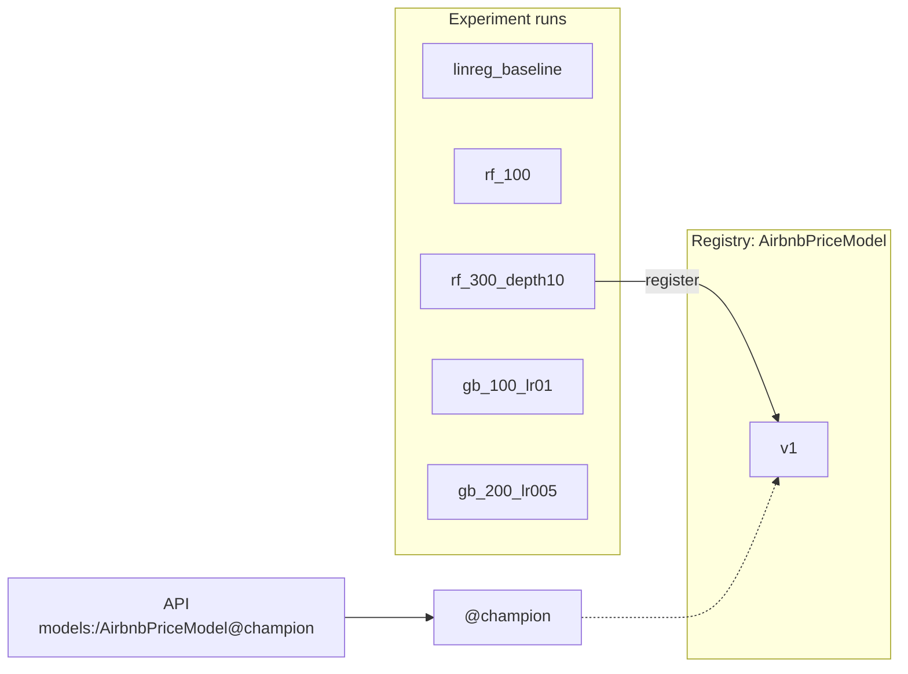

---

---

# Part 4: Experiment tracking and the model registry

---

## Chapter 7: Experiment tracking with MLflow

### The problem

In Chapter 4 you trained one model and three numbers scrolled past in the terminal. Now you'll try five. Without a system you end up with scribbled notes. Was 78.7 the 300-tree forest with depth 10, or the 100-tree one? Which file holds that model? Then someone asks "can we use last Tuesday's model?" and you really don't know which one that was.

ML work is experimental. You try something, measure it, and try something else. The history of those experiments (the settings, the scores and the models) belongs to the project. Losing it is like a chemist losing their lab notebook.

MLflow Tracking records every training attempt, called a run: its settings (parameters), its scores (metrics) and the trained model (an artifact). A web UI lets you sort runs and compare them side by side.

> [!TIP]
> **Why MLflow?** It's free, open source, self-hosted (so no vendor lock-in), and the most widely used tracker. Alternatives such as Weights & Biases, Neptune and Comet work the same way conceptually, so what you learn here carries over.

### Concepts

MLflow has two sides.

- **The tracking server** is a web server that receives logs and stores them in two places:
  - the backend store (`mlflow.db`, a SQLite database) holds run names, parameters and metrics, which is what the UI shows
  - the artifact store (`mlartifacts/`) holds the saved model files
- **The client** is a few lines in your training code (`mlflow.log_params(...)`, `mlflow.log_metrics(...)`, `mlflow.sklearn.log_model(...)`) that send data to the server over HTTP.


Two more terms:
- An **experiment** is a named folder of runs. Ours is `airbnb-price-prediction`.
- **Artifact proxying** means the server both stores model files and hands them out over HTTP, so clients never need direct access to the folder. That's what lets a Docker container download a model in Chapter 9.

### What changes in this chapter

| File | Change |
|---|---|
| `registry.py` | New. MLflow names and helpers (Chapter 8 explains the promotion half) |
| `track_experiments.py` | New. The five configurations, logged as runs |
| `tests/conftest.py` | Append a `local_mlflow` fixture |
| `tests/test_track_experiments.py` | New, with 13 tests |

### Step 1: Check the port (macOS)

MLflow's default port is 5000, and on macOS AirPlay Receiver usually holds it:
```bash
lsof -nP -iTCP:5000 -sTCP:LISTEN
```
If you see `ControlCe…` (ControlCenter), port 5000 is taken. You could switch AirPlay Receiver off, but this guide uses port 5001 everywhere instead.

> [!NOTE]
> **Windows:** port 5000 is normally free. Use 5001 anyway, so every command and file in this guide matches.

### Step 2: Start the MLflow server in its own terminal

The server has to keep running while you work, so open a new terminal window. We'll call it the MLflow terminal.

```bash
cd NYC-Airbnb-Price-Prediction          # your project folder
source .venv/bin/activate               # new terminal, so activate again
which mlflow                            # must end in .venv/bin/mlflow
mlflow server \
  --backend-store-uri sqlite:///mlflow.db \
  --artifacts-destination ./mlartifacts \
  --host 0.0.0.0 --port 5001 \
  --allowed-hosts "localhost:*,127.0.0.1:*,host.docker.internal:*,mlflow-server:*"
```

It's ready when you see:
```
INFO:     Uvicorn running on http://0.0.0.0:5001 (Press CTRL+C to quit)
```

What each flag does:

| Flag | Meaning |
|---|---|
| `--backend-store-uri sqlite:///mlflow.db` | Run details go in `mlflow.db` in the project folder |
| `--artifacts-destination ./mlartifacts` | Model files go in `mlartifacts/`, and the server hands them out over HTTP |
| `--host 0.0.0.0` | Accept connections from anywhere on this machine, including Docker containers (Chapter 9). `127.0.0.1` would only accept programs on the host itself |
| `--port 5001` | Stays clear of AirPlay's port 5000 |
| `--allowed-hosts ...` | An allow-list of the names clients may use to reach the server: your browser (`localhost`, `127.0.0.1`), Docker (`host.docker.internal`, Chapter 9) and Docker Compose (`mlflow-server`, Chapter 13) |

> [!WARNING]
> If this fails with `ImportError: cannot import name 'service' from 'google.protobuf'`, the terminal is running another Python's `mlflow`, usually Anaconda's. Check `which mlflow`, run `conda deactivate`, then `source .venv/bin/activate`. You can also call `.venv/bin/mlflow server …` directly.

Leave this terminal running and go back to your work terminal:
```bash
curl -s http://127.0.0.1:5001/health        # OK
export MLFLOW_TRACKING_URI=http://127.0.0.1:5001
```

> [!TIP]
> `export` makes every MLflow program in this terminal talk to your server. Set it again in any new work terminal.

Check that the allow-list lets Docker-style names in and keeps strangers out:
```bash
for h in host.docker.internal:5001 mlflow-server:5000 evil.example.com; do
  curl -s -o /dev/null -w "$h -> %{http_code}\n" -H "Host: $h" \
    "http://127.0.0.1:5001/api/2.0/mlflow/experiments/search?max_results=1"
done
```
```
host.docker.internal:5001 -> 200
mlflow-server:5000 -> 200
evil.example.com -> 403
```

> [!TIP]
> Quote URLs that contain `?`. Unquoted, zsh treats `?` as a filename wildcard and fails with `no matches found`.

### Step 3: `registry.py`, one home for MLflow names

<<<FILE:registry.py>>>

For now, look at the top of the file:
- `EXPERIMENT_NAME`, `MODEL_NAME` and `CHAMPION_ALIAS` are used by every script, so they're defined once.
- `require_tracking_uri()` exists because MLflow doesn't complain when `MLFLOW_TRACKING_URI` isn't set. It quietly writes to a local database instead of your server, and you're left wondering why nothing shows up in the UI. This function turns that silent mistake into a clear message.

The rest of the file (`SELECTION_METRIC`, `MAX_MODEL_SIZE_MB`, `pick_best`, `logged_model_uri`, `register_and_promote`) handles promoting a model. Chapter 8 goes through it line by line.

### Step 4: `track_experiments.py`, five runs in one loop

<<<FILE:track_experiments.py>>>

How it works:
1. `CONFIGS` holds the five experiments as data, mapping a run name to a model class and its parameters. A sixth experiment would be one more line.
2. `with mlflow.start_run(run_name=...)` puts everything logged inside the block into one run. If the code crashes inside the block, MLflow marks the run `FAILED` instead of leaving it half-finished.
3. `build_model(model_class(**params))` uses the same preprocessing and log-price wrapping as the baseline. Only the regressor changes, so the comparison is fair.
4. `log_params` records the settings, plus `model_type` and `target_transform`, so anyone reading the run later knows what it is.
5. `log_metrics` records RMSE, MAE and R² in dollars.
6. `log_model(..., name="model")` uploads the whole fitted model. `input_example` saves three real rows with it to document the expected input.
7. `model_size_mb` comes from the model's metadata file (`MLmodel`), where MLflow writes each model's exact size, so reading it doesn't download the model. The results below show why size matters.
8. `n_jobs=-1` lets the random forests train on all CPU cores, and `random_state` makes every run reproducible.

> [!TIP]
> **Why `SKOPS_TRUSTED_TYPES`?** MLflow 3 saves scikit-learn models in the skops format by default. It's safer than Python's `pickle`, which can run any code when a file is loaded, so a malicious model file could take over your machine. skops only loads object types that are on an allow-list. Linear regression only uses allowed types, but random forests and gradient boosting store their trees in `sklearn.tree._tree.Tree`, which skops blocks unless you trust it. We trust exactly that one type, since we create these files ourselves, and anything else unexpected stays blocked. MLflow stores the list with the model, so loading it later (in the API) needs no extra setting. The exercise below shows the crash you get without it.

### Step 5: A test fixture that never touches your real server

Unit tests shouldn't write junk runs to your real MLflow server. Add a fixture that creates a throwaway MLflow database in a temporary folder, which pytest deletes afterwards:

<<<FILE:tests/conftest.py|from:def local_mlflow|title:append>>>

`tmp_path` is a fresh temporary folder for each test, and `monkeypatch.setenv` sets `MLFLOW_TRACKING_URI` for that test only. The `yield` hands the setup to the test, and the line after it restores the previous address.

### Step 6: The tests

<<<FILE:tests/test_track_experiments.py>>>

The tests for this chapter (Chapter 8 covers the registry tests):

| Test | What it proves |
|---|---|
| `test_configs_are_the_five_planned_runs` | There are exactly the 5 planned run names, in order |
| `test_train_and_log_records_params_metrics_and_model` | A run gets the right name, params, metrics and size, and its model loads back and predicts positive prices |
| `test_every_config_can_be_logged_and_loaded_back` (×5) | Every config, not only LinearRegression, survives being saved and loaded |

```bash
pytest tests/test_track_experiments.py -q
```
Expected:
```
13 passed, … warnings
```

> [!TIP]
> **About the warnings.** `Inferred schema contains integer column(s)` is MLflow pointing out that integer columns can't hold missing values. That's fine here, because the API schema requires those fields. `Failed to resolve installed pip version` appears because environments made by uv don't include `pip`, so MLflow records it without a version. Both are harmless.

### See it fail: the skops crash

The original project hit this exact crash. In `track_experiments.py`, temporarily delete the line `skops_trusted_types=SKOPS_TRUSTED_TYPES,`, then run:
```bash
pytest tests/test_track_experiments.py -q -k every_config
```
```
skops.io.exceptions.UntrustedTypesFoundException: Untrusted types found in the file: ['sklearn.tree._tree.Tree'].
4 failed, 1 passed
```
All four tree models fail, and linear regression (which has no trees) passes. There's a lesson for tests here too. The original test only trained LinearRegression, so it missed this bug, which is why the tests now cover every variant the project uses. Put the line back.

### Step 7: Run all five experiments on the real server

```bash
python track_experiments.py
```
Expected (takes about 45 seconds; run IDs will differ):
```
linreg_baseline  rmse=  83.54  mae= 47.08  r2=0.395  size=   0.3MB  run_id=…
rf_100           rmse=  77.53  mae= 43.39  r2=0.479  size= 326.0MB  run_id=…
rf_300_depth10   rmse=  78.75  mae= 43.81  r2=0.463  size=  39.3MB  run_id=…
gb_100_lr01      rmse=  81.13  mae= 44.90  r2=0.430  size=   3.9MB  run_id=…
gb_200_lr005     rmse=  81.21  mae= 44.92  r2=0.429  size=   7.4MB  run_id=…
```

> [!WARNING]
> Don't pipe this into `grep` to tidy the output while you're checking whether it worked. A pipe reports the exit code of its last command, so a Python crash can still look like success (exit code 0). This fooled the original project once.

### Step 8: Compare in the UI

Open http://127.0.0.1:5001 and click the experiment `airbnb-price-prediction`. Tick all five runs and click Compare to see the parameters and metrics side by side.

| Run | RMSE | MAE | R² | Model size |
|---|---|---|---|---|
| rf_100 | $77.53 | $43.39 | 0.479 | 326 MB |
| rf_300_depth10 | $78.75 | $43.81 | 0.463 | 39 MB |
| gb_100_lr01 | $81.13 | $44.90 | 0.430 | 3.9 MB |
| gb_200_lr005 | $81.21 | $44.92 | 0.429 | 7.4 MB |
| linreg_baseline | $83.54 | $47.08 | 0.395 | 0.3 MB |

What the results show:
- All four tree models beat the baseline. They pick up patterns a straight line can't, since location effects aren't linear in latitude and longitude.
- RMSE and MAE rank the models the same way here, though they don't always agree.
- The two gradient-boosting runs are nearly identical: half the learning rate with twice the trees ends up in the same place.
- The gains are real but modest, because the features say nothing about size or amenities.
- Look at the size column. `rf_100` grows 100 trees with no depth limit and comes out at 326 MB. The runner-up is $1.22 worse but 8 times smaller. Chapter 8 decides what to do about that.

### Step 9: Commit

```bash
git add registry.py track_experiments.py tests/conftest.py tests/test_track_experiments.py
git commit -m "feat: MLflow experiment tracking for five regression configs"
```

`.gitignore` keeps `mlflow.db` and `mlartifacts/` out of Git. They're the server's data, not source code.

### Checkpoint

```bash
pytest -q                                              # 39 passed
curl -s http://127.0.0.1:5001/health                   # OK
```
The UI should also show 5 finished runs, each with params, metrics and a `model` artifact.

You no longer have to remember results. Every run's settings, scores and model are recorded, and you can compare them whenever you like.

---

## Chapter 8: Promoting a champion in the model registry

### The problem

You have five runs. Which one should the API serve, and how does the API find it?

The Model Registry is MLflow's catalogue of approved models:
- a registered model is a named slot, here `AirbnbPriceModel`
- every time you register a run's model into it, it gets a new version: v1, v2, v3 and so on
- an alias is a movable label that points at one version, such as `@champion` pointing at v1

The API (Chapter 6) asks for `models:/AirbnbPriceModel@champion`. To ship a better model later, you register it as v2 and move `@champion`, and the API code stays the same.



> [!TIP]
> **Aliases, not stages.** Older tutorials use stages (`Staging`, `Production`). That API is deprecated. Aliases do the same job and can have any name you like.

### Step 1: Decide which model wins

The lowest RMSE belongs to `rf_100`. But look at the sizes:

| Run | RMSE | Size |
|---|---|---|
| rf_100 | $77.53 | 326 MB |
| rf_300_depth10 | $78.75 | 39 MB |

The API downloads the champion every time it starts and keeps it in memory, and the Docker container, CI and every restart all pay that cost. $1.22 of accuracy isn't worth 8 times the size, so we choose `rf_300_depth10`.

A one-off manual pick isn't enough, though. In Chapter 10, retraining runs automatically, so the decision has to be a written rule that code can apply and tests can check:

> **Champion = the lowest RMSE among models no bigger than 100 MB.**

### Step 2: How `registry.py` implements the rule

You created `registry.py` in Chapter 7. Here's the lower half.

`pick_best(results)` takes `results`, which maps a run ID to its metrics. It:
1. keeps only the models within `MAX_MODEL_SIZE_MB` (100)
2. raises an error if none are left, so it never quietly promotes nothing or promotes something oversized
3. picks the lowest RMSE among the rest
4. prints a note if the overall lowest RMSE was excluded by size (`note: … is over the 100 MB budget`)
5. prints a note if MAE would have picked a different model. RMSE decides, but you can see the disagreement.

> [!TIP]
> **Why RMSE decides:** it punishes big dollar misses hardest. For a pricing tool, one $300 miss hurts more than three $100 misses.

`best_run_id(experiment_name)` feeds `pick_best` from the server. It only looks at `FINISHED` runs, and it treats a run without a `model_size_mb` metric as infinitely big, since that run can't prove it fits the budget.

`logged_model_uri(run_id)` exists because in MLflow 3 a logged model is its own object with its own address (`models:/m-…`), and the run only records which model it produced. We register that address.

> [!TIP]
> The first version of this project registered `runs:/<run_id>/model`, the MLflow 2 style. It worked, but MLflow warned: *"Run … has no artifacts at artifact path 'model', registering model based on models:/m-… instead"*. It only worked through a compatibility fallback. We treat fallback warnings as bugs, and a test now fails if that warning ever comes back.

`register_and_promote(run_id)` registers the model, which creates the next version, and points `@champion` at it.

### Step 3: The registry tests

These are already in `tests/test_track_experiments.py`, and they pass:

| Test | What it proves |
|---|---|
| `test_pick_best_uses_lowest_rmse_within_size_budget` | A 326 MB model with the best RMSE is skipped, and the 39 MB runner-up wins |
| `test_pick_best_prefers_rmse_when_mae_disagrees` | RMSE is the deciding metric |
| `test_pick_best_refuses_when_no_model_fits_the_budget` | It raises an error instead of promoting something oversized |
| `test_register_and_promote_sets_champion_alias` | `@champion` points at the new version, and that version loads |
| `test_promoting_again_moves_the_alias` | A second promotion creates v2 and moves the alias |
| `test_register_uses_the_runs_logged_model_not_a_fallback` | There's no fallback warning, and the version's source is `models:/m-…` |

### Step 4: Promote

```bash
python registry.py
```
Expected (plus a few MLflow `INFO` lines):
```
note: <rf_100's run id> has a lower RMSE but is over the 100 MB budget
Successfully registered model 'AirbnbPriceModel'.
Created version '1' of model 'AirbnbPriceModel'.
registered AirbnbPriceModel v1 from run <rf_300_depth10's run id> -> @champion
```

In the UI, Models → AirbnbPriceModel shows version 1 with the alias `champion`.

### Step 5: Tests against the real champion

The unit tests use a throwaway registry. This file checks the actual champion on your server. It loads the model through the registry address instead of a file, and checks that its predictions make economic sense:

<<<FILE:tests/test_model_registry.py>>>

How it works:
- Regression has no "is it above 0.5?" check like classification does. Instead the tests check direction (a Manhattan entire home must cost more than a Bronx shared room) and plausibility (between $10 and $800).
- `Listing(**listing)` makes sure the test inputs are valid API inputs too.
- `pytestmark = pytest.mark.skipif(...)` skips the whole file, with a clear reason, when no server is configured. The rest of the suite still runs anywhere.

```bash
pytest tests/test_model_registry.py -v                         # 3 passed
env -u MLFLOW_TRACKING_URI pytest tests/test_model_registry.py -v -rs
# SKIPPED [1] tests/test_model_registry.py:47: MLFLOW_TRACKING_URI not set; start the MLflow server to run registry tests
# SKIPPED [2] tests/test_model_registry.py:51: MLFLOW_TRACKING_URI not set; start the MLflow server to run registry tests
# 3 skipped
```

### Step 6: Load the champion from a brand-new process

Load the model in a fresh Python process that knows nothing except the registry address:
```bash
python -c "
import mlflow.sklearn, pandas as pd
from schemas import EXAMPLE_LISTING
m = mlflow.sklearn.load_model('models:/AirbnbPriceModel@champion')
print(type(m).__name__, round(float(m.predict(pd.DataFrame([EXAMPLE_LISTING]))[0]), 2))"
```
Expected:
```
TransformedTargetRegressor 244.25
```

### Step 7: Serve the champion through the API

```bash
uvicorn main:app --port 8000
```
```
INFO:     Loading models:/AirbnbPriceModel@champion from http://127.0.0.1:5001
INFO:     Model loaded
INFO:     Application startup complete.
```

In the browser, go to http://127.0.0.1:8000/docs → POST /predict → Try it out, and try these listings (change only the fields shown):

| Listing | Predicted |
|---|---|
| The example (Midtown, Manhattan, entire home) | $244.25, the same as Step 6 |
| `neighbourhood_group` Brooklyn, `neighbourhood` Williamsburg, `latitude` 40.7081, `longitude` -73.9571 | $190.16 |
| `room_type` Private room (Midtown) | $129.44 |
| Bronx, Fordham, 40.8615 / -73.8904, Shared room | $38.59 |

Manhattan costs more than Brooklyn, and an entire home costs more than a private room, which costs more than a shared room. Stop the server with Ctrl-C.

### Step 8: Commit

```bash
git add tests/test_model_registry.py
git commit -m "feat: register best run as AirbnbPriceModel@champion with a 100 MB size budget"
```

### Checkpoint

```bash
pytest -q                                   # 42 passed   (with MLFLOW_TRACKING_URI set)
env -u MLFLOW_TRACKING_URI pytest -q        # 39 passed, 3 skipped
```

### Your project after Part 4

```
NYC-Airbnb-Price-Prediction/
├── registry.py                   ← names, champion rule, promotion
├── track_experiments.py          ← five configs, logged with size
├── mlflow.db                     ← run database        (NOT in Git)
├── mlartifacts/                  ← model files (~375 MB) (NOT in Git)
├── tests/
│   ├── conftest.py               ← + local_mlflow
│   ├── test_track_experiments.py ← 13 tests
│   └── test_model_registry.py    ← 3 tests against the real champion
└── … (Parts 1 to 3)
```

Running: the MLflow server, in the MLflow terminal. Registry: `AirbnbPriceModel` v1 is `rf_300_depth10`, and it holds `@champion`.

"Which model is in production?" now has an exact answer: the version holding `@champion`, picked by a written rule that code can apply.
