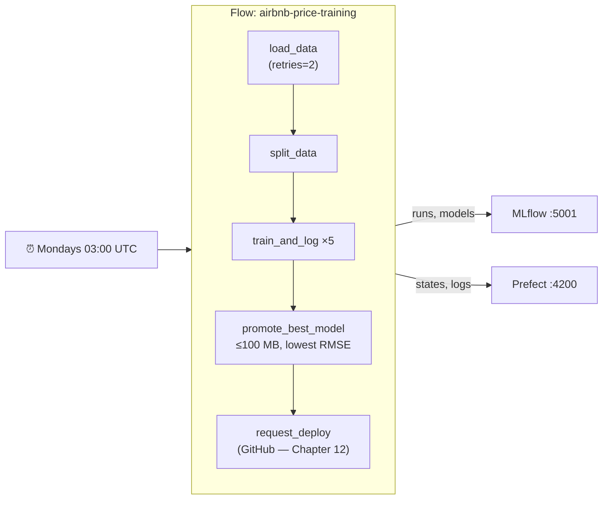

---

---

# PART 5 — Packaging and Automation

---

## Chapter 9 — Packaging the API with Docker

### What Problem This Solves

The API runs on your laptop because your laptop has Python 3.11, a `.venv` with exactly the right libraries, and your code. A cloud server, a teammate's machine or GitHub's CI machines have none of that. "It works on my machine" is the classic deployment failure.

**Docker** packages an operating system, Python, the exact libraries and your code into one sealed **image**. Any machine with Docker runs it identically.

### Concepts Before Any Code

| Term | Meaning |
|---|---|
| **Image** | A read-only package: OS + Python + libraries + code. Built from a `Dockerfile` |
| **Container** | A running instance of an image. Many containers can run from one image |
| **Layer** | Each `Dockerfile` instruction produces a layer. Unchanged layers are reused (cached) on rebuild |
| **Port mapping** `-p 8001:8000` | Traffic to your Mac's port 8001 goes to the container's port 8000 |
| **`host.docker.internal`** | Docker Desktop's name for *your computer* as seen from inside a container. Inside a container, `127.0.0.1` means **the container itself**, not your Mac |


### The Big Decision: Don't Put the Model in the Image

| Approach | A new model means… | |
|---|---|---|
| Train inside `docker build` | Rebuild the image (slow; the build needs the data) | ❌ |
| Copy `model.pkl` into the image | Rebuild the image | ❌ |
| **Load `@champion` from MLflow at startup** | **Just restart the container** | ✅ |

The image contains only code and libraries. The trade-off: the container must reach MLflow when it starts — which is why fast, clear failure (Chapter 6's 🧪) matters.

### Step 1 — `requirements-serve.txt`: only what the API needs

<<<FILE:requirements-serve.txt>>>

**Why a second requirements file?** The API doesn't need Prefect, pytest or the MLflow *server* — leaving them out makes the image smaller.
- **Same versions as `requirements.txt`** — especially scikit-learn: a model saved by one version may not load in another.
- **`mlflow-skinny`** — MLflow's lightweight client: enough to load models from a server.
- **`skops`** — see the 🧪 below.

### Step 2 — `.dockerignore`: keep the build small and safe

<<<FILE:.dockerignore>>>

When you build, Docker sends the project folder (the "build context") to the builder. Without this file it would upload the dataset, hundreds of MB of MLflow artifacts and the whole `.venv` on every build — slow, and it risks shipping data inside the image.

### Step 3 — The `Dockerfile`

<<<FILE:Dockerfile>>>

**Line by line:**

| Line | What it does |
|---|---|
| `FROM python:3.11-slim` | Start from official Python 3.11 on a minimal Debian — same Python as your `.venv` |
| `PYTHONDONTWRITEBYTECODE=1` | Don't write `.pyc` caches (useless in a container) |
| `PYTHONUNBUFFERED=1` | Print logs immediately, so `docker logs` shows them live |
| `WORKDIR /app` | Following commands run in `/app` |
| `COPY requirements-serve.txt` then `RUN pip install` | Install libraries **before** copying code (layer caching, below) |
| `COPY schemas.py main.py ./` | Only the two files the API needs |
| `ENV MLFLOW_HTTP_REQUEST_...` | Fail in ~14 s, not ~4 min, if MLflow is unreachable (Chapter 6) |
| `useradd` / `USER appuser` | Run as an ordinary user, not root — if the app were ever compromised, the attacker isn't root |
| `EXPOSE 8000` | Documents the port the app listens on |
| `CMD [...]` | What runs at start. `--host 0.0.0.0` is essential: `127.0.0.1` inside a container is unreachable from outside |

💡 **Layer caching.** Each instruction is a layer, and unchanged layers are reused. Because code is copied *after* the ~500 MB library install, editing `main.py` rebuilds only a tiny layer. Copy code first, and every one-line edit would reinstall everything.

### Step 4 — Build

```bash
docker build -t airbnb-price-api:local .
docker images airbnb-price-api:local --format '{{.Size}}'
```

**What this does:** reads the `Dockerfile` in `.` and names the result `airbnb-price-api` with the tag `local`. The first build takes about a minute. Expected size: roughly **850 MB** — almost all of it scipy, pandas, scikit-learn and numpy, which the model genuinely needs.

### Step 5 — Run it

The MLflow server must be running (MLflow terminal).

```bash
docker run -d --name airbnb-api -p 8001:8000 \
  -e MLFLOW_TRACKING_URI=http://host.docker.internal:5001 \
  airbnb-price-api:local
sleep 5
docker logs airbnb-api
```
Expected (end of the log):
```
INFO:     Loading models:/AirbnbPriceModel@champion from http://host.docker.internal:5001
INFO:     Model loaded
INFO:     Application startup complete.
```

| Flag | Meaning |
|---|---|
| `-d` | Run in the background ("detached") |
| `--name airbnb-api` | A name to refer to it by |
| `-p 8001:8000` | Your port 8001 → the container's 8000. (We use 8001 so it never clashes with a `uvicorn` you may have running on 8000.) |
| `-e MLFLOW_TRACKING_URI=...` | Environment variable inside the container — pointing at your computer's MLflow via `host.docker.internal` |

💡 The container reached MLflow through `host.docker.internal:5001` — that's why the server was started with `--host 0.0.0.0` and `host.docker.internal:*` in `--allowed-hosts` (Chapter 7).

🪟 Docker Desktop on Windows provides `host.docker.internal` too. (Plain Docker Engine on Linux needs `--add-host=host.docker.internal:host-gateway` on `docker run`.)

⚠️ `port is already allocated`? Something already uses that port on your computer. Find it with `lsof -nP -iTCP:8001 -sTCP:LISTEN`; if it says `com.docker.backend`, another container owns it — `docker ps` shows which. Don't stop containers that aren't yours; pick another port (`-p 8002:8000`).

### Step 6 — Verify the container

```bash
curl -s localhost:8001/health
curl -s -X POST localhost:8001/predict -H 'Content-Type: application/json' -d '{
  "neighbourhood_group": "Manhattan", "neighbourhood": "Midtown",
  "latitude": 40.7549, "longitude": -73.984, "room_type": "Entire home/apt",
  "minimum_nights": 2, "number_of_reviews": 20, "reviews_per_month": 1.0,
  "calculated_host_listings_count": 1, "availability_365": 180}'
```
Expected:
```
{"status":"ok","model_uri":"models:/AirbnbPriceModel@champion"}
{"predicted_price":244.25,"currency":"USD"}
```
The same $244.25 as Chapter 8 — same model, same library versions.

Hygiene checks:
```bash
docker exec airbnb-api whoami       # appuser   (not root)
docker exec airbnb-api ls /app      # main.py requirements-serve.txt schemas.py   (no data, no models)
docker rm -f airbnb-api             # stop and remove the test container
```

### 🧪 See It Fail — a slim image missing a library

This happened in the original project. `mlflow-skinny` does **not** include `skops`, but MLflow 3 saves our models in skops format (Chapter 7). Remove the last two lines (the comment and `skops==0.16.0`) from `requirements-serve.txt`, rebuild and run:
```bash
docker build -t airbnb-price-api:local .
docker run --rm -e MLFLOW_TRACKING_URI=http://host.docker.internal:5001 airbnb-price-api:local
```
```
INFO:     Loading models:/AirbnbPriceModel@champion from http://host.docker.internal:5001
ModuleNotFoundError: No module named 'skops'
ERROR:    Application startup failed. Exiting.
```
Notice what the log *also* proves: the container reached MLflow (networking works), and it failed **fast and clearly**. **Restore the two lines** and rebuild.

### 🧪 See It Fail — MLflow unreachable

```bash
docker run --rm -e MLFLOW_TRACKING_URI=http://host.docker.internal:5999 airbnb-price-api:local
```
Wrong port on purpose. It exits after about **14 seconds** with `Application startup failed` — the retry budget from the `Dockerfile`, instead of the ~4-minute silent hang measured in Chapter 6.

### Step 7 — Commit

```bash
git add requirements-serve.txt Dockerfile .dockerignore
git commit -m "feat: slim Docker image that loads the champion from MLflow at startup"
```

### ✅ Checkpoint

```bash
docker images airbnb-price-api:local     # the image exists
docker ps -a --filter name=airbnb        # nothing left running from the tests
```

**The mental shift:** the API is now a *portable artifact*. Anything that can run Docker can run it — the model arrives at startup from the registry.

---

## Chapter 10 — Orchestration with Prefect

### What Problem This Solves

Retraining currently means a person running `python track_experiments.py`, then `python registry.py`, in the right order — and remembering to do it at all. Real models go stale as new data arrives. We want the whole pipeline to run **by itself, on a schedule**; to **retry** steps that fail for temporary reasons; and to leave a **record** of every run we can inspect later.

**Prefect** is an *orchestrator*. You mark Python functions as **tasks**, combine them into a **flow**, and Prefect adds retries, logging, run history and scheduling. The **Prefect server** stores that history and shows it in a dashboard.

💡 **Why Prefect?** It's plain Python (decorators, no separate DSL), runs locally with one command, and its concepts — tasks, flows, retries, schedules — are the same ones you'd meet in Airflow or Dagster.

### Concepts Before Any Code

| Term | Meaning |
|---|---|
| **Task** | A function decorated with `@task` — one step, with optional retries |
| **Flow** | A function decorated with `@flow` that calls tasks; one execution is a **flow run** |
| **Retries** | `@task(retries=2, retry_delay_seconds=5)` — on failure, try again (twice, 5 s apart) |
| **Deployment** | A named, schedulable version of a flow |
| **Cron** | A schedule written as five fields: `minute hour day month weekday`. `0 3 * * 1` = Mondays at 03:00 |



### What Changes in This Chapter

| File | Change |
|---|---|
| `scripts/trigger_deploy.py` | New — asks GitHub to start a deployment (used for real in Chapter 12) |
| `tests/test_trigger_deploy.py` | New — 4 tests with a fake HTTP call |
| `orchestrate_training.py` | New — the flow |

### Step 1 — `scripts/trigger_deploy.py`: the hand-off to deployment

The last step of the flow asks **GitHub Actions** to build and publish a new image (Chapter 12). GitHub has an API for "run this workflow now":

<<<FILE:scripts/trigger_deploy.py>>>

**Walk through it:**
- `requests.post(...)` calls GitHub's `workflow_dispatch` endpoint with a token and the new model version.
- GitHub answers `204` (or `200`) on success.
- **Anything else raises `DeployTriggerError`** carrying GitHub's reason.

💡 **Why raise instead of returning `False`?** In the original project, this function returned `False` and printed the error to the terminal. When GitHub rejected a request (a token permission problem — Chapter 12), the flow still reported **Completed**, because nobody reads the terminal of an automated job. In pipelines, failures must *raise*, so the orchestrator records them.

### Step 2 — Its tests

You don't have a GitHub repository yet, so the tests replace `requests.post` with a fake — the same `monkeypatch` trick as the API's fake model:

<<<FILE:tests/test_trigger_deploy.py>>>

| Test | What it proves |
|---|---|
| `test_trigger_deploy_dispatches_deploy_workflow` | Correct URL, `Bearer` token and `model_version` input |
| `test_trigger_deploy_accepts_200_with_run_details` | Both GitHub success codes count as success |
| `test_trigger_deploy_raises_with_githubs_reason` | A `403` raises, and the message contains GitHub's reason |
| `test_request_deploy_task_fails_when_github_rejects` | The real Prefect task (called via `.fn`, which runs the function without Prefect's machinery) raises — so a flow would end *Failed* |

The last test imports `orchestrate_training`, so write that next before running the tests.

### Step 3 — `orchestrate_training.py`: the flow

<<<FILE:orchestrate_training.py>>>

**Walk through it:**
- **The tasks are thin wrappers.** All real logic already exists and is tested (`features.py`, `track_experiments.train_and_log`, `registry.pick_best`/`register_and_promote`). Prefect adds retries, logging and history *around* it — nothing is duplicated.
- **Retries only on `load_data`** — loading data is the step most likely to fail temporarily (a network drive, a slow download). Retrying training wouldn't fix a bug in the code.
- **The same champion rule as Chapter 8** — an automatic run makes the same choice you made by hand.
- **Deploy is optional** — with no GitHub credentials it logs a warning and the flow still succeeds.
- **`--serve`** registers the weekly schedule and keeps running to execute it.

```bash
pytest tests/test_trigger_deploy.py -v      # 4 passed
pytest -q                                   # 46 passed (with MLFLOW_TRACKING_URI set)
```

### Step 4 — Start the Prefect server in its own terminal

Open a new terminal (the "Prefect terminal"):
```bash
cd NYC-Airbnb-Price-Prediction
source .venv/bin/activate          # ⚠️ new terminal = activate again
which prefect                      # must end in .venv/bin/prefect
prefect server start
```
Ready when it prints `Check out the dashboard at http://127.0.0.1:4200`. Leave it running.

⚠️ Anaconda also ships a `prefect`. If `which prefect` doesn't point into `.venv`, see the Chapter 7 ⚠️.

In your **work terminal**, tell Prefect where its server is (saved in Prefect's settings, so you only do this once):
```bash
prefect config set PREFECT_API_URL=http://127.0.0.1:4200/api
```

You now have three terminals: MLflow, Prefect, work.

### Step 5 — Run the flow by hand first

Always prove a pipeline works manually before scheduling it:
```bash
export MLFLOW_TRACKING_URI=http://127.0.0.1:5001     # if not already set in this terminal
python orchestrate_training.py
```
Expected (trimmed; about 45 seconds):
```
Task run 'load_data-…' - Finished in state Completed()
Task run 'split_data-…' - Finished in state Completed()
Task run 'train_and_log-…' - linreg_baseline rmse=83.54 mae=47.08 r2=0.395 size=0.3MB
Task run 'train_and_log-…' - rf_100 rmse=77.53 mae=43.39 r2=0.479 size=326.0MB
Task run 'train_and_log-…' - rf_300_depth10 rmse=78.75 mae=43.81 r2=0.463 size=39.3MB
Task run 'train_and_log-…' - gb_100_lr01 rmse=81.13 mae=44.90 r2=0.430 size=3.9MB
Task run 'train_and_log-…' - gb_200_lr005 rmse=81.21 mae=44.92 r2=0.429 size=7.4MB
Task run 'promote_best_model-…' - promoted run … as AirbnbPriceModel v2 @champion
Task run 'request_deploy-…' - GITHUB_REPO/GITHUB_TOKEN not set; skipping deploy trigger
Flow run '<two-word-name>' - Finished in state Completed()
```
Open **http://127.0.0.1:4200** → *Runs* to see the run, its tasks and logs. (Prefect names each run with two random words, like `loyal-cow`.) In MLflow, `@champion` has moved to **v2** — `rf_300_depth10` again, from this run.

### 🧪 See It Fail — watch retries happen

Point the flow at a file that doesn't exist:
```bash
DATA_PATH=nope.csv python orchestrate_training.py
```
```
… Task run 'load_data-…' - Task run failed with exception: FileNotFoundError(…) - Retry 1/2 will start 5 second(s) from now
… Task run 'load_data-…' - Task run failed with exception: FileNotFoundError(…) - Retry 2/2 will start 5 second(s) from now
… Task run 'load_data-…' - Task run failed with exception: FileNotFoundError(…) - Retries are exhausted
… Flow run '…' - Finished in state Failed("Flow run encountered an exception: FileNotFoundError: … 'nope.csv'")
```
Three attempts, 5 seconds apart, then a clean `Failed` with the real cause — and **no training happened** (MLflow has no new runs). In the Prefect UI, the failed run shows the full traceback. Multiply this by hundreds of unattended nightly runs and you see why orchestration matters.

### Step 6 — Schedule it

`.serve()` needs its own long-running process. Open a **fourth terminal** (temporarily):
```bash
cd NYC-Airbnb-Price-Prediction
source .venv/bin/activate
export MLFLOW_TRACKING_URI=http://127.0.0.1:5001
python orchestrate_training.py --serve
```
```
Your flow 'airbnb-price-training' is being served and polling for scheduled runs!
To trigger a run for this flow, use the following command:
        $ prefect deployment run 'airbnb-price-training/weekly-retrain'
```

It registered a **deployment** called `airbnb-price-training/weekly-retrain` with the schedule `0 3 * * 1` (Mondays 03:00 — **UTC**, since no timezone was given). Prove the scheduled path works end to end by triggering it now, from your work terminal:
```bash
prefect deployment run 'airbnb-price-training/weekly-retrain'
```
In the fourth terminal you'll see the serving process pick the run up, retrain, and finish with `promoted run … as AirbnbPriceModel v3 @champion`.

Stop the serving process with **Ctrl-C**. Prefect pauses the schedule cleanly:
```
prefect.runner - Pausing all deployments...
prefect.runner - All deployments have been paused!
```
You can close the fourth terminal.

⚠️ **The serving process must keep running for the schedule to fire.** A laptop asleep at 03:00 on Monday won't retrain. In a real setup, the serving process lives on an always-on server.

⚠️ **Disk usage grows with every retrain.** Each full training round saves about 377 MB — 326 MB of it is `rf_100`, the unlimited-depth forest the size rule never promotes. See Appendix E for cleaning up.

### Step 7 — Commit

```bash
git add orchestrate_training.py scripts/trigger_deploy.py tests/test_trigger_deploy.py
git commit -m "feat: Prefect training flow with retries, promotion and deploy trigger"
```

### ✅ Checkpoint

```bash
pytest -q                                     # 46 passed
env -u MLFLOW_TRACKING_URI pytest -q          # 43 passed, 3 skipped
```
Prefect UI: one completed run, one failed run (the retry demo), and a paused `weekly-retrain` deployment. MLflow: `@champion` → v3.

**The mental shift:** training is no longer something you *do* — it's something that *happens*, with retries and a history you can inspect.
