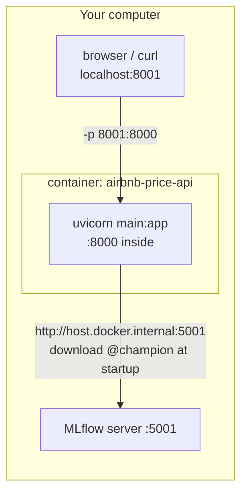
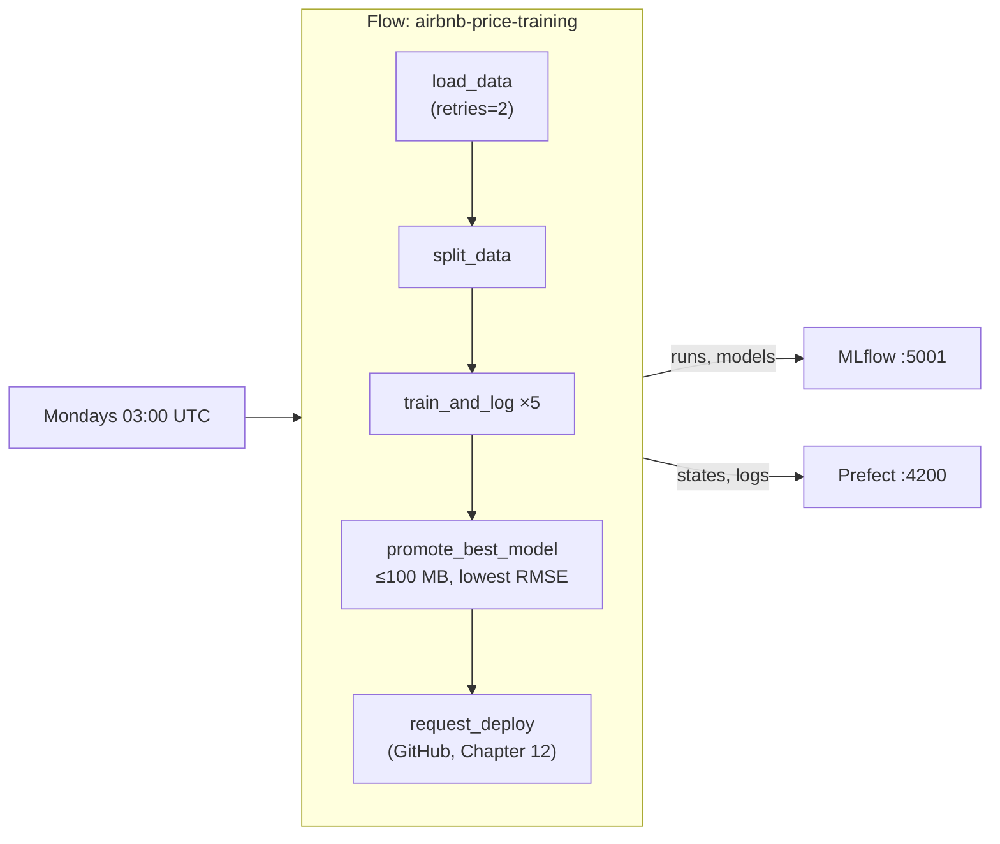

---

---

# Part 5: Packaging and automation

---

## Chapter 9: Packaging the API with Docker

### The problem

The API runs on your laptop because your laptop has Python 3.11, a `.venv` with exactly the right libraries, and your code. A cloud server, a teammate's machine or GitHub's CI machines have none of that. "It works on my machine" is the classic deployment failure.

Docker packages an operating system, Python, the exact libraries and your code into one sealed image. Any machine with Docker runs that image the same way.

### Concepts

| Term | Meaning |
|---|---|
| Image | A read-only package of OS, Python, libraries and code, built from a `Dockerfile` |
| Container | A running instance of an image. You can run many containers from one image |
| Layer | Each `Dockerfile` instruction produces a layer. Docker reuses (caches) unchanged layers when you rebuild |
| Port mapping `-p 8001:8000` | Traffic to your Mac's port 8001 goes to the container's port 8000 |
| `host.docker.internal` | Docker Desktop's name for your computer, as seen from inside a container. Inside a container, `127.0.0.1` means the container itself, not your Mac |



### The big decision: keep the model out of the image

| Approach | What a new model requires | Verdict |
|---|---|---|
| Train inside `docker build` | Rebuilding the image, which is slow and needs the data during the build | No |
| Copy `model.pkl` into the image | Rebuilding the image | No |
| Load `@champion` from MLflow at startup | Restarting the container | Yes |

The image contains only code and libraries. The trade-off is that the container has to reach MLflow when it starts, which is why the fast, clear failure from Chapter 6's exercise matters.

### Step 1: `requirements-serve.txt`, only what the API needs

<<<FILE:requirements-serve.txt>>>

The API doesn't need Prefect, pytest or the MLflow server, so a second, smaller requirements file keeps them out of the image.
- The versions match `requirements.txt`, and scikit-learn matters most, because a model saved by one version may not load in another.
- `mlflow-skinny` is MLflow's lightweight client, which is enough to load models from a server.
- `skops` is explained in the exercise below.

### Step 2: `.dockerignore`, to keep the build small and safe

<<<FILE:.dockerignore>>>

When you build, Docker sends the project folder (the "build context") to the builder. Without this file, every build would upload the dataset, hundreds of MB of MLflow artifacts and the whole `.venv`. That's slow, and it risks shipping data inside the image.

### Step 3: The `Dockerfile`

<<<FILE:Dockerfile>>>

Line by line:

| Line | What it does |
|---|---|
| `FROM python:3.11-slim` | Starts from the official Python 3.11 image on a minimal Debian, the same Python as your `.venv` |
| `PYTHONDONTWRITEBYTECODE=1` | Stops Python writing `.pyc` caches, which are useless in a container |
| `PYTHONUNBUFFERED=1` | Prints logs immediately, so `docker logs` shows them live |
| `WORKDIR /app` | Runs the following commands in `/app` |
| `COPY requirements-serve.txt` then `RUN pip install` | Installs the libraries before copying the code (see layer caching below) |
| `COPY schemas.py main.py ./` | Copies only the two files the API needs |
| `ENV MLFLOW_HTTP_REQUEST_...` | Makes startup fail in about 14 s instead of about 4 min when MLflow is unreachable (Chapter 6) |
| `useradd` / `USER appuser` | Runs the app as an ordinary user instead of root, so an attacker who compromised it wouldn't get root |
| `EXPOSE 8000` | Documents the port the app listens on |
| `CMD [...]` | What runs at start. `--host 0.0.0.0` is essential, because `127.0.0.1` inside a container can't be reached from outside |

> [!TIP]
> **Layer caching.** Each instruction is a layer, and Docker reuses unchanged layers. The code is copied after the roughly 500 MB library install, so editing `main.py` only rebuilds a tiny layer. If the code were copied first, every one-line edit would reinstall everything.

### Step 4: Build

```bash
docker build -t airbnb-price-api:local .
docker images airbnb-price-api:local --format '{{.Size}}'
```

This reads the `Dockerfile` in `.` and names the result `airbnb-price-api`, with the tag `local`. The first build takes about a minute. Expect an image of roughly 850 MB. Almost all of that is scipy, pandas, scikit-learn and numpy, which the model really does need.

### Step 5: Run it

The MLflow server must be running in the MLflow terminal.

```bash
docker run -d --name airbnb-api -p 8001:8000 \
  -e MLFLOW_TRACKING_URI=http://host.docker.internal:5001 \
  airbnb-price-api:local
sleep 5
docker logs airbnb-api
```
Expected (end of the log):
```
INFO:     Loading models:/AirbnbPriceModel@champion from http://host.docker.internal:5001
INFO:     Model loaded
INFO:     Application startup complete.
```

| Flag | Meaning |
|---|---|
| `-d` | Run in the background ("detached") |
| `--name airbnb-api` | A name to refer to the container by |
| `-p 8001:8000` | Your port 8001 goes to the container's 8000. We use 8001 so it never clashes with a `uvicorn` you might have running on 8000 |
| `-e MLFLOW_TRACKING_URI=...` | An environment variable inside the container, pointing at your computer's MLflow through `host.docker.internal` |

> [!TIP]
> The container reached MLflow through `host.docker.internal:5001`. That's why Chapter 7 started the server with `--host 0.0.0.0` and put `host.docker.internal:*` in `--allowed-hosts`.

> [!NOTE]
> **Windows:** Docker Desktop on Windows provides `host.docker.internal` too. Plain Docker Engine on Linux needs `--add-host=host.docker.internal:host-gateway` on `docker run`.

> [!WARNING]
> `port is already allocated` means something else on your computer already uses that port. Find it with `lsof -nP -iTCP:8001 -sTCP:LISTEN`. If it says `com.docker.backend`, another container owns the port, and `docker ps` shows which one. Don't stop containers that aren't yours. Pick another port instead (`-p 8002:8000`).

### Step 6: Check the container

```bash
curl -s localhost:8001/health
curl -s -X POST localhost:8001/predict -H 'Content-Type: application/json' -d '{
  "neighbourhood_group": "Manhattan", "neighbourhood": "Midtown",
  "latitude": 40.7549, "longitude": -73.984, "room_type": "Entire home/apt",
  "minimum_nights": 2, "number_of_reviews": 20, "reviews_per_month": 1.0,
  "calculated_host_listings_count": 1, "availability_365": 180}'
```
Expected:
```
{"status":"ok","model_uri":"models:/AirbnbPriceModel@champion"}
{"predicted_price":244.25,"currency":"USD"}
```
You get the same $244.25 as in Chapter 8, because it's the same model with the same library versions.

Two hygiene checks, then clean up:
```bash
docker exec airbnb-api whoami       # appuser (not root)
docker exec airbnb-api ls /app      # three files: no data, no models
docker rm -f airbnb-api             # stop and remove the test container
```
```
appuser
main.py
requirements-serve.txt
schemas.py
```

### See it fail: a slim image missing a library

This happened in the original project. `mlflow-skinny` doesn't include `skops`, but MLflow 3 saves our models in the skops format (Chapter 7). Remove the last two lines of `requirements-serve.txt` (the comment and `skops==0.16.0`), then rebuild and run:
```bash
docker build -t airbnb-price-api:local .
docker run --rm -e MLFLOW_TRACKING_URI=http://host.docker.internal:5001 airbnb-price-api:local
```
```
INFO:     Loading models:/AirbnbPriceModel@champion from http://host.docker.internal:5001
ModuleNotFoundError: No module named 'skops'
ERROR:    Application startup failed. Exiting.
```
The log proves two other things along the way: the container reached MLflow (so networking works), and it failed quickly with a clear message. Restore the two lines and rebuild.

### See it fail: MLflow unreachable

```bash
docker run --rm -e MLFLOW_TRACKING_URI=http://host.docker.internal:5999 airbnb-price-api:local
```
The port is wrong on purpose. The container exits after about 14 seconds with `Application startup failed`. That's the retry budget set in the `Dockerfile`, compared with the silent four-minute hang measured in Chapter 6.

### Step 7: Commit

```bash
git add requirements-serve.txt Dockerfile .dockerignore
git commit -m "feat: slim Docker image that loads the champion from MLflow at startup"
```

### Checkpoint

```bash
docker images airbnb-price-api:local     # the image exists
docker ps -a --filter name=airbnb        # nothing left running from the tests
```

The API is now a portable image. Any machine that runs Docker can run it, and the model arrives from the registry when the container starts.

---

## Chapter 10: Orchestration with Prefect

### The problem

Right now, retraining means someone runs `python track_experiments.py` and then `python registry.py`, in that order, and remembers to do it at all. Real models go stale as new data arrives. We want the pipeline to run by itself on a schedule, to retry steps that fail for temporary reasons, and to leave a record of every run that we can look at later.

Prefect is an orchestrator. You mark Python functions as tasks and combine them into a flow, and Prefect adds retries, logging, run history and scheduling. The Prefect server stores that history and shows it in a dashboard.

> [!TIP]
> **Why Prefect?** It's plain Python (decorators rather than a separate language), it runs locally with one command, and its concepts (tasks, flows, retries, schedules) are the same ones you'd meet in Airflow or Dagster.

### Concepts

| Term | Meaning |
|---|---|
| Task | A function decorated with `@task`: one step, with optional retries |
| Flow | A function decorated with `@flow` that calls tasks. One execution is a flow run |
| Retries | `@task(retries=2, retry_delay_seconds=5)` tries again on failure, twice, 5 seconds apart |
| Deployment | A named, schedulable version of a flow |
| Cron | A schedule written as five fields: `minute hour day month weekday`. `0 3 * * 1` means Mondays at 03:00 |



### What changes in this chapter

| File | Change |
|---|---|
| `scripts/trigger_deploy.py` | New. Asks GitHub to start a deployment (used for real in Chapter 12) |
| `tests/test_trigger_deploy.py` | New, with 4 tests that use a fake HTTP call |
| `orchestrate_training.py` | New. The flow |

### Step 1: `scripts/trigger_deploy.py`, the hand-off to deployment

The last step of the flow asks GitHub Actions to build and publish a new image (Chapter 12). GitHub has an API for "run this workflow now":

<<<FILE:scripts/trigger_deploy.py>>>

How it works:
- `requests.post(...)` calls GitHub's `workflow_dispatch` endpoint with a token and the new model version.
- GitHub answers `204` (or `200`) on success.
- Any other answer raises `DeployTriggerError` with GitHub's reason in it.

> [!TIP]
> **Why raise instead of returning `False`?** In the original project this function returned `False` and printed the error to the terminal. When GitHub rejected a request (a token permission problem, covered in Chapter 12), the flow still reported Completed, because nobody reads the terminal of an automated job. In a pipeline, failures have to raise so the orchestrator records them.

### Step 2: Its tests

You don't have a GitHub repository yet, so the tests replace `requests.post` with a fake. It's the same `monkeypatch` trick the API tests used for the fake model:

<<<FILE:tests/test_trigger_deploy.py>>>

| Test | What it proves |
|---|---|
| `test_trigger_deploy_dispatches_deploy_workflow` | The URL, the `Bearer` token and the `model_version` input are correct |
| `test_trigger_deploy_accepts_200_with_run_details` | Both of GitHub's success codes count as success |
| `test_trigger_deploy_raises_with_githubs_reason` | A `403` raises, and the message contains GitHub's reason |
| `test_request_deploy_task_fails_when_github_rejects` | The real Prefect task raises, so a flow would end Failed. The test calls it through `.fn`, which runs the plain function without Prefect's machinery |

The last test imports `orchestrate_training`, so write that file before running the tests.

### Step 3: `orchestrate_training.py`, the flow

<<<FILE:orchestrate_training.py>>>

How it works:
- The tasks are thin wrappers. The real logic already exists and has tests (`features.py`, `track_experiments.train_and_log`, `registry.pick_best` and `register_and_promote`). Prefect adds retries, logging and history around that logic without duplicating any of it.
- Only `load_data` retries, because loading data is the step most likely to fail temporarily (a network drive, a slow download). Retrying training wouldn't fix a bug in the code.
- It uses the same champion rule as Chapter 8, so an automatic run makes the same choice you made by hand.
- The deploy step is optional. Without GitHub credentials it logs a warning and the flow still succeeds.
- `--serve` registers the weekly schedule and keeps running so it can execute it.

```bash
pytest tests/test_trigger_deploy.py -v      # 4 passed
pytest -q                                   # 46 passed (with MLFLOW_TRACKING_URI set)
```

### Step 4: Start the Prefect server in its own terminal

Open a new terminal, which we'll call the Prefect terminal:
```bash
cd NYC-Airbnb-Price-Prediction
source .venv/bin/activate          # new terminal, so activate again
which prefect                      # must end in .venv/bin/prefect
prefect server start
```
It's ready when it prints `Check out the dashboard at http://127.0.0.1:4200`. Leave it running.

> [!WARNING]
> Anaconda ships a `prefect` too. If `which prefect` doesn't point into `.venv`, see the warning in Chapter 7.

In your work terminal, tell Prefect where its server is. Prefect saves this in its settings, so you only do it once:
```bash
prefect config set PREFECT_API_URL=http://127.0.0.1:4200/api
```

You now have three terminals: MLflow, Prefect and work.

### Step 5: Run the flow by hand first

Always check that a pipeline works when you run it by hand before you schedule it:
```bash
export MLFLOW_TRACKING_URI=http://127.0.0.1:5001     # if not already set in this terminal
python orchestrate_training.py
```
Expected (trimmed; takes about 45 seconds):
```
Task run 'load_data-…' - Finished in state Completed()
Task run 'split_data-…' - Finished in state Completed()
Task run 'train_and_log-…' - linreg_baseline rmse=83.54 mae=47.08 r2=0.395 size=0.3MB
Task run 'train_and_log-…' - rf_100 rmse=77.53 mae=43.39 r2=0.479 size=326.0MB
Task run 'train_and_log-…' - rf_300_depth10 rmse=78.75 mae=43.81 r2=0.463 size=39.3MB
Task run 'train_and_log-…' - gb_100_lr01 rmse=81.13 mae=44.90 r2=0.430 size=3.9MB
Task run 'train_and_log-…' - gb_200_lr005 rmse=81.21 mae=44.92 r2=0.429 size=7.4MB
Task run 'promote_best_model-…' - promoted run … as AirbnbPriceModel v2 @champion
Task run 'request_deploy-…' - GITHUB_REPO/GITHUB_TOKEN not set; skipping deploy trigger
Flow run '<two-word-name>' - Finished in state Completed()
```
Open http://127.0.0.1:4200 and go to Runs to see the run, its tasks and its logs. Prefect names each run with two random words, like `loyal-cow`. Over in MLflow, `@champion` has moved to v2, which is `rf_300_depth10` again, from this run.

### See it fail: watch retries happen

Point the flow at a file that doesn't exist:
```bash
DATA_PATH=nope.csv python orchestrate_training.py
```
```
… Task run 'load_data-…' - Task run failed with exception: FileNotFoundError(…) - Retry 1/2 will start 5 second(s) from now
… Task run 'load_data-…' - Task run failed with exception: FileNotFoundError(…) - Retry 2/2 will start 5 second(s) from now
… Task run 'load_data-…' - Task run failed with exception: FileNotFoundError(…) - Retries are exhausted
… Flow run '…' - Finished in state Failed("Flow run encountered an exception: FileNotFoundError: … 'nope.csv'")
```
You get three attempts, 5 seconds apart, then a clean `Failed` with the real cause. No training happened, so MLflow has no new runs. In the Prefect UI, the failed run shows the full traceback. Imagine hundreds of unattended nightly runs and it's clear why this matters.

### Step 6: Schedule it

`.serve()` needs its own long-running process, so open a fourth terminal for now:
```bash
cd NYC-Airbnb-Price-Prediction
source .venv/bin/activate
export MLFLOW_TRACKING_URI=http://127.0.0.1:5001
python orchestrate_training.py --serve
```
```
Your flow 'airbnb-price-training' is being served and polling for scheduled runs!
To trigger a run for this flow, use the following command:
        $ prefect deployment run 'airbnb-price-training/weekly-retrain'
```

That registered a deployment called `airbnb-price-training/weekly-retrain` with the schedule `0 3 * * 1`. That's Mondays at 03:00 UTC, since no timezone was given. To check the scheduled path end to end, trigger it now from your work terminal:
```bash
prefect deployment run 'airbnb-price-training/weekly-retrain'
```
In the fourth terminal you'll see the serving process pick up the run, retrain, and finish with `promoted run … as AirbnbPriceModel v3 @champion`.

Stop the serving process with Ctrl-C. Prefect pauses the schedule cleanly:
```
prefect.runner - Pausing all deployments...
prefect.runner - All deployments have been paused!
```
You can close the fourth terminal.

> [!WARNING]
> The serving process has to keep running for the schedule to fire. A laptop that's asleep at 03:00 on Monday won't retrain. In a real setup, the serving process runs on a server that's always on.

> [!WARNING]
> Disk usage grows with every retrain. Each full training round saves about 377 MB, and 326 MB of that is `rf_100`, the unlimited-depth forest the size rule never promotes. Appendix E explains how to clean it up.

### Step 7: Commit

```bash
git add orchestrate_training.py scripts/trigger_deploy.py tests/test_trigger_deploy.py
git commit -m "feat: Prefect training flow with retries, promotion and deploy trigger"
```

### Checkpoint

```bash
pytest -q                                     # 46 passed
env -u MLFLOW_TRACKING_URI pytest -q          # 43 passed, 3 skipped
```
The Prefect UI should show two completed runs (Step 5 by hand, and Step 6 through the deployment), one failed run (the retry exercise), and a paused `weekly-retrain` deployment. In MLflow, `@champion` points to v3.

Training now happens on a schedule, retries temporary failures, and leaves a history you can inspect.
