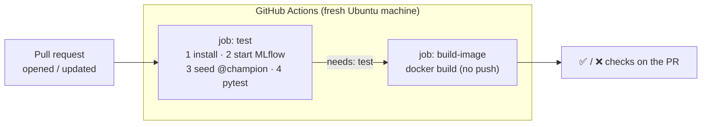
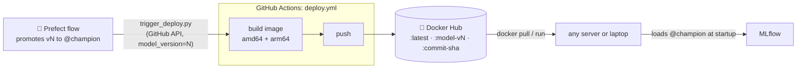

---

---

# PART 6 — CI/CD

---

## Chapter 11 — Continuous Integration with GitHub Actions

### What Problem This Solves

Your 46 tests protect you only if someone runs them — and people forget, or run them against a setup they've tweaked by hand. **Continuous Integration (CI)** runs the tests *automatically, on a clean machine*, for every proposed change, and shows ✅ or ❌ on the change *before* it's merged.

**GitHub Actions** is GitHub's built-in CI. A YAML file in `.github/workflows/` says *when* to run and *what* to run.

### Concepts Before Any Code

| Term | Meaning |
|---|---|
| **Remote / push** | Your repository on GitHub (`origin`); `git push` uploads commits to it |
| **Branch** | A parallel line of commits. You work on a branch, then merge it into `main` |
| **Pull request (PR)** | A request to merge a branch into `main`, with discussion and **checks** |
| **Workflow** | A YAML file describing automated jobs |
| **Job / step** | A workflow has jobs (each on a fresh virtual machine); a job has steps |
| **Runner** | GitHub's throwaway machine that executes a job |

**The CI puzzle.** Your tests include the real-registry tests (Chapter 8), which need an MLflow server with a `@champion`, and training needs data. GitHub's runner is a brand-new machine: no MLflow, no access to your laptop's DVC storage. So CI builds what it needs from scratch every time:
- a **throwaway MLflow server** started inside the job;
- a quick **champion trained on the committed 2,000-row sample** (Chapter 3) — that's what the sample was for.



### Step 1 — `scripts/ci_seed_model.py`

<<<FILE:scripts/ci_seed_model.py>>>

It reuses the same `train_and_log` and `register_and_promote` as the real pipeline — no CI-only shortcuts. It trains LinearRegression because it's the fastest: CI checks that the *plumbing* works, not which model is best. `DATA_PATH` will point it at the sample.

### Step 2 — The workflow: `.github/workflows/ci.yml`

<<<FILE:.github/workflows/ci.yml>>>

**Reading it:**

| Part | Meaning |
|---|---|
| `on: pull_request` | Run when a PR is opened or gets new commits. A plain push to `main` runs nothing |
| `runs-on: ubuntu-latest` | A fresh Linux machine, thrown away afterwards |
| `env:` | Environment variables for every step. Port **5000** is fine on GitHub's machines (no AirPlay) |
| `actions/checkout` | Downloads your repository into the machine |
| `setup-python` + `cache: pip` | Installs Python 3.11 and caches downloaded packages between runs |
| `mlflow server … &` | `&` runs the server in the background so the job can continue |
| the `for` loop | **Waits until the server is actually ready** (polls `/health`) instead of guessing with `sleep 30`; if it never comes up, prints the server log and fails with a useful message |
| `needs: test` | `build-image` starts only if `test` passed |
| `push: false` | Build the image to prove the `Dockerfile` works — but don't publish unreviewed code. Publishing is Chapter 12's controlled job |
| `cache-from/to: type=gha` | Store Docker layers in GitHub's cache so later builds are faster |

💡 **Use current action versions.** Actions like `actions/checkout@v7` get new major versions; old ones eventually stop working. Check the latest before writing a workflow:
```bash
git ls-remote --tags --refs https://github.com/actions/checkout.git | awk -F/ '{print $NF}' | grep -E '^v[0-9]+$' | sort -V | tail -1
```

### Step 3 — Rehearse CI locally first

Pushing and waiting minutes to discover a typo is slow. Run the same steps against a throwaway server in a temporary folder (port 5055, so your real MLflow on 5001 is untouched):

```bash
T=$(mktemp -d)
(cd "$T" && exec mlflow server --backend-store-uri sqlite:///mlflow.db \
   --artifacts-destination ./mlartifacts --host 127.0.0.1 --port 5055 > mlflow.log 2>&1) &
until curl -sf http://127.0.0.1:5055/health >/dev/null; do sleep 2; done

MLFLOW_TRACKING_URI=http://127.0.0.1:5055 DATA_PATH=tests/fixtures/listings_sample.csv python -m scripts.ci_seed_model
MLFLOW_TRACKING_URI=http://127.0.0.1:5055 DATA_PATH=tests/fixtures/listings_sample.csv pytest -q

pkill -f "mlflow server.*--port 5055"; rm -rf "$T"
```
Expected:
```
seeded AirbnbPriceModel v1 @champion (rmse=93.98)
46 passed
```
**46 passed, none skipped** — the registry tests ran against the seeded champion. The sample-trained model is worse ($93.98 vs $83.54 — less data), which is fine: it only has to pass the sanity checks.

💡 **The parentheses matter.** `( cd … && exec mlflow server … ) &` runs the `cd` inside a background sub-shell, so *your* terminal stays in the project folder.

### Step 4 — Commit the CI files

```bash
git add scripts/ci_seed_model.py .github/workflows/ci.yml
git commit -m "ci: test against an ephemeral MLflow server and build the image on PRs"
```

### Step 5 — Create the GitHub repository and check what you're about to publish

On github.com: **+ → New repository** → a name (e.g. `NYC-Airbnb-Price-Prediction`) → **Public** → **don't** add a README, `.gitignore` or license (the repository must be empty for the first push) → **Create repository**.

Before the first push, check what you're publishing — once public, it's public:
```bash
git ls-files                                  # only code, config, docs, the pointer file and the small sample
git log --format='%ae' | sort -u              # only your noreply address (Chapter 1)
git grep -nIiE "(api[_-]?key|secret|token|password)\s*[:=]\s*['\"][A-Za-z0-9_\-]{12,}" || echo "no secrets found"
```

### Step 6 — Connect and push

```bash
git remote add origin https://github.com/<your-github-username>/<your-repo>.git
git push -u origin main
```
Expected:
```
 * [new branch]      main -> main
branch 'main' set up to track 'origin/main'.
```

- `remote add origin` stores the GitHub address under the short name `origin`.
- `-u` links your `main` to GitHub's `main`, so later a plain `git push`/`git pull` knows where to go.
- **Logging in:** GitHub doesn't accept account passwords for `git push`. If Git asks for a password, use a **personal access token** (GitHub → Settings → Developer settings → Personal access tokens) — or install GitHub's CLI (`brew install gh`, then `gh auth login`), which sets this up for you. macOS remembers the credential in Keychain.

🪟 In WSL, Git can use Windows' *Git Credential Manager* (installed with Git for Windows), or you can paste a token when prompted.

Nothing runs yet — CI triggers on pull requests.

### Step 7 — Open a real pull request

Make a small, useful change on a new branch — a first README:
```bash
git switch -c first-pr
```

📄 **File: `README.md`**
```markdown
# NYC Airbnb Price Prediction

Predicts a New York City Airbnb listing's nightly price (USD) — an end-to-end MLOps practice project.
```

```bash
git add README.md
git commit -m "docs: add README"
git push -u origin first-pr
```
Git prints a link like `https://github.com/<you>/<repo>/pull/new/first-pr`. Open it → **Create pull request**.

Within seconds, the PR page shows a **CI** checks section. Click **Details** to watch live. Expected on the first run (times vary):

| Job | Result | Time | Slowest steps |
|---|---|---|---|
| **test** | ✅ | ~2.5 min | `pip install` ~55 s · `pytest -v` ~58 s |
| **build-image** | ✅ | ~1.3 min | `docker build` ~58 s |

💡 Open the **test** job → **Run pytest -v**: you'll find `tests/test_model_registry.py … PASSED` — proof the registry tests really ran in CI.

### 🧪 See It Fail — a red pull request

**Don't skip this.** Knowing what a CI failure looks like, and how to fix it, is one of the most useful habits to build early. On the same branch, break a test on purpose — in `tests/test_schemas.py`, change `== "USD"` to `== "EUR"`:
```bash
git commit -am "test: intentional failure to see CI go red"
git push
```
The PR updates, CI re-runs, and **test** goes ❌. The failing test and its error are shown in the log; **build-image never starts** (`needs: test`). GitHub also emails you. That's the safety net: broken code is visible *before* it reaches `main`.

Fix it back and push:
```bash
git revert --no-edit HEAD
git push
```
CI turns ✅ again — and faster than the first time (cached packages and Docker layers):

| Job | First run | Cached re-run |
|---|---|---|
| test | ~2.5 min | ~2 min |
| build-image | ~1.3 min | **~30 s** — the ~500 MB dependency layer was reused (Chapter 9's layer ordering paying off) |

### Step 8 — Merge and tidy up

On the PR: **Merge pull request** → **Confirm** → **Delete branch**. Then locally:
```bash
git switch main
git pull
git fetch --prune
git branch -d first-pr
```

From now on, **every change goes through a branch and a pull request**, so CI checks it before it reaches `main`.

### ✅ Checkpoint

- The PR page shows `test` ✅ and `build-image` ✅.
- `git log --oneline -1` on `main` shows the merge commit.

**The mental shift:** quality is now a *system*, not a discipline. You don't have to remember to run the tests or check the Docker build — every pull request does it, forever.

---

## Chapter 12 — Continuous Deployment: Publish the Image When the Model Changes

### What Problem This Solves

CI *checks* changes. **Continuous Deployment (CD)** *ships* them: it builds the API image and publishes it to a **registry** (Docker Hub) that any server can pull from. In MLOps, a release isn't only triggered by new code — it's triggered by **a new model**:



The image stays model-free (Chapter 9); the `model-vN` tag records *which promotion caused this release*.

### Concepts Before Any Code

| Term | Meaning |
|---|---|
| **Container registry** | A website that stores images (Docker Hub, GitHub Container Registry, AWS ECR…) |
| **Tag** | A label on an image version: `:latest`, `:model-v4` |
| **`workflow_dispatch`** | A workflow that runs only when asked — from the GitHub UI or its API |
| **Secret** | An encrypted value stored in the repository settings; GitHub hides it in logs |
| **Multi-architecture image** | One tag containing builds for several CPU types. GitHub's runners are Intel/AMD (`amd64`); Apple Silicon Macs are `arm64` |
| **QEMU** | An emulator that lets an `amd64` runner build the `arm64` version |

### Step 1 — Docker Hub account and access token

1. Sign up (free) at https://hub.docker.com and note your **username** exactly.
2. **Account settings → Personal access tokens → Generate new token**: description `github-actions`, permissions **Read & Write**. **Copy it now** — it's shown only once.

### Step 2 — Store it as GitHub secrets

In your repository: **Settings → Secrets and variables → Actions → New repository secret**. Create two:

| Name | Value |
|---|---|
| `DOCKERHUB_USERNAME` | your Docker Hub username |
| `DOCKERHUB_TOKEN` | the token from Step 1 |

💡 Tokens go straight from Docker Hub into GitHub's encrypted storage — never into a file, a commit or a chat.

### Step 3 — The workflow: `.github/workflows/deploy.yml`

```bash
git switch -c deploy-workflow
```

<<<FILE:.github/workflows/deploy.yml>>>

**Reading it:**

| Part | Meaning |
|---|---|
| `on: workflow_dispatch` + `inputs.model_version` | Runs **only when asked**, receiving the model version |
| `setup-qemu-action` + `platforms: linux/amd64,linux/arm64` | Build for Intel/AMD *and* Apple Silicon under one tag |
| `login-action` | Logs in to Docker Hub with the token (never a password) |
| `push: true` | Unlike CI, this job **publishes** |
| three `tags` | `latest` = newest · `model-vN` = which champion triggered it · commit SHA = exact code |
| `labels` | Metadata baked into the image (`docker image inspect` shows them) |

💡 **Why build for arm64 too?** The original project first built only for `amd64` (GitHub's runners). On an Apple Silicon Mac, `docker pull` then failed with `no matching manifest for linux/arm64/v8`. It *could* run with `--platform linux/amd64` under emulation (slower), but a plain pull failing for every Apple Silicon user isn't acceptable. The cost: each deploy takes ~5 minutes instead of ~1, because the arm64 half is built under emulation.

### Step 4 — Merge it (via a PR)

```bash
git add .github/workflows/deploy.yml
git commit -m "ci: workflow_dispatch deploy that pushes the API image to Docker Hub"
git push -u origin deploy-workflow
```
Open the PR, wait for CI ✅, **merge**, then locally:
```bash
git switch main && git pull && git fetch --prune && git branch -d deploy-workflow
```

💡 A `workflow_dispatch` workflow must be **on the default branch** before it can be triggered — hence merging first.

### Step 5 — First deploy, by hand

Find your current champion version (from your work terminal, with `MLFLOW_TRACKING_URI` set):
```bash
python -c "from mlflow import MlflowClient; print(MlflowClient().get_registered_model('AirbnbPriceModel').aliases)"
# {'champion': '3'}
```

On GitHub: **Actions → Deploy → Run workflow** → branch `main`, `model_version` = **3** → **Run workflow**. Refresh after a few seconds to see the run; it takes about 5 minutes.

Then check Docker Hub (`https://hub.docker.com/r/<your-dockerhub-username>/airbnb-price-api/tags`): three tags — `latest`, `model-v3` and the commit SHA — each listing **amd64** and **arm64**.

### Step 6 — Pull and run the published image

The real test of a deployment is what a user does — a plain pull, no special flags:
```bash
docker pull <your-dockerhub-username>/airbnb-price-api:latest
docker image inspect <your-dockerhub-username>/airbnb-price-api:latest \
  --format 'arch={{.Architecture}} model-version={{index .Config.Labels "airbnb.model-version"}}'
docker run -d --name airbnb-hub -p 8001:8000 \
  -e MLFLOW_TRACKING_URI=http://host.docker.internal:5001 \
  <your-dockerhub-username>/airbnb-price-api:latest
sleep 5
curl -s -X POST localhost:8001/predict -H 'Content-Type: application/json' -d '{
  "neighbourhood_group": "Manhattan", "neighbourhood": "Midtown",
  "latitude": 40.7549, "longitude": -73.984, "room_type": "Entire home/apt",
  "minimum_nights": 2, "number_of_reviews": 20, "reviews_per_month": 1.0,
  "calculated_host_listings_count": 1, "availability_365": 180}'
docker rm -f airbnb-hub
```
Expected:
```
arch=arm64 model-version=3            ← amd64 on an Intel machine
{"predicted_price":244.25,"currency":"USD"}
```

### Step 7 — Let the flow trigger deploys: a GitHub token

`trigger_deploy.py` (Chapter 10) calls GitHub's API, which needs a **fine-grained personal access token**:

GitHub → your avatar → **Settings → Developer settings → Personal access tokens → Fine-grained tokens → Generate new token**:
- **Name:** `airbnb-deploy-trigger`, with an expiration (e.g. 90 days)
- **Repository access:** *Only select repositories* → your repository
- **Permissions → Repository permissions → Actions: Read and write** — nothing else

⚠️ **The permission is the classic mistake.** Fine-grained tokens start with **no** permissions; each must be granted explicitly. In the original project the token lacked *Actions: Read and write*, and GitHub answered `403 Resource not accessible by personal access token`.

| Error | Usual cause |
|---|---|
| `401 Bad credentials` | Token not exported in *this* terminal, expired, or copied incompletely |
| `403 Resource not accessible by personal access token` | Token lacks **Actions: Read and write** |
| `404 Not Found` | Token not granted this repository, or a typo in `GITHUB_REPO` |

Use the token **only in your work terminal** — never in a file:
```bash
export GITHUB_REPO=<your-github-username>/<your-repo>
export GITHUB_TOKEN=<paste your token>
```

### 🧪 See It Fail — a rejected trigger fails loudly

```bash
GITHUB_TOKEN=not-a-real-token python -m scripts.trigger_deploy --model-version 3
echo "exit code: $?"
```
```
GitHub refused to start deploy.yml for <your-github-username>/<your-repo>: 401 {
  "message": "Bad credentials",
  "documentation_url": "https://docs.github.com/rest",
  "status": "401"
}
exit code: 1
```
A clear reason and a non-zero exit code. Inside the Prefect flow, the same error makes `request_deploy` — and the flow — end **Failed**, with the reason in Prefect's log. (The original version only printed the error and let the flow report *Completed* — the bug Chapter 10's 💡 described.)

### Step 8 — The full loop: nobody clicks anything

With `MLFLOW_TRACKING_URI`, `GITHUB_REPO` and `GITHUB_TOKEN` exported in your work terminal:
```bash
python orchestrate_training.py
```
Expected (end of the output):
```
Task run 'promote_best_model-…' - promoted run … as AirbnbPriceModel v4 @champion
Task run 'request_deploy-…' - Finished in state Completed()
Flow run '…' - Finished in state Completed()
```
No "skipping deploy trigger" warning this time. Within seconds, **Actions** shows a new **Deploy** run with `model_version = 4`; minutes later, Docker Hub has `model-v4`.

What happened, in order, in the original project's run (where this was version 5):

| Time | Event | Where |
|---|---|---|
| 17:26:47 | Flow starts retraining | Prefect |
| 17:27:29 | New version promoted to `@champion`; `request_deploy` Completed | Prefect → MLflow |
| 17:27:30 | Deploy run created | GitHub Actions |
| 17:27:57 | `model-v5` pushed, amd64 + arm64 | Docker Hub |

💡 That deploy took only ~35 seconds: the *code* hadn't changed since the previous deploy, so every Docker layer came from GitHub's cache and the job mostly just added the new tag.

When you're done: `unset GITHUB_TOKEN` (or close the terminal).

### ✅ Checkpoint

- Docker Hub shows `latest`, `model-v3`, `model-v4` (amd64 + arm64).
- `docker pull <your-dockerhub-username>/airbnb-price-api:latest` works with no `--platform` flag.
- A flow run with credentials set produced a Deploy run automatically.

### What You Should Have at the End of Part 6

```
NYC-Airbnb-Price-Prediction/
├── .github/workflows/
│   ├── ci.yml                ← PRs: test + build
│   └── deploy.yml            ← on demand: build amd64+arm64, push to Docker Hub
├── scripts/
│   ├── ci_seed_model.py      ← CI: train on the sample, promote @champion
│   └── trigger_deploy.py     ← raises DeployTriggerError if GitHub refuses
├── README.md
└── … (Parts 1–5)
```

**GitHub secrets:** `DOCKERHUB_USERNAME`, `DOCKERHUB_TOKEN` · **Your terminal only:** `GITHUB_TOKEN`, `GITHUB_REPO`

**The mental shift:** a better model now reaches users *automatically* — retrain → promote → build → publish — and every step is recorded.
