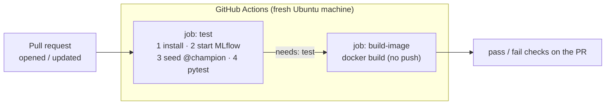

---

---

# Part 6: CI/CD

---

## Chapter 11: Continuous integration with GitHub Actions

### The problem

Your 46 tests only protect you if someone runs them. People forget, or they run them against a setup they've tweaked by hand. Continuous integration (CI) runs the tests automatically on a clean machine for every proposed change, and marks the change with a pass or fail before anyone merges it.

GitHub Actions is GitHub's built-in CI. A YAML file in `.github/workflows/` says when to run and what to run.

### Concepts

| Term | Meaning |
|---|---|
| Remote / push | Your repository on GitHub (`origin`). `git push` uploads commits to it |
| Branch | A parallel line of commits. You work on a branch, then merge it into `main` |
| Pull request (PR) | A request to merge a branch into `main`, with discussion and checks |
| Workflow | A YAML file that describes automated jobs |
| Job / step | A workflow has jobs (each on a fresh virtual machine), and a job has steps |
| Runner | GitHub's throwaway machine that runs a job |

The tricky part is that some tests need more than code. The real-registry tests (Chapter 8) need an MLflow server with a `@champion`, and training needs data. GitHub's runner is a brand-new machine with no MLflow and no access to your laptop's DVC storage. So CI builds what it needs from scratch every time:
- a throwaway MLflow server, started inside the job
- a quick champion trained on the committed 2,000-row sample from Chapter 3, which is what the sample was for



### Step 1: `scripts/ci_seed_model.py`

<<<FILE:scripts/ci_seed_model.py>>>

It uses the same `train_and_log` and `register_and_promote` as the real pipeline, with no CI-only shortcuts. It trains LinearRegression because that's the fastest, and CI only needs to check that the plumbing works, not which model is best. `DATA_PATH` points it at the sample.

### Step 2: The workflow, `.github/workflows/ci.yml`

<<<FILE:.github/workflows/ci.yml>>>

Reading it:

| Part | Meaning |
|---|---|
| `on: pull_request` | Runs when a PR is opened or gets new commits. A plain push to `main` runs nothing |
| `runs-on: ubuntu-latest` | A fresh Linux machine that's thrown away afterwards |
| `env:` | Environment variables for every step. Port 5000 is fine on GitHub's machines, since they don't have AirPlay |
| `MLFLOW_DISABLE_AGENT_HINT: "1"` | Silences an informational MLflow log line (a hint aimed at AI coding tools) so the CI log stays readable. It's harmless either way |
| `actions/checkout` | Downloads your repository onto the machine |
| `setup-python` + `cache: pip` | Installs Python 3.11 and caches downloaded packages between runs |
| `mlflow server … &` | The `&` runs the server in the background so the job can carry on |
| the `for` loop | Waits until the server is actually ready by polling `/health`, instead of guessing with `sleep 30`. If the server never comes up, it prints the server log and fails with a useful message |
| `needs: test` | `build-image` only starts if `test` passed |
| `push: false` | Builds the image to prove the `Dockerfile` works, but doesn't publish unreviewed code. Chapter 12's job handles publishing |
| `cache-from/to: type=gha` | Stores Docker layers in GitHub's cache so later builds are faster |

> [!TIP]
> **Use current action versions.** Actions like `actions/checkout@v7` get new major versions, and old ones eventually stop working. Check for the latest before you write a workflow:
> ```bash
> git ls-remote --tags --refs https://github.com/actions/checkout.git | awk -F/ '{print $NF}' | grep -E '^v[0-9]+$' | sort -V | tail -1
> ```

### Step 3: Rehearse CI locally first

Pushing and then waiting minutes to find a typo is slow. Instead, run the same steps against a throwaway server in a temporary folder. It uses port 5055, so your real MLflow on 5001 isn't touched:

```bash
T=$(mktemp -d)
(cd "$T" && exec mlflow server --backend-store-uri sqlite:///mlflow.db \
   --artifacts-destination ./mlartifacts --host 127.0.0.1 --port 5055 > mlflow.log 2>&1) &
until curl -sf http://127.0.0.1:5055/health >/dev/null; do sleep 2; done

MLFLOW_TRACKING_URI=http://127.0.0.1:5055 DATA_PATH=tests/fixtures/listings_sample.csv python -m scripts.ci_seed_model
MLFLOW_TRACKING_URI=http://127.0.0.1:5055 DATA_PATH=tests/fixtures/listings_sample.csv pytest -q

pkill -f "mlflow server.*--port 5055"; rm -rf "$T"
```
Expected:
```
seeded AirbnbPriceModel v1 @champion (rmse=93.98)
46 passed
```
All 46 passed and none were skipped, so the registry tests ran against the seeded champion. The model trained on the sample is worse ($93.98 against $83.54, because it had less data). That's fine, since it only has to pass the sanity checks.

> [!TIP]
> **The parentheses matter.** `( cd … && exec mlflow server … ) &` runs the `cd` inside a background sub-shell, so your own terminal stays in the project folder.

### Step 4: Commit the CI files

```bash
git add scripts/ci_seed_model.py .github/workflows/ci.yml
git commit -m "ci: test against an ephemeral MLflow server and build the image on PRs"
```

### Step 5: Create the GitHub repository and check what you're about to publish

On github.com, click + → New repository. Give it a name (for example `NYC-Airbnb-Price-Prediction`) and make it Public. Don't add a README, `.gitignore` or license, because the repository has to be empty for the first push. Then click Create repository.

Before the first push, check what you're about to publish. Once it's public, it's public:
```bash
git ls-files                                  # only code, config, docs, the pointer file and the small sample
git log --format='%ae' | sort -u              # only your noreply address (Chapter 1)
git grep -nIiE "(api[_-]?key|secret|token|password)\s*[:=]\s*['\"][A-Za-z0-9_\-]{12,}" || echo "no secrets found"
```

### Step 6: Connect and push

```bash
git remote add origin https://github.com/<your-github-username>/<your-repo>.git
git push -u origin main
```
Expected:
```
 * [new branch]      main -> main
branch 'main' set up to track 'origin/main'.
```

- `remote add origin` saves the GitHub address under the short name `origin`.
- `-u` links your `main` to GitHub's `main`, so a plain `git push` or `git pull` later knows where to go.
- GitHub doesn't accept account passwords for `git push`. If Git asks for a password, use a personal access token (GitHub → Settings → Developer settings → Personal access tokens). You can also install GitHub's CLI (`brew install gh`, then `gh auth login`), which sets this up for you. macOS remembers the credential in Keychain.

> [!NOTE]
> **Windows:** in WSL, Git can use Windows' Git Credential Manager (installed with Git for Windows), or you can paste a token when it prompts you.

Nothing runs yet, because CI only triggers on pull requests.

### Step 7: Open a real pull request

Make a small, useful change on a new branch, such as a first README:
```bash
git switch -c first-pr
```

**File: `README.md`**
```markdown
# NYC Airbnb Price Prediction

Predicts a New York City Airbnb listing's nightly price (USD). An end-to-end MLOps practice project.
```

```bash
git add README.md
git commit -m "docs: add README"
git push -u origin first-pr
```
Git prints a link like `https://github.com/<you>/<repo>/pull/new/first-pr`. Open it and click Create pull request.

Within seconds, the PR page shows a CI checks section. Click Details to watch it live. Expect something like this on the first run (times vary):

| Job | Result | Time | Slowest steps |
|---|---|---|---|
| test | Pass | ~2.5 min | `pip install` ~55 s, `pytest -v` ~58 s |
| build-image | Pass | ~1.3 min | `docker build` ~58 s |

> [!TIP]
> Open the test job and then the Run pytest -v step. You'll find `tests/test_model_registry.py … PASSED`, which proves the registry tests really ran in CI.

### See it fail: a red pull request

Don't skip this one. It's worth knowing early what a CI failure looks like and how to fix it. On the same branch, break a test on purpose: in `tests/test_schemas.py`, change `== "USD"` to `== "EUR"`.
```bash
git commit -am "test: intentional failure to see CI go red"
git push
```
The PR updates and CI runs again, and this time test fails. The log shows the failing test and its error, and build-image never starts (`needs: test`). GitHub also emails you. That's the safety net working: broken code shows up before it reaches `main`.

Undo the change and push:
```bash
git revert --no-edit HEAD
git push
```
CI passes again, and faster than the first time thanks to the cached packages and Docker layers:

| Job | First run | Cached re-run |
|---|---|---|
| test | ~2.5 min | ~2 min |
| build-image | ~1.3 min | ~30 s. The ~500 MB dependency layer was reused, which is Chapter 9's layer ordering paying off |

### Step 8: Merge and tidy up

On the PR, click Merge pull request → Confirm → Delete branch. Then locally:
```bash
git switch main
git pull
git fetch --prune
git branch -d first-pr
```

From now on, every change goes through a branch and a pull request, so CI checks it before it reaches `main`.

### Checkpoint

- The PR page shows `test` and `build-image` both passing.
- `git log --oneline -1` on `main` shows the merge commit.

You no longer have to remember to run the tests or check the Docker build. Every pull request does both.

---

## Chapter 12: Continuous deployment when the model changes

### The problem

CI checks changes. Continuous deployment (CD) ships them. It builds the API image and publishes it to a registry (Docker Hub) that any server can pull from. In MLOps, a new release can come from new code, and it can also come from a new model:


The image still contains no model (Chapter 9). The `model-vN` tag records which promotion caused the release.

### Concepts

| Term | Meaning |
|---|---|
| Container registry | A website that stores images (Docker Hub, GitHub Container Registry, AWS ECR and others) |
| Tag | A label on one version of an image, such as `:latest` or `:model-v4` |
| `workflow_dispatch` | A trigger for workflows that only run when asked, from the GitHub UI or its API |
| Secret | An encrypted value stored in the repository settings. GitHub hides it in logs |
| Multi-architecture image | One tag that contains builds for several CPU types. GitHub's runners are Intel/AMD (`amd64`), and Apple Silicon Macs are `arm64` |
| QEMU | An emulator that lets an `amd64` runner build the `arm64` version |

### Step 1: Docker Hub account and access token

1. Sign up (it's free) at https://hub.docker.com and note your exact username.
2. Go to Account settings → Personal access tokens → Generate new token. Use the description `github-actions` and the permission Read & Write. Copy the token straight away, because Docker Hub only shows it once.

### Step 2: Store it as GitHub secrets

In your repository, go to Settings → Secrets and variables → Actions → New repository secret, and create two secrets:

| Name | Value |
|---|---|
| `DOCKERHUB_USERNAME` | Your Docker Hub username |
| `DOCKERHUB_TOKEN` | The token from Step 1 |

> [!TIP]
> Paste the token straight from Docker Hub into GitHub's encrypted storage. Never put it in a file, a commit or a chat.

### Step 3: The workflow, `.github/workflows/deploy.yml`

```bash
git switch -c deploy-workflow
```

<<<FILE:.github/workflows/deploy.yml>>>

Reading it:

| Part | Meaning |
|---|---|
| `on: workflow_dispatch` + `inputs.model_version` | Runs only when asked, and receives the model version |
| `setup-qemu-action` + `platforms: linux/amd64,linux/arm64` | Builds for Intel/AMD and Apple Silicon under one tag |
| `login-action` | Logs in to Docker Hub with the token (never a password) |
| `push: true` | Unlike CI, this job publishes |
| three `tags` | `latest` is the newest, `model-vN` records which champion triggered it, and the commit SHA pins the exact code |
| `labels` | Metadata baked into the image, which `docker image inspect` shows |

> [!TIP]
> **Why build for arm64 too?** The original project first built only for `amd64`, which is what GitHub's runners are. On an Apple Silicon Mac, `docker pull` then failed with `no matching manifest for linux/arm64/v8`. It could still run with `--platform linux/amd64` under emulation, more slowly, but a plain pull failing for every Apple Silicon user wasn't acceptable. The cost is that each deploy takes about 5 minutes instead of about 1, because the arm64 half is built under emulation.

### Step 4: Merge it through a PR

```bash
git add .github/workflows/deploy.yml
git commit -m "ci: workflow_dispatch deploy that pushes the API image to Docker Hub"
git push -u origin deploy-workflow
```
Open the PR, wait for CI to pass, merge it, then locally:
```bash
git switch main && git pull && git fetch --prune && git branch -d deploy-workflow
```

> [!TIP]
> GitHub can only trigger a `workflow_dispatch` workflow once it's on the default branch, which is why you merge first.

### Step 5: First deploy, by hand

Find your current champion version from your work terminal (with `MLFLOW_TRACKING_URI` set):
```bash
python -c "from mlflow import MlflowClient; print(MlflowClient().get_registered_model('AirbnbPriceModel').aliases)"
# {'champion': '3'}
```

On GitHub, go to Actions → Deploy → Run workflow, choose the branch `main`, set `model_version` to 3, and click Run workflow. Refresh after a few seconds to see the run. It takes about 5 minutes.

Then check Docker Hub (`https://hub.docker.com/r/<your-dockerhub-username>/airbnb-price-api/tags`). You should see three tags, `latest`, `model-v3` and the commit SHA, and each lists both amd64 and arm64.

### Step 6: Pull and run the published image

The real test of a deployment is what a user does, which is a plain pull with no special flags:
```bash
docker pull <your-dockerhub-username>/airbnb-price-api:latest
docker image inspect <your-dockerhub-username>/airbnb-price-api:latest \
  --format 'arch={{.Architecture}} model-version={{index .Config.Labels "airbnb.model-version"}}'
docker run -d --name airbnb-hub -p 8001:8000 \
  -e MLFLOW_TRACKING_URI=http://host.docker.internal:5001 \
  <your-dockerhub-username>/airbnb-price-api:latest
sleep 5
curl -s -X POST localhost:8001/predict -H 'Content-Type: application/json' -d '{
  "neighbourhood_group": "Manhattan", "neighbourhood": "Midtown",
  "latitude": 40.7549, "longitude": -73.984, "room_type": "Entire home/apt",
  "minimum_nights": 2, "number_of_reviews": 20, "reviews_per_month": 1.0,
  "calculated_host_listings_count": 1, "availability_365": 180}'
docker rm -f airbnb-hub
```
Expected:
```
arch=arm64 model-version=3            ← amd64 on an Intel machine
{"predicted_price":244.25,"currency":"USD"}
```

### Step 7: Let the flow trigger deploys with a GitHub token

`trigger_deploy.py` (Chapter 10) calls GitHub's API, and that needs a fine-grained personal access token.

Go to GitHub → your avatar → Settings → Developer settings → Personal access tokens → Fine-grained tokens → Generate new token, and set:
- Name: `airbnb-deploy-trigger`, with an expiration (for example 90 days)
- Repository access: Only select repositories, then pick your repository
- Permissions → Repository permissions → Actions: Read and write, and nothing else

> [!WARNING]
> **The permission is the classic mistake.** Fine-grained tokens start with no permissions, and you have to grant each one explicitly. In the original project the token was missing Actions: Read and write, and GitHub answered `403 Resource not accessible by personal access token`.

| Error | Usual cause |
|---|---|
| `401 Bad credentials` | The token isn't exported in this terminal, has expired, or was copied incompletely |
| `403 Resource not accessible by personal access token` | The token lacks Actions: Read and write |
| `404 Not Found` | The token wasn't granted this repository, or there's a typo in `GITHUB_REPO` |

Only use the token in your work terminal, and never put it in a file:
```bash
export GITHUB_REPO=<your-github-username>/<your-repo>
export GITHUB_TOKEN=<paste your token>
```

### See it fail: a rejected trigger fails loudly

```bash
GITHUB_TOKEN=not-a-real-token python -m scripts.trigger_deploy --model-version 3
echo "exit code: $?"
```
```
GitHub refused to start deploy.yml for <your-github-username>/<your-repo>: 401 {
  "message": "Bad credentials",
  "documentation_url": "https://docs.github.com/rest",
  "status": "401"
}
exit code: 1
```
You get a clear reason and a non-zero exit code. Inside the Prefect flow, the same error makes `request_deploy` fail, and the flow ends Failed with the reason in Prefect's log. The original version only printed the error and let the flow report Completed, which is the bug described in Chapter 10.

### Step 8: The full loop, with nobody clicking anything

With `MLFLOW_TRACKING_URI`, `GITHUB_REPO` and `GITHUB_TOKEN` exported in your work terminal:
```bash
python orchestrate_training.py
```
Expected (end of the output):
```
Task run 'promote_best_model-…' - promoted run … as AirbnbPriceModel v4 @champion
Task run 'request_deploy-…' - Finished in state Completed()
Flow run '…' - Finished in state Completed()
```
This time there's no "skipping deploy trigger" warning. Within seconds, the Actions tab shows a new Deploy run with `model_version = 4`, and a few minutes later Docker Hub has `model-v4`.

In the original project's run (where this was version 5), the timeline looked like this:

| Time | Event | Where |
|---|---|---|
| 17:26:47 | The flow starts retraining | Prefect |
| 17:27:29 | The new version is promoted to `@champion`, and `request_deploy` completes | Prefect → MLflow |
| 17:27:30 | The deploy run is created | GitHub Actions |
| 17:27:57 | `model-v5` is pushed for amd64 and arm64 | Docker Hub |

> [!TIP]
> That deploy only took about 35 seconds. The code hadn't changed since the previous deploy, so every Docker layer came from GitHub's cache, and the job mostly just added the new tag.

When you're done, run `unset GITHUB_TOKEN` or close the terminal.

### Checkpoint

- Docker Hub shows `latest`, `model-v3` and `model-v4`, each for amd64 and arm64.
- `docker pull <your-dockerhub-username>/airbnb-price-api:latest` works without a `--platform` flag.
- A flow run with the credentials set produced a Deploy run automatically.

### Your project after Part 6

```
NYC-Airbnb-Price-Prediction/
├── .github/workflows/
│   ├── ci.yml                ← PRs: test + build
│   └── deploy.yml            ← on demand: build amd64+arm64, push to Docker Hub
├── scripts/
│   ├── ci_seed_model.py      ← CI: train on the sample, promote @champion
│   └── trigger_deploy.py     ← raises DeployTriggerError if GitHub refuses
├── README.md
└── … (Parts 1 to 5)
```

GitHub secrets: `DOCKERHUB_USERNAME` and `DOCKERHUB_TOKEN`. In your terminal only: `GITHUB_TOKEN` and `GITHUB_REPO`.

A better model now reaches users without anyone stepping in. The flow retrains, promotes, builds and publishes, and each step leaves a record.
