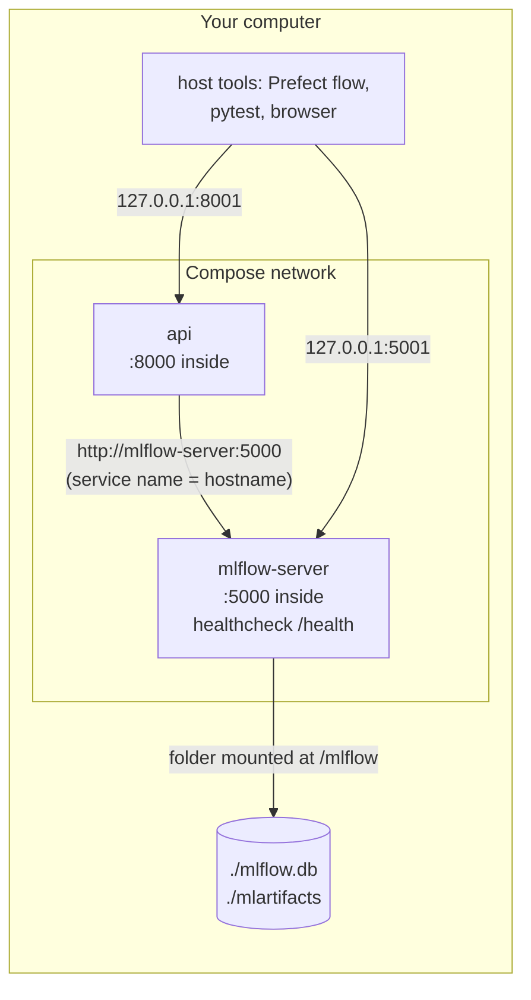

---

---

# Part 7: The local stack

---

## Chapter 13: One command for everything with Docker Compose

### The problem

Running the stack by hand means keeping a terminal open for `mlflow server` with its long list of flags, then starting the API with a separate `docker run` with the right ports and environment variables, in the right order. Docker Compose describes all of that in one file, `docker-compose.yml`, and starts it with one command. It also handles the ordering: the API must not start before MLflow is ready, or it has nowhere to load its model from.



### Concepts

| Term | Meaning |
|---|---|
| Service | One container definition in `docker-compose.yml` (`mlflow-server`, `api`) |
| Compose network | A private network that Compose creates. Inside it, a service's name is its hostname |
| Bind mount `.:/mlflow` | A folder on your computer that also appears inside the container. Changes show up on both sides |
| Healthcheck | A command Docker runs repeatedly. Once it succeeds, the container counts as healthy |
| `depends_on: condition: service_healthy` | Start this service only after that one is healthy, not merely started |

### The decision: reuse your existing MLflow data

| Option | Trade-off |
|---|---|
| Reuse `./mlflow.db` and `./mlartifacts` (chosen) | All your runs, versions and `@champion` carry over, and host tools keep using `http://127.0.0.1:5001` unchanged. Compose simply replaces your MLflow terminal |
| A fresh, empty Docker volume | Isolated, but empty. You'd have to retrain before the API could start, and you'd end up with two separate histories |

> [!WARNING]
> **Never run two MLflow servers on the same SQLite file.** SQLite is a single file with simple locking, and two servers writing to it at once can corrupt it. So you have to stop the server in the MLflow terminal first.

### Step 1: Back up the MLflow database

Before touching the data, take a consistent snapshot. SQLite's backup API is safe even while the server is running:
```bash
mkdir -p ~/mlflow-backups/nyc-airbnb
python - <<'EOF'
import os, sqlite3, time
target = os.path.expanduser(f"~/mlflow-backups/nyc-airbnb/mlflow-{time.strftime('%Y%m%d-%H%M')}.db")
src, dst = sqlite3.connect("mlflow.db"), sqlite3.connect(target)
src.backup(dst)
dst.close(); src.close()
check = sqlite3.connect(target)
print("backup:", target)
print("integrity:", check.execute("PRAGMA integrity_check").fetchone()[0],
      "| aliases:", check.execute("select alias, version from registered_model_aliases").fetchall())
EOF
```
Expected:
```
backup: /Users/you/mlflow-backups/nyc-airbnb/mlflow-20260924-2320.db
integrity: ok | aliases: [('champion', 4)]
```

### Step 2: Stop the server in the MLflow terminal

In the MLflow terminal, press Ctrl-C and wait for the prompt. Then, in the work terminal:
```bash
lsof -nP -iTCP:5001 -sTCP:LISTEN || echo "port 5001 free"
pgrep -fl "mlflow server" || echo "no mlflow server running"
```
You should see "port 5001 free" and "no mlflow server running". You can close the MLflow terminal now, since Compose replaces it.

### Step 3: Write `docker-compose.yml`

```bash
git switch -c docker-compose
```

<<<FILE:docker-compose.yml>>>

Reading it:

| Part | Meaning |
|---|---|
| `image: ghcr.io/mlflow/mlflow:v3.16.1` | The official MLflow image, pinned to the same version as `requirements.txt`. A different server version might try to migrate your database's structure |
| `sqlite:////mlflow/mlflow.db` | Four slashes: `sqlite:///` followed by the absolute path `/mlflow/mlflow.db` |
| `volumes: - .:/mlflow` | Your project folder appears inside the container at `/mlflow`, so `mlflow.db` and `mlartifacts/` are the same files as before |
| `ports: "5001:5000"` | You reach MLflow on 5001 from your computer. Inside the network it's on 5000 |
| `healthcheck` | Every 10 s, Docker calls MLflow's `/health` endpoint. It uses Python, because the image may not include `curl` |
| `build: .` + `image: airbnb-price-api:local` | Builds the API from your `Dockerfile` and gives it the same name as in Chapter 9 |
| `MLFLOW_TRACKING_URI: http://mlflow-server:5000` | Inside the network, the MLflow service is reachable by its name |
| `depends_on … service_healthy` | Holds the API back until MLflow is healthy |
| `restart: on-failure` | If the API exits with an error, Docker restarts it |

> [!TIP]
> **Why mount the whole folder and not just `mlflow.db`?** When SQLite saves changes, it writes a temporary journal file next to the database. If you mounted only the `.db` file, the journal would live inside the container, and a crash mid-write could leave the database damaged. Mounting the folder keeps both files together on your disk.

> [!NOTE]
> **Windows:** this is where keeping the project on WSL's own disk (not under `/mnt/c/…`) matters. Folder mounts from the Windows drive are slow and can run into permission problems.

Check the file before running anything:
```bash
docker compose config --quiet && echo "compose file valid"
```

### Step 4: Start the stack and watch the ordering

```bash
docker compose up -d --build
```
Expected (trimmed):
```
 Container …-mlflow-server-1  Started
 Container …-mlflow-server-1  Waiting
 Container …-mlflow-server-1  Healthy
 Container …-api-1            Starting
 Container …-api-1            Started
```
The API only starts once MLflow is healthy. Check its log:
```bash
docker compose logs api
```
```
INFO:     Loading models:/AirbnbPriceModel@champion from http://mlflow-server:5000
INFO:     Model loaded
INFO:     Application startup complete.
```

### Step 5: Check it

```bash
docker compose ps                                  # mlflow-server: healthy · api: Up
curl -s -X POST localhost:8001/predict -H 'Content-Type: application/json' -d '{
  "neighbourhood_group": "Manhattan", "neighbourhood": "Midtown",
  "latitude": 40.7549, "longitude": -73.984, "room_type": "Entire home/apt",
  "minimum_nights": 2, "number_of_reviews": 20, "reviews_per_month": 1.0,
  "calculated_host_listings_count": 1, "availability_365": 180}'
# {"predicted_price":244.25,"currency":"USD"}
```

Your host tools keep working unchanged, at the same address on port 5001:
```bash
python -c "from mlflow import MlflowClient; print(MlflowClient().get_registered_model('AirbnbPriceModel').aliases)"
pytest -q                                          # 46 passed
```

In the browser, http://127.0.0.1:5001 shows all your runs and model versions, so nothing was lost.

Now a restart test, to show the data lives on your disk and not inside the containers:
```bash
docker compose down
docker compose up -d
docker compose ps
```
The champion is still `@champion`, and the prediction is still $244.25.

> [!TIP]
> The MLflow container runs as root but writes into your project folder. On macOS, Docker Desktop maps those files back to your user, so the artifacts from new runs are ordinary files that you own.

> [!NOTE]
> **Windows:** in WSL2, files the container creates may be owned by `root` (check with `ls -l mlartifacts`). If a later host command, such as the cleanup in Appendix E, reports `Permission denied`, take ownership back with `sudo chown -R "$USER" mlflow.db mlartifacts`.

### Step 6: Everyday commands

```bash
docker compose up -d            # start both (the API waits for MLflow)
docker compose ps               # status and health
docker compose logs -f api      # follow the API's log (Ctrl-C stops following)
docker compose restart api      # after promoting a new champion: reload the model
docker compose down             # stop and remove the containers (data stays on disk)
```

The Prefect flow works exactly as before, with `MLFLOW_TRACKING_URI=http://127.0.0.1:5001`. After it promotes a new champion, run `docker compose restart api` so the local API serves it.

> [!WARNING]
> From now on, don't also start the old `mlflow server` command while Compose is running, or both would write to the same database.

### Step 7: Commit through a PR

```bash
git add docker-compose.yml
git commit -m "feat: docker compose stack for MLflow + API, reusing local MLflow data"
git push -u origin docker-compose
```
Open the PR, wait for CI to pass and merge it, then run `git switch main && git pull && git fetch --prune && git branch -d docker-compose`.

### Checkpoint

```bash
docker compose ps        # mlflow-server Up (healthy), api Up
curl -s localhost:8001/health
```

The serving stack is now described in a file. Anyone with the repository can run `docker compose up -d` and get the same system.
