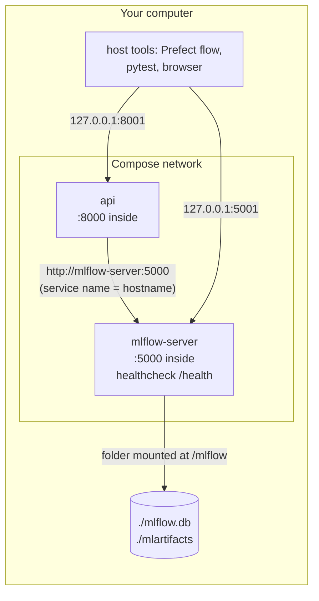

---

---

# PART 7 — The Local Stack

---

## Chapter 13 — One Command for Everything: Docker Compose

### What Problem This Solves

Running the stack by hand means: a terminal for `mlflow server` with a long list of flags, then a separate `docker run` for the API with the right ports and environment variables — in the right order. **Docker Compose** describes all of it in one file, `docker-compose.yml`, and starts it with one command. It also handles *ordering*: the API must not start before MLflow is ready, or it has nothing to load its model from.



### Concepts Before Any Code

| Term | Meaning |
|---|---|
| **Service** | One container definition in `docker-compose.yml` (`mlflow-server`, `api`) |
| **Compose network** | A private network Compose creates; inside it, **a service's name is its hostname** |
| **Bind mount** `.:/mlflow` | A folder on your computer appears inside the container — changes are shared both ways |
| **Healthcheck** | A command Docker runs repeatedly; when it succeeds, the container is *healthy* |
| **`depends_on: condition: service_healthy`** | Start this service only after that one is *healthy* — not merely *started* |

### The Decision: Reuse Your Existing MLflow Data

| Option | Trade-off |
|---|---|
| **Reuse `./mlflow.db` + `./mlartifacts`** ✅ | All your runs, versions and `@champion` carry over; host tools keep using `http://127.0.0.1:5001` unchanged. Compose becomes a drop-in replacement for your MLflow terminal |
| A fresh, empty Docker volume | Isolated, but empty — you'd have to retrain before the API can start, and keep two separate histories |

⚠️ **Never run two MLflow servers on the same SQLite file.** SQLite is a single file with simple locking; two servers writing it at once can corrupt it. So the MLflow terminal's server must be stopped first.

### Step 1 — Back up the MLflow database

Before touching data, take a consistent snapshot. SQLite's backup API is safe even while the server is running:
```bash
mkdir -p ~/mlflow-backups/nyc-airbnb
python - <<'EOF'
import os, sqlite3, time
target = os.path.expanduser(f"~/mlflow-backups/nyc-airbnb/mlflow-{time.strftime('%Y%m%d-%H%M')}.db")
src, dst = sqlite3.connect("mlflow.db"), sqlite3.connect(target)
src.backup(dst)
dst.close(); src.close()
check = sqlite3.connect(target)
print("backup:", target)
print("integrity:", check.execute("PRAGMA integrity_check").fetchone()[0],
      "| aliases:", check.execute("select alias, version from registered_model_aliases").fetchall())
EOF
```
Expected:
```
backup: /Users/you/mlflow-backups/nyc-airbnb/mlflow-20260924-2320.db
integrity: ok | aliases: [('champion', 4)]
```

### Step 2 — Stop the MLflow terminal's server

In the **MLflow terminal**, press **Ctrl-C** and wait for the prompt. Then, in the work terminal:
```bash
lsof -nP -iTCP:5001 -sTCP:LISTEN || echo "port 5001 free"
pgrep -fl "mlflow server" || echo "no mlflow server running"
```
Both should say free / not running. (You can close the MLflow terminal — Compose replaces it.)

### Step 3 — Write `docker-compose.yml`

```bash
git switch -c docker-compose
```

<<<FILE:docker-compose.yml>>>

**Reading it:**

| Part | Meaning |
|---|---|
| `image: ghcr.io/mlflow/mlflow:v3.16.1` | The official MLflow image, pinned to **the same version** as `requirements.txt` — a different server version might try to migrate your database's structure |
| `sqlite:////mlflow/mlflow.db` | Four slashes = `sqlite:///` + the absolute path `/mlflow/mlflow.db` |
| `volumes: - .:/mlflow` | Your project folder appears inside the container at `/mlflow`, so `mlflow.db` and `mlartifacts/` are the same files as before |
| `ports: "5001:5000"` | Reach MLflow from your computer on 5001; inside the network it's 5000 |
| `healthcheck` | Every 10 s, ask MLflow's `/health` endpoint (with Python — the image may not include `curl`) |
| `build: .` + `image: airbnb-price-api:local` | Build the API from your `Dockerfile`, with the same name as Chapter 9 |
| `MLFLOW_TRACKING_URI: http://mlflow-server:5000` | Inside the network, the MLflow service is reachable **by its name** |
| `depends_on … service_healthy` | Don't start the API until MLflow is healthy |
| `restart: on-failure` | If the API exits with an error, Docker restarts it |

💡 **Why mount the whole folder, not just `mlflow.db`?** While SQLite saves changes, it writes a temporary *journal* file **next to** the database. Mount only the `.db` file, and the journal would live inside the container; a crash mid-write could then leave the database damaged. Mounting the folder keeps them together on your disk.

🪟 This is where keeping the project inside WSL's own disk (not `/mnt/c/…`) matters: folder mounts from the Windows drive are slow and can have permission problems.

Check the file before running anything:
```bash
docker compose config --quiet && echo "compose file valid"
```

### Step 4 — Start the stack and watch the ordering

```bash
docker compose up -d --build
```
Expected (trimmed):
```
 Container …-mlflow-server-1  Started
 Container …-mlflow-server-1  Waiting
 Container …-mlflow-server-1  Healthy
 Container …-api-1            Starting
 Container …-api-1            Started
```
The API starts only once MLflow is **healthy**. Check its log:
```bash
docker compose logs api
```
```
INFO:     Loading models:/AirbnbPriceModel@champion from http://mlflow-server:5000
INFO:     Model loaded
INFO:     Application startup complete.
```

### Step 5 — Verify

```bash
docker compose ps                                  # mlflow-server: healthy · api: Up
curl -s -X POST localhost:8001/predict -H 'Content-Type: application/json' -d '{
  "neighbourhood_group": "Manhattan", "neighbourhood": "Midtown",
  "latitude": 40.7549, "longitude": -73.984, "room_type": "Entire home/apt",
  "minimum_nights": 2, "number_of_reviews": 20, "reviews_per_month": 1.0,
  "calculated_host_listings_count": 1, "availability_365": 180}'
# {"predicted_price":244.25,"currency":"USD"}
```

Your host tools work **unchanged** — same address, 5001:
```bash
python -c "from mlflow import MlflowClient; print(MlflowClient().get_registered_model('AirbnbPriceModel').aliases)"
pytest -q                                          # 46 passed
```

In the browser, http://127.0.0.1:5001 shows all your runs and model versions — nothing was lost.

**Restart test** — data lives on your disk, not inside containers:
```bash
docker compose down
docker compose up -d
docker compose ps
```
Still `@champion`, still $244.25.

💡 The MLflow container runs as root but writes into your project folder. Docker Desktop maps those files back to *your* user, so new runs' artifacts are ordinary files you own.

### Step 6 — Everyday commands

```bash
docker compose up -d            # start both (API waits for MLflow)
docker compose ps               # status and health
docker compose logs -f api      # follow the API's log (Ctrl-C to stop following)
docker compose restart api      # after promoting a new champion: reload the model
docker compose down             # stop and remove containers (data stays on disk)
```

The Prefect flow works exactly as before (`MLFLOW_TRACKING_URI=http://127.0.0.1:5001`). After it promotes a new champion, `docker compose restart api` makes the local API serve it.

⚠️ From now on, **don't also start the old `mlflow server` command** while Compose is running — both would write the same database.

### Step 7 — Commit (via a PR)

```bash
git add docker-compose.yml
git commit -m "feat: docker compose stack for MLflow + API, reusing local MLflow data"
git push -u origin docker-compose
```
Open the PR, wait for ✅, merge, then `git switch main && git pull && git fetch --prune && git branch -d docker-compose`.

### ✅ Checkpoint

```bash
docker compose ps        # mlflow-server Up (healthy), api Up
curl -s localhost:8001/health
```

**The mental shift:** your whole serving stack is now *declared in a file*. Anyone with the repository runs `docker compose up -d` and gets the same system.
