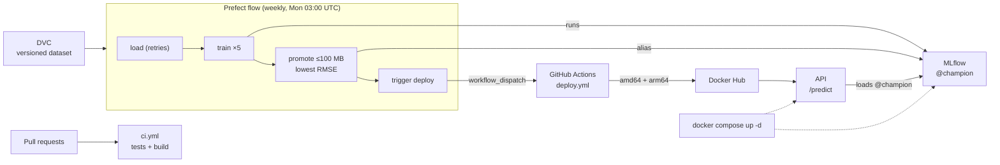

---

---

# Part 8: Wrap-up

---

## Chapter 14: Definition of done, and a README

### The problem

"It worked when I built it" isn't the same as "it works now". Later chapters changed things that earlier ones relied on. So the last job is to re-check everything against the current state (not from memory) and to write the page strangers will read first.

### Step 1: The definition-of-done checklist

Run each check. Every row should pass.

| Requirement | Check | Expected |
|---|---|---|
| The baseline works (Ch 4) | `python train.py` | `rmse: 83.545` |
| Five experiments are tracked (Ch 7) | MLflow UI → `airbnb-price-prediction` | Each of the 5 configs has finished runs with params and metrics |
| The champion loads in a fresh process (Ch 8) | The `python -c "…load_model('models:/AirbnbPriceModel@champion')…"` command from Chapter 8 | `TransformedTargetRegressor 244.25` |
| All tests pass | `pytest -q` (with `MLFLOW_TRACKING_URI` set) | `46 passed` |
| The tests catch bugs | Change a rule in `schemas.py` (for example `availability_365` from `le=365` to `le=400`), run `pytest -q`, then undo it | Exactly one test fails, then all pass again |
| CI runs on pull requests (Ch 11) | Your repository's Pull requests → Closed | Every merged PR shows `test` and `build-image` passing |
| Deploys get published (Ch 12) | Docker Hub tags | `latest` and `model-vN`, for amd64 and arm64 |
| The local stack runs (Ch 13) | `docker compose ps` | MLflow healthy, API up |

### Step 2: Rebuild from GitHub

The strongest proof that a project is complete is a fresh clone with nothing else:
```bash
cd /tmp
git clone https://github.com/<your-github-username>/<your-repo>.git airbnb-check
cd airbnb-check
uv venv --python 3.11 .venv && source .venv/bin/activate
uv pip install -r requirements.txt "dvc==3.67.1"
dvc pull
python train.py | grep rmse
env -u MLFLOW_TRACKING_URI pytest -q
```
Expected:
```
rmse: 83.545
43 passed, 3 skipped
```
Then clean up with `deactivate; cd ~; rm -rf /tmp/airbnb-check`.

> [!TIP]
> `dvc pull` works here because your DVC remote is a folder on this machine. A teammate on another computer couldn't reach it. For that, the remote would need to move to shared storage such as an S3 bucket. CI still works for any clone, because it uses the committed sample.

> [!TIP]
> If your repository's name starts with `-`, use `cd -- -name`. Otherwise the shell reads the name as an option.

### Step 3: Write the README

The README is your repository's front page, written for someone who has never seen the project. These sections work well:

1. What it does: one paragraph, plus a diagram of the whole loop (GitHub renders ```` ```mermaid ```` blocks).
2. Results: the five-model table from Chapter 7, and the champion rule (100 MB or less, lowest RMSE) with its reason.
3. Key decisions: the log target inside the model, the cleaning thresholds, the high-cardinality `neighbourhood` column, and keeping the model out of the image.
4. Project layout: one line per important file (see Appendix A).
5. Setup: the venv, installing, `dvc pull`, and the warning about other Pythons.
6. How to run it: `docker compose up -d`, then running each part by hand, and the tests.
7. CI/CD: what each workflow does and which secrets it needs.
8. Known limitations. Be honest here: modest accuracy, artifact storage that keeps growing, and a DVC remote and MLflow server that only exist on one laptop.

Replace the one-line README from Chapter 11, then commit it through a pull request like any other change.

### Step 4: Shut down cleanly

```bash
docker compose down                 # stop MLflow and the API (data stays on disk)
unset GITHUB_TOKEN                  # or just close the work terminal
```
Then press Ctrl-C in the Prefect terminal. Everything is saved: `mlflow.db`, `mlartifacts/`, and Prefect's history in `~/.prefect`. Running `docker compose up -d` and `prefect server start` brings it all back.

---

## What you built

### The finished system



### The real problems behind this guide's tips

Every one of these actually happened while we built this project, and each one carries a more general lesson.

| # | Problem | Chapter | Lesson |
|---|---|---|---|
| 1 | A test used a relative path and failed when run from another folder | 3 | Build paths from `__file__`, not from the current directory |
| 2 | An `httpx` deprecation warning | 1, 6 | Read warnings, because they turn into errors later |
| 3 | The API froze silently for about 4 minutes when MLflow was down | 6 | Log before slow calls, and limit retries so failures are fast and clear |
| 4 | Anaconda's `mlflow` and `prefect` shadowed the project's copies | 7, 10 | Check `which <tool>` before trusting a command |
| 5 | AirPlay held port 5000, and another project held a second port | 7, 9 | Check who holds a port before binding to it, and don't stop what isn't yours |
| 6 | skops refused the tree models (`UntrustedTypesFoundException`) | 7 | Test every variant you use, and trust only the exact type you need |
| 7 | A `grep` pipe hid a crash behind exit code 0 | 7 | Check the real program's exit code |
| 8 | The best model was 326 MB | 8 | The best metric isn't the only criterion, so write trade-offs down as rules |
| 9 | Registration went through an MLflow 3 compatibility fallback | 8 | Treat fallback warnings as bugs and use the current API |
| 10 | `mlflow-skinny` didn't include `skops` | 9 | Check a slim image's dependencies explicitly |
| 11 | A personal email nearly went public | 1, 11 | Set a noreply email first, and review what you publish before the first push |
| 12 | The published image didn't run on Apple Silicon | 12 | Build for the platforms your users actually have |
| 13 | A rejected deploy (`403`) was reported as "Completed" | 10, 12 | In a pipeline, failures must raise instead of printing |
| 14 | Moving MLflow into Compose risked two servers on one SQLite file | 13 | Back up first, stop the old server, pin the same version, and mount the folder |

### Where to go next

- Clean up artifacts automatically (Appendix E), or cap or drop the 326 MB forest from the scheduled configs.
- Add better features. Size, bedrooms and amenities would lift accuracy well beyond an R² of about 0.46.
- Move to shared infrastructure: a DVC remote on S3, a hosted MLflow server, and the Prefect flow on a machine that's always on.
- Add monitoring. Log predictions and watch for data drift (new neighbourhoods, shifting prices) to decide when retraining matters.
- Deploy to the cloud by running the published image on a cloud service, with `MLFLOW_TRACKING_URI` pointing at a hosted MLflow.

---

---

# Appendices

---

## Appendix A: The final repository

```
NYC-Airbnb-Price-Prediction/
├── .github/workflows/
│   ├── ci.yml                     ← on every PR: throwaway MLflow → seed champion → tests → build image
│   └── deploy.yml                 ← on demand: build amd64 + arm64, push to Docker Hub
├── .dvc/config                    ← DVC remote settings
├── data/
│   ├── AB_NYC_2019.csv.dvc        ← pointer to the dataset (the CSV itself is in DVC)
│   └── .gitignore
├── scripts/
│   ├── __init__.py
│   ├── make_sample.py             ← writes the 2,000-row CI sample
│   ├── ci_seed_model.py           ← CI: train on the sample, promote @champion
│   └── trigger_deploy.py          ← asks GitHub to run deploy.yml
├── tests/
│   ├── conftest.py                ← shared fixtures (sample, throwaway MLflow)
│   ├── fixtures/listings_sample.csv
│   ├── test_features.py           ← 7
│   ├── test_schemas.py            ← 14
│   ├── test_api.py                ← 5
│   ├── test_track_experiments.py  ← 13
│   ├── test_model_registry.py     ← 3 (real champion; skipped without a server)
│   └── test_trigger_deploy.py     ← 4
├── features.py                    ← load, clean, split, build model, evaluate
├── train.py                       ← baseline
├── track_experiments.py           ← five configs → MLflow runs (with model size)
├── registry.py                    ← champion rule, register, move @champion
├── orchestrate_training.py        ← Prefect flow + weekly schedule
├── schemas.py                     ← Pydantic validation
├── main.py                        ← FastAPI app
├── Dockerfile · .dockerignore · requirements-serve.txt   ← API image
├── docker-compose.yml             ← MLflow + API together
├── requirements.txt · pytest.ini · .gitignore · .dvcignore
└── README.md
```

These are not in Git, and never should be: `.venv/`, `data/AB_NYC_2019.csv`, `models/`, `mlflow.db`, `mlartifacts/`.

---

## Appendix B: Troubleshooting

| Symptom | Cause | Fix | Ch |
|---|---|---|---|
| `command not found: pytest` / `No module named …` | The venv isn't active in this terminal | `source .venv/bin/activate` from the project folder | 1 |
| `ImportError: cannot import name 'service' from 'google.protobuf'` | Another Python's `mlflow` or `prefect` is running (Anaconda's, for example) | `which mlflow`, `conda deactivate`, `source .venv/bin/activate`, or call `.venv/bin/mlflow` | 7, 10 |
| `The following paths are ignored by one of your .gitignore files: data` | `data/` is in `.gitignore` | Remove that line. DVC's `data/.gitignore` already handles the CSV | 2 |
| `ModuleNotFoundError: No module named 'features'` when running a script | You ran `python scripts/x.py` | Run it as a module from the project root: `python -m scripts.x` | 3 |
| A test passes from the project root but fails from elsewhere | The test uses a relative path | Build paths from `Path(__file__)` | 3 |
| Nothing appears in the MLflow UI | `MLFLOW_TRACKING_URI` isn't set in this terminal | `export MLFLOW_TRACKING_URI=http://127.0.0.1:5001` | 7 |
| MLflow won't start, or the port is in use | macOS AirPlay Receiver holds 5000 | Use port 5001 (as this guide does) or switch AirPlay Receiver off | 7 |
| zsh: `no matches found: http://…?…` | zsh treats `?` as a wildcard | Put the URL in quotes | 7 |
| `UntrustedTypesFoundException: … sklearn.tree._tree.Tree` | skops blocks tree objects by default | Add `skops_trusted_types=["sklearn.tree._tree.Tree"]` to `log_model` | 7 |
| `Inferred schema contains integer column(s)` / `Failed to resolve installed pip version` | Informational MLflow warnings | Safe to ignore (see Ch 7) | 7 |
| Warning: `has no artifacts at artifact path 'model', registering … based on models:/m-…` | Registering the MLflow 2 way (`runs:/…`) | Register the logged model's own URI (`registry.logged_model_uri`) | 8 |
| API startup hangs for minutes | MLflow is unreachable and the default retries take about 4 min | Start MLflow, and set `MLFLOW_HTTP_REQUEST_MAX_RETRIES=3` and `MLFLOW_HTTP_REQUEST_TIMEOUT=10` | 6, 9 |
| Ctrl-C doesn't stop a stuck server | It's blocked inside the startup retries | `pgrep -fl uvicorn`, then `kill -9 <pid>` | 6 |
| `port is already allocated` (Docker) / `address already in use` | Something else uses the port | `lsof -nP -iTCP:<port> -sTCP:LISTEN`. If it's `com.docker.backend`, check `docker ps`. Choose another port | 9 |
| Container: `No module named 'skops'` | `mlflow-skinny` doesn't include skops | Add `skops==0.16.0` to `requirements-serve.txt` and rebuild | 9 |
| The container can't reach MLflow | The server is bound to `127.0.0.1`, or the host name isn't allowed | Start MLflow with `--host 0.0.0.0` and `host.docker.internal:*` in `--allowed-hosts` | 7, 9 |
| `Invalid Host header` / HTTP 403 from MLflow | The name isn't in `--allowed-hosts` | Add it (for example `mlflow-server:*`) | 7, 13 |
| `no matching manifest for linux/arm64/v8` | The image was only built for amd64 | Build multi-arch (`setup-qemu-action`, `platforms: linux/amd64,linux/arm64`) | 12 |
| Deploy trigger `401 Bad credentials` | The token is missing, expired or incomplete in this terminal | Export `GITHUB_TOKEN` again | 12 |
| Deploy trigger `403 Resource not accessible by personal access token` | The token lacks Actions: Read and write | Edit the fine-grained token's permissions | 12 |
| Deploy trigger `404 Not Found` | The token wasn't granted this repo, or `GITHUB_REPO` is wrong | Fix the repository access or the `owner/repo` value | 12 |
| `mlflow gc`: `Tracking URL is not set` / `the tracking URI must be a valid http or https URI` | `gc` needs a running server to delete proxied model files | Follow Appendix E: start a temporary server and `export MLFLOW_TRACKING_URI=http://127.0.0.1:5001` | E |
| Scheduled runs never happen | The `--serve` process isn't running, so the deployment is paused | Keep `python orchestrate_training.py --serve` running | 10 |
| `cd -NYC-…: invalid option` | The name starts with `-` | `cd -- -NYC-…` | 14 |

### "My personal email is in my commits"

This is only safe before you've pushed, because it rewrites every commit's ID:
```bash
NR="12345678+yourname@users.noreply.github.com"
git config user.email "$NR"
FILTER_BRANCH_SQUELCH_WARNING=1 git filter-branch -f --env-filter \
  "export GIT_AUTHOR_EMAIL='$NR' GIT_COMMITTER_EMAIL='$NR'" -- --all
git update-ref -d refs/original/refs/heads/main          # remove filter-branch's backup of the old commits
git reflog expire --expire=now --all && git gc -q --prune=now
git log --format='%ae' | sort -u                         # only the noreply address
```
If you've already pushed, the old commits are public, and rewriting them would break everyone else's copy.

---

## Appendix C: Command cheat sheet

| Task | Command |
|---|---|
| Activate the venv | `source .venv/bin/activate` |
| Run all tests, quietly, one file, or by name | `pytest -v` · `pytest -q` · `pytest tests/test_api.py` · `pytest -k skops` |
| Status, stage, commit | `git status --short` · `git add <files>` · `git commit -m "…"` |
| Branch, PR, back to main | `git switch -c <branch>` · `git push -u origin <branch>` · (merge on GitHub) · `git switch main && git pull && git fetch --prune && git branch -d <branch>` |
| Data | `dvc add <file>` · `dvc push` · `dvc pull` · `dvc status` |
| MLflow server (by hand) | `mlflow server --backend-store-uri sqlite:///mlflow.db --artifacts-destination ./mlartifacts --host 0.0.0.0 --port 5001 --allowed-hosts "localhost:*,127.0.0.1:*,host.docker.internal:*,mlflow-server:*"` |
| Point tools at MLflow | `export MLFLOW_TRACKING_URI=http://127.0.0.1:5001` |
| Train all five, promote the best | `python track_experiments.py` · `python registry.py` |
| Full pipeline, or on a schedule | `python orchestrate_training.py` · `python orchestrate_training.py --serve` |
| Prefect | `prefect server start` · `prefect deployment run 'airbnb-price-training/weekly-retrain'` |
| API locally | `uvicorn main:app --port 8000`, then http://127.0.0.1:8000/docs |
| Docker | `docker build -t airbnb-price-api:local .` · `docker ps` · `docker logs <name>` · `docker rm -f <name>` |
| Compose | `docker compose up -d` · `ps` · `logs -f api` · `restart api` · `down` |
| Who holds a port? | `lsof -nP -iTCP:<port> -sTCP:LISTEN` |
| Which copy of a tool will run? | `which mlflow` |

---

## Appendix D: Glossary

| Term | Meaning |
|---|---|
| Alias | A movable label on a registered model version (`@champion`) |
| Artifact | A file a run produces. Here, the saved model |
| Backend store | MLflow's database of runs, parameters and metrics (`mlflow.db`) |
| Bind mount | A host folder made visible inside a container |
| CI / CD | Continuous integration (test every change) and continuous deployment (ship automatically) |
| Container / image | A running instance, and the read-only package it runs from |
| Cron | A five-field schedule: minute hour day month weekday |
| Deployment (Prefect) | A named, schedulable version of a flow |
| DVC remote | Storage outside the project that holds versioned data |
| Experiment / run | A named group of training runs, and one training attempt |
| Fixture (pytest) | A function that prepares something tests need |
| Flow / task (Prefect) | A pipeline, and one step of it |
| High cardinality | A categorical column with many distinct values |
| Layer (Docker) | One cached step of an image build |
| MAE / RMSE / R² | The average miss, the miss with big errors weighted more, and the share of variation explained |
| MD5 hash | A fingerprint of a file's bytes |
| Multi-arch image | One tag that contains builds for several CPU types (amd64, arm64) |
| Pinning | Recording exact dependency versions (`package==1.2.3`) |
| Pointer file | DVC's small `.dvc` file, which Git tracks in place of the data |
| Pull request (PR) | A proposed merge of a branch, with automated checks |
| Registry (model) | A catalogue of approved model versions |
| Secret (GitHub) | An encrypted repository setting that's hidden in logs |
| skops | A safer model file format than pickle, with an allow-list of loadable types |
| Virtual environment | A private Python and set of libraries for one project |
| workflow_dispatch | A GitHub Actions trigger that only runs when requested |

---

## Appendix E: Cleanup and freeing disk space

To stop everything: run `docker compose down`, press Ctrl-C in the Prefect terminal, and run `unset GITHUB_TOKEN`.

Disk use grows because every full retrain saves about 377 MB of models. Most of that is the 326 MB `rf_100`, which the size rule never promotes. `du -sh mlartifacts` shows the total.

Deleting a run in MLflow only hides it. Also, in MLflow 3 each model is its own object (a logged model, `models:/m-…`) that outlives its run. So the recipe below deletes both the old `rf_100` runs and their models, then runs `mlflow gc` to erase them for good, files included.

`mlflow gc` works on the database file directly, but it needs a running server to delete the model files, because they're stored through the server's artifact proxy. You can't use Compose's MLflow for this. `gc` on your computer and the server in the container would both write to `mlflow.db`, and SQLite locking isn't reliable across the container boundary. So stop the stack and start a temporary server on your computer just for the cleanup.

> [!WARNING]
> Back up first (Chapter 13, Step 1).

```bash
docker compose down
(exec mlflow server --backend-store-uri sqlite:///mlflow.db --artifacts-destination ./mlartifacts \
   --host 127.0.0.1 --port 5001 > mlflow.log 2>&1) &
until curl -sf http://127.0.0.1:5001/health >/dev/null; do sleep 2; done
export MLFLOW_TRACKING_URI=http://127.0.0.1:5001
du -sh mlartifacts

python - <<'EOF'
import mlflow
from mlflow import MlflowClient
client = MlflowClient()
champion_run = client.get_model_version_by_alias("AirbnbPriceModel", "champion").run_id
runs = mlflow.search_runs(experiment_names=["airbnb-price-prediction"],
                          filter_string="tags.mlflow.runName = 'rf_100'")
deleted = 0
for run_id in runs["run_id"]:
    if run_id == champion_run:          # never delete what the API serves
        continue
    for output in client.get_run(run_id).outputs.model_outputs:
        client.delete_logged_model(output.model_id)
    client.delete_run(run_id)
    deleted += 1
print("deleted", deleted, "rf_100 runs and their models")
EOF

mlflow gc --backend-store-uri sqlite:///mlflow.db
du -sh mlartifacts
pkill -f "mlflow server.*--port 5001"
while lsof -nP -iTCP:5001 -sTCP:LISTEN >/dev/null; do sleep 1; done   # wait until it has really stopped
docker compose up -d
```
Expected (IDs differ):
```
deleted 4 rf_100 runs and their models
Run with ID … has been permanently deleted.
Logged model with ID m-… has been permanently deleted.
```
You get one line per run and one per model. So far you've done 4 rounds of training (Chapter 7, Chapter 10 twice, and Chapter 12), and the second `du` should come out about 326 MB smaller for each deleted run. Some empty `m-…` folders may stay behind in `mlartifacts/`, but they take up no space. Afterwards, the Chapter 8 Step 6 command still prints `TransformedTargetRegressor 244.25`, because the champion wasn't touched.

> [!NOTE]
> We tested this recipe on a throwaway setup (a scratch server with a few `rf_100` runs), not on the original project's data. That's why the backup comes first.

Revoke the tokens you no longer need. On GitHub, go to Settings → Developer settings → Personal access tokens. On Docker Hub, go to Account settings → Personal access tokens.

---

*We wrote this guide from the finished project. Every file shown is the project's final code, and every expected output comes from a real run. The original build log, with all the detours, is `implementation.md`.*
