# MLOps implementation log: NYC Airbnb price prediction

> **Project:** predict the nightly price (USD) of a New York City Airbnb listing
> **Dataset:** New York City Airbnb Open Data 2019, from Kaggle / Inside Airbnb (`AB_NYC_2019.csv`, 48,895 rows, 16 columns, a regression problem)
> **Goal:** build the full MLOps flow (Git, DVC, training, FastAPI, MLflow, Docker, Prefect, GitHub Actions, Docker Compose) on a real, messy regression problem, and understand every step

---

## Roadmap

| Task | Tools | What you build | Status |
|---|---|---|---|
| 1 | Git, uv, pip | Project scaffold, virtual env, pinned requirements | Done |
| 2 | DVC | Versioned dataset with a local remote | Done |
| 3 | pandas, scikit-learn, pytest | Shared cleaning and model-building module, tests, CI sample | Done |
| 4 | scikit-learn, joblib | Baseline training script (`train.py`) | Done |
| 5 | Pydantic | Input/output schemas with validation | Done |
| 6 | FastAPI | Prediction REST API | Done |
| 7 | MLflow Tracking | Five logged experiments on an MLflow server | Done |
| 8 | MLflow Registry | Best model promoted to `@champion` | Done |
| 9 | Docker | Slim API image that loads the champion at startup | Done |
| 10 | Prefect | Automated, scheduled retraining flow | Done |
| 11 | GitHub Actions | CI: tests on every pull request | Done |
| 12 | GitHub Actions, Docker Hub | CD: push the image when a new model is promoted | Done |
| 13 | Docker Compose | MLflow and the API running together (optional) | Done |
| 14 | | Definition-of-done check and README | Done |

> **How to read this log:** each task's section was written after that task was built, using the real commands and outputs from this project, so it matches the code. The step-by-step build plan (with every code file) is in `docs/superpowers/plans/2026-09-24-nyc-airbnb-price-prediction.md`. For a clean, start-to-finish tutorial, see `airbnb_mlops_guide.md`.

---

## The big picture

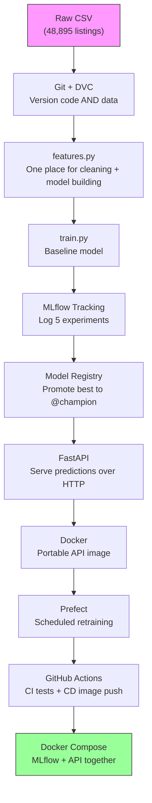

### Why this project is a step up

Every earlier project in the series was binary classification (yes or no). This one is regression: the model outputs a number, a price. That changes a few things throughout:

| Classification (before) | Regression (now) |
|---|---|
| Accuracy, precision, recall | RMSE, MAE, R² |
| "Is the prediction above 0.5?" | "Is the price in a sensible dollar range? Does Manhattan cost more than the Bronx?" |
| Roughly balanced labels | A heavily skewed target (most listings cost about $100, a few up to $10,000) |

The data is also messy: missing values, `$0` prices, huge outliers, and a column (`neighbourhood`) with 221 different values.

---

### Decisions made up front

| Decision | Why |
|---|---|
| Train on `log1p(price)`, report in dollars | Price is heavily right-skewed, and the log makes it easier for the model to learn |
| Put the log/exp conversion inside the model (`TransformedTargetRegressor`) | Nobody downstream (the API, the tests) can forget to convert back to dollars |
| Drop `price == 0` and `price > 800` | 11 rows cost `$0` (data errors), and 800 is about the 99th percentile ($799), so this removes 420 extreme outliers |
| One shared module, `features.py` | Four different scripts train models, and they all have to clean the data identically |
| The API loads the model from the MLflow registry, not from a file | Promoting a new model then needs a restart instead of a code change or rebuild |
| CI trains on a small committed sample | GitHub's servers can't reach the DVC storage on this laptop |

---

---

# Task 1: Project scaffold, virtual environment, pinned requirements

---

### The problem

Before writing any ML code we need three foundations:

1. Git, which keeps a history of every code change so we can always go back.
2. An isolated Python environment, so this project's libraries don't clash with anything else on the machine.
3. Pinned requirements, an exact list of library versions, so the code runs the same on this laptop, in Docker and in CI.

The virtual environment matters on this machine in particular. The default Python here is Anaconda's 3.12, and pandas already warns about mismatched `numexpr`/`bottleneck` versions in it. Installing MLflow, Prefect and the rest there could break other projects. Also, the Docker image (Task 9) uses Python 3.11, and the laptop should match so a model trained here loads cleanly there.

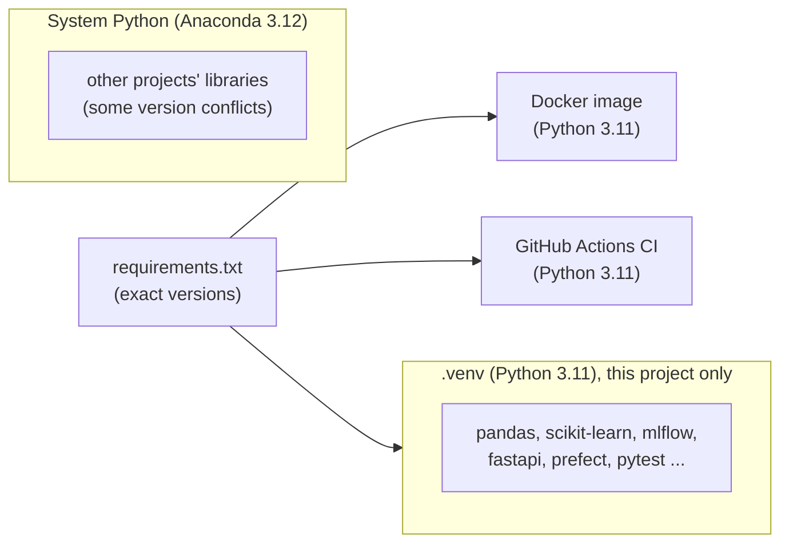

---

### Pre-check: make sure these are installed

```bash
git --version
# Expected: git version 2.x.x   (this machine: 2.49.0)

uv --version
# Expected: uv 0.x.x            (this machine: 0.9.28)
```

`uv` is a fast Python package and environment manager. It creates virtual environments and installs packages the way `pip` does, only much faster, and it can download Python 3.11 for you if it isn't installed.

---

### Step 1: Initialise Git on the `main` branch

```bash
cd "/Users/kumarshikhar/MLOps Projects/NYC-Airbnb-Price-Prediction"
git init -b main
```

This creates the hidden `.git/` folder, Git's internal database of every change. `-b main` names the first branch `main` (GitHub's default), which saves renaming `master` to `main` later.

Output:
```
Initialized empty Git repository in /Users/kumarshikhar/MLOps Projects/NYC-Airbnb-Price-Prediction/.git/
```

---

### Step 2: Create and activate the virtual environment

```bash
uv venv --python 3.11 .venv
source .venv/bin/activate
python --version
```

Expected:
```
Python 3.11.14
```

`uv venv --python 3.11 .venv` creates a self-contained Python 3.11 in the `.venv/` folder. `source .venv/bin/activate` makes `python` and `pip` in this terminal point to `.venv`, and your prompt usually shows `(.venv)`.

> [!WARNING]
> **Activation is per terminal.** Every new terminal window starts without the venv. Whenever you open one (for the MLflow or Prefect server later, for example), run `source .venv/bin/activate` from the project folder first.

---

### Step 3: Install the libraries, then pin the versions that were installed

```bash
uv pip install scikit-learn pandas numpy joblib fastapi uvicorn pydantic mlflow prefect pytest requests httpx2
uv pip freeze | grep -iE '^(scikit-learn|pandas|numpy|joblib|fastapi|uvicorn|pydantic|mlflow|prefect|pytest|requests|httpx2)==' > requirements.txt
cat requirements.txt
```

The resulting `requirements.txt`:
```
fastapi==0.141.1
httpx2==2.13.1
joblib==1.6.0
mlflow==3.16.1
numpy==2.4.6
pandas==3.0.6
prefect==3.8.6
pydantic==2.13.5
pytest==9.1.1
requests==2.34.2
scikit-learn==1.9.1
uvicorn==0.53.0
```

We install the latest versions first, then read back exactly what got installed and write those versions down, so we never guess a version number. The `grep` keeps only the 12 libraries we use directly, since the freeze also lists about 200 sub-dependencies.

What each library is for:

| Library | Used for |
|---|---|
| pandas, numpy | Loading and cleaning data |
| scikit-learn | Preprocessing and models |
| joblib | Saving the baseline model to disk |
| mlflow | Experiment tracking and the model registry |
| fastapi, uvicorn, pydantic | The prediction API and its input validation |
| prefect | Orchestrating and scheduling retraining |
| pytest, httpx2 | Tests (httpx2 powers FastAPI's test client; see the note in Task 6) |
| requests | Triggering the GitHub deploy workflow |

---

### Step 4: Install DVC, deliberately outside `requirements.txt`

```bash
uv pip install dvc
dvc --version
# 3.67.1
```

Why leave it out of `requirements.txt`? DVC is a tool you use on your laptop to fetch data. CI never runs DVC (it uses a committed sample instead; see Task 3), so installing it there would only slow CI down.

---

### Step 5: Create `.gitignore`

```gitignore
# Python
.venv/
__pycache__/
*.pyc
.pytest_cache/

# Local artifacts (models live in the MLflow registry, data lives in DVC)
models/
mlruns/
mlartifacts/
mlflow.db
mlflow.log

# Misc
.DS_Store
.env

# NOTE: do NOT add data/ here. `dvc add` writes data/.gitignore for the CSV,
# and ignoring the whole folder would stop git from tracking the .dvc pointer file.
```

> [!WARNING]
> **The `data/` trap.** It's tempting to ignore the whole `data/` folder. Don't. Git would then also ignore `data/AB_NYC_2019.csv.dvc`, the small pointer file that DVC needs in Git. DVC writes its own `data/.gitignore` in Task 2 that covers just the CSV.

---

### Step 6: Create `pytest.ini`

```ini
[pytest]
pythonpath = .
testpaths = tests
```

`pythonpath = .` lets tests `import features`, `import main` and so on from the project root. `testpaths = tests` tells pytest where to look, so a plain `pytest` works.

---

### Step 7: Commit

```bash
git add .gitignore requirements.txt pytest.ini README.md docs/
git commit -m "chore: project scaffold, pinned requirements, pytest config"
```

---

### After Task 1

```
NYC-Airbnb-Price-Prediction/
├── .git/                                        ← Git's database
├── .venv/                                       ← Python 3.11 env, NOT in Git
├── .gitignore
├── pytest.ini
├── requirements.txt                             ← 12 pinned libraries
├── README.md
└── docs/superpowers/plans/2026-09-24-nyc-airbnb-price-prediction.md  ← build plan
```

Git tracks everything above except `.venv/`.
Commit: `1419a83 chore: project scaffold, pinned requirements, pytest config`

---

---

# Task 2: Versioning the dataset with DVC

---

### The problem

The dataset is a 7 MB CSV. Git is the wrong tool for data: it stores every version forever, clones get slow, and GitHub rejects large files. We still need to be able to answer "which exact data was this model trained on?"

Git tracks code, and DVC tracks data. DVC stores a tiny pointer file (with a fingerprint of the data) in Git, and keeps the real file in separate storage.

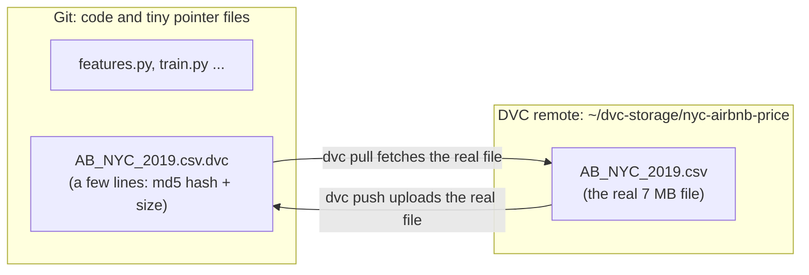

---

### Step 1: Copy the dataset in under its standard name

The Kaggle download on this machine is called `Airbnb NYC 2019.csv` (with spaces). We give it the dataset's standard Kaggle name:

```bash
mkdir -p data
cp ~/Downloads/"Airbnb NYC 2019.csv" data/AB_NYC_2019.csv
python -c "import pandas as pd; df = pd.read_csv('data/AB_NYC_2019.csv'); print(df.shape); print(list(df.columns))"
```

Output:
```
(48895, 16)
['id', 'name', 'host_id', 'host_name', 'neighbourhood_group', 'neighbourhood', 'latitude', 'longitude', 'room_type', 'price', 'minimum_nights', 'number_of_reviews', 'last_review', 'reviews_per_month', 'calculated_host_listings_count', 'availability_365']
```

What we confirmed about the data, checked against the real file rather than assumed:

| Quirk | Actual value |
|---|---|
| Missing values | `name` 16, `host_name` 21, `last_review` 10,052, `reviews_per_month` 10,052 |
| `reviews_per_month` missing exactly when `number_of_reviews == 0` | True for every row |
| `$0` prices | 11 rows |
| Price median / 99th percentile / max | $106 / $799 / $10,000 |
| Distinct `neighbourhood` values | 221 |
| Latitude / longitude range | 40.4998 to 40.9131 / -74.2444 to -73.7130 |

---

### Step 2: `dvc init`, then `dvc add`, before any `git add`

```bash
dvc init
dvc add data/AB_NYC_2019.csv
git status --short -uall
```

Output:
```
A  .dvc/.gitignore
A  .dvc/config
A  .dvcignore
?? data/.gitignore
?? data/AB_NYC_2019.csv.dvc
```

Behind the scenes, DVC:
1. computes an MD5 hash (a unique fingerprint) of the CSV,
2. writes `data/AB_NYC_2019.csv.dvc`, the pointer file with that hash,
3. copies the CSV into its cache, `.dvc/cache/`,
4. and writes `data/.gitignore` containing `/AB_NYC_2019.csv`, so Git never sees the real file.

> [!WARNING]
> **Order matters (the Article 7.5 lesson).** If you ran `git add -A` before `dvc add`, Git would stage the real CSV and it would stay in the history forever. Always run `dvc add` first, then check that `git status` doesn't list the CSV itself.

The pointer file:
```bash
cat data/AB_NYC_2019.csv.dvc
```
```yaml
outs:
- md5: f772a1d8d29bae6e7a9beac0ae880a2b
  size: 7077973
  hash: md5
  path: AB_NYC_2019.csv
```

Check that Git ignores the CSV, and why:
```bash
git check-ignore -v data/AB_NYC_2019.csv
# data/.gitignore:1:/AB_NYC_2019.csv	data/AB_NYC_2019.csv
```

---

### Step 3: Set up a local DVC remote and push

A remote is where DVC keeps the real files, outside Git. We use a folder in the home directory, outside the project, so deleting the project doesn't delete the data backup. A cloud setup would use an S3 bucket instead.

```bash
mkdir -p ~/dvc-storage/nyc-airbnb-price
dvc remote add -d localremote ~/dvc-storage/nyc-airbnb-price
dvc push
```

Output:
```
Setting 'localremote' as a default remote.
1 file pushed
```

`-d` makes this the default remote, so `dvc push` and `dvc pull` need no extra arguments. The setting is saved in `.dvc/config`:

```ini
[core]
    remote = localremote
['remote "localremote"']
    url = /Users/kumarshikhar/dvc-storage/nyc-airbnb-price
```

---

### Step 4: Delete the CSV and get it back

This is what a teammate (or future you) goes through after a fresh clone:

```bash
rm data/AB_NYC_2019.csv
ls data/
# AB_NYC_2019.csv.dvc          ← only the pointer is left

dvc pull
wc -l data/AB_NYC_2019.csv
md5 -q data/AB_NYC_2019.csv
```

Output:
```
A       data/AB_NYC_2019.csv
1 file added
   49081 data/AB_NYC_2019.csv
f772a1d8d29bae6e7a9beac0ae880a2b
```

The MD5 matches the pointer file exactly, so it's the same data, byte for byte.

> [!TIP]
> **Why 49,081 lines but 48,895 rows?** Some listing names contain line breaks inside quotes. `wc -l` counts raw lines, while pandas counts real rows.

---

### Step 5: Commit the pointer and config, not the data

```bash
git add .dvc .dvcignore data/AB_NYC_2019.csv.dvc data/.gitignore
git commit -m "data: track AB_NYC_2019.csv with DVC and a local remote"
```

---

### After Task 2

```
NYC-Airbnb-Price-Prediction/
├── .dvc/
│   ├── config                  ← remote settings, IN Git
│   ├── .gitignore              ← keeps cache/ and tmp/ out of Git
│   └── cache/                  ← DVC's local copy, NOT in Git
├── .dvcignore
├── data/
│   ├── AB_NYC_2019.csv         ← real file, NOT in Git
│   ├── AB_NYC_2019.csv.dvc     ← pointer file, IN Git
│   └── .gitignore              ← written by DVC
└── ... (Task 1 files)
```

Git tracks `.dvc/config`, `.dvc/.gitignore`, `.dvcignore`, `data/AB_NYC_2019.csv.dvc` and `data/.gitignore`. The DVC remote stores `AB_NYC_2019.csv`.
Commit: `9088fe5 data: track AB_NYC_2019.csv with DVC and a local remote`

---

---

# Task 3: `features.py`, one place for cleaning and model building

---

### The problem

Four different scripts train models in this project:

| Script | Task |
|---|---|
| `train.py` | 4, the baseline |
| `track_experiments.py` | 7, five MLflow experiments |
| `orchestrate_training.py` | 10, the Prefect flow |
| `scripts/ci_seed_model.py` | 11, CI |

If each one had its own copy of the cleaning code, the copies would slowly drift apart ("I changed the outlier cutoff in one place but not the other"). So every rule lives once, in `features.py`, and everything else imports it.

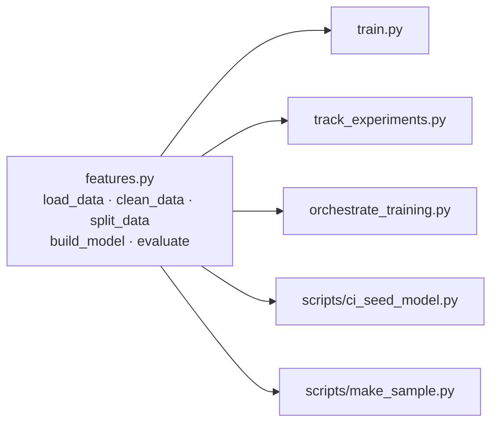

---

### The feature set

| Type | Columns | What happens to them |
|---|---|---|
| Numeric (7) | `latitude`, `longitude`, `minimum_nights`, `number_of_reviews`, `reviews_per_month`, `calculated_host_listings_count`, `availability_365` | `StandardScaler` (rescaled to mean 0, std 1) |
| Categorical (3) | `neighbourhood_group` (5 values), `neighbourhood` (221 values), `room_type` (3 values) | `OneHotEncoder(handle_unknown="ignore")` |
| Dropped (5) | `id`, `name`, `host_id`, `host_name`, `last_review` | Identifiers, free text or personal data, none of them useful inputs |
| Target | `price` | Trained as `log1p(price)` |

> [!TIP]
> **High-cardinality categoricals.** `neighbourhood` has 221 values, so one-hot encoding creates 221 columns for it alone. That's fine for these models, but it carries a real risk: one day the API will receive a neighbourhood the model never saw in training. `handle_unknown="ignore"` turns an unknown value into all zeros instead of crashing, and a test proves it.

---

### The log-price trick

Most listings cost about $100, but a few cost thousands. A model trained on raw prices gets pulled around by those few expensive listings. Taking the log squeezes the scale:

| Price | `log1p(price)` |
|---|---|
| $50 | 3.93 |
| $150 | 5.02 |
| $800 | 6.69 |

The model learns on the log scale, and `expm1` (the exact inverse of `log1p`) converts predictions back.

The danger is forgetting to convert back. You'd report "RMSE = 0.5" (in log units) or serve a price of "$5.3". So we never do the conversion by hand. scikit-learn's `TransformedTargetRegressor` does it inside the model:

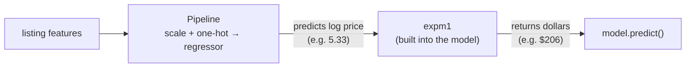

When this model is saved to MLflow and loaded by the API, the conversion goes with it.

---

### Step 1: Write the tests first (test-driven development)

In TDD you write a test that describes what the code should do, watch it fail, then write the code that makes it pass. Watching it fail proves the test actually tests something.

`tests/test_features.py` builds a tiny six-row fake dataset with the real quirks: a `$0` price, a `$10,000` outlier, and a listing with no reviews (so `reviews_per_month` is missing):

```python
prices = [0, 50, 150, 300, 800, 10000]
```

It checks:

| Test | What it proves |
|---|---|
| `test_clean_data_drops_zero_and_outlier_prices` | Only `[50, 150, 300, 800]` survive cleaning |
| `test_clean_data_fills_missing_reviews_per_month_with_zero` | A missing review rate becomes `0`, not the average |
| `test_clean_data_keeps_only_model_columns` | `id`, `name` and the other dropped columns are gone |
| `test_log_target_inversion_matches_hand_computed_value` | Predictions come out in dollars (see below) |
| `test_evaluate_returns_dollar_scale_metrics` | RMSE is in dollars, not log units |

The hand-computed check works like this. A `DummyRegressor(strategy="mean")` just predicts the average of whatever it was trained on. Trained on log prices, it predicts `mean(log1p(prices))`, so the dollar prediction must be:

```python
expected = np.expm1(np.mean(np.log1p([50, 150, 300, 800])))   # ≈ $206
assert model.predict(X.iloc[[0]])[0] == pytest.approx(expected)
```

If the `expm1` conversion were missing, the model would return about 5.3 and the test would fail.

Run the tests before `features.py` exists:
```bash
pytest tests/test_features.py -v
```
```
E   ModuleNotFoundError: No module named 'features'
```
That's the right failure: the module doesn't exist yet.

---

### Step 2: Write `features.py`

The key parts (the full file is in the repo):

```python
MAX_PRICE = 800
RANDOM_STATE = 42

def load_data(path=None):
    """Read the raw CSV. With no path, honour $DATA_PATH (CI uses the sample)."""
    path = path or os.environ.get("DATA_PATH", DEFAULT_DATA_PATH)
    return pd.read_csv(path)

def clean_data(df):
    df = df.copy()
    # reviews_per_month is missing exactly when number_of_reviews == 0:
    # no reviews means a review rate of 0, not the average rate.
    df["reviews_per_month"] = df["reviews_per_month"].fillna(0.0)
    df = df[(df[TARGET] > 0) & (df[TARGET] <= MAX_PRICE)]
    return df[FEATURES + [TARGET]].reset_index(drop=True)

def split_data(df):
    """80/20 split -> (X_train, X_test, y_train, y_test)."""
    return train_test_split(df[FEATURES], df[TARGET], test_size=0.2, random_state=RANDOM_STATE)

def build_model(regressor):
    preprocessor = ColumnTransformer([
        ("num", StandardScaler(), NUMERIC_FEATURES),
        ("cat", OneHotEncoder(handle_unknown="ignore"), CATEGORICAL_FEATURES),
    ])
    pipeline = Pipeline([("preprocess", preprocessor), ("regressor", regressor)])
    return TransformedTargetRegressor(regressor=pipeline, func=np.log1p, inverse_func=np.expm1)

def evaluate(model, X, y):
    """RMSE / MAE / R² on the original dollar scale."""
    predictions = model.predict(X)
    return {"rmse": ..., "mae": ..., "r2": ...}
```

Why these choices:
- `fillna(0.0)`: a listing with zero reviews really does have a review rate of zero. Filling with the mean would invent reviews that never happened.
- `random_state=42` gives the same split on every run, so results are comparable across experiments.
- `build_model(regressor)` takes any regressor, so Task 7 can plug in RandomForest or GradientBoosting with identical preprocessing.
- The `DATA_PATH` environment variable lets CI point training at the small sample without changing code.

Run the tests again:
```
tests/test_features.py::test_clean_data_drops_zero_and_outlier_prices PASSED
tests/test_features.py::test_clean_data_fills_missing_reviews_per_month_with_zero PASSED
tests/test_features.py::test_clean_data_keeps_only_model_columns PASSED
tests/test_features.py::test_log_target_inversion_matches_hand_computed_value PASSED
tests/test_features.py::test_evaluate_returns_dollar_scale_metrics PASSED
5 passed
```

---

### Step 3: Create the CI sample (`scripts/make_sample.py`)

Our DVC remote is a folder on this laptop. GitHub Actions runs on GitHub's servers, which can't reach it, so CI can't `dvc pull` the data.

The fix is to commit a small random sample of 2,000 rows to Git, with only the model columns. There are no names or IDs, so there's no personal data.

```bash
touch scripts/__init__.py
python -m scripts.make_sample
```
```
wrote 2000 rows to tests/fixtures/listings_sample.csv
```

What's in it:
```
(2000, 11)
{'Manhattan': 858, 'Brooklyn': 827, 'Queens': 259, 'Bronx': 42, 'Staten Island': 14}
missing reviews_per_month: 424 | price==0: 0 | price>800: 15
```

All five boroughs are there, and the sample keeps the real quirks (missing values, outliers), so the cleaning code gets tested on realistic data. The file is 142 KB.

> [!TIP]
> **Why `python -m scripts.make_sample` and not `python scripts/make_sample.py`?** Running a file directly puts `scripts/` first on Python's import path, so `import features` (which lives in the project root) would fail. `-m` runs it as a module from the project root. The empty `scripts/__init__.py` makes `scripts` a proper package.

---

### Step 4: Shared test fixtures (`tests/conftest.py`)

pytest loads `conftest.py` automatically, and every test can use the fixtures defined there:

```python
SAMPLE_PATH = Path(__file__).parent / "fixtures" / "listings_sample.csv"

@pytest.fixture(scope="session")
def sample_path():
    """Absolute path, so tests pass no matter which directory pytest runs from."""
    return SAMPLE_PATH

@pytest.fixture(scope="session")
def sample_splits(sample_path):
    """(X_train, X_test, y_train, y_test) from the committed 2,000-row sample."""
    return split_data(clean_data(load_data(sample_path)))
```

`scope="session"` loads the sample once for the whole test run instead of once per test.

Two more tests use them:

| Test | What it proves |
|---|---|
| `test_split_data_is_reproducible_80_20` | The 80/20 ratio, the right columns, and the same split every time |
| `test_model_tolerates_unseen_neighbourhood` | A neighbourhood the model never saw (`"Nowhere Heights"`) gets a price instead of a crash |

```bash
pytest -v
# 7 passed
```

---

### Step 5: Audit whether the tests catch bugs

A passing test suite only matters if it fails when the code is wrong. We broke `features.py` in nine ways, one at a time, and checked that the tests noticed:

| Deliberate bug | Caught? |
|---|---|
| Removed the `expm1` conversion back to dollars | Yes |
| Removed the log transform entirely | Yes |
| Filled missing review rates with the mean instead of 0 | Yes |
| Kept `$0` prices | Yes |
| Kept outliers above $800 | Yes |
| Kept the `id` / `name` columns | Yes |
| 50/50 split instead of 80/20 | Yes |
| Non-reproducible split (no `random_state`) | Yes |
| Removed `handle_unknown="ignore"` | Yes |

We also cloned the repo into a fresh folder, ran `dvc pull` and ran the tests there, and everything passed. So the project can be rebuilt from Git and DVC alone.

The audit also found a bug, which we fixed. The split test originally used the relative path `"tests/fixtures/listings_sample.csv"`, so it failed whenever pytest ran from a folder other than the project root. It now uses the `sample_path` fixture, which builds an absolute path from the test file's location.

---

### Step 6: Commit

```bash
git add features.py scripts/__init__.py scripts/make_sample.py tests/
git commit -m "feat: shared cleaning/pipeline module with log-target model and CI sample"
# after the audit:
git commit -m "test: cwd-independent sample path, cover unseen categories; fix CI rehearsal in plan"
```

---

### After Task 3

```
NYC-Airbnb-Price-Prediction/
├── features.py                        ← all cleaning + model-building rules
├── scripts/
│   ├── __init__.py
│   └── make_sample.py                 ← regenerates the CI sample
├── tests/
│   ├── conftest.py                    ← sample_path, sample_splits fixtures
│   ├── fixtures/
│   │   └── listings_sample.csv        ← 2,000 rows, IN Git (142 KB, no personal data)
│   └── test_features.py               ← 7 tests
└── ... (Task 1 and 2 files)
```

Tests: 7 passed, 0 warnings.
Commits:
```
9e90207 test: cwd-independent sample path, cover unseen categories; fix CI rehearsal in plan
e29ded8 feat: shared cleaning/pipeline module with log-target model and CI sample
9088fe5 data: track AB_NYC_2019.csv with DVC and a local remote
1419a83 chore: project scaffold, pinned requirements, pytest config
```

---

---

# Task 4: Baseline training script (`train.py`)

---

### The problem

Before bringing in MLflow, Docker or anything else, we need proof that the whole pipeline works end to end on the real data: load, clean, split, train, score, save and reload. That's what a baseline is for. It's the simplest reasonable model, and it gives us the number every later model has to beat.

We use LinearRegression because it's fast, simple and hard to get wrong. If something breaks, the problem is in the pipeline and not in a fancy model.

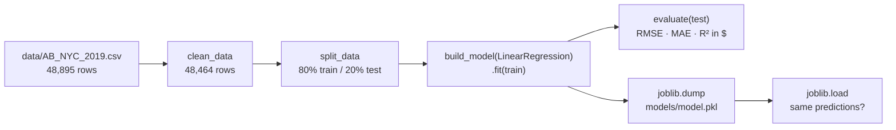

---

### The three regression metrics

| Metric | Plain meaning | Good direction |
|---|---|---|
| RMSE (root mean squared error) | The typical error in dollars, with big misses counting extra (errors are squared before averaging) | Lower |
| MAE (mean absolute error) | The average miss in dollars: "on average we're off by $X" | Lower |
| R² | The share of the price variation the model explains. 1.0 is perfect, 0 is no better than always guessing the average, and negative is worse than that | Higher |

RMSE is always at least as large as MAE. The gap between them tells you how much of the error comes from a few large misses.

---

### Step 1: Write `train.py`

```python
from pathlib import Path

import joblib
from sklearn.linear_model import LinearRegression

from features import build_model, clean_data, evaluate, load_data, split_data

MODEL_PATH = Path("models/model.pkl")


def main():
    df = clean_data(load_data())
    X_train, X_test, y_train, y_test = split_data(df)
    print(f"rows after cleaning: {len(df)}  (train={len(X_train)}, test={len(X_test)})")

    model = build_model(LinearRegression()).fit(X_train, y_train)
    for name, value in evaluate(model, X_test, y_test).items():
        print(f"{name}: {value:.3f}")

    MODEL_PATH.parent.mkdir(exist_ok=True)
    joblib.dump(model, MODEL_PATH)
    reloaded = joblib.load(MODEL_PATH)
    assert (reloaded.predict(X_test.head()) == model.predict(X_test.head())).all()
    print(f"saved and reloaded {MODEL_PATH}")
```

Notes:
- The whole script is about 15 lines because every rule lives in `features.py` (Task 3). `train.py` only wires the steps together.
- `evaluate` scores on the test set, which is data the model never saw during training. Scoring on the training data would flatter the model.
- `joblib.dump` saves the fitted model to a file as one object, with the preprocessing, the regressor and the log/dollar conversion all inside it.
- The reload-and-compare line proves the saved file really works, instead of only proving that something was written to disk.

> [!TIP]
> **Where's the `expm1`?** There isn't one in this file, on purpose. The model that `build_model` returns converts log price back to dollars inside `.predict()` (see Task 3), so `evaluate` already sees dollars.

---

### Step 2: Run it

```bash
python train.py
```

Output:
```
rows after cleaning: 48464  (train=38771, test=9693)
rmse: 83.545
mae: 47.077
r2: 0.395
saved and reloaded models/model.pkl
```

It takes about 1.4 seconds, and `models/model.pkl` is 9.6 KB.

The 48,464 comes from 48,895 raw rows, minus 11 rows at `$0`, minus 420 rows above `$800`.

---

### Step 3: Are these numbers sane?

**Is the scale right?** An RMSE of $83.5 is in the tens of dollars, as expected. If it had printed `0.5`, we'd be scoring log prices. If it had printed `4,000`, the conversion back would be broken.

**Is it better than guessing?** We compared it with a model that ignores every feature and always predicts the same typical price:

| Model | RMSE | MAE | R² |
|---|---|---|---|
| Always guess the typical price | $110.91 | $71.07 | -0.065 |
| LinearRegression baseline | $83.55 | $47.08 | 0.395 |

The baseline cuts the average miss from $71 to $47, so the features carry real signal.

> [!TIP]
> **Why is the "always guess" R² slightly negative instead of exactly 0?** It's trained on log prices, so its single guess is the log average (about $110), which is lower than the plain dollar average. R² measures against the plain dollar average, so this guess scores a little below zero.

**Do individual predictions make sense?** Here are three listings with the same host details but a different location and room type:

| Listing | Predicted price |
|---|---|
| Midtown Manhattan, entire home | $284.37 |
| Midtown Manhattan, private room | $142.57 |
| Fordham (Bronx), shared room | $36.18 |

The entire home costs the most, then the private room, then the shared room in the Bronx, which is the order you'd expect.

How good is an R² of 0.40? It's a modest start. We only have location, room type and booking activity, and nothing about size, bedrooms, photos or amenities. The tree-based models in Task 7 should do better, and now we have the number they have to beat.

---

### Step 4: Commit the code, not the model

```bash
git add train.py
git commit -m "feat: baseline LinearRegression training script (log-price target)"
```

`models/model.pkl` isn't committed, because `models/` is in `.gitignore`. It's only a quick local sanity check. From Task 7 onwards, models are stored and versioned in the MLflow registry, which is where the API loads them from.

---

### After Task 4

```
NYC-Airbnb-Price-Prediction/
├── train.py                  ← baseline training script, IN Git
├── models/
│   └── model.pkl             ← 9.6 KB saved model, NOT in Git
└── ... (Task 1 to 3 files)
```

Baseline to beat: RMSE $83.55 · MAE $47.08 · R² 0.395
Commit: `4f1e4c8 feat: baseline LinearRegression training script (log-price target)`

---

---

# Task 5: Pydantic schemas (`schemas.py`)

---

### The problem

Soon (in Task 6) anyone will be able to send a listing to our API and get a price back. People and other programs send bad data: a typo in `room_type`, `minimum_nights: 0`, a latitude with the sign flipped. A machine-learning model never complains about bad input. It just returns a confident-looking price that means nothing.

Pydantic is a Python library that checks data against a declared shape before it reaches the model. We describe a valid listing once, and every request gets checked automatically. FastAPI uses these schemas directly, so a bad request gets a clear `422` error explaining what's wrong.

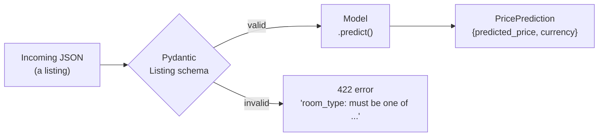

---

### The rules we enforce

The schema's fields match the model's 10 features exactly, not the raw CSV. There's no `id`, `name`, `host_name` or `last_review`, because the model doesn't use them and the API shouldn't ask for them.

| Field | Rule | Why |
|---|---|---|
| `neighbourhood_group` | One of Manhattan, Brooklyn, Queens, Bronx, Staten Island | Only 5 boroughs exist |
| `room_type` | One of Entire home/apt, Private room, Shared room | The data only has 3 types |
| `neighbourhood` | Any non-empty text | 221 values is too many to list, and the model safely ignores unknown ones (tested in Task 3) |
| `latitude` | 40.49 to 40.92 | NYC's bounding box, padded slightly around the real data (40.4998 to 40.9131) |
| `longitude` | -74.26 to -73.70 | Same idea (real data: -74.2444 to -73.7130) |
| `minimum_nights` | At least 1 | A booking is at least one night |
| `number_of_reviews` | At least 0 | Counts can't be negative |
| `reviews_per_month` | At least 0 | Rates can't be negative |
| `calculated_host_listings_count` | At least 1 | The host has at least this listing |
| `availability_365` | 0 to 365 | Days in a year |

> [!TIP]
> **Why bound latitude and longitude at all?** Without bounds, `latitude: -75` (Antarctica) or `longitude: 73.98` (a flipped sign, which puts it in China) would be accepted, and the model would happily return a price. It has never seen anything outside NYC, so its answer would be meaningless.

---

### Step 1: Write the tests first

`tests/test_schemas.py`:

```python
def test_valid_listing_is_accepted():
    listing = Listing(**EXAMPLE_LISTING)
    assert listing.room_type == "Entire home/apt"


def test_listing_fields_match_model_features_exactly():
    assert set(Listing.model_fields) == set(features.FEATURES)


@pytest.mark.parametrize(
    "field, value",
    [
        ("room_type", "Castle"),
        ("neighbourhood_group", "New Jersey"),
        ("neighbourhood", ""),
        ("minimum_nights", 0),
        ("number_of_reviews", -1),
        ("reviews_per_month", -0.5),
        ("calculated_host_listings_count", 0),
        ("availability_365", 366),
        ("latitude", -75.0),    # Antarctica
        ("longitude", 73.98),   # sign flipped: that's China
    ],
)
def test_invalid_value_is_rejected(field, value):
    with pytest.raises(ValidationError):
        Listing(**{**EXAMPLE_LISTING, field: value})
```

How it works:
- `@pytest.mark.parametrize` runs one test function 10 times, once per `(field, value)` pair. Each run takes a valid listing and breaks exactly one field, so a failure tells us precisely which rule is missing.
- `{**EXAMPLE_LISTING, field: value}` copies the valid example and overwrites one field.
- `pytest.raises(ValidationError)` means the test only passes if Pydantic rejects the input.
- `test_listing_fields_match_model_features_exactly` ties the schema to `features.FEATURES`. If someone adds a feature to the model but forgets the API, this test fails.

There are two more tests: a listing with a missing field is rejected, and `PricePrediction` defaults its currency to `"USD"`.

Run them before `schemas.py` exists:
```
E   ModuleNotFoundError: No module named 'schemas'
```
That's the right failure: the module doesn't exist yet.

---

### Step 2: Write `schemas.py`

```python
from typing import Literal

from pydantic import BaseModel, Field

NYC_LAT_MIN, NYC_LAT_MAX = 40.49, 40.92
NYC_LON_MIN, NYC_LON_MAX = -74.26, -73.70

EXAMPLE_LISTING = {
    "neighbourhood_group": "Manhattan",
    "neighbourhood": "Midtown",
    "latitude": 40.7549,
    "longitude": -73.9840,
    "room_type": "Entire home/apt",
    "minimum_nights": 2,
    "number_of_reviews": 20,
    "reviews_per_month": 1.0,
    "calculated_host_listings_count": 1,
    "availability_365": 180,
}


class Listing(BaseModel):
    model_config = {"json_schema_extra": {"examples": [EXAMPLE_LISTING]}}

    neighbourhood_group: Literal["Manhattan", "Brooklyn", "Queens", "Bronx", "Staten Island"]
    neighbourhood: str = Field(..., min_length=1)
    latitude: float = Field(..., ge=NYC_LAT_MIN, le=NYC_LAT_MAX)
    longitude: float = Field(..., ge=NYC_LON_MIN, le=NYC_LON_MAX)
    room_type: Literal["Entire home/apt", "Private room", "Shared room"]
    minimum_nights: int = Field(..., ge=1)
    number_of_reviews: int = Field(..., ge=0)
    reviews_per_month: float = Field(..., ge=0)
    calculated_host_listings_count: int = Field(..., ge=1)
    availability_365: int = Field(..., ge=0, le=365)


class PricePrediction(BaseModel):
    predicted_price: float
    currency: str = "USD"
```

Reading the syntax:
- `Literal[...]` means the value must be exactly one of these strings.
- In `Field(...)`, the `...` means the field is required and has no default.
- `ge` and `le` mean "greater than or equal" and "less than or equal".
- `min_length=1` rules out empty strings.
- `model_config = {"json_schema_extra": ...}` puts `EXAMPLE_LISTING` into FastAPI's auto-generated docs page, so the "Try it out" button starts with a valid request (Task 6).
- `EXAMPLE_LISTING` lives here rather than in the tests, so the tests, the API docs and later tasks all share one known-good listing.

Run the tests:
```bash
pytest tests/test_schemas.py -v
# 14 passed
```

---

### Step 3: Break a rule on purpose and watch it fail

A test that has never failed might not be testing anything. So we weakened one rule on purpose, changing `minimum_nights: ge=1` to `ge=0`, and ran the tests again:

```
E       Failed: DID NOT RAISE ValidationError
FAILED tests/test_schemas.py::test_invalid_value_is_rejected[minimum_nights-0]
1 failed, 13 passed
```

Exactly the one matching test failed, and its name tells us which field and value. After reverting the change: `14 passed`.

---

### Step 4: Make sure we don't reject real listings

Strict validation carries the opposite risk too: bounds so tight that they reject real data. We ran all 48,464 cleaned training listings through `Listing`:

```
validated 48464 real listings, rejected 0
```

The rules block nonsense without blocking anything the model was trained on.

---

### Step 5: Commit

```bash
git add schemas.py tests/test_schemas.py
git commit -m "feat: Listing/PricePrediction schemas with NYC bounds and tests"
```

---

### After Task 5

```
NYC-Airbnb-Price-Prediction/
├── schemas.py                ← Listing, PricePrediction, EXAMPLE_LISTING
├── tests/
│   └── test_schemas.py       ← 14 tests
└── ... (Task 1 to 4 files)
```

Tests: 21 passed (7 features + 14 schemas).
Commit: `f8773d9 feat: Listing/PricePrediction schemas with NYC bounds and tests`

---

---

# Task 6: FastAPI prediction service (`main.py`)

---

### The problem

A model sitting in a Python file is no use to a website, a mobile app or another team. They need to ask over the network what a listing should cost and get an answer back. FastAPI turns our model into a web API: a program that listens for HTTP requests and replies with JSON.

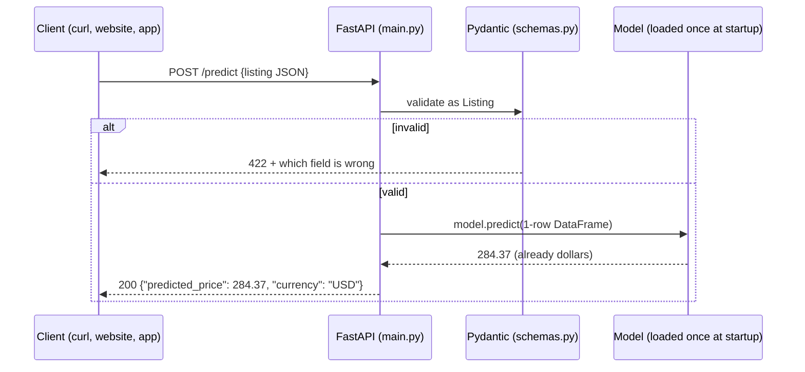

---

### The big design choice: load the model from the registry, not a file

The obvious approach is `joblib.load("models/model.pkl")`, and we deliberately avoid it (the Article 12 lesson). A hardcoded path ties the API to one specific file, so every new model would need someone to copy a file and redeploy.

Instead, `main.py` asks the MLflow Model Registry (built in Tasks 7 and 8) for whichever model currently holds the `champion` label:

```python
MODEL_URI = os.environ.get("MODEL_URI", "models:/AirbnbPriceModel@champion")
```

| Part | Meaning |
|---|---|
| `models:/` | Look this up in the MLflow Model Registry |
| `AirbnbPriceModel` | The registered model's name |
| `@champion` | An alias: a movable label that points at one version |

To ship a better model, you promote it, move the `champion` label and restart the API, and it serves the new model. You don't change any code or rebuild anything.

Where is the registry? MLflow reads the `MLFLOW_TRACKING_URI` environment variable itself (for example `http://127.0.0.1:5000`). So the same code works on the laptop, in CI and in Docker, and only the environment variable changes.

---

### Step 1: Write the tests first, with a fake model

The registry doesn't exist yet (that's Task 7). Should the API tests wait for it?

They don't need to. The API has its own logic worth testing: validation, the response shape, rounding, and never returning a negative price. So we swap the real model for a tiny stand-in:

```python
class FakeModel:
    """Stands in for the registry model so API tests need no MLflow server."""

    def __init__(self, price):
        self.price = price
        self.seen = None

    def predict(self, X):
        self.seen = X          # remember what the API sent us
        return np.array([self.price])


@pytest.fixture
def fake_model(monkeypatch):
    fake = FakeModel(price=123.456)
    monkeypatch.setattr(main, "load_model", lambda: fake)
    return fake


@pytest.fixture
def client(fake_model):
    with TestClient(main.app) as c:  # `with` runs the lifespan (model load)
        yield c
```

How it works:
- `monkeypatch.setattr(main, "load_model", ...)` temporarily replaces `main.load_model` for one test, so at startup the app "loads" the fake instead of contacting MLflow. pytest undoes the swap automatically afterwards.
- `TestClient` sends real HTTP-style requests to the app in memory, with no server and no port.
- The `with TestClient(...)` part matters, because FastAPI only runs its startup code (where the model is loaded) inside a `with` block.
- `self.seen` lets a test check exactly what the API passed to the model.

The five tests:

| Test | What it proves |
|---|---|
| `test_health` | `GET /health` answers `{"status": "ok", ...}` |
| `test_predict_returns_rounded_usd_price` | `123.456` comes back as `{"predicted_price": 123.46, "currency": "USD"}` |
| `test_predict_sends_exactly_the_model_features` | The model receives one row with exactly the 10 feature columns |
| `test_predict_never_returns_negative_price` | A model output of `-5.0` is served as `0.0` |
| `test_predict_rejects_invalid_listing` | `room_type: "Castle"` gets HTTP `422` |

Before `main.py` exists:
```
E   ModuleNotFoundError: No module named 'main'
```
That's the right failure: the module doesn't exist yet.

---

### Step 2: Write `main.py`

```python
MODEL_URI = os.environ.get("MODEL_URI", "models:/AirbnbPriceModel@champion")
logger = logging.getLogger("uvicorn.error")


def load_model():
    return mlflow.sklearn.load_model(MODEL_URI)


@asynccontextmanager
async def lifespan(app: FastAPI):
    logger.info("Loading %s from %s", MODEL_URI, mlflow.get_tracking_uri())
    app.state.model = load_model()
    logger.info("Model loaded")
    yield


app = FastAPI(title="NYC Airbnb Price API", lifespan=lifespan)


@app.get("/health")
def health():
    return {"status": "ok", "model_uri": MODEL_URI}


@app.post("/predict", response_model=PricePrediction)
def predict(listing: Listing) -> PricePrediction:
    features = pd.DataFrame([listing.model_dump()])
    price = float(app.state.model.predict(features)[0])
    return PricePrediction(predicted_price=round(max(price, 0.0), 2))
```

What each piece does:
- `lifespan` holds code that runs once when the server starts (before `yield`) and once when it stops (after). Loading a model can take seconds, so we do it once at startup instead of on every request, and keep it on `app.state.model`.
- `load_model()` is its own function, which is what makes the fake-model tests possible. The tests replace this one function.
- `predict(listing: Listing)` has its parameter typed as our Pydantic `Listing`, so FastAPI validates the JSON body automatically. Bad input never reaches this function, because FastAPI replies `422` on its own.
- `listing.model_dump()` turns the validated listing into a dict, and `pd.DataFrame([...])` makes a one-row table, which is what scikit-learn models expect.
- `max(price, 0.0)` stops the API from serving a negative price. Our log-price model can't actually produce one (`expm1` of any number is greater than -1), but the API shouldn't rely on that.
- There's no `expm1` here either, because the model converts back to dollars inside `.predict()` (Task 3).

Run the tests:
```bash
pytest tests/test_api.py -v
# 5 passed, 1 warning
```

---

### Step 3: Don't ignore warnings (the `httpx` to `httpx2` swap)

That one warning was:
```
StarletteDeprecationWarning: Using `httpx` with `starlette.testclient` is deprecated; install `httpx2` instead.
```

A deprecation warning is the library telling you something will break in a future version. FastAPI's `TestClient` (built on Starlette) now wants `httpx2`. We had pinned `httpx` only for the test client, so:

```bash
uv pip install httpx2
pytest -q
# 26 passed          ← no warning
```

`requirements.txt` now pins `httpx2==2.13.1` instead of `httpx`. (`httpx` is still installed, because Prefect depends on it and pulls it in by itself.)

---

### Step 4: A live test with a real model

The fake-model tests prove the API logic. We also wanted to prove that the real loading path works: `mlflow.sklearn.load_model`, the startup hook, and actual HTTP on a real port. We saved Task 4's baseline in MLflow's model format to a temporary folder and pointed `MODEL_URI` at it:

```bash
MODEL_URI=/tmp/.../baseline_mlflow_model uvicorn main:app --port 8765
```

Startup log:
```
INFO:     Loading /tmp/.../baseline_mlflow_model from sqlite:///.../mlflow.db
INFO:     Model loaded
INFO:     Application startup complete.
```

| Request | Response |
|---|---|
| `GET /health` | `{"status":"ok","model_uri":"/tmp/.../baseline_mlflow_model"}` |
| `POST /predict` Midtown entire home | `{"predicted_price":284.37,"currency":"USD"}`, identical to Task 4's check |
| `POST /predict` with `latitude: -75` | HTTP 422: `"Input should be greater than or equal to 40.49"` |
| `GET /docs` | HTTP 200: FastAPI's interactive docs page, pre-filled with `EXAMPLE_LISTING` |

> [!TIP]
> **Try the docs page yourself later.** Once the real model exists (Task 8), run `uvicorn main:app` and open http://127.0.0.1:8000/docs. Click POST /predict → Try it out → Execute to get a live prediction from the browser.

---

### Step 5: What happens when MLflow is down? (a real problem we found)

We started the API pointed at an MLflow server that wasn't running. The API froze silently for 247 seconds, more than 4 minutes with no output, before it finally failed.

The cause: MLflow's client retries failed requests 7 times and waits longer after each attempt (2 s, 4 s, 8 s, 16 s and so on). That's sensible for a training script, but for an API it looks exactly like "the app is broken and I don't know why."

The first part of the fix, done now: `main.py` logs what it's loading and from where before it tries. Even a slow startup now says what it's waiting on:
```
INFO:     Loading models:/AirbnbPriceModel@champion from http://127.0.0.1:5999
```

The second part of the fix goes in the Dockerfile (Task 9): two MLflow settings that cut the retrying short.

```bash
MLFLOW_HTTP_REQUEST_MAX_RETRIES=3 MLFLOW_HTTP_REQUEST_TIMEOUT=10 uvicorn main:app
```
```
INFO:     Loading models:/AirbnbPriceModel@champion from http://127.0.0.1:5999
mlflow.exceptions.MlflowException: API request to http://127.0.0.1:5999/... failed ...
ERROR:    Application startup failed. Exiting.
```

| Setting | Time to fail when MLflow is down |
|---|---|
| MLflow defaults (7 retries) | 247 s, silent |
| 3 retries, 10 s timeout | About 14 s, with a clear error |

Three retries still ride out a brief MLflow restart, but when the server is really missing you get a fast, clear failure, and Docker or Compose can then restart the container.

> [!WARNING]
> **Stuck servers ignore Ctrl-C.** While MLflow is retrying inside startup, a normal stop signal may be ignored. If a test server hangs, find it with `pgrep -fl uvicorn` and stop it with `kill -9 <pid>`.

---

### Step 6: Commit

```bash
git add main.py tests/test_api.py requirements.txt docs/
git commit -m "feat: FastAPI app serving the registry champion, with startup logging"
```

---

### After Task 6

```
NYC-Airbnb-Price-Prediction/
├── main.py                   ← FastAPI app: /health, /predict
├── requirements.txt          ← httpx → httpx2
├── tests/
│   └── test_api.py           ← 5 tests using a FakeModel
└── ... (Task 1 to 5 files)
```

Tests: 26 passed, 0 warnings (7 features + 14 schemas + 5 api).
Commit: `09fadaa feat: FastAPI app serving the registry champion, with startup logging`

---

---

# Task 7: MLflow experiment tracking

---

### The problem

In Task 4 we trained one model and printed three numbers to the terminal. Now we want to try five different models. Without a system you end up with scribbled notes: was it the 300-tree forest with depth 10 that got 78.7, or the 100-tree one? Which file holds that model?

MLflow Tracking records every training attempt, called a run, in one place: its settings (parameters), its scores (metrics) and the trained model itself (an artifact). A web UI lets you sort runs and compare them side by side.

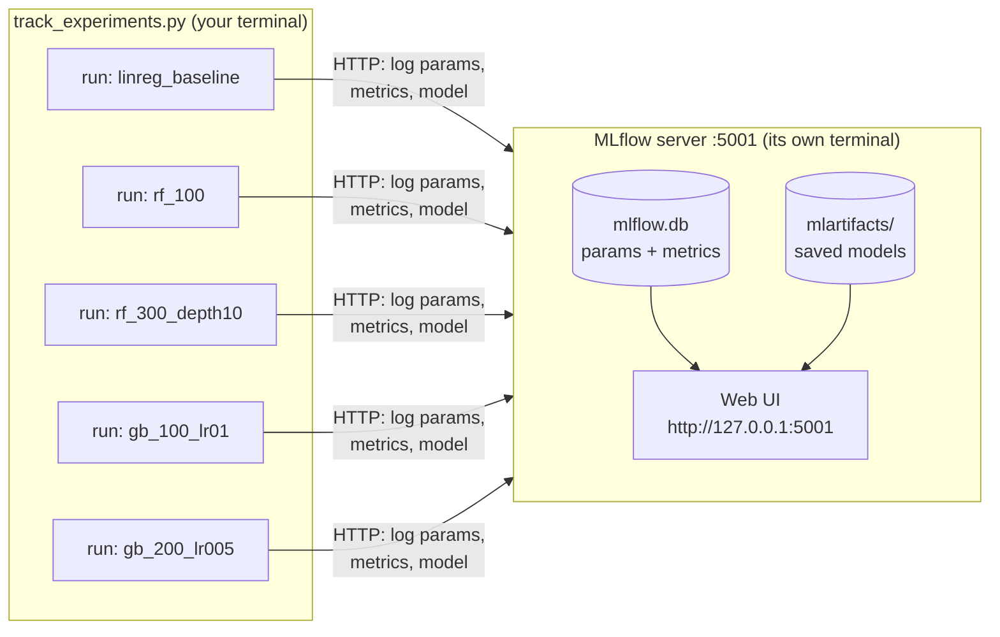

---

### Pre-check: port 5000 is taken on Macs

MLflow's default port is 5000, and on macOS AirPlay Receiver (process name `ControlCenter`) usually holds it:

```bash
lsof -nP -iTCP:5000 -sTCP:LISTEN
```
```
COMMAND    PID         USER   FD   TYPE ... NAME
ControlCe 1132 kumarshikhar   12u  IPv4 ... TCP *:5000 (LISTEN)
```

There are two options: turn off AirPlay Receiver (System Settings → General → AirDrop & Handoff), or use another port. We use port 5001 on this laptop. In CI and Docker Compose (later tasks), MLflow still runs on 5000, because those are separate machines and networks where AirPlay doesn't exist.

---

### Step 1: Start the MLflow server in its own terminal

The server has to keep running while we work, so it gets a dedicated terminal window.

```bash
# NEW terminal window:
cd "/Users/kumarshikhar/MLOps Projects/NYC-Airbnb-Price-Prediction"
source .venv/bin/activate          # new terminal, so activate again
which mlflow                       # must point into .venv/ (see the Anaconda trap below)

mlflow server \
  --backend-store-uri sqlite:///mlflow.db \
  --artifacts-destination ./mlartifacts \
  --host 0.0.0.0 --port 5001 \
  --allowed-hosts "localhost:*,127.0.0.1:*,host.docker.internal:*,mlflow-server:*"
```

It's ready when you see:
```
INFO:     Uvicorn running on http://0.0.0.0:5001 (Press CTRL+C to quit)
```

What each flag does:

| Flag | Meaning |
|---|---|
| `--backend-store-uri sqlite:///mlflow.db` | Run details (params, metrics, and later the model registry) go in a small database file |
| `--artifacts-destination ./mlartifacts` | Saved models go in `mlartifacts/`, and the server hands them out over HTTP. Clients never need direct access to the folder, which is what lets a Docker container download a model in Task 9 |
| `--host 0.0.0.0` | Accept connections from anywhere on this machine, including Docker containers (`127.0.0.1` would only accept this laptop's own programs) |
| `--port 5001` | Stays clear of AirPlay's port 5000 |
| `--allowed-hosts ...` | An allow-list of the names clients may use to reach the server |

> [!WARNING]
> **The Anaconda trap.** If you see `ImportError: cannot import name 'service' from 'google.protobuf'`, your terminal is running Anaconda's `mlflow` (`/opt/anaconda3/bin/mlflow`) instead of the project's, and its libraries are incompatible. Check with `which mlflow`. To fix it, run `conda deactivate` (if the prompt shows `(base)`), then `source .venv/bin/activate`. You can also skip the question entirely by calling `.venv/bin/mlflow server ...`.

---

### Step 2: Check the server from the working terminal

```bash
curl -s http://127.0.0.1:5001/health
# OK
```

Check that the allow-list really lets Docker-style names in and keeps strangers out:
```bash
for h in host.docker.internal:5001 mlflow-server:5000 evil.example.com; do
  curl -s -o /dev/null -w "$h -> %{http_code}\n" -H "Host: $h" \
    "http://127.0.0.1:5001/api/2.0/mlflow/experiments/search?max_results=1"
done
```
```
host.docker.internal:5001 -> 200
mlflow-server:5000 -> 200
evil.example.com -> 403
```

> [!TIP]
> **A zsh gotcha:** quote URLs that contain `?`. Unquoted, zsh treats `?` as a filename wildcard and fails with `no matches found`.

---

### Step 3: `registry.py`, one home for MLflow names

```python
EXPERIMENT_NAME = "airbnb-price-prediction"
MODEL_NAME = "AirbnbPriceModel"
CHAMPION_ALIAS = "champion"


def require_tracking_uri() -> str:
    uri = os.environ.get("MLFLOW_TRACKING_URI")
    if not uri:
        sys.exit(
            "MLFLOW_TRACKING_URI is not set. Start the server (see implementation.md, Task 7) and run:\n"
            "  export MLFLOW_TRACKING_URI=http://127.0.0.1:5001"
        )
    return uri
```

Why `require_tracking_uri`? If `MLFLOW_TRACKING_URI` isn't set, MLflow doesn't complain. It quietly writes to a local database file instead of your server, and you're left wondering why nothing appears in the UI. This check turns that silent mistake into a clear message. (Task 8 adds the model-promotion helpers to this file.)

---

### Step 4: `track_experiments.py`, five runs in one loop

The five planned configurations, as data:

```python
CONFIGS = {
    "linreg_baseline": (LinearRegression, {}),
    "rf_100": (RandomForestRegressor, {"n_estimators": 100, "n_jobs": -1, "random_state": RANDOM_STATE}),
    "rf_300_depth10": (RandomForestRegressor, {"n_estimators": 300, "max_depth": 10, "n_jobs": -1, "random_state": RANDOM_STATE}),
    "gb_100_lr01": (GradientBoostingRegressor, {"n_estimators": 100, "learning_rate": 0.1, "random_state": RANDOM_STATE}),
    "gb_200_lr005": (GradientBoostingRegressor, {"n_estimators": 200, "learning_rate": 0.05, "random_state": RANDOM_STATE}),
}
```

And one function that trains and logs any of them:

```python
def train_and_log(run_name, X_train, X_test, y_train, y_test):
    """Fit one config inside an MLflow run. Returns (run_id, metrics)."""
    model_class, params = CONFIGS[run_name]
    with mlflow.start_run(run_name=run_name) as run:
        model = build_model(model_class(**params)).fit(X_train, y_train)
        metrics = evaluate(model, X_test, y_test)
        mlflow.log_params(
            {"model_type": model_class.__name__, "target_transform": "log1p/expm1", **params}
        )
        mlflow.log_metrics(metrics)
        mlflow.sklearn.log_model(
            model,
            name="model",
            input_example=X_train.head(3),
            skops_trusted_types=SKOPS_TRUSTED_TYPES,
        )
    return run.info.run_id, metrics
```

What each piece does:
- `with mlflow.start_run(...)` puts everything logged inside the block into one run. If the code crashes inside the block, MLflow marks the run `FAILED` instead of leaving it half-finished.
- `build_model(...)` uses the same preprocessing and log-price wrapping as the baseline (Task 3). Only the regressor changes, so the comparison is fair.
- `log_params` records the settings, plus `model_type` and `target_transform`, so anyone reading the run later knows what it is.
- `log_metrics` records RMSE, MAE and R² in dollars.
- `log_model(..., name="model")` uploads the whole fitted model, whose address becomes `runs:/<run_id>/model`.
- `input_example` saves three real rows with the model, documenting the input it expects.
- `n_jobs=-1` lets the random forests train on all CPU cores.
- `skops_trusted_types` is the fix for a real crash, covered in Step 6.

---

### Step 5: Test without touching the real server

Unit tests should never write junk runs to your real server. So `tests/conftest.py` gets a `local_mlflow` fixture: a throwaway MLflow database in a temporary folder, which pytest deletes afterwards.

```python
@pytest.fixture
def local_mlflow(tmp_path, monkeypatch):
    """A throwaway sqlite tracking store + registry, so unit tests never touch the real server."""
    previous_uri = mlflow.get_tracking_uri()
    uri = f"sqlite:///{tmp_path / 'mlflow.db'}"
    monkeypatch.setenv("MLFLOW_TRACKING_URI", uri)
    mlflow.set_tracking_uri(uri)
    experiment_id = mlflow.create_experiment(
        "test-experiment", artifact_location=(tmp_path / "artifacts").as_uri()
    )
    mlflow.set_experiment(experiment_id=experiment_id)
    yield uri
    mlflow.set_tracking_uri(previous_uri)
```

The tests train on the 2,000-row sample, so they're fast:

| Test | What it proves |
|---|---|
| `test_configs_are_the_five_planned_runs` | There are exactly the 5 planned run names, in order |
| `test_train_and_log_records_params_metrics_and_model` | A run gets the right name, params and metrics, and its model loads back and predicts positive prices |
| `test_every_config_can_be_logged_and_loaded_back` (×5) | Every config, not only LinearRegression, survives being saved and loaded |

We added the last one after a real failure, described in the next step.

---

### Step 6: The `UntrustedTypesFoundException` crash, and how we debugged it

The first real run died on the second model:

```
linreg_baseline  rmse=  83.54  mae= 47.08  r2=0.395
Traceback (most recent call last):
  ...
skops.io.exceptions.UntrustedTypesFoundException: Untrusted types found in the file: ['sklearn.tree._tree.Tree'].
mlflow.exceptions.MlflowException: The saved sklearn model references untrusted types.
```

We found the root cause by reading MLflow's own source code rather than guessing:

1. MLflow 3 saves scikit-learn models in the skops format by default. skops is a safer replacement for Python's `pickle`. A pickle file can run any code when it's loaded, so a malicious model file could take over your machine.
2. skops only loads object types that are on an allow-list. LinearRegression only uses allowed types. Random forests and gradient boosting store their trees in `sklearn.tree._tree.Tree`, which skops blocks by default, since a crafted Tree could crash the process.
3. You can trust a type explicitly with `skops_trusted_types`. MLflow writes that list into the model's metadata (the `MLmodel` file), and `mlflow.sklearn.load_model` reads it back automatically. So the fix only belongs at logging time, and the API (Task 6) needs no change.

Why didn't the tests catch it? The original test only trained `linreg_baseline`, the one model without trees. The lesson: test every variant you'll actually use.

We fixed it test-first:
1. We wrote `test_every_config_can_be_logged_and_loaded_back`, parametrized over all 5 configs. It reproduced the crash exactly: `4 failed, 1 passed`. Every tree model failed, and only `sklearn.tree._tree.Tree` was flagged.
2. We trusted exactly that one type and nothing more:
   ```python
   SKOPS_TRUSTED_TYPES = ["sklearn.tree._tree.Tree"]
   ```
3. We ran the tests again and got `7 passed`, and the full suite gave `33 passed`.

> [!WARNING]
> **Trust only what you need.** The error message itself warns against trusting everything it reports just to make a file load. We trust one type because we create these model files ourselves, and anything else unexpected would still be blocked.

> [!WARNING]
> **Don't let a filter hide a crash.** The first run was piped through `grep`, which made the whole command report exit code 0 even though Python crashed. Always check the real exit code of the program itself.

The crashed attempt left 2 runs on the server (a finished `linreg_baseline` and a `FAILED` `rf_100`). We soft-deleted both with `MlflowClient().delete_run(...)`, so the experiment shows exactly one clean set of five. MLflow deletes are "soft": runs move to a Deleted view and can be restored.

---

### Step 7: Run all five experiments

```bash
export MLFLOW_TRACKING_URI=http://127.0.0.1:5001
python track_experiments.py
```

Output (42 seconds):
```
linreg_baseline  rmse=  83.54  mae= 47.08  r2=0.395  run_id=3bc55499dfb64305a25185b1cd40ffc9
rf_100           rmse=  77.53  mae= 43.39  r2=0.479  run_id=d22d7f884d214953990e2cd4a3dceeaa
rf_300_depth10   rmse=  78.75  mae= 43.81  r2=0.463  run_id=23d6c14c4baf4fb1aa960a7fdcdc1fad
gb_100_lr01      rmse=  81.13  mae= 44.90  r2=0.430  run_id=22cd207e8654415cb2372bed6c144323
gb_200_lr005     rmse=  81.21  mae= 44.92  r2=0.429  run_id=8a766f1b85a241c18e357bdc6e258b83
```

Then open http://127.0.0.1:5001 and the experiment `airbnb-price-prediction`. Tick the runs and click Compare to see them side by side.

---

### Step 8: Reading the results

| Run | RMSE | MAE | R² | Saved model size |
|---|---|---|---|---|
| rf_100 | $77.53 | $43.39 | 0.479 | 311 MB |
| rf_300_depth10 | $78.75 | $43.81 | 0.463 | 38 MB |
| gb_100_lr01 | $81.13 | $44.90 | 0.430 | 3.7 MB |
| gb_200_lr005 | $81.21 | $44.92 | 0.429 | 7.1 MB |
| linreg_baseline | $83.54 | $47.08 | 0.395 | 0.3 MB |

What this tells us:
- All four tree models beat the baseline. They pick up patterns a straight line can't, such as location effects that aren't linear in latitude and longitude.
- RMSE and MAE agree on the ranking here, so there's no conflict between metrics to resolve. With regression they don't always agree, and Task 8 decides the rule.
- The two gradient-boosting runs are nearly identical: half the learning rate with twice the trees ends up in the same place.
- The gains are real but modest (RMSE drops from $83.5 to $77.5). The features only describe location, room type and booking activity, with nothing on size, bedrooms or amenities, so no model can explain most of the price.
- Size matters too. `rf_100` grows 100 trees with no depth limit, so each tree is huge and the model comes to 311 MB. `rf_300_depth10` is only $1.22 worse on RMSE but 8 times smaller. The API downloads the champion at startup and keeps it in memory, so Task 8 makes an explicit decision about this trade-off.

We also checked directly on the server, rather than trusting the printout: 5 active runs, all `FINISHED`, with params and metrics present, and every model downloads through the server and loads as a `TransformedTargetRegressor`.

> [!TIP]
> **Two harmless warnings you'll see:** `Inferred schema contains integer column(s)...` is MLflow noting that integer columns can't hold missing values, which is fine because the API schema requires those fields. `Failed to resolve installed pip version` appears because venvs made by uv don't include `pip`, so MLflow records it without a version.

---

### Step 9: Commit

```bash
git add registry.py track_experiments.py tests/conftest.py tests/test_track_experiments.py
git commit -m "feat: MLflow experiment tracking for five regression configs"
# after the crash:
git commit -m "fix: trust sklearn Tree type so tree models can be logged with MLflow's skops format"
```

`mlflow.db` and `mlartifacts/` aren't committed, because they're in `.gitignore`. They're the server's data, not source code.

---

### After Task 7

```
NYC-Airbnb-Price-Prediction/
├── registry.py                  ← MLflow names + require_tracking_uri
├── track_experiments.py         ← CONFIGS + train_and_log
├── mlflow.db                    ← server's run database, NOT in Git
├── mlartifacts/                 ← saved models (~360 MB), NOT in Git
├── tests/
│   ├── conftest.py              ← + local_mlflow fixture
│   └── test_track_experiments.py ← 7 tests
└── ... (Task 1 to 6 files)
```

Running: the MLflow server on http://127.0.0.1:5001, in its own terminal.
Tests: 33 passed.
Commits:
```
7d10a0e fix: trust sklearn Tree type so tree models can be logged with MLflow's skops format
2fae35a feat: MLflow experiment tracking for five regression configs
```

---

---

# Task 8: Promoting the champion in the MLflow model registry

---

### The problem

Task 7 gave us five runs. Which one should the API serve, and how does the API find it?

The Model Registry is MLflow's catalogue of approved models:
- A registered model is a named slot: `AirbnbPriceModel`.
- Each time you register a run's model into it, it gets a new version: v1, v2, v3 and so on.
- An alias is a movable label that points at one version, such as `@champion` pointing at v1.

The API (Task 6) asks for `models:/AirbnbPriceModel@champion`. To ship a better model later, you register it as v2 and move `@champion` to it, and the API code stays the same.

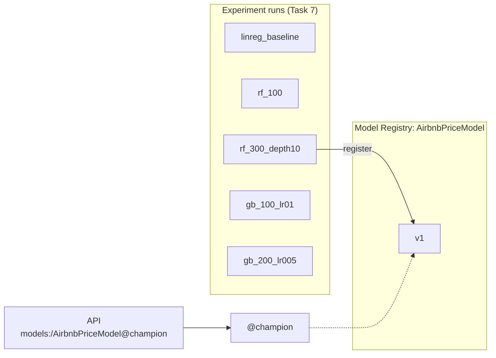

> [!TIP]
> **Aliases, not stages.** Older MLflow tutorials use stages (`Staging`, `Production`). That API is deprecated. Aliases do the same job, can have any name you like, and a version can have several.

---

### Step 1: Decide which model wins

The plan was to pick the lowest RMSE but sanity-check the choice. The sanity check turned up a real problem:

| Run | RMSE | Model size |
|---|---|---|
| rf_100 | $77.53 | 326 MB |
| rf_300_depth10 | $78.75 | 39 MB |

`rf_100` wins by $1.22, but its 100 unlimited-depth trees make it 8 times bigger. The API downloads the champion every time it starts and keeps it in memory, and the Docker container (Task 9) and CI (Task 11) would pay that cost on every start. We chose `rf_300_depth10`, which is practically as accurate and far lighter.

A one-off manual pick isn't enough, though. In Task 10, Prefect retrains and promotes automatically, so the decision has to be a written rule that code can apply and tests can check:

> **Champion = the lowest RMSE among models no bigger than 100 MB.**

---

### Step 2: Record each model's size (`track_experiments.py`)

A size rule needs every run's size as a metric. MLflow already writes each model's exact size into its metadata file (`MLmodel`), and reading that tiny file doesn't download the model:

```python
model_info = mlflow.sklearn.log_model(...)
size_bytes = Model.load(model_info.model_uri).model_size_bytes
metrics["model_size_mb"] = round(size_bytes / 1e6, 1)
mlflow.log_metric("model_size_mb", metrics["model_size_mb"])
```

The existing Task 7 runs didn't have this metric, so we soft-deleted them and ran `track_experiments.py` again. Every model uses `random_state=42`, so the metrics came out identical, this time with sizes:

```
linreg_baseline  rmse=  83.54  mae= 47.08  r2=0.395  size=   0.3MB
rf_100           rmse=  77.53  mae= 43.39  r2=0.479  size= 326.0MB
rf_300_depth10   rmse=  78.75  mae= 43.81  r2=0.463  size=  39.3MB
gb_100_lr01      rmse=  81.13  mae= 44.90  r2=0.430  size=   3.9MB
gb_200_lr005     rmse=  81.21  mae= 44.92  r2=0.429  size=   7.4MB
```

> [!TIP]
> **Reproducibility paid off here.** Because the numbers matched exactly, re-running was safe. We changed what we record, not what we train.

---

### Step 3: The selection rule (`registry.py`)

```python
SELECTION_METRIC = "rmse"
MAX_MODEL_SIZE_MB = 100


def pick_best(results: dict[str, dict[str, float]]) -> str:
    """results maps run_id -> metrics (incl. model_size_mb). Returns the winning run_id."""
    eligible = {
        run_id: m for run_id, m in results.items() if m["model_size_mb"] <= MAX_MODEL_SIZE_MB
    }
    if not eligible:
        raise ValueError(f"No model within the {MAX_MODEL_SIZE_MB} MB size budget")

    best = min(eligible, key=lambda run_id: eligible[run_id][SELECTION_METRIC])
    best_overall = min(results, key=lambda run_id: results[run_id][SELECTION_METRIC])
    if best_overall != best:
        print(f"note: {best_overall} has a lower RMSE but is over the {MAX_MODEL_SIZE_MB} MB budget")
    best_by_mae = min(eligible, key=lambda run_id: eligible[run_id]["mae"])
    if best_by_mae != best:
        print(f"note: lowest-RMSE run {best} differs from lowest-MAE run {best_by_mae}; RMSE decides")
    return best
```

Why these choices:
- RMSE decides because it punishes big dollar misses hardest. For a pricing tool, one $300 miss hurts more than three $100 misses.
- MAE still gets checked. With regression the metrics can disagree, and if they do, the script says so instead of picking silently.
- When the size budget changes the outcome, the script announces the excluded winner, so you always see it.
- If no model is eligible, it raises an error. It never quietly promotes nothing, and never promotes the oversized one anyway.

`best_run_id(experiment_name)` feeds this from the server. It only searches `FINISHED` runs, and it treats a run with no `model_size_mb` metric as infinitely big, since that run can't prove it fits the budget.

---

### Step 4: Register and promote

```python
def logged_model_uri(run_id: str) -> str:
    """MLflow 3 stores a run's model as its own LoggedModel (models:/m-...), not as a run artifact."""
    outputs = MlflowClient().get_run(run_id).outputs.model_outputs
    if not outputs:
        raise ValueError(f"Run {run_id} has no logged model")
    return f"models:/{outputs[0].model_id}"


def register_and_promote(run_id: str) -> str:
    """Register the run's model and point @champion at it. Returns the new version."""
    version = mlflow.register_model(logged_model_uri(run_id), MODEL_NAME).version
    MlflowClient().set_registered_model_alias(MODEL_NAME, CHAMPION_ALIAS, version)
    return version
```

Run it:
```bash
python registry.py
```
```
Successfully registered model 'AirbnbPriceModel'.
Created version '1' of model 'AirbnbPriceModel'.
note: f0f529b7... has a lower RMSE but is over the 100 MB budget
registered AirbnbPriceModel v1 from run 63832c72... -> @champion
```

The result: `@champion` points at v1, which is `rf_300_depth10` (RMSE $78.75, 39.3 MB). In the UI, Models → AirbnbPriceModel shows version 1 with the `champion` alias.

> [!TIP]
> **Why `logged_model_uri` and not `runs:/<id>/model`?** Our first version registered `runs:/<run_id>/model`, the MLflow 2 style. It worked, but MLflow warned: *"Run … has no artifacts at artifact path 'model', registering model based on models:/m-… instead"*. In MLflow 3, a logged model is its own object with its own address (`models:/m-…`), and the run only records which model it produced. Relying on a fallback is fragile, so we wrote a test that fails on that warning, then switched to registering the model's real address.

---

### Step 5: Tests

The unit tests use the throwaway `local_mlflow` database and never touch your real server:

| Test | What it proves |
|---|---|
| `test_pick_best_uses_lowest_rmse_within_size_budget` | A 326 MB model with the best RMSE is skipped, and the 39 MB runner-up wins |
| `test_pick_best_prefers_rmse_when_mae_disagrees` | RMSE is the deciding metric |
| `test_pick_best_refuses_when_no_model_fits_the_budget` | It raises an error instead of promoting something oversized |
| `test_register_and_promote_sets_champion_alias` | `@champion` points at the new version, and that version loads |
| `test_promoting_again_moves_the_alias` | A second promotion creates v2 and moves the alias |
| `test_register_uses_the_runs_logged_model_not_a_fallback` | There's no fallback warning, and the version's source is `models:/m-…` |

The real-registry tests live in `tests/test_model_registry.py`. They load the actual champion from your server through `models:/AirbnbPriceModel@champion` (not joblib) and check that its predictions make economic sense:

| Test | What it proves |
|---|---|
| `test_manhattan_entire_home_costs_more_than_bronx_shared_room` | The direction makes sense |
| `test_predictions_are_plausible_dollar_amounts` (×2) | Prices are between $10 and $800 |

Regression has no 0.5 threshold to test against like classification did, so direction and plausibility serve as the sanity checks.

When `MLFLOW_TRACKING_URI` isn't set, these tests are skipped with a clear reason, so the rest of the suite still runs without a server:
```bash
MLFLOW_TRACKING_URI=http://127.0.0.1:5001 pytest tests/test_model_registry.py -v   # 3 passed
env -u MLFLOW_TRACKING_URI pytest tests/test_model_registry.py -v -rs             # 3 skipped
```

As a safety check, we counted the experiments, runs and model versions on the server before and after running the full suite with the server configured. The counts were identical (`experiments=2 runs=12 model_versions=1`), so the unit tests don't leak into your real server.

---

### Step 6: Load from a separate process, then serve

This is the important registry check: a brand-new Python process, which knows nothing except the registry address, loads the model and predicts:

```bash
export MLFLOW_TRACKING_URI=http://127.0.0.1:5001
python -c "
import mlflow.sklearn, pandas as pd
from schemas import EXAMPLE_LISTING
m = mlflow.sklearn.load_model('models:/AirbnbPriceModel@champion')
print(type(m).__name__, round(float(m.predict(pd.DataFrame([EXAMPLE_LISTING]))[0]), 2))"
```
```
TransformedTargetRegressor 244.25
```

And through the real API:
```bash
uvicorn main:app --port 8000
```
```
INFO:     Loading models:/AirbnbPriceModel@champion from http://127.0.0.1:5001
INFO:     Model loaded
INFO:     Application startup complete.
```

| Listing | `/predict` |
|---|---|
| Midtown (Manhattan) entire home | $244.25, the same as the separate process |
| Williamsburg (Brooklyn) entire home | $190.16 |
| Midtown (Manhattan) private room | $129.44 |
| Fordham (Bronx) shared room | $38.59 |

Manhattan costs more than Brooklyn, and an entire home costs more than a private room, which costs more than a shared room. That's sensible.

> [!TIP]
> **Try it yourself.** With the MLflow server running, in a terminal with the venv active:
> ```bash
> export MLFLOW_TRACKING_URI=http://127.0.0.1:5001
> uvicorn main:app --port 8000
> ```
> Open http://127.0.0.1:8000/docs, then POST /predict → Try it out → Execute. Change the `room_type` or `neighbourhood_group` and watch the price move. Stop the server with Ctrl-C.

---

### Step 7: Commit

```bash
git add registry.py track_experiments.py tests/test_track_experiments.py tests/test_model_registry.py docs/
git commit -m "feat: register best run as AirbnbPriceModel@champion with a 100 MB size budget"
```

---

### After Task 8

```
NYC-Airbnb-Price-Prediction/
├── registry.py                   ← + size budget, pick_best, logged_model_uri, register_and_promote
├── track_experiments.py          ← + model_size_mb metric
├── tests/
│   ├── test_track_experiments.py ← 13 tests
│   └── test_model_registry.py    ← 3 tests against the real champion
└── ... (Task 1 to 7 files)
```

MLflow registry: `AirbnbPriceModel` v1 is `rf_300_depth10`, with the alias `@champion`.
Tests: 42 passed with the server configured (39 passed and 3 skipped without it).
Commit: `772e04a feat: register best run as AirbnbPriceModel@champion with a 100 MB size budget`

---

---

# Task 9: Docker image for the API

---

### The problem

The API works on this laptop because the laptop has Python 3.11, a `.venv` with exactly the right libraries, and our code. Another machine, whether a cloud server, a teammate's laptop or CI, has none of that. "It works on my machine" is the classic deployment failure.

A Docker image is a sealed box that holds an operating system, Python, the exact libraries and our code. Any machine with Docker runs it the same way. A running copy of an image is called a container.

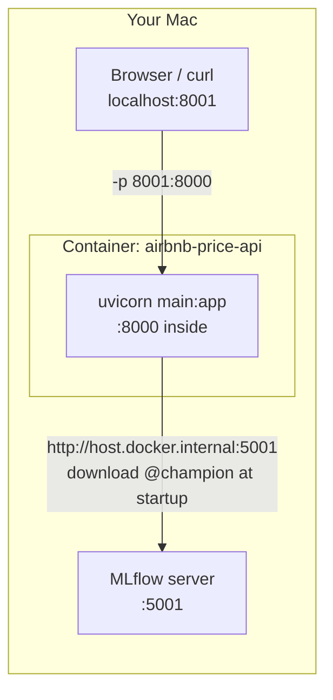

---

### The big decision: keep the model out of the image

There were three options: train during the build, copy a model file in, or do neither. We chose neither. The image holds only code and libraries, and the container downloads `@champion` from MLflow when it starts.

| Approach | What a new model requires | Our choice |
|---|---|---|
| Train inside `docker build` | Rebuilding the image (slow, and the build needs the data) | No |
| Copy `model.pkl` into the image | Rebuilding the image | No |
| Load `@champion` from MLflow at startup | Restarting the container | Yes |

The trade-off is that the container needs to reach the MLflow server when it starts. That's why the fail-fast settings from Task 6 matter, and why Docker Compose (Task 13) starts MLflow first.

---

### Step 1: `requirements-serve.txt`, only what the API needs

The full `requirements.txt` includes training tools (Prefect, pytest, the full MLflow server). The API needs far less, so it gets its own file with the same versions and fewer packages:

```text
# API image only. Versions must match requirements.txt (same sklearn that trained the model).
fastapi==0.141.1
numpy==2.4.6
pandas==3.0.6
pydantic==2.13.5
scikit-learn==1.9.1
uvicorn==0.53.0
mlflow-skinny==3.16.1
# mlflow-skinny doesn't include skops, but MLflow 3 saves our models in skops format.
skops==0.16.0
```

Notes:
- The scikit-learn version matches training, because a model saved by one scikit-learn version may fail to load, or behave differently, in another.
- `mlflow-skinny` is MLflow's lightweight client. It can load models from a server without the tracking server, the UI and the heavy extras of the full `mlflow` package.
- `skops` is explained by the bug in Step 5.

---

### Step 2: `.dockerignore`, to keep the build small and safe

Docker sends the project folder to the build (the "build context"). `.dockerignore` excludes everything the image must never contain:

```
.venv
.git
.dvc/cache
.dvc/tmp
data
models
mlruns
mlartifacts
mlflow.db
mlflow.log
tests
docs
__pycache__
*.pyc
.pytest_cache
```

Without it, Docker would upload the 7 MB dataset, about 700 MB of MLflow artifacts and the whole `.venv` on every build. That's slow, and it risks shipping data inside the image.

---

### Step 3: The `Dockerfile`

```dockerfile
FROM python:3.11-slim

ENV PYTHONDONTWRITEBYTECODE=1 \
    PYTHONUNBUFFERED=1

WORKDIR /app

# Dependencies before code: editing main.py doesn't bust the pip layer cache.
COPY requirements-serve.txt .
RUN pip install --no-cache-dir -r requirements-serve.txt

COPY schemas.py main.py ./

ENV MLFLOW_HTTP_REQUEST_MAX_RETRIES=3 \
    MLFLOW_HTTP_REQUEST_TIMEOUT=10

RUN useradd --create-home appuser
USER appuser

EXPOSE 8000
CMD ["uvicorn", "main:app", "--host", "0.0.0.0", "--port", "8000"]
```

Line by line:

| Line | What it does |
|---|---|
| `FROM python:3.11-slim` | Starts from the official Python 3.11 image on a minimal Debian, the same Python as our `.venv` |
| `PYTHONDONTWRITEBYTECODE=1` | Stops Python writing `.pyc` cache files, which are useless in a container |
| `PYTHONUNBUFFERED=1` | Prints logs immediately, so `docker logs` shows them in real time |
| `WORKDIR /app` | Runs all following commands in `/app` |
| `COPY requirements-serve.txt`, then `RUN pip install` | Installs the libraries before copying the code (see layer caching below) |
| `COPY schemas.py main.py ./` | Copies only the two files the API needs. `features.py`, `train.py` and the rest aren't required to serve |
| `ENV MLFLOW_HTTP_REQUEST_...` | Fails fast if MLflow is unreachable (what we found in Task 6) |
| `useradd` / `USER appuser` | Runs as an ordinary user instead of root, so an attacker who compromised the app wouldn't be root inside the container |
| `EXPOSE 8000` | Documents the port the app listens on |
| `CMD [...]` | What runs when the container starts. `--host 0.0.0.0` is essential, because `127.0.0.1` inside a container can't be reached from outside it |

> [!TIP]
> **Layer caching.** Each Dockerfile instruction creates a layer, and Docker reuses unchanged layers when it rebuilds. Our layers:
> ```
> 506MB   RUN pip install --no-cache-dir -r requirements-serve.txt
> 16.4kB  COPY schemas.py main.py ./
> ```
> Because the code is copied after the libraries, editing `main.py` only rebuilds the 16 KB layer, and the 506 MB install gets reused. If the code were copied first, every one-line edit would reinstall everything.

---

### Step 4: Build the image

```bash
docker build -t airbnb-price-api:local .
```

This reads the `Dockerfile` in `.` (this folder) and names the result `airbnb-price-api` with the tag `local`. The first build took about 50 seconds.

```bash
docker images airbnb-price-api:local --format '{{.Size}}'
# 850MB
```

Almost all of that size is the scientific Python stack, which the model really does need:

| Package | Size |
|---|---|
| scipy | 122 MB |
| pandas | 79 MB |
| scikit-learn | 59 MB |
| numpy | 42 MB (+29 MB libs) |
| mlflow (skinny) | 37 MB |

---

### Step 5: Run it, and the first two surprises

```bash
docker run -d --name airbnb-api -p 8001:8000 \
  -e MLFLOW_TRACKING_URI=http://host.docker.internal:5001 \
  airbnb-price-api:local
```

What the flags mean:

| Flag | Meaning |
|---|---|
| `-d` | Run in the background ("detached") |
| `--name airbnb-api` | A name to refer to the container by |
| `-p 8001:8000` | Mac port 8001 goes to container port 8000 |
| `-e MLFLOW_TRACKING_URI=...` | An environment variable inside the container |
| `host.docker.internal` | Docker Desktop's special name for your Mac, as seen from inside a container. Inside a container, `127.0.0.1` means the container itself, not your Mac |

**The first surprise was `port is already allocated`.** We first tried `-p 8000:8000`:
```
Bind for 0.0.0.0:8000 failed: port is already allocated
```
`docker ps` showed a container from a different project (`ai-engineering-bootcamp-api-1`) already publishing port 8000. It had restarted automatically when Docker Desktop opened. Rather than stop someone else's container, we use Mac port 8001. Inside the container the API still listens on 8000, and only the outside mapping changes.

> [!TIP]
> **Finding who holds a port:** run `lsof -nP -iTCP:8000 -sTCP:LISTEN`. If it says `com.docker.backend`, a container owns the port, and `docker ps` shows which one.

**The second surprise was `No module named 'skops'`.**
```
INFO:     Loading models:/AirbnbPriceModel@champion from http://host.docker.internal:5001
ModuleNotFoundError: No module named 'skops'
ERROR:    Application startup failed. Exiting.
```

We had actually predicted this before building. Checking the dependencies showed that the full `mlflow` package installs `skops` but `mlflow-skinny` doesn't, and since Task 7 MLflow saves our models in the skops format. We built once without it anyway, to see the failure instead of assuming it.

The log proves two other things too:
- The container reached MLflow through `host.docker.internal:5001`, so the networking and the `--allowed-hosts` list work.
- It failed quickly with a clear message instead of hanging.

The fix was to pin `skops==0.16.0` (the venv's exact version) in `requirements-serve.txt`, with a comment explaining why, and rebuild.

---

### Step 6: Check the container

After the rebuild:
```
INFO:     Loading models:/AirbnbPriceModel@champion from http://host.docker.internal:5001
INFO:     Model loaded
INFO:     Application startup complete.
```
It was ready in about 2 seconds.

```bash
curl -s localhost:8001/health
# {"status":"ok","model_uri":"models:/AirbnbPriceModel@champion"}
```

| Listing | From the container | From Task 8 (laptop) |
|---|---|---|
| Midtown entire home | $244.25 | $244.25 |
| Midtown private room | $129.44 | $129.44 |
| Williamsburg entire home | $190.16 | $190.16 |
| Fordham shared room | $38.59 | $38.59 |
| `latitude: -75` | HTTP 422 | HTTP 422 |

The results match to the cent, because it's the same model with the same library versions.

Hygiene checks:
```bash
docker exec airbnb-api whoami          # appuser (not root)
docker exec airbnb-api ls /app         # main.py requirements-serve.txt schemas.py (no data or models)
docker exec airbnb-api printenv MLFLOW_HTTP_REQUEST_MAX_RETRIES MLFLOW_HTTP_REQUEST_TIMEOUT
# 3
# 10
```

Then a fail-fast check, with MLflow unreachable (the wrong port on purpose):
```bash
docker run --name airbnb-api-dead -e MLFLOW_TRACKING_URI=http://host.docker.internal:5999 airbnb-price-api:local
```
```
INFO:     Loading models:/AirbnbPriceModel@champion from http://host.docker.internal:5999
ERROR:    Application startup failed. Exiting.
```
It exited with code 3 after 14 seconds, which is exactly the retry budget we set, instead of the silent four-minute hang we measured in Task 6.

Clean up the test containers:
```bash
docker rm -f airbnb-api airbnb-api-dead
```

---

### Step 7: Commit

```bash
git add requirements-serve.txt Dockerfile .dockerignore
git commit -m "feat: slim Docker image that loads the champion from MLflow at startup"
```

---

### After Task 9

```
NYC-Airbnb-Price-Prediction/
├── Dockerfile                  ← python:3.11-slim, non-root, fail-fast env
├── .dockerignore               ← keeps data, models, venv, tests out of the image
├── requirements-serve.txt      ← API-only deps (+ skops)
└── ... (Task 1 to 8 files)
```

Docker image: `airbnb-price-api:local` (850 MB, of which our code is 16 KB).
To run it:
```bash
docker run -d --name airbnb-api -p 8001:8000 \
  -e MLFLOW_TRACKING_URI=http://host.docker.internal:5001 airbnb-price-api:local
# → http://localhost:8001/docs
```
Commit: `a1b9c73 feat: slim Docker image that loads the champion from MLflow at startup`

---

---

# Task 10: Automated retraining with Prefect

---

### The problem

Right now, retraining means someone runs `python track_experiments.py` and then `python registry.py`, in the right order, and remembers to do it at all. Real models go stale as new listings arrive and prices shift. We want the whole pipeline to run by itself on a schedule. When a step fails (because the data file is briefly unavailable, say), it should retry automatically, and afterwards we should be able to see what happened.

Prefect is an orchestrator. You mark Python functions as tasks and combine them into a flow, and Prefect handles retries, logging, run history and scheduling. The Prefect server keeps that history and shows it in a dashboard.

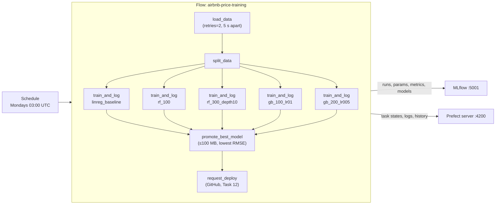

We now have three long-running terminals:

| Terminal | Runs |
|---|---|
| 1 | MLflow server (`:5001`) |
| 2 | Your working terminal |
| 3 | Prefect server (`:4200`) |

---

### Step 1: `scripts/trigger_deploy.py`, the hand-off to CD (tested now, used in Task 12)

The last step of the flow asks GitHub Actions to build and publish a new image. GitHub has an API for "run this workflow now" (a `workflow_dispatch`):

```python
def trigger_deploy(model_version: str, repo: str, token: str, ref: str = "main") -> bool:
    response = requests.post(
        f"https://api.github.com/repos/{repo}/actions/workflows/{WORKFLOW_FILE}/dispatches",
        headers={
            "Accept": "application/vnd.github+json",
            "Authorization": f"Bearer {token}",
            "X-GitHub-Api-Version": "2022-11-28",
        },
        json={"ref": ref, "inputs": {"model_version": str(model_version)}},
        timeout=10,
    )
    # GitHub answers 204 (or 200 when returning run details) on success.
    if response.status_code not in (200, 204):
        print(f"deploy trigger failed: {response.status_code} {response.text}", file=sys.stderr)
        return False
    return True
```

We don't have a GitHub repo yet, so the tests replace `requests.post` with a fake (the same `monkeypatch` trick as the API's fake model) and check what would be sent:

| Test | What it proves |
|---|---|
| `test_trigger_deploy_dispatches_deploy_workflow` | The URL, the `Bearer` token and the `model_version` input are correct |
| `test_trigger_deploy_accepts_200_with_run_details` | Both of GitHub's success codes count as success |
| `test_trigger_deploy_reports_failure` | A `401 Bad credentials` returns `False` instead of pretending it worked |

(Task 12 later changed this function to raise an error instead of returning `False`.)

---

### Step 2: `orchestrate_training.py`, the flow

```python
@task(retries=2, retry_delay_seconds=5)
def load_data():
    return features.clean_data(features.load_data())


@task
def split_data(df):
    return features.split_data(df)


@task
def train_and_log(run_name, splits):
    run_id, metrics = track_experiments.train_and_log(run_name, *splits)
    get_run_logger().info(...)
    return run_id, metrics


@task
def promote_best_model(results):
    run_id = pick_best(results)
    version = register_and_promote(run_id)
    ...
    return version


@task
def request_deploy(version):
    repo, token = os.environ.get("GITHUB_REPO"), os.environ.get("GITHUB_TOKEN")
    if not (repo and token):
        get_run_logger().warning("GITHUB_REPO/GITHUB_TOKEN not set; skipping deploy trigger")
        return False
    return trigger_deploy(version, repo, token)


@flow(name="airbnb-price-training")
def training_flow():
    require_tracking_uri()
    mlflow.set_experiment(EXPERIMENT_NAME)
    splits = split_data(load_data())
    results = {}
    for run_name in track_experiments.CONFIGS:
        run_id, metrics = train_and_log(run_name, splits)
        results[run_id] = metrics
    version = promote_best_model(results)
    request_deploy(version)
    return version
```

How it works:
- The tasks are thin wrappers. All the real logic already exists and has tests: `features.py`, `track_experiments.train_and_log`, and `registry.pick_best` and `register_and_promote`. Prefect adds retries, logging and history around that logic, so nothing is duplicated.
- Only `load_data` has `@task(retries=2, retry_delay_seconds=5)`, because loading data is the step most likely to fail temporarily (a network drive, a slow `dvc pull`). Retrying training wouldn't fix a bug in the code.
- `MLFLOW_TRACKING_URI` comes from the environment through `require_tracking_uri()`, and is never hardcoded.
- The same size-budget rule as Task 8 picks the winner, so an automatic run makes the same choice you made by hand.
- The deploy step is optional. Without GitHub credentials, the flow logs a clear warning and still succeeds.

---

### Step 3: Pre-check where Prefect's server is

```bash
prefect config view
# PREFECT_PROFILE='local'
# PREFECT_API_URL='http://127.0.0.1:4200/api' (from profile)
```

This machine's Prefect profile (left over from an earlier project) already points at a server on port 4200, so even a one-off run needs that server running. It wasn't:

```bash
curl -s http://127.0.0.1:4200/api/health     # connection refused
```

> [!WARNING]
> **The Anaconda trap again.** Anaconda also ships a `prefect` (`/opt/anaconda3/bin/prefect`). In any new terminal, check that `which prefect` points into `.venv/`.

Start the server in terminal 3:
```bash
cd "/Users/kumarshikhar/MLOps Projects/NYC-Airbnb-Price-Prediction"
conda deactivate          # only if the prompt shows (base)
source .venv/bin/activate # new terminal, so activate again
which prefect             # .../.venv/bin/prefect
prefect server start
```

The dashboard is at http://127.0.0.1:4200. The server keeps its history in `~/.prefect/prefect.db`, which is shared across projects, so you'll see runs from earlier projects too.

---

### Step 4: Run the flow by hand first

The rule is to schedule a pipeline only after a manual run works:

```bash
export MLFLOW_TRACKING_URI=http://127.0.0.1:5001
python orchestrate_training.py
```

Output (47 seconds, trimmed):
```
Task run 'load_data-fdf' - Finished in state Completed()
Task run 'split_data-2e8' - Finished in state Completed()
Task run 'train_and_log-c11' - linreg_baseline rmse=83.54 mae=47.08 r2=0.395 size=0.3MB
Task run 'train_and_log-37d' - rf_100 rmse=77.53 mae=43.39 r2=0.479 size=326.0MB
Task run 'train_and_log-524' - rf_300_depth10 rmse=78.75 mae=43.81 r2=0.463 size=39.3MB
Task run 'train_and_log-82f' - gb_100_lr01 rmse=81.13 mae=44.90 r2=0.430 size=3.9MB
Task run 'train_and_log-4bf' - gb_200_lr005 rmse=81.21 mae=44.92 r2=0.429 size=7.4MB
Task run 'promote_best_model-184' - promoted run c12ba16c... as AirbnbPriceModel v2 @champion
Task run 'request_deploy-710' - GITHUB_REPO/GITHUB_TOKEN not set; skipping deploy trigger
Flow run 'loyal-cow' - Finished in state Completed()
note: 2d27675c... has a lower RMSE but is over the 100 MB budget
```

We checked the result separately, rather than trusting the log:
```
@champion -> v2: rf_300_depth10 (run c12ba16c), rmse=78.75, size=39.3MB
prefect flow run: loyal-cow | COMPLETED | 44.5 s
```

> [!TIP]
> Prefect gives every run a random two-word name (`loyal-cow`, `hopeful-llama` and so on), which makes runs easy to tell apart in the dashboard.

---

### Step 5: Check that the retries work

Point the flow at a file that doesn't exist:

```bash
DATA_PATH=nope.csv python orchestrate_training.py
```
```
20:44:15.348 | Task run 'load_data-b32' - ... FileNotFoundError ... - Retry 1/2 will start 5 second(s) from now
20:44:20.357 | Task run 'load_data-b32' - ... FileNotFoundError ... - Retry 2/2 will start 5 second(s) from now
20:44:25.365 | Task run 'load_data-b32' - ... FileNotFoundError ... - Retries are exhausted
20:44:26.400 | Flow run 'russet-piculet' - Finished in state Failed("... No such file or directory: 'nope.csv'")
```

| Check | Result |
|---|---|
| Attempts | 3 (1 try plus 2 retries) |
| Gap between attempts | Exactly 5 seconds (15.3, 20.4, 25.4) |
| Flow outcome | `Failed`, exit code 1, with the real cause shown |
| MLflow before and after | 17 runs and 2 versions both times, so nothing was trained on bad data |

---

### Step 6: Schedule it

```bash
python orchestrate_training.py --serve
```

which calls:
```python
training_flow.serve(name="weekly-retrain", cron="0 3 * * 1")  # Mondays 03:00
```

`.serve()` does two things:
1. It registers a deployment, a named and scheduled version of the flow: `airbnb-price-training/weekly-retrain`.
2. It keeps running, polls the Prefect server for runs that are due, and executes them.

```
Your flow 'airbnb-price-training' is being served and polling for scheduled runs!
To trigger a run for this flow, use the following command:
        $ prefect deployment run 'airbnb-price-training/weekly-retrain'
```

The cron expression `0 3 * * 1` reads as minute 0, hour 3, any day of the month, any month, weekday 1 (Monday). The timezone is empty, which means UTC.

We then triggered one run through the deployment, to check the scheduled path end to end rather than only a direct Python call:

```bash
prefect deployment run 'airbnb-price-training/weekly-retrain'
# Created flow run 'hopeful-llama'.
```
The serving process picked it up, retrained all five models, and finished:
```
promoted run e40349c5... as AirbnbPriceModel v3 @champion
Flow run 'hopeful-llama' - Finished in state Completed()
```

> [!WARNING]
> **The serving process has to keep running for the schedule to fire.** When we stopped it, Prefect paused the schedule cleanly:
> ```
> prefect.runner - Pausing all deployments...
> prefect.runner - All deployments have been paused!
> ```
> A laptop that's asleep at 03:00 on Monday won't retrain anyway. To keep the schedule live on this machine, run `python orchestrate_training.py --serve` in its own terminal (with the venv active and `MLFLOW_TRACKING_URI` exported). In a real deployment, the serving process runs on a server that's always on.

---

### Step 7: Known issue: disk usage grows with every retrain

After four full training rounds, `mlartifacts/` takes up 1.4 GB. Each round saves about 377 MB, and 326 MB of that is `rf_100`, the unlimited-depth forest that the size budget never promotes. On a weekly schedule that adds up to about 20 GB a year.

Possible fixes, which we haven't applied yet:
- Delete old runs that aren't the champion from time to time, then run `mlflow gc` to free their files.
- Drop `rf_100` from the scheduled flow (which changes the five planned configs).
- Cap its depth.

---

### Step 8: Commit

```bash
git add orchestrate_training.py scripts/trigger_deploy.py tests/test_trigger_deploy.py
git commit -m "feat: Prefect training flow with retries, promotion and deploy trigger"
```

---

### After Task 10

```
NYC-Airbnb-Price-Prediction/
├── orchestrate_training.py       ← Prefect flow + --serve schedule
├── scripts/
│   └── trigger_deploy.py         ← asks GitHub to run deploy.yml
├── tests/
│   └── test_trigger_deploy.py    ← 3 tests with a fake HTTP call
└── ... (Task 1 to 9 files)
```

Running: the Prefect server on http://127.0.0.1:4200 (terminal 3).
Prefect deployment: `airbnb-price-training/weekly-retrain`, cron `0 3 * * 1` (UTC), currently paused.
MLflow registry: `@champion` points at v3 (`rf_300_depth10`, promoted automatically by the flow).
Tests: 45 passed with the MLflow server configured.
Commit: `d59e688 feat: Prefect training flow with retries, promotion and deploy trigger`

---

---

# Task 11: GitHub Actions CI

---

### The problem

Our 45 tests only protect us if someone runs them. People forget, or they run them against a server they've tweaked by hand. Continuous integration (CI) runs the tests automatically on a clean machine for every proposed change, and marks the pull request with a pass or fail before anything is merged.

GitHub Actions is GitHub's built-in CI. A YAML file in `.github/workflows/` says when to run (when a pull request is opened or updated) and what to run.

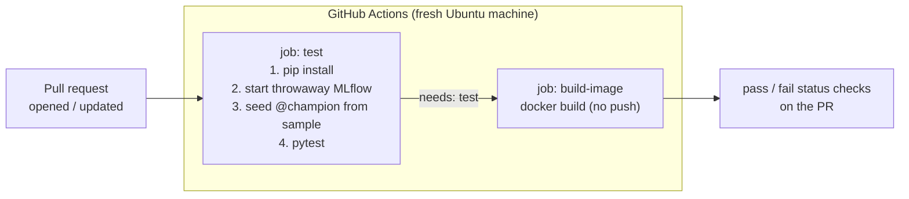

The tricky part is that our tests include real-registry tests that need an MLflow server with a `@champion`, and training needs data. But the runner is a brand-new machine with no MLflow server and no access to the DVC remote on this laptop. So the workflow builds everything it needs from scratch every time:
- a throwaway MLflow server, started inside the job
- a quick champion, trained on the committed 2,000-row sample (Task 3) by `scripts/ci_seed_model.py`

---

### Step 1: `scripts/ci_seed_model.py`

```python
def main():
    require_tracking_uri()
    mlflow.set_experiment(EXPERIMENT_NAME)
    run_id, metrics = train_and_log("linreg_baseline", *split_data(clean_data(load_data())))
    version = register_and_promote(run_id)
    print(f"seeded AirbnbPriceModel v{version} @champion (rmse={metrics['rmse']:.2f})")
```

It reuses exactly the same `train_and_log` and `register_and_promote` as the real pipeline, with no CI-only shortcuts. `load_data()` reads `$DATA_PATH`, which CI points at the sample. It uses LinearRegression because that trains fastest, and CI only checks that the plumbing works, not which model is best.

Run it as a module from the project root with `python -m scripts.ci_seed_model` (see the `-m` note in Task 3).

---

### Step 2: `.github/workflows/ci.yml`

```yaml
name: CI

on:
  pull_request:

jobs:
  test:
    runs-on: ubuntu-latest
    env:
      MLFLOW_TRACKING_URI: http://127.0.0.1:5000
      # The DVC remote lives on a laptop; CI trains on the committed sample.
      DATA_PATH: tests/fixtures/listings_sample.csv
      MLFLOW_DISABLE_AGENT_HINT: "1"
    steps:
      - uses: actions/checkout@v7
      - uses: actions/setup-python@v7
        with:
          python-version: "3.11"
          cache: pip
      - run: pip install -r requirements.txt
      - name: Start ephemeral MLflow server
        run: |
          mlflow server --backend-store-uri sqlite:///mlflow.db \
            --artifacts-destination ./mlartifacts \
            --host 127.0.0.1 --port 5000 > mlflow.log 2>&1 &
          for i in $(seq 1 60); do
            curl -sf http://127.0.0.1:5000/health && exit 0
            sleep 2
          done
          cat mlflow.log
          exit 1
      - name: Seed AirbnbPriceModel@champion
        run: python -m scripts.ci_seed_model
      - run: pytest -v

  build-image:
    needs: test
    runs-on: ubuntu-latest
    steps:
      - uses: actions/checkout@v7
      - uses: docker/setup-buildx-action@v4
      - uses: docker/build-push-action@v7
        with:
          context: .
          push: false
          tags: airbnb-price-api:ci
          cache-from: type=gha
          cache-to: type=gha,mode=max
```

Reading it:

| Part | Meaning |
|---|---|
| `on: pull_request` | Runs whenever a PR is opened or gets new commits. A plain push to `main` runs nothing |
| `runs-on: ubuntu-latest` | A fresh Linux virtual machine that's thrown away afterwards |
| `env:` (job level) | Environment variables for every step. Port 5000 is fine here, since GitHub's Linux machines don't have AirPlay |
| `actions/checkout` | Downloads the repo's code onto the machine |
| `setup-python` + `cache: pip` | Installs Python 3.11 and caches downloaded packages between runs, keyed on `requirements.txt` |
| `mlflow server ... &` | The `&` runs the server in the background so the job can carry on |
| The `for` loop | Waits until the server is actually ready by polling `/health`, instead of guessing with `sleep 30`. If the server never comes up, it prints the server log and fails the job, so the error message is useful |
| `needs: test` | `build-image` only starts if `test` passed, since there's no point building an image from broken code |
| `push: false` | Builds the image to prove the `Dockerfile` works, but doesn't publish it. Publishing unreviewed PR code would be risky, so that's left to Task 12's controlled job |
| `cache-from/to: type=gha` | Stores Docker layers in GitHub's cache so later builds can reuse them |

> [!TIP]
> **Use current action versions.** Our original plan listed `checkout@v4`, `setup-python@v5` and so on. Before writing the file we checked each action's latest major version (`git ls-remote --tags https://github.com/actions/checkout.git`) and found newer ones: `checkout@v7`, `setup-python@v7`, `setup-buildx-action@v4` and `build-push-action@v7`. Old versions eventually stop working when GitHub retires the runtime they depend on.

---

### Step 3: Rehearse CI locally first

Pushing and then waiting minutes to find a typo is slow. So we ran the same steps on the laptop against a throwaway server in a temporary folder, on port 5055 so the real MLflow on 5001 wasn't touched:

```bash
T=$(mktemp -d)
(cd "$T" && exec mlflow server --backend-store-uri sqlite:///mlflow.db \
   --artifacts-destination ./mlartifacts --host 127.0.0.1 --port 5055 > mlflow.log 2>&1) &
until curl -sf http://127.0.0.1:5055/health >/dev/null; do sleep 2; done

export MLFLOW_TRACKING_URI=http://127.0.0.1:5055 DATA_PATH=tests/fixtures/listings_sample.csv
python -m scripts.ci_seed_model
pytest -q

pkill -f "mlflow server.*--port 5055"; rm -rf "$T"
```
```
seeded AirbnbPriceModel v1 @champion (rmse=93.98)
45 passed
```

All 45 passed and none were skipped, so the real-registry tests ran against the seeded champion. The model trained on the sample has a worse RMSE ($93.98) than the one trained on the full data ($83.54), as you'd expect with less data. That's fine, because it only needs to pass the "Manhattan costs more than the Bronx" and "$10 to $800" sanity checks.

> [!TIP]
> **The parentheses matter.** `(cd "$T" && exec mlflow server ...) &` runs the `cd` inside a background subshell, so your own terminal stays in the project folder. Without them, a later `cd -` would jump somewhere unexpected. We caught exactly this bug in the plan during the Task 3 audit.

---

### Step 4: Review what you're publishing before going public

The repository is public, so before the first push we checked exactly what would be uploaded:

| Check | Result |
|---|---|
| Tracked files | 37, all code, config and docs |
| Dataset | Not included, only the `.dvc` pointer file (DVC's job) |
| Largest file | `tests/fixtures/listings_sample.csv`, 142 KB, model columns only (no names or IDs) |
| Secrets / tokens | None found |
| Commit author email | A problem: the personal Gmail address was on every commit, and GitHub shows it publicly |
| Local paths | `/Users/kumarshikhar/...` in 7 places (low risk) |

We fixed the email before the first push. GitHub gives every account a private "noreply" address, `<account-id>+<username>@users.noreply.github.com`, and the account ID is public (`https://api.github.com/users/<username>` → `id`):

```bash
# 1. Use the noreply address for THIS repository only (other projects unaffected)
git config user.email "44173053+shikharkumar13@users.noreply.github.com"

# 2. Rewrite the author/committer email on all existing local commits
FILTER_BRANCH_SQUELCH_WARNING=1 git filter-branch -f --env-filter \
  "export GIT_AUTHOR_EMAIL='44173053+shikharkumar13@users.noreply.github.com' \
          GIT_COMMITTER_EMAIL='44173053+shikharkumar13@users.noreply.github.com'" -- --all

# 3. Remove filter-branch's local backup of the old commits
git update-ref -d refs/original/refs/heads/main
git reflog expire --expire=now --all && git gc -q --prune=now
```

Afterwards we checked that:
- the file contents were identical before and after (the same Git tree), so only the author details changed
- no Gmail references were left in the history

> [!WARNING]
> **Rewriting history is only safe before you push.** It gives every commit a new ID (hash). Nobody had a copy yet, so this was harmless. After pushing, rewriting would break everyone else's copy, and the old commits would already be public. It also changed the commit hashes quoted in this log, so we updated those too.

---

### Step 5: Connect and push

```bash
git remote add origin https://github.com/shikharkumar13/-NYC-Airbnb-Price-Prediction-MLOps.git
git push --dry-run -u origin main   # checks your login without uploading anything
git push -u origin main
```
```
 * [new branch]      main -> main
branch 'main' set up to track 'origin/main'.
```

What these do:
- `remote add origin` saves the GitHub address under the short name `origin`.
- `--dry-run` goes through authentication and shows what would happen. On this Mac, Homebrew's git uses the macOS Keychain (`credential.helper = osxkeychain`), which already held a GitHub login.
- `-u` links the local `main` to `origin/main`, so a plain `git push` or `git pull` later knows where to go.

---

### Step 6: A real pull request

CI only runs on pull requests, so we made a small but useful change on a new branch (README sections explaining the tests and CI) and pushed it:

```bash
git switch -c ci-smoke-test
# ... edit README.md ...
git commit -am "docs: README sections for tests and CI"
git push -u origin ci-smoke-test
```

Then on GitHub: Compare & pull request → Create pull request, which opened PR #1.

We watched the result live through GitHub's API:

| Job | Result | Time | Slowest steps |
|---|---|---|---|
| test | Success | 2 m 31 s | `pip install` 55 s · `pytest -v` 58 s · MLflow start 12 s · seed 12 s |
| build-image | Success | 1 m 16 s | `docker build` 58 s |

Every step of `test` succeeded: the MLflow server started, `@champion` was seeded, and `pytest -v` passed. The PR page showed both checks green.

Pushing another commit to the PR ran CI again, and this time the caches helped:

| Job | First run | Second run (cached) |
|---|---|---|
| test | 2 m 31 s (pip install 55 s) | 2 m 05 s (pip install 43 s) |
| build-image | 1 m 16 s | 31 s, with the Docker layers reused from GitHub's cache |

The Docker build time halved because the 506 MB dependency layer from Task 9 hadn't changed and was reused.

After merging, GitHub's "Delete branch" button removes the PR branch on GitHub. Locally, `git fetch --prune` followed by `git branch -d <branch>` tidies up.

> [!TIP]
> **See the logs yourself.** On the PR, click Details next to a check, then the test job, then the Run pytest -v step. You'll find `tests/test_model_registry.py ... PASSED`, which proves the registry tests really ran in CI. (They only skip when `MLFLOW_TRACKING_URI` is unset, and CI sets it.) GitHub only shows job logs to signed-in users.

---

### After Task 11

```
NYC-Airbnb-Price-Prediction/
├── .github/workflows/
│   └── ci.yml                  ← test + build-image on every PR
├── scripts/
│   └── ci_seed_model.py        ← CI-only: train on sample, promote @champion
└── ... (Task 1 to 10 files)
```

GitHub: https://github.com/shikharkumar13/-NYC-Airbnb-Price-Prediction-MLOps
Commit identity for this repo: `44173053+shikharkumar13@users.noreply.github.com`
PR #1: `ci-smoke-test` into `main`, both checks passing.

---

---

# Task 12: Continuous deployment to Docker Hub

---

### The problem

CI (Task 11) checks every change. Continuous deployment (CD) ships it: it builds the API image and publishes it to a registry (Docker Hub here) that any server can pull from. In MLOps, a new release can come from new code, and it can also come from a new model. So the loop we want is:

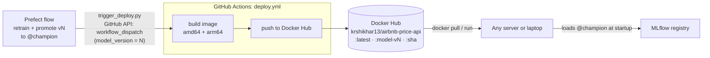

The image itself still contains no model (Task 9). The `model-vN` tag records which promotion caused the release.

---

### Step 1: `.github/workflows/deploy.yml`

```yaml
name: Deploy

on:
  workflow_dispatch:
    inputs:
      model_version:
        description: "AirbnbPriceModel version just promoted to @champion"
        required: true
        type: string

jobs:
  build-and-push:
    runs-on: ubuntu-latest
    steps:
      - uses: actions/checkout@v7
      # QEMU lets this amd64 runner also build the arm64 (Apple Silicon) image.
      - uses: docker/setup-qemu-action@v4
      - uses: docker/setup-buildx-action@v4
      - uses: docker/login-action@v4
        with:
          username: ${{ secrets.DOCKERHUB_USERNAME }}
          password: ${{ secrets.DOCKERHUB_TOKEN }}
      - uses: docker/build-push-action@v7
        with:
          context: .
          # One tag, two builds: Docker picks the right one for each machine.
          platforms: linux/amd64,linux/arm64
          push: true
          tags: |
            ${{ secrets.DOCKERHUB_USERNAME }}/airbnb-price-api:latest
            ${{ secrets.DOCKERHUB_USERNAME }}/airbnb-price-api:model-v${{ inputs.model_version }}
            ${{ secrets.DOCKERHUB_USERNAME }}/airbnb-price-api:${{ github.sha }}
          labels: |
            org.opencontainers.image.revision=${{ github.sha }}
            airbnb.model-version=${{ inputs.model_version }}
          cache-from: type=gha
          cache-to: type=gha,mode=max
```

Reading it:

| Part | Meaning |
|---|---|
| `on: workflow_dispatch` | Only runs when asked, from the Actions tab or through GitHub's API, and never on every push |
| `inputs.model_version` | A value passed in when the workflow is triggered, used in a tag and a label |
| `secrets.DOCKERHUB_...` | Encrypted values stored in the repo settings, which GitHub hides in logs |
| `login-action` | Logs in to Docker Hub with the token (never a password) |
| `push: true` | Unlike CI, this job publishes |
| Three tags | `latest` is the newest release, `model-vN` records which champion triggered it, and `<sha>` pins the exact code |
| `labels` | Metadata baked into the image itself, which `docker image inspect` shows |

> [!TIP]
> **A `workflow_dispatch` workflow has to be on the default branch** before anyone can trigger it. That's why `deploy.yml` went through a PR (#2) and was merged first.

---

### Step 2: Secrets for the Docker Hub token

You do this yourself in the browser, so tokens never pass through code or chat:

1. On hub.docker.com, go to Account settings → Personal access tokens → Generate new token, with Read & Write access. Copy it straight away, because it's only shown once.
2. In the GitHub repo, go to Settings → Secrets and variables → Actions → New repository secret, and add:
   - `DOCKERHUB_USERNAME` = `krshikhar13`
   - `DOCKERHUB_TOKEN` = the token

---

### Step 3: First deploy, by hand

Go to Actions → Deploy → Run workflow, with the branch `main` and `model_version` set to `3` (the champion at the time).

The result on Docker Hub:
```
latest                                    pushed 16:16:11 UTC
model-v3                                  pushed 16:16:13 UTC
9f00579b44ef1469ad8de6e3afff3d28a4f2ccb3  pushed 16:16:15 UTC   ← = main's commit
```
It's a 180 MB compressed download (about 850 MB unpacked).

> [!WARNING]
> **API rate limits.** While watching runs, we polled GitHub's API every 20 to 30 seconds without logging in and hit the limit of 60 requests an hour for anonymous calls (`remaining 0/60`). Poll gently (once a minute), stop watchers you no longer need, or authenticate.

---

### Step 4: The platform surprise, `no matching manifest for linux/arm64`

Pulling the published image on the Mac failed:
```
docker pull krshikhar13/airbnb-price-api:model-v3
no matching manifest for linux/arm64/v8 in the manifest list entries
```

GitHub's runners are Intel/AMD (`amd64`), so the image had only been built for `amd64`, and this Mac is Apple Silicon (`arm64`). It could run with `--platform linux/amd64`, with Docker Desktop emulating an Intel CPU more slowly, but a plain `docker pull` fails for anyone on Apple Silicon.

The fix (PR #3) was to build a multi-architecture image, using `setup-qemu-action` (an emulator that lets the amd64 runner build arm64 as well) plus `platforms: linux/amd64,linux/arm64`. One tag now points at two builds, and Docker picks the right one automatically. The cost is that a deploy went from about 1 minute to about 5, because the arm64 half is built under emulation.

---

### Step 5: Let the flow trigger deploys with a GitHub token

`scripts/trigger_deploy.py` (Task 10) calls GitHub's API, which needs a token.

Go to GitHub → Settings → Developer settings → Personal access tokens → Fine-grained tokens → Generate new token, and set:
- Repository access: Only select repositories, then this repo
- Repository permissions: Actions, Read and write

Only use it from your own terminal:
```bash
export MLFLOW_TRACKING_URI=http://127.0.0.1:5001
export GITHUB_REPO=shikharkumar13/-NYC-Airbnb-Price-Prediction-MLOps
export GITHUB_TOKEN=<your fine-grained token>
python orchestrate_training.py
```

---

### Step 6: A silent failure, found and fixed

The first full run looked perfect:
```
promoted run 3f9000a1... as AirbnbPriceModel v4 @champion
Flow run 'gabby-coot' - Finished in state Completed()
```
But no deploy showed up on GitHub. Here's how we tracked it down:

1. The Prefect log had no "skipping deploy trigger" warning, so the environment variables were set and GitHub was called.
2. GitHub showed no new run, so GitHub had refused the request.
3. Yet `request_deploy` said COMPLETED, because `trigger_deploy` only printed the error to the terminal and returned `False`. Prefect never found out.

The terminal showed the actual cause:
```
403 Resource not accessible by personal access token
```
The fine-grained token didn't have Actions: Read and write. Fine-grained tokens start with no permissions, and each one has to be granted explicitly. We fixed it by editing the token's permissions.

| Error | Usual cause |
|---|---|
| `401 Bad credentials` | The token isn't exported in that terminal, has expired, or was copied incompletely |
| `403 Resource not accessible by personal access token` | The token lacks Actions: Read and write (our case) |
| `404 Not Found` | The token wasn't granted this repo, or there's a typo in `GITHUB_REPO` (ours starts with `-`) |

The code fix (PR #4) was written test-first, so that a failed trigger fails loudly:

```python
class DeployTriggerError(RuntimeError):
    """GitHub refused to start the deploy workflow."""

...
    if response.status_code not in (200, 204):
        raise DeployTriggerError(
            f"GitHub refused to start {WORKFLOW_FILE} for {repo}: "
            f"{response.status_code} {response.text}"
        )
    return True
```

New tests:

| Test | What it proves |
|---|---|
| `test_trigger_deploy_raises_with_githubs_reason` | A 403 raises, and the message includes GitHub's reason |
| `test_request_deploy_task_fails_when_github_rejects` | The real Prefect `request_deploy` task (called through `.fn`) raises, so the flow ends Failed with the reason in Prefect's log |

> [!TIP]
> **The lesson:** "return `False` and print something" is how errors get lost in automated systems, because nobody reads the terminal of a scheduled job at 03:00. In a pipeline, failures should raise, so the orchestrator records them.

---

### Step 7: Check the published multi-arch image

After the permission fix, `python -m scripts.trigger_deploy --model-version 4` started a deploy that took 4 m 53 s and built both architectures:

```
latest     archs ['amd64', 'arm64']
model-v4   archs ['amd64', 'arm64']
f664d6b…   archs ['amd64', 'arm64']
```

Then the real test, doing what a user would do, with no `--platform` flag:
```bash
docker pull krshikhar13/airbnb-price-api:latest        # works now; Docker picked arm64
docker run -d --name airbnb-hub -p 8001:8000 \
  -e MLFLOW_TRACKING_URI=http://host.docker.internal:5001 \
  krshikhar13/airbnb-price-api:latest
```
```
local arch=arm64 | model-version label=4 | revision=f664d6b
INFO:     Loading models:/AirbnbPriceModel@champion from http://host.docker.internal:5001
INFO:     Model loaded
Midtown entire home -> {"predicted_price":244.25,"currency":"USD"}
```
It was ready in about 2 seconds, running natively, with the same prediction as every earlier check.

---

### Step 8: The full loop, where the flow deploys by itself

A one-off command started the deploy in Step 7. The real goal is that nobody has to click anything: the flow promotes a model and then triggers the deploy itself. So we did one more run in the same terminal:

```bash
git pull                        # includes the loud-failure fix (PR #4)
python orchestrate_training.py
```

| Time (UTC) | What happened | Where |
|---|---|---|
| 17:26:47 | Flow `ruby-aardwolf` starts retraining | Prefect |
| 17:27:29 | `promoted run b5f34b8e... as AirbnbPriceModel v5 @champion` | Prefect → MLflow |
| 17:27:29 | `request_deploy` COMPLETED, with no warning and no error | Prefect |
| 17:27:30 | Deploy run created with `model_version = 5` | GitHub Actions |
| 17:27:57 | `model-v5` pushed for `amd64` and `arm64` | Docker Hub |

That deploy only took 35 seconds, compared with about 5 minutes for v4. The code hadn't changed, so every Docker layer came from GitHub's build cache, and the job mostly just added the new `model-v5` tag.

Docker Hub afterwards:
```
latest     pushed 17:27:55 UTC  archs ['amd64', 'arm64']
model-v5   pushed 17:27:57 UTC  archs ['amd64', 'arm64']
model-v4   pushed 17:20:33 UTC  archs ['amd64', 'arm64']
```

---

### After Task 12

```
NYC-Airbnb-Price-Prediction/
├── .github/workflows/
│   ├── ci.yml                  ← PRs: test + build
│   └── deploy.yml              ← on demand: build amd64+arm64, push to Docker Hub
├── scripts/
│   └── trigger_deploy.py       ← raises DeployTriggerError if GitHub refuses
└── ... (Task 1 to 11 files)
```

GitHub secrets: `DOCKERHUB_USERNAME` and `DOCKERHUB_TOKEN`.
In your terminal only: `GITHUB_TOKEN` (fine-grained, this repo, Actions: Read and write) and `GITHUB_REPO`.
Docker Hub: `krshikhar13/airbnb-price-api` with the tags `latest`, `model-v3`, `model-v4` and `model-v5`, plus commit-SHA tags.
MLflow: `@champion` points at v5.
Tests: 46 passed.
PRs merged: #2 (the deploy workflow), #3 (multi-arch) and #4 (fail loudly).

---

# Task 13: MLflow and the API together with Docker Compose

*(Optional. We skipped it at first, then added it at the end, after Task 14.)*

---

### The problem

Running the stack by hand meant keeping a terminal open for `mlflow server` with a long list of flags, then starting the API with a separate `docker run` with the right port and `MLFLOW_TRACKING_URI`, in the right order. Docker Compose describes all of that in one file, `docker-compose.yml`, and starts it with one command. It also handles the ordering: the API must not start before MLflow is ready, or it has nowhere to load its model from.

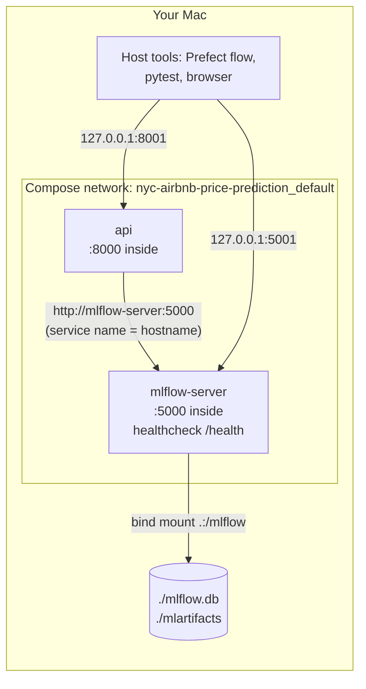

---

### Step 1: The decision to reuse the existing MLflow data

| Option | Trade-off |
|---|---|
| Reuse `./mlflow.db` and `./mlartifacts` (chosen) | All the runs, v1 to v5 and `@champion` carry over. Compose simply replaces the MLflow terminal, and host tools keep using `http://127.0.0.1:5001` unchanged. You have to stop the host server first |
| A fresh Docker volume | Clean and isolated, but empty. The flow would have to run first to create a champion, and you'd end up with two separate MLflow histories |

> [!WARNING]
> **Never run two MLflow servers on the same SQLite file.** SQLite is a single file with simple locking, and two servers writing to it at once can corrupt it. So we stopped the host `mlflow server` (terminal 1) with Ctrl-C before starting Compose.

We backed up first. Before anything touched the data, we took a consistent snapshot with SQLite's online backup API (which is safe even while the server is running) into `~/mlflow-backups/nyc-airbnb/`, and checked it:
```
integrity: ok | registered versions: 5 | aliases: [('champion', 5)]
```

The container uses the same MLflow version. A different server version might try to migrate the database schema, so we checked that the official image for our exact version exists for Apple Silicon, and what it contains:
```
ghcr.io/mlflow/mlflow:v3.16.1 exists | platforms: ['linux/amd64', 'linux/arm64']
mlflow 3.16.1 | python 3.11.15
```

---

### Step 2: `docker-compose.yml`

```yaml
services:
  mlflow-server:
    image: ghcr.io/mlflow/mlflow:v3.16.1   # same version as requirements.txt, so same DB schema
    command: >
      mlflow server
      --backend-store-uri sqlite:////mlflow/mlflow.db
      --artifacts-destination /mlflow/mlartifacts
      --host 0.0.0.0 --port 5000
      --allowed-hosts "localhost:*,127.0.0.1:*,mlflow-server:*"
    volumes:
      # The whole folder, not just mlflow.db: SQLite writes its journal file
      # next to the database, and that must land on disk, not in the container.
      - .:/mlflow
    ports:
      - "5001:5000"   # host 5001: macOS AirPlay Receiver holds 5000
    healthcheck:
      # The MLflow image has Python but not necessarily curl.
      test: ["CMD", "python", "-c", "import urllib.request; urllib.request.urlopen('http://localhost:5000/health')"]
      interval: 10s
      timeout: 5s
      retries: 10
      start_period: 30s

  api:
    build: .
    image: airbnb-price-api:local
    environment:
      MLFLOW_TRACKING_URI: http://mlflow-server:5000
    ports:
      - "8001:8000"   # host 8000 is used by another project's container
    depends_on:
      mlflow-server:
        condition: service_healthy   # don't race MLflow's startup
    restart: on-failure
```

Reading it:

| Part | Meaning |
|---|---|
| `services:` | Each entry becomes a container, and Compose puts them all on one private network |
| `image: ghcr.io/mlflow/mlflow:v3.16.1` | The official MLflow image, pinned to our exact version |
| `sqlite:////mlflow/mlflow.db` | Four slashes: `sqlite:///` followed by the absolute path `/mlflow/mlflow.db` |
| `volumes: - .:/mlflow` | A bind mount: this project folder appears inside the container at `/mlflow` |
| `ports: "5001:5000"` | `host:container`. You reach MLflow from the Mac on 5001, and inside the network it's still 5000 |
| `healthcheck` | Every 10 s, Docker calls MLflow's `/health` endpoint, and once that succeeds the container is `healthy` |
| `build: .` + `image:` | Builds the API from our `Dockerfile` and names it `airbnb-price-api:local`, the same name as in Task 9 |
| `MLFLOW_TRACKING_URI: http://mlflow-server:5000` | Inside the network, a service's name is its hostname. This is still the one setting every component reads |
| `depends_on: condition: service_healthy` | Holds the API back until MLflow is healthy, and not merely started, because a started server may still be loading |
| `restart: on-failure` | If the API exits with an error (because MLflow went away, for example), Docker restarts it |

> [!TIP]
> **Why mount the folder and not just `mlflow.db`?** When SQLite saves changes, it writes a temporary journal file next to the database. If only the `.db` file were mounted, the journal would live inside the container, and a crash mid-write could leave the database damaged. Mounting the folder keeps the database and its journal together on your disk.

Check the file before running anything:
```bash
docker compose config --quiet && echo "compose file valid"
```
`docker compose config` also shows how Compose parsed the command. The `--allowed-hosts` value arrives as one clean argument, `localhost:*,127.0.0.1:*,mlflow-server:*`, without the quote marks.

---

### Step 3: Start it and watch the ordering

```bash
docker compose up -d --build
```
```
 Container ...-mlflow-server-1 Started
 Container ...-mlflow-server-1 Waiting
 Container ...-mlflow-server-1 Healthy
 Container ...-api-1 Starting
 Container ...-api-1 Started
```

| Event | Time (UTC) |
|---|---|
| mlflow-server started | 17:51:48 |
| mlflow-server's first healthy check | 17:51:53 |
| api started | 17:51:53 |

The API started in the same second that MLflow became healthy, and not before.

```bash
docker compose logs api
```
```
INFO:     Loading models:/AirbnbPriceModel@champion from http://mlflow-server:5000
INFO:     Model loaded
INFO:     Application startup complete.
```

---

### Step 4: Check it

| Check | Result |
|---|---|
| `POST localhost:8001/predict` (Midtown entire home) | $244.25, the same as every earlier check |
| History carried over | 25 finished runs, versions `[1, 2, 3, 4, 5]`, `{'champion': '5'}` |
| Host tools unchanged (`MLFLOW_TRACKING_URI=http://127.0.0.1:5001`) | The champion loads, and `pytest` gives 46 passed |
| Writes through the Compose server land on your disk | A test artifact at `mlartifacts/2/…/check.txt`, owned by your user (uid 501) and not by root |
| `docker compose down`, then `up -d` | Still `@champion` = v5 and still $244.25, because the data lives on disk and not in the containers |

The write check matters because the weekly Prefect flow writes new runs and models. The MLflow container runs as root, but Docker Desktop on macOS maps files written to a bind mount back to your own user, so they stay normal files you can manage. (We used a throwaway experiment, `compose-write-check`, and soft-deleted it afterwards.)

---

### Step 5: Everyday commands

```bash
docker compose up -d            # start both (API waits for MLflow)
docker compose ps               # status + health
docker compose logs -f api      # follow the API's logs
docker compose restart api      # after promoting a new champion: reload the model
docker compose down             # stop and remove containers (data stays on disk)
```

The Prefect flow works exactly as before, still pointing at `http://127.0.0.1:5001`. After it promotes a new champion, `docker compose restart api` makes the local API serve it.

---

### After Task 13

```
NYC-Airbnb-Price-Prediction/
├── docker-compose.yml     ← mlflow-server + api, healthcheck-gated
└── ... (all earlier files)
```

It replaces terminal 1 (`mlflow server …`) and the separate `docker run` for the API.
Backup: `~/mlflow-backups/nyc-airbnb/mlflow-before-compose-20260924-2320.db`

---

---

# Task 14: Definition of done and the README

---

### The problem

"It worked when we built it" isn't the same as "it works now". Later changes (the skops fix, the size budget, the loud-failure fix, the multi-arch build) could have broken something earlier. So at the end we checked every definition-of-done item again against the current state, not from memory, and rebuilt the project from GitHub alone.

---

### Step 1: Check every definition-of-done item again

| Requirement | How we checked it (final state) | Result |
|---|---|---|
| Task 4: baseline metrics printed and sane | `python train.py` | RMSE 83.545, MAE 47.077, R² 0.395, in the tens of dollars |
| Task 7: all 5 runs in MLflow with params and metrics | Queried every config's latest `FINISHED` run | All 5 present with params and `rmse`, `mae`, `r2` and `model_size_mb` (25 finished runs in total across the retrains) |
| Task 8: a separate process loads `@champion` | A new Python process runs `load_model("models:/AirbnbPriceModel@champion")` | `@champion` is v5, a `TransformedTargetRegressor` predicting $244.25 |
| Tests: everything passes | `MLFLOW_TRACKING_URI=... pytest` | 46 passed |
| Tests: breaking a constraint really fails | Loosened `availability_365` to `le=400` (a different rule from the one in Task 5) | `FAILED test_invalid_value_is_rejected[availability_365-366]` with `DID NOT RAISE`. After restoring it, 14 passed |
| Task 11: a real PR shows CI running | GitHub check-runs for every merged PR | PRs #1 to #4 all show `test=success` and `build-image=success` |

---

### Step 2: Rebuild from GitHub alone

The strongest proof that a project is complete is a fresh clone from GitHub (not the laptop folder), with nothing else:

```bash
git clone https://github.com/shikharkumar13/-NYC-Airbnb-Price-Prediction-MLOps.git
cd -- -NYC-Airbnb-Price-Prediction-MLOps
dvc pull
python train.py
pytest
```
```
cloned main @ f664d6b, 36 files
dvc pull ok: f772a1d8d29bae6e7a9beac0ae880a2b      ← same MD5 as Task 2
rows after cleaning: 48464  (train=38771, test=9693)
rmse: 83.545                                      ← reproduces Task 4 exactly
43 passed, 3 skipped                              ← registry tests skip without a server
3 passed                                          ← …and pass when pointed at MLflow
```

> [!TIP]
> **About `cd -- -NYC-...`:** the repo name starts with a hyphen, so a plain `cd -NYC-...` would be read as an option. `--` means "end of options".

---

### Step 3: Tidy up GitHub

The branches from PRs #2 to #4 were still on GitHub after merging. Before deleting each one, we checked that it was fully contained in `main`:

```bash
git merge-base --is-ancestor origin/<branch> origin/main && git push origin --delete <branch>
```

---

### Step 4: The README

`README.md` is the repo's front page, written for someone who has never seen the project. It covers:
- what the project does, with a Mermaid diagram of the whole loop
- the results table and the champion rule (100 MB or less, lowest RMSE)
- the main decisions: the log target inside the model, the cleaning thresholds, the high-cardinality `neighbourhood` column, and keeping the model out of the image
- the project layout, setup (including the Anaconda trap), how to run each part, the tests, and CI/CD
- the known limitations, stated honestly

The detailed explanations stay here in `implementation.md`, and the README links to it.

---

---

# Wrap-up: what we built, and what we learned

### The finished system

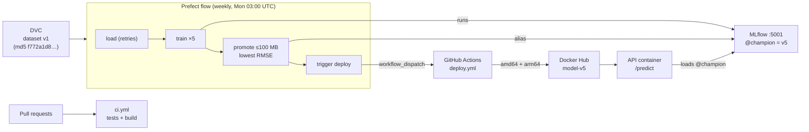

Final numbers: 46 tests, 6 PRs merged with passing CI, `@champion` = v5 (`rf_300_depth10`, RMSE $78.75), the image `krshikhar13/airbnb-price-api` for amd64 and arm64, and a local stack started with `docker compose up -d`.

### The real problems we hit, and what each one teaches

| # | Problem | Lesson |
|---|---|---|
| 1 | A test used a relative path and failed from another folder (Task 3) | Build paths from `__file__`, not from the current directory |
| 2 | An `httpx` deprecation warning (Task 6) | Read warnings, because they turn into errors later |
| 3 | The API froze silently for 4 minutes when MLflow was down (Task 6) | Log before slow calls, and set retry limits so failures are fast and clear |
| 4 | Anaconda's `mlflow` and `prefect` shadowed the venv's copies (Tasks 7, 10) | Run `which <tool>` before trusting a command |
| 5 | AirPlay held port 5000, and another project held 8000 (Tasks 7, 9) | Check `lsof -iTCP:<port>` before binding, and don't kill what isn't yours |
| 6 | skops refused the tree models (`UntrustedTypesFoundException`) (Task 7) | Test every variant you use, and trust only the exact type you need |
| 7 | A `grep` pipe hid a crash behind exit code 0 (Task 7) | Check the real program's exit code |
| 8 | The best model was 326 MB (Task 8) | The best metric isn't the only criterion, so write trade-offs down as explicit rules |
| 9 | Registration went through an MLflow 3 fallback (Task 8) | Treat fallback warnings as bugs and use the current API |
| 10 | `mlflow-skinny` didn't include `skops` (Task 9) | Check a slim image's dependencies explicitly |
| 11 | A personal email was about to go public (Task 11) | Review what you publish before the first push |
| 12 | We hit GitHub's API rate limit (Task 12) | Poll gently, and stop watchers you don't need |
| 13 | The image didn't run on Apple Silicon (Task 12) | Build for the platforms your users actually have |
| 14 | The deploy trigger failed with a 403, but the flow said "Completed" (Task 12) | In a pipeline, failures must raise instead of printing |
| 15 | Moving MLflow into Compose risked two servers on one SQLite file (Task 13) | Back up first, stop the old server, pin the same server version, and mount the folder so SQLite's journal stays on disk |

### Where to go next

- Clean up artifacts automatically (delete old runs that aren't the champion, along with their logged models, then run `mlflow gc`; `airbnb_mlops_guide.md`, Appendix E has a tested recipe), or drop or cap the 326 MB forest.
- Add better features. The data has no size, bedroom or amenity information, which caps accuracy (R² of about 0.46).
- Move to shared infrastructure: a DVC remote on S3, a hosted MLflow server, and the Prefect flow on a machine that's always on.
- Add monitoring. Log predictions and watch for data drift (new neighbourhoods, shifting prices) to decide when retraining actually matters.
