# MLOps Implementation Guide — NYC Airbnb Price Prediction

> **Project:** Predict the nightly price (USD) of a New York City Airbnb listing
> **Dataset:** New York City Airbnb Open Data 2019 — Kaggle / Inside Airbnb (`AB_NYC_2019.csv`, 48,895 rows, 16 columns, **regression**)
> **Goal:** Build the full MLOps flow — Git → DVC → training → FastAPI → MLflow → Docker → Prefect → GitHub Actions → Docker Compose — on a real, messy regression problem, and understand every step.

---

## Roadmap at a Glance

| Task | Tools | What You Build | Status |
|---|---|---|---|
| **1** | Git, uv, pip | Project scaffold, virtual env, pinned requirements | ✅ Done |
| **2** | DVC | Versioned dataset with a local remote | ✅ Done |
| **3** | pandas, scikit-learn, pytest | Shared cleaning + model-building module, tests, CI sample | ✅ Done |
| **4** | scikit-learn, joblib | Baseline training script (`train.py`) | ✅ Done |
| **5** | Pydantic | Input/output schemas with validation | ✅ Done |
| **6** | FastAPI | Prediction REST API | ✅ Done |
| **7** | MLflow Tracking | Five logged experiments on an MLflow server | ✅ Done |
| **8** | MLflow Registry | Best model promoted to `@champion` | ✅ Done |
| **9** | Docker | Slim API image that loads the champion at startup | ✅ Done |
| **10** | Prefect | Automated, scheduled retraining flow | ✅ Done |
| **11** | GitHub Actions | CI — tests on every pull request | ✅ Done |
| **12** | GitHub Actions, Docker Hub | CD — push the image when a new model is promoted | ✅ Done |
| **13** | Docker Compose | MLflow + API running together (optional) | ⏳ Next |
| **14** | — | Definition-of-done check + README | ⬜ |

> **How to use this guide:** Each task's section is written once that task is built, using the real commands and outputs from this project, so the guide always matches the code. The step-by-step build plan (with every code file) lives in `docs/superpowers/plans/2026-09-24-nyc-airbnb-price-prediction.md`.

---

## What We Are Building — Big Picture

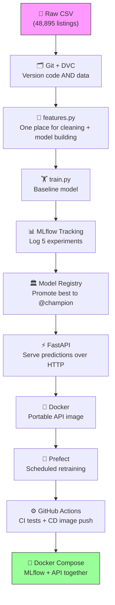

### Why this project is a step up

Every earlier project in the series was **binary classification** (yes/no). This one is **regression** — the model outputs a number (a price). That changes a few things everywhere:

| Classification (before) | Regression (now) |
|---|---|
| Accuracy, precision, recall | **RMSE, MAE, R²** |
| "Is the prediction above 0.5?" | "Is the price in a sensible dollar range? Does Manhattan cost more than the Bronx?" |
| Balanced-ish labels | **Heavily skewed target** (most listings ~$100, a few up to $10,000) |

The data is also genuinely messy: missing values, `$0` prices, huge outliers, and a column (`neighbourhood`) with 221 different values.

---

### Key decisions made up front

| Decision | Why |
|---|---|
| Train on `log1p(price)`, report in dollars | Price is heavily right-skewed; the log makes it well-behaved for the model. |
| Put the log/exp conversion **inside** the model (`TransformedTargetRegressor`) | Nobody downstream (API, tests) can forget to convert back to dollars. |
| Drop `price == 0` and `price > 800` | 11 rows are `$0` (data errors); 800 ≈ the 99th percentile ($799), removing 420 extreme outliers. |
| One shared module, `features.py` | Four different scripts train models; they must all clean data identically. |
| API loads the model from the MLflow registry, not from a file | Promoting a new model needs a restart, not a code change or rebuild. |
| CI trains on a small committed sample | GitHub's servers can't reach the DVC storage on this laptop. |

---

---

# TASK 1 — Project Scaffold, Virtual Environment, Pinned Requirements

---

### What Problem This Solves

Before writing any ML code we need three foundations:

1. **Git** — a history of every code change, so we can always go back.
2. **An isolated Python environment** — so this project's libraries don't clash with anything else on the machine.
3. **Pinned requirements** — an exact list of library versions, so the code runs the same on this laptop, in Docker, and in CI.

Why the virtual environment matters *on this machine specifically*: the default Python here is Anaconda's 3.12, and pandas already warns about mismatched `numexpr`/`bottleneck` versions in it. Installing MLflow, Prefect, etc. there risks breaking other projects. Also, the Docker image (Task 9) uses **Python 3.11** — the laptop should match, so a model trained here unpickles cleanly there.

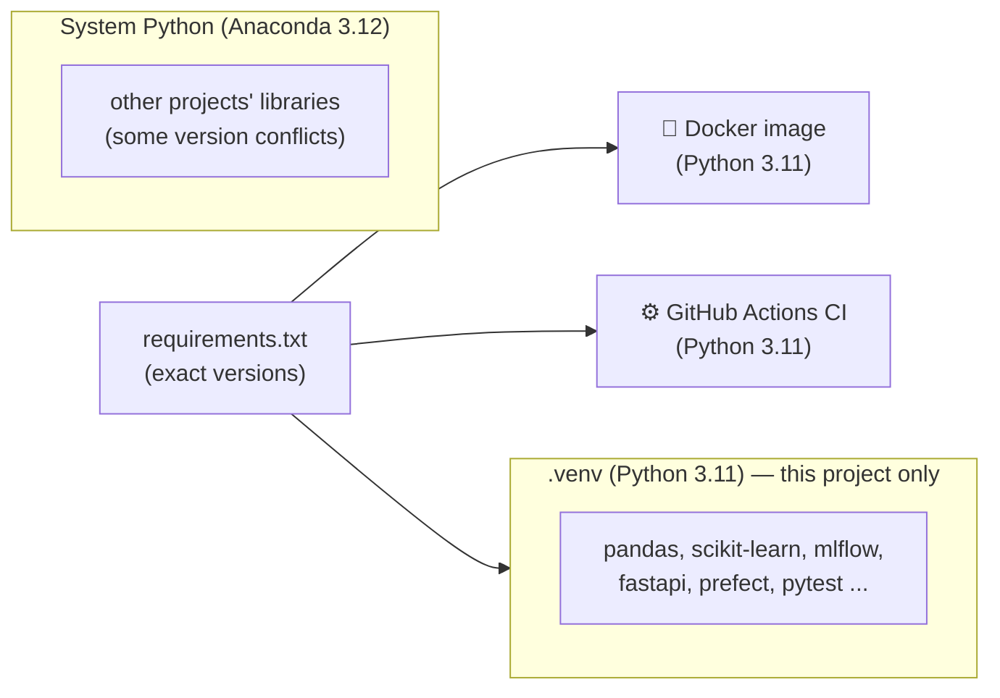

---

### Pre-Check — Make Sure These Are Installed

```bash
git --version
# Expected: git version 2.x.x   (this machine: 2.49.0)

uv --version
# Expected: uv 0.x.x            (this machine: 0.9.28)
```

**What is `uv`?** A very fast Python package and environment manager. It creates virtual environments and installs packages like `pip`, but much faster — and it can download Python 3.11 for you if it isn't installed.

---

### Step 1 — Initialize Git on the `main` Branch

```bash
cd "/Users/kumarshikhar/MLOps Projects/NYC-Airbnb-Price-Prediction"
git init -b main
```

**What this does:**
- Creates the hidden `.git/` folder — Git's internal database of every change.
- `-b main` names the first branch `main` (GitHub's default), avoiding a later `master` → `main` rename.

Output:
```
Initialized empty Git repository in /Users/kumarshikhar/MLOps Projects/NYC-Airbnb-Price-Prediction/.git/
```

---

### Step 2 — Create and Activate the Virtual Environment

```bash
uv venv --python 3.11 .venv
source .venv/bin/activate
python --version
```

Expected:
```
Python 3.11.14
```

**What this does:**
- `uv venv --python 3.11 .venv` creates a self-contained Python 3.11 in the `.venv/` folder.
- `source .venv/bin/activate` makes `python` and `pip` in *this terminal* point to `.venv`. Your prompt usually shows `(.venv)`.

> ⚠️ **Activation is per terminal.** Every new terminal window starts *without* the venv. Whenever you open one (for example for the MLflow server or Prefect server later), run `source .venv/bin/activate` from the project folder first.

---

### Step 3 — Install Libraries, Then Pin the Versions Actually Installed

```bash
uv pip install scikit-learn pandas numpy joblib fastapi uvicorn pydantic mlflow prefect pytest requests httpx2
uv pip freeze | grep -iE '^(scikit-learn|pandas|numpy|joblib|fastapi|uvicorn|pydantic|mlflow|prefect|pytest|requests|httpx2)==' > requirements.txt
cat requirements.txt
```

Result — `requirements.txt`:
```
fastapi==0.141.1
httpx2==2.13.1
joblib==1.6.0
mlflow==3.16.1
numpy==2.4.6
pandas==3.0.6
prefect==3.8.6
pydantic==2.13.5
pytest==9.1.1
requests==2.34.2
scikit-learn==1.9.1
uvicorn==0.53.0
```

**What this does:**
- First we install the latest versions, **then** read back exactly what got installed and write those versions down. We never guess version numbers.
- `grep` keeps only the 12 libraries we use directly (the freeze lists ~200 sub-dependencies too).

**What each library is for:**

| Library | Used for |
|---|---|
| pandas, numpy | Loading and cleaning data |
| scikit-learn | Preprocessing + models |
| joblib | Saving the baseline model to disk |
| mlflow | Experiment tracking + model registry |
| fastapi, uvicorn, pydantic | The prediction API and its input validation |
| prefect | Orchestrating/scheduling retraining |
| pytest, httpx2 | Tests (httpx2 powers FastAPI's test client — see the note in Task 6) |
| requests | Triggering the GitHub deploy workflow |

---

### Step 4 — Install DVC (Deliberately *Not* in `requirements.txt`)

```bash
uv pip install dvc
dvc --version
# 3.67.1
```

**Why not in `requirements.txt`?** DVC is a tool *you* use on your laptop to fetch data. CI never runs DVC (it uses a committed sample instead — see Task 3), so installing it there would only slow CI down.

---

### Step 5 — Create `.gitignore`

```gitignore
# Python
.venv/
__pycache__/
*.pyc
.pytest_cache/

# Local artifacts (models live in the MLflow registry, data lives in DVC)
models/
mlruns/
mlartifacts/
mlflow.db
mlflow.log

# Misc
.DS_Store
.env

# NOTE: do NOT add data/ here. `dvc add` writes data/.gitignore for the CSV,
# and ignoring the whole folder would stop git from tracking the .dvc pointer file.
```

> ⚠️ **The `data/` trap.** It's tempting to ignore the whole `data/` folder. Don't: Git would then also ignore `data/AB_NYC_2019.csv.dvc` — the small pointer file that DVC *needs* in Git. DVC writes its own precise `data/.gitignore` in Task 2 instead.

---

### Step 6 — Create `pytest.ini`

```ini
[pytest]
pythonpath = .
testpaths = tests
```

**What this does:**
- `pythonpath = .` lets tests `import features`, `import main`, etc. from the project root.
- `testpaths = tests` tells pytest where to look, so plain `pytest` just works.

---

### Step 7 — Commit

```bash
git add .gitignore requirements.txt pytest.ini README.md Implementation_Plan_NYC_Airbnb_Price_Prediction.md docs/
git commit -m "chore: project scaffold, pinned requirements, pytest config"
```

---

### What You Should Have at the End of Task 1

```
NYC-Airbnb-Price-Prediction/
├── .git/                                        ← Git's database
├── .venv/                                       ← Python 3.11 env, NOT in Git
├── .gitignore
├── pytest.ini
├── requirements.txt                             ← 12 pinned libraries
├── README.md
├── Implementation_Plan_NYC_Airbnb_Price_Prediction.md   ← the original spec
└── docs/superpowers/plans/2026-09-24-nyc-airbnb-price-prediction.md  ← build plan
```

**Git tracks:** everything above except `.venv/`
**Commit:** `1419a83 chore: project scaffold, pinned requirements, pytest config`

---

---

# TASK 2 — DVC: Versioning the Dataset

---

### What Problem This Solves

The dataset is a 7 MB CSV. Putting data in Git is the wrong tool: every version is stored forever, clones get slow, and GitHub rejects large files. But we still need to answer: *"Which exact data was this model trained on?"*

**Git** tracks code. **DVC** tracks data: it stores a tiny *pointer file* (with a fingerprint of the data) in Git, and the real file in separate storage.

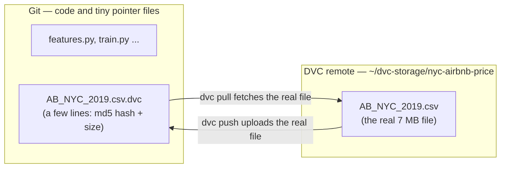

---

### Step 1 — Copy the Dataset In Under Its Canonical Name

The Kaggle download on this machine is called `Airbnb NYC 2019.csv` (with spaces). We give it the standard name the spec uses:

```bash
mkdir -p data
cp ~/Downloads/"Airbnb NYC 2019.csv" data/AB_NYC_2019.csv
python -c "import pandas as pd; df = pd.read_csv('data/AB_NYC_2019.csv'); print(df.shape); print(list(df.columns))"
```

Output:
```
(48895, 16)
['id', 'name', 'host_id', 'host_name', 'neighbourhood_group', 'neighbourhood', 'latitude', 'longitude', 'room_type', 'price', 'minimum_nights', 'number_of_reviews', 'last_review', 'reviews_per_month', 'calculated_host_listings_count', 'availability_365']
```

**What we confirmed about the data** (checked against the real file, not assumed):

| Quirk | Actual value |
|---|---|
| Missing values | `name` 16, `host_name` 21, `last_review` 10,052, `reviews_per_month` 10,052 |
| `reviews_per_month` missing exactly when `number_of_reviews == 0` | ✅ True for every row |
| `$0` prices | 11 rows |
| Price median / 99th percentile / max | $106 / $799 / $10,000 |
| Distinct `neighbourhood` values | 221 |
| Latitude / longitude range | 40.4998 – 40.9131 / -74.2444 – -73.7130 |

---

### Step 2 — `dvc init`, Then `dvc add` — Before Any `git add`

```bash
dvc init
dvc add data/AB_NYC_2019.csv
git status --short -uall
```

Output:
```
A  .dvc/.gitignore
A  .dvc/config
A  .dvcignore
?? data/.gitignore
?? data/AB_NYC_2019.csv.dvc
```

**What DVC does behind the scenes:**
1. Computes an MD5 hash (a unique fingerprint) of the CSV.
2. Writes `data/AB_NYC_2019.csv.dvc` — the pointer file with that hash.
3. Copies the CSV into its cache, `.dvc/cache/`.
4. Writes `data/.gitignore` containing `/AB_NYC_2019.csv`, so Git never sees the real file.

> ⚠️ **Order matters (the Article 7.5 lesson).** If you ran `git add -A` *before* `dvc add`, Git would stage the real CSV and it would end up in history forever. Always `dvc add` first, then check that `git status` does **not** list the CSV itself.

The pointer file:
```bash
cat data/AB_NYC_2019.csv.dvc
```
```yaml
outs:
- md5: f772a1d8d29bae6e7a9beac0ae880a2b
  size: 7077973
  hash: md5
  path: AB_NYC_2019.csv
```

Double-check that Git ignores the CSV and *why*:
```bash
git check-ignore -v data/AB_NYC_2019.csv
# data/.gitignore:1:/AB_NYC_2019.csv	data/AB_NYC_2019.csv
```

---

### Step 3 — Set Up a Local DVC Remote and Push

A **remote** is where DVC keeps the real files outside Git. We use a folder in the home directory (outside the project, so deleting the project doesn't delete the data backup). In a cloud setup this would be an S3 bucket.

```bash
mkdir -p ~/dvc-storage/nyc-airbnb-price
dvc remote add -d localremote ~/dvc-storage/nyc-airbnb-price
dvc push
```

Output:
```
Setting 'localremote' as a default remote.
1 file pushed
```

**What `-d` means:** make this the *default* remote, so `dvc push` / `dvc pull` need no extra arguments. The setting is saved in `.dvc/config`:

```ini
[core]
    remote = localremote
['remote "localremote"']
    url = /Users/kumarshikhar/dvc-storage/nyc-airbnb-price
```

---

### Step 4 — Verify: Delete the CSV and Get It Back

This simulates a teammate (or future you) cloning the repo fresh:

```bash
rm data/AB_NYC_2019.csv
ls data/
# AB_NYC_2019.csv.dvc          ← only the pointer is left

dvc pull
wc -l data/AB_NYC_2019.csv
md5 -q data/AB_NYC_2019.csv
```

Output:
```
A       data/AB_NYC_2019.csv
1 file added
   49081 data/AB_NYC_2019.csv
f772a1d8d29bae6e7a9beac0ae880a2b
```

The MD5 matches the pointer file exactly — it's the same data, byte for byte.

> 💡 **Why 49,081 lines but 48,895 rows?** Some listing names contain line breaks inside quotes. `wc -l` counts raw lines; pandas counts real rows.

---

### Step 5 — Commit the Pointer and Config (Not the Data)

```bash
git add .dvc .dvcignore data/AB_NYC_2019.csv.dvc data/.gitignore
git commit -m "data: track AB_NYC_2019.csv with DVC and a local remote"
```

---

### What You Should Have at the End of Task 2

```
NYC-Airbnb-Price-Prediction/
├── .dvc/
│   ├── config                  ← remote settings, IN Git
│   ├── .gitignore              ← keeps cache/ and tmp/ out of Git
│   └── cache/                  ← DVC's local copy, NOT in Git
├── .dvcignore
├── data/
│   ├── AB_NYC_2019.csv         ← real file, NOT in Git
│   ├── AB_NYC_2019.csv.dvc     ← pointer file, IN Git
│   └── .gitignore              ← written by DVC
└── ... (Task 1 files)
```

**Git tracks:** `.dvc/config`, `.dvc/.gitignore`, `.dvcignore`, `data/AB_NYC_2019.csv.dvc`, `data/.gitignore`
**DVC remote stores:** `AB_NYC_2019.csv`
**Commit:** `9088fe5 data: track AB_NYC_2019.csv with DVC and a local remote`

---

---

# TASK 3 — `features.py`: One Place for Cleaning and Model Building

---

### What Problem This Solves

Four different scripts will train models in this project:

| Script | Task |
|---|---|
| `train.py` | 4 — baseline |
| `track_experiments.py` | 7 — five MLflow experiments |
| `orchestrate_training.py` | 10 — Prefect flow |
| `scripts/ci_seed_model.py` | 11 — CI |

If each one had its own copy of the cleaning code, they would slowly drift apart ("oh, I changed the outlier cutoff in one place but not the other"). So every rule lives **once**, in `features.py`, and everything else imports it.

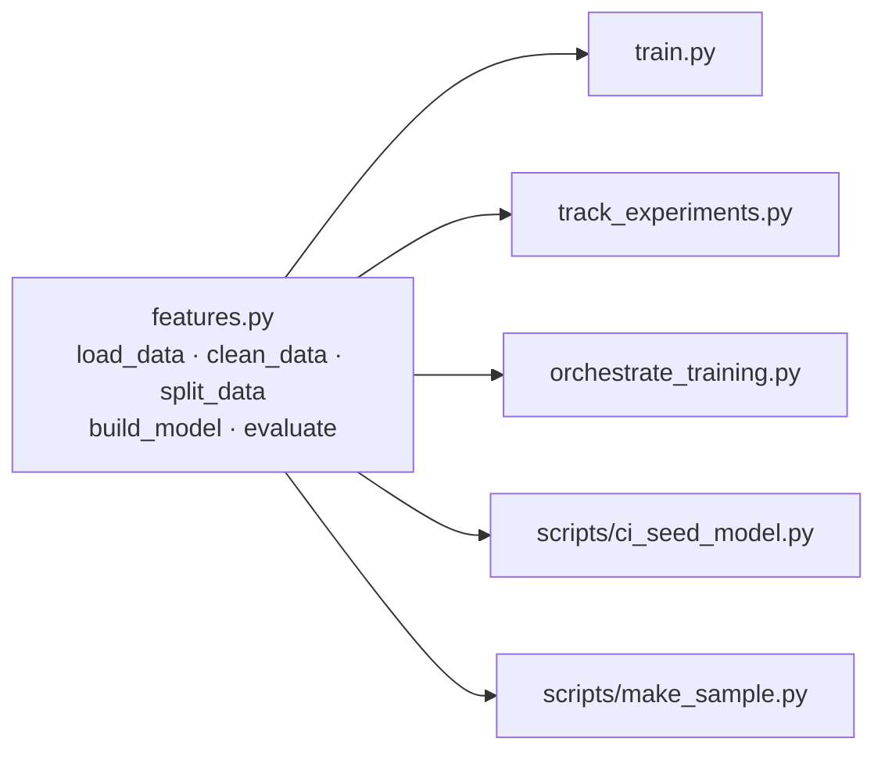

---

### The Feature Set

| Type | Columns | What happens to them |
|---|---|---|
| Numeric (7) | `latitude`, `longitude`, `minimum_nights`, `number_of_reviews`, `reviews_per_month`, `calculated_host_listings_count`, `availability_365` | `StandardScaler` (rescaled to mean 0, std 1) |
| Categorical (3) | `neighbourhood_group` (5 values), `neighbourhood` (221 values), `room_type` (3 values) | `OneHotEncoder(handle_unknown="ignore")` |
| Dropped (5) | `id`, `name`, `host_id`, `host_name`, `last_review` | Identifiers or free text/personal data — not useful inputs |
| Target | `price` | Trained as `log1p(price)` |

> 💡 **High-cardinality categoricals.** `neighbourhood` has 221 values, so one-hot encoding creates 221 columns for it alone. That's fine for these models, but it creates a real risk: the API will one day receive a neighbourhood the model never saw in training. `handle_unknown="ignore"` turns an unknown value into all zeros instead of crashing — and we have a test proving it.

---

### The Log-Price Trick, Explained

Most listings cost ~$100, but a few cost thousands. A model trained on raw prices gets dragged around by those few expensive listings. Taking the log squeezes the scale:

| Price | `log1p(price)` |
|---|---|
| $50 | 3.93 |
| $150 | 5.02 |
| $800 | 6.69 |

The model learns on the log scale, and predictions are converted back with `expm1` (the exact inverse of `log1p`).

**The danger:** forgetting to convert back. You'd report "RMSE = 0.5" (log units) or serve a price of "$5.3". So we don't do the conversion by hand anywhere — scikit-learn's `TransformedTargetRegressor` does it **inside the model**:

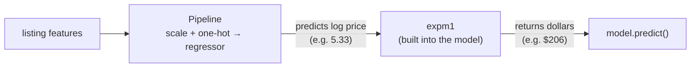

When this model is saved to MLflow and loaded by the API, the conversion travels with it.

---

### Step 1 — Write the Tests First (Test-Driven Development)

TDD means: **write a test that describes what the code should do, watch it fail, then write the code to make it pass.** Watching it fail proves the test actually tests something.

`tests/test_features.py` builds a tiny six-row fake dataset containing the real quirks — a `$0` price, a `$10,000` outlier, and a listing with no reviews (so `reviews_per_month` is missing):

```python
prices = [0, 50, 150, 300, 800, 10000]
```

and checks:

| Test | What it proves |
|---|---|
| `test_clean_data_drops_zero_and_outlier_prices` | Only `[50, 150, 300, 800]` survive cleaning |
| `test_clean_data_fills_missing_reviews_per_month_with_zero` | Missing review rate → `0`, not the average |
| `test_clean_data_keeps_only_model_columns` | `id`, `name`, etc. are gone |
| `test_log_target_inversion_matches_hand_computed_value` | Predictions are in dollars (see below) |
| `test_evaluate_returns_dollar_scale_metrics` | RMSE is in dollars, not log units |

**The hand-computed check.** A `DummyRegressor(strategy="mean")` simply predicts the average of whatever it was trained on. Trained on log prices, it predicts `mean(log1p(prices))`. So the dollar prediction must be:

```python
expected = np.expm1(np.mean(np.log1p([50, 150, 300, 800])))   # ≈ $206
assert model.predict(X.iloc[[0]])[0] == pytest.approx(expected)
```

If the `expm1` conversion were missing, the model would return ~5.3 and the test would fail.

Run the tests before `features.py` exists:
```bash
pytest tests/test_features.py -v
```
```
E   ModuleNotFoundError: No module named 'features'
```
✅ Failing for the right reason.

---

### Step 2 — Write `features.py`

The key parts (full file in the repo):

```python
MAX_PRICE = 800
RANDOM_STATE = 42

def load_data(path=None):
    """Read the raw CSV. With no path, honour $DATA_PATH (CI uses the sample)."""
    path = path or os.environ.get("DATA_PATH", DEFAULT_DATA_PATH)
    return pd.read_csv(path)

def clean_data(df):
    df = df.copy()
    # reviews_per_month is missing exactly when number_of_reviews == 0:
    # no reviews means a review rate of 0, not the average rate.
    df["reviews_per_month"] = df["reviews_per_month"].fillna(0.0)
    df = df[(df[TARGET] > 0) & (df[TARGET] <= MAX_PRICE)]
    return df[FEATURES + [TARGET]].reset_index(drop=True)

def split_data(df):
    """80/20 split -> (X_train, X_test, y_train, y_test)."""
    return train_test_split(df[FEATURES], df[TARGET], test_size=0.2, random_state=RANDOM_STATE)

def build_model(regressor):
    preprocessor = ColumnTransformer([
        ("num", StandardScaler(), NUMERIC_FEATURES),
        ("cat", OneHotEncoder(handle_unknown="ignore"), CATEGORICAL_FEATURES),
    ])
    pipeline = Pipeline([("preprocess", preprocessor), ("regressor", regressor)])
    return TransformedTargetRegressor(regressor=pipeline, func=np.log1p, inverse_func=np.expm1)

def evaluate(model, X, y):
    """RMSE / MAE / R² on the original dollar scale."""
    predictions = model.predict(X)
    return {"rmse": ..., "mae": ..., "r2": ...}
```

**Why these choices:**
- `fillna(0.0)` — a listing with zero reviews genuinely has a review rate of zero. Filling with the mean would invent reviews that never happened.
- `random_state=42` — the same split every run, so results are comparable across experiments.
- `build_model(regressor)` takes *any* regressor, so Task 7 can plug in RandomForest or GradientBoosting with identical preprocessing.
- `DATA_PATH` environment variable — lets CI point training at the small sample without changing code.

Run the tests again:
```
tests/test_features.py::test_clean_data_drops_zero_and_outlier_prices PASSED
tests/test_features.py::test_clean_data_fills_missing_reviews_per_month_with_zero PASSED
tests/test_features.py::test_clean_data_keeps_only_model_columns PASSED
tests/test_features.py::test_log_target_inversion_matches_hand_computed_value PASSED
tests/test_features.py::test_evaluate_returns_dollar_scale_metrics PASSED
5 passed
```

---

### Step 3 — Create the CI Sample (`scripts/make_sample.py`)

**The problem:** our DVC remote is a folder on this laptop. GitHub Actions runs on GitHub's servers, which can't reach it — so CI can't `dvc pull` the data.

**The fix:** commit a small, random 2,000-row sample of the data to Git, with only the model columns (no names, no ids — no personal data).

```bash
touch scripts/__init__.py
python -m scripts.make_sample
```
```
wrote 2000 rows to tests/fixtures/listings_sample.csv
```

What's in it:
```
(2000, 11)
{'Manhattan': 858, 'Brooklyn': 827, 'Queens': 259, 'Bronx': 42, 'Staten Island': 14}
missing reviews_per_month: 424 | price==0: 0 | price>800: 15
```

All five boroughs are present, and it still has the real quirks (missing values, outliers) — so cleaning is tested on realistic data. File size: 142 KB.

> 💡 **Why `python -m scripts.make_sample` and not `python scripts/make_sample.py`?** Running a file directly puts `scripts/` first on Python's import path, so `import features` (which lives in the project root) would fail. `-m` runs it as a module from the project root. The empty `scripts/__init__.py` makes `scripts` a proper package.

---

### Step 4 — Shared Test Fixtures (`tests/conftest.py`)

pytest automatically loads `conftest.py`. Fixtures defined there are available to every test:

```python
SAMPLE_PATH = Path(__file__).parent / "fixtures" / "listings_sample.csv"

@pytest.fixture(scope="session")
def sample_path():
    """Absolute path, so tests pass no matter which directory pytest runs from."""
    return SAMPLE_PATH

@pytest.fixture(scope="session")
def sample_splits(sample_path):
    """(X_train, X_test, y_train, y_test) from the committed 2,000-row sample."""
    return split_data(clean_data(load_data(sample_path)))
```

`scope="session"` means the sample is loaded once for the whole test run, not once per test.

Two more tests use them:

| Test | What it proves |
|---|---|
| `test_split_data_is_reproducible_80_20` | 80/20 ratio, correct columns, same split every time |
| `test_model_tolerates_unseen_neighbourhood` | A neighbourhood the model never saw (`"Nowhere Heights"`) gives a price, not a crash |

```bash
pytest -v
# 7 passed
```

---

### Step 5 — Audit: Do the Tests Actually Catch Bugs?

A passing test suite only matters if it *fails* when the code is wrong. We deliberately broke `features.py` in nine ways, one at a time, and checked that the tests noticed:

| Deliberate bug | Caught? |
|---|---|
| Removed the `expm1` conversion back to dollars | ✅ |
| Removed the log transform entirely | ✅ |
| Filled missing review rates with the mean instead of 0 | ✅ |
| Kept `$0` prices | ✅ |
| Kept outliers above $800 | ✅ |
| Kept `id` / `name` columns | ✅ |
| 50/50 split instead of 80/20 | ✅ |
| Non-reproducible split (no `random_state`) | ✅ |
| Removed `handle_unknown="ignore"` | ✅ |

We also cloned the repo into a fresh folder, ran `dvc pull`, and ran the tests there — everything passed. That proves the project can be rebuilt from Git + DVC alone.

**Bug the audit found and fixed:** the split test originally used the relative path `"tests/fixtures/listings_sample.csv"`, so it failed if pytest ran from any folder other than the project root. It now uses the `sample_path` fixture, which builds an absolute path from the test file's location.

---

### Step 6 — Commit

```bash
git add features.py scripts/__init__.py scripts/make_sample.py tests/
git commit -m "feat: shared cleaning/pipeline module with log-target model and CI sample"
# after the audit:
git commit -m "test: cwd-independent sample path, cover unseen categories; fix CI rehearsal in plan"
```

---

### What You Should Have at the End of Task 3

```
NYC-Airbnb-Price-Prediction/
├── features.py                        ← all cleaning + model-building rules
├── scripts/
│   ├── __init__.py
│   └── make_sample.py                 ← regenerates the CI sample
├── tests/
│   ├── conftest.py                    ← sample_path, sample_splits fixtures
│   ├── fixtures/
│   │   └── listings_sample.csv        ← 2,000 rows, IN Git (142 KB, no personal data)
│   └── test_features.py               ← 7 tests
└── ... (Task 1–2 files)
```

**Tests:** 7 passed, 0 warnings
**Commits:**
```
9e90207 test: cwd-independent sample path, cover unseen categories; fix CI rehearsal in plan
e29ded8 feat: shared cleaning/pipeline module with log-target model and CI sample
9088fe5 data: track AB_NYC_2019.csv with DVC and a local remote
1419a83 chore: project scaffold, pinned requirements, pytest config
```

---

---

# TASK 4 — Baseline Training Script (`train.py`)

---

### What Problem This Solves

Before bringing in MLflow, Docker, or anything fancy, we need proof that the **whole pipeline works end to end** on the real data: load → clean → split → train → score → save → reload. That's the job of a *baseline*: the simplest reasonable model, giving us a number every later model has to beat.

We use **LinearRegression** — fast, simple, and hard to get wrong. If something is broken, it's in the pipeline, not in a fancy model.

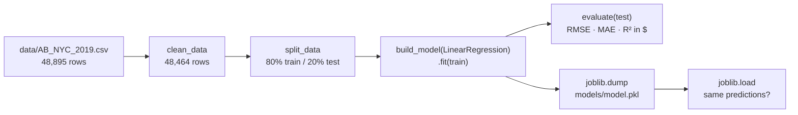

---

### Understanding the Three Regression Metrics

| Metric | Plain meaning | Good direction |
|---|---|---|
| **RMSE** (root mean squared error) | Typical error in dollars, but big misses count extra (errors are squared before averaging) | Lower |
| **MAE** (mean absolute error) | Average miss in dollars — "on average we're off by $X" | Lower |
| **R²** | Share of the price variation the model explains. 1.0 = perfect, 0 = no better than always guessing the average, negative = worse than that | Higher |

RMSE is always ≥ MAE. The gap between them tells you how much of the error comes from a few large misses.

---

### Step 1 — Write `train.py`

```python
from pathlib import Path

import joblib
from sklearn.linear_model import LinearRegression

from features import build_model, clean_data, evaluate, load_data, split_data

MODEL_PATH = Path("models/model.pkl")


def main():
    df = clean_data(load_data())
    X_train, X_test, y_train, y_test = split_data(df)
    print(f"rows after cleaning: {len(df)}  (train={len(X_train)}, test={len(X_test)})")

    model = build_model(LinearRegression()).fit(X_train, y_train)
    for name, value in evaluate(model, X_test, y_test).items():
        print(f"{name}: {value:.3f}")

    MODEL_PATH.parent.mkdir(exist_ok=True)
    joblib.dump(model, MODEL_PATH)
    reloaded = joblib.load(MODEL_PATH)
    assert (reloaded.predict(X_test.head()) == model.predict(X_test.head())).all()
    print(f"saved and reloaded {MODEL_PATH}")
```

**What this does:**
- The whole script is ~15 lines because every rule lives in `features.py` (Task 3). `train.py` only *wires the steps together*.
- `evaluate` scores on the **test set** — data the model never saw during training. Scoring on training data would flatter the model.
- `joblib.dump` saves the fitted model (preprocessing + regressor + log/dollar conversion, all in one object) to a file.
- The reload-and-compare line proves the saved file really works — not just that *something* was written to disk.

> 💡 **Where's the `expm1`?** There isn't one in this file, on purpose. The model returned by `build_model` converts log-price back to dollars inside `.predict()` (see Task 3), so `evaluate` already sees dollars.

---

### Step 2 — Run It

```bash
python train.py
```

Output:
```
rows after cleaning: 48464  (train=38771, test=9693)
rmse: 83.545
mae: 47.077
r2: 0.395
saved and reloaded models/model.pkl
```

It takes about 1.4 seconds, and `models/model.pkl` is 9.6 KB.

**Where 48,464 comes from:** 48,895 raw rows − 11 rows at `$0` − 420 rows above `$800` = 48,464.

---

### Step 3 — Are These Numbers Sane?

**Check 1 — Right scale?** RMSE $83.5 is "tens of dollars". ✅ If it had printed `0.5` we'd be scoring log prices. If it had printed `4,000` the conversion back would be broken.

**Check 2 — Better than guessing?** We compared against a model that ignores every feature and always predicts the same typical price:

| Model | RMSE | MAE | R² |
|---|---|---|---|
| Always guess the typical price | $110.91 | $71.07 | -0.065 |
| **LinearRegression baseline** | **$83.55** | **$47.08** | **0.395** |

The baseline cuts the average miss from $71 to $47 — the features carry real signal.

> 💡 **Why is the "always guess" R² slightly negative instead of exactly 0?** It's trained on log prices, so its single guess is the *log-average* (about $110), which is lower than the plain dollar average. R² measures against the plain dollar average, so this guess scores a little worse than zero.

**Check 3 — Do individual predictions make sense?** Same host details, different location and room type:

| Listing | Predicted price |
|---|---|
| Midtown Manhattan, entire home | $284.37 |
| Midtown Manhattan, private room | $142.57 |
| Fordham (Bronx), shared room | $36.18 |

Entire home > private room > shared room in the Bronx — exactly the order you'd expect. ✅

**How good is R² = 0.40?** It's a modest start. We only have location, room type and booking activity; nothing about size, bedrooms, photos or amenities. The tree-based models in Task 7 should do better, and now we have the number they have to beat.

---

### Step 4 — Commit (the Code, Not the Model)

```bash
git add train.py
git commit -m "feat: baseline LinearRegression training script (log-price target)"
```

`models/model.pkl` is **not** committed — `models/` is in `.gitignore`. It's a quick local sanity artifact only. From Task 7 onwards, models are stored and versioned in the **MLflow registry**, which is what the API will load from.

---

### What You Should Have at the End of Task 4

```
NYC-Airbnb-Price-Prediction/
├── train.py                  ← baseline training script, IN Git
├── models/
│   └── model.pkl             ← 9.6 KB saved model, NOT in Git
└── ... (Task 1–3 files)
```

**Baseline to beat:** RMSE $83.55 · MAE $47.08 · R² 0.395
**Commit:** `4f1e4c8 feat: baseline LinearRegression training script (log-price target)`

---

---

# TASK 5 — Pydantic Schemas (`schemas.py`)

---

### What Problem This Solves

Soon (Task 6) anyone will be able to send a listing to our API and get a price back. People — and other programs — send bad data: a typo in `room_type`, `minimum_nights: 0`, a latitude with the sign flipped. A machine-learning model **never complains** about bad input: it just returns a confident-looking, meaningless price.

**Pydantic** is a Python library that checks data against a declared shape *before* it reaches the model. We describe what a valid listing looks like once, and every request is checked automatically. FastAPI uses these schemas directly, so a bad request gets a clear `422` error explaining what's wrong.

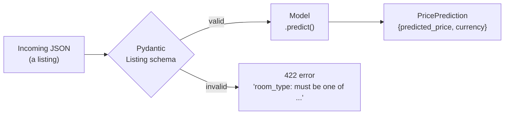

---

### The Rules We Enforce

The schema's fields match the **model's 10 features exactly** — not the raw CSV. No `id`, `name`, `host_name` or `last_review`: the model doesn't use them, so the API doesn't ask for them.

| Field | Rule | Why |
|---|---|---|
| `neighbourhood_group` | One of Manhattan, Brooklyn, Queens, Bronx, Staten Island | Only 5 boroughs exist |
| `room_type` | One of Entire home/apt, Private room, Shared room | Only 3 types in the data |
| `neighbourhood` | Any non-empty text | 221 values is too many to list; unknown ones are safely ignored by the model (tested in Task 3) |
| `latitude` | 40.49 – 40.92 | NYC's bounding box, slightly padded around the real data (40.4998 – 40.9131) |
| `longitude` | -74.26 – -73.70 | Same (real data: -74.2444 – -73.7130) |
| `minimum_nights` | ≥ 1 | A booking is at least one night |
| `number_of_reviews` | ≥ 0 | Counts can't be negative |
| `reviews_per_month` | ≥ 0 | Rates can't be negative |
| `calculated_host_listings_count` | ≥ 1 | The host has at least this listing |
| `availability_365` | 0 – 365 | Days in a year |

> 💡 **Why bound latitude/longitude at all?** Without bounds, `latitude: -75` (Antarctica) or `longitude: 73.98` (a flipped sign — that's China) would be accepted, and the model would happily return a price for them. The model has never seen anything outside NYC, so its answer would be meaningless.

---

### Step 1 — Write the Tests First

`tests/test_schemas.py`:

```python
def test_valid_listing_is_accepted():
    listing = Listing(**EXAMPLE_LISTING)
    assert listing.room_type == "Entire home/apt"


def test_listing_fields_match_model_features_exactly():
    assert set(Listing.model_fields) == set(features.FEATURES)


@pytest.mark.parametrize(
    "field, value",
    [
        ("room_type", "Castle"),
        ("neighbourhood_group", "New Jersey"),
        ("neighbourhood", ""),
        ("minimum_nights", 0),
        ("number_of_reviews", -1),
        ("reviews_per_month", -0.5),
        ("calculated_host_listings_count", 0),
        ("availability_365", 366),
        ("latitude", -75.0),    # Antarctica
        ("longitude", 73.98),   # sign flipped: that's China
    ],
)
def test_invalid_value_is_rejected(field, value):
    with pytest.raises(ValidationError):
        Listing(**{**EXAMPLE_LISTING, field: value})
```

**What this does:**
- `@pytest.mark.parametrize` runs one test function 10 times, once per `(field, value)` pair. Each run takes a *valid* listing and breaks exactly **one** field — so if the test fails, we know precisely which rule is missing.
- `{**EXAMPLE_LISTING, field: value}` copies the valid example and overwrites one field.
- `pytest.raises(ValidationError)` means "this test passes only if Pydantic rejects the input".
- `test_listing_fields_match_model_features_exactly` ties the schema to `features.FEATURES`. If someone adds a feature to the model but forgets the API, this test fails.

Two more tests: a listing with a missing field is rejected, and `PricePrediction` defaults its currency to `"USD"`.

Run before `schemas.py` exists:
```
E   ModuleNotFoundError: No module named 'schemas'
```
✅ Failing for the right reason.

---

### Step 2 — Write `schemas.py`

```python
from typing import Literal

from pydantic import BaseModel, Field

NYC_LAT_MIN, NYC_LAT_MAX = 40.49, 40.92
NYC_LON_MIN, NYC_LON_MAX = -74.26, -73.70

EXAMPLE_LISTING = {
    "neighbourhood_group": "Manhattan",
    "neighbourhood": "Midtown",
    "latitude": 40.7549,
    "longitude": -73.9840,
    "room_type": "Entire home/apt",
    "minimum_nights": 2,
    "number_of_reviews": 20,
    "reviews_per_month": 1.0,
    "calculated_host_listings_count": 1,
    "availability_365": 180,
}


class Listing(BaseModel):
    model_config = {"json_schema_extra": {"examples": [EXAMPLE_LISTING]}}

    neighbourhood_group: Literal["Manhattan", "Brooklyn", "Queens", "Bronx", "Staten Island"]
    neighbourhood: str = Field(..., min_length=1)
    latitude: float = Field(..., ge=NYC_LAT_MIN, le=NYC_LAT_MAX)
    longitude: float = Field(..., ge=NYC_LON_MIN, le=NYC_LON_MAX)
    room_type: Literal["Entire home/apt", "Private room", "Shared room"]
    minimum_nights: int = Field(..., ge=1)
    number_of_reviews: int = Field(..., ge=0)
    reviews_per_month: float = Field(..., ge=0)
    calculated_host_listings_count: int = Field(..., ge=1)
    availability_365: int = Field(..., ge=0, le=365)


class PricePrediction(BaseModel):
    predicted_price: float
    currency: str = "USD"
```

**Reading the syntax:**
- `Literal[...]` — the value must be exactly one of these strings.
- `Field(...)` — the `...` means "required, no default".
- `ge` / `le` — "greater than or equal" / "less than or equal".
- `min_length=1` — no empty strings.
- `model_config = {"json_schema_extra": ...}` — puts `EXAMPLE_LISTING` into FastAPI's auto-generated docs page, so the "Try it out" button starts with a valid request (Task 6).
- `EXAMPLE_LISTING` lives here (not in the tests) so the tests, the API docs, and later tasks all share one known-good listing.

Run the tests:
```bash
pytest tests/test_schemas.py -v
# 14 passed
```

---

### Step 3 — Break a Rule on Purpose and Watch It Fail

A test that has never failed might not be testing anything. So we deliberately weakened one rule — `minimum_nights: ge=1` → `ge=0` — and re-ran:

```
E       Failed: DID NOT RAISE ValidationError
FAILED tests/test_schemas.py::test_invalid_value_is_rejected[minimum_nights-0]
1 failed, 13 passed
```

Exactly the one matching test failed, and its name tells us which field and value. After reverting: `14 passed`. ✅

---

### Step 4 — Make Sure We Don't Reject Real Listings

Strict validation has the opposite risk too: bounds so tight they reject real data. We ran every one of the 48,464 cleaned training listings through `Listing`:

```
validated 48464 real listings, rejected 0
```

The rules block nonsense without blocking anything the model was trained on. ✅

---

### Step 5 — Commit

```bash
git add schemas.py tests/test_schemas.py
git commit -m "feat: Listing/PricePrediction schemas with NYC bounds and tests"
```

---

### What You Should Have at the End of Task 5

```
NYC-Airbnb-Price-Prediction/
├── schemas.py                ← Listing, PricePrediction, EXAMPLE_LISTING
├── tests/
│   └── test_schemas.py       ← 14 tests
└── ... (Task 1–4 files)
```

**Tests:** 21 passed (7 features + 14 schemas)
**Commit:** `f8773d9 feat: Listing/PricePrediction schemas with NYC bounds and tests`

---

---

# TASK 6 — FastAPI Prediction Service (`main.py`)

---

### What Problem This Solves

A model sitting in a Python file is useless to a website, a mobile app or another team. They need to ask a question over the network — *"what should this listing cost?"* — and get an answer back. **FastAPI** turns our model into a **web API**: a program that listens for HTTP requests and replies with JSON.

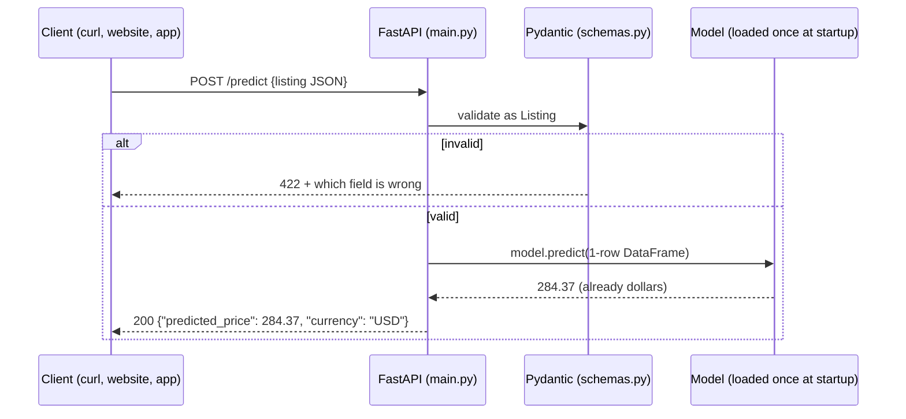

---

### The Big Design Choice: Load the Model From the Registry, Not a File

The obvious approach is `joblib.load("models/model.pkl")`. The spec explicitly rejects this (the Article 12 lesson): a hardcoded path ties the API to one specific file. Every new model would need someone to copy a file and redeploy.

Instead, `main.py` asks the **MLflow Model Registry** (built in Tasks 7–8) for *whichever model currently holds the `champion` label*:

```python
MODEL_URI = os.environ.get("MODEL_URI", "models:/AirbnbPriceModel@champion")
```

| Part | Meaning |
|---|---|
| `models:/` | "Look this up in the MLflow Model Registry" |
| `AirbnbPriceModel` | The registered model's name |
| `@champion` | An *alias* — a movable label pointing at one version |

Promote a better model → move the `champion` label → restart the API → it serves the new model. **No code change, no rebuild.**

Where is the registry? MLflow reads the `MLFLOW_TRACKING_URI` environment variable itself (e.g. `http://127.0.0.1:5000`). The same code therefore works on the laptop, in CI and in Docker — only the environment variable changes.

---

### Step 1 — Write the Tests First, With a Fake Model

**The problem:** the registry doesn't exist yet (that's Task 7). Should the API tests wait?

**No.** The API has its own logic worth testing: validation, response shape, rounding, never returning a negative price. We swap the real model for a tiny stand-in:

```python
class FakeModel:
    """Stands in for the registry model so API tests need no MLflow server."""

    def __init__(self, price):
        self.price = price
        self.seen = None

    def predict(self, X):
        self.seen = X          # remember what the API sent us
        return np.array([self.price])


@pytest.fixture
def fake_model(monkeypatch):
    fake = FakeModel(price=123.456)
    monkeypatch.setattr(main, "load_model", lambda: fake)
    return fake


@pytest.fixture
def client(fake_model):
    with TestClient(main.app) as c:  # `with` runs the lifespan (model load)
        yield c
```

**What this does:**
- `monkeypatch.setattr(main, "load_model", ...)` temporarily replaces `main.load_model` for one test, so at startup the app "loads" the fake instead of contacting MLflow. pytest undoes the swap automatically afterwards.
- `TestClient` sends real HTTP-style requests to the app **in memory** — no server, no port.
- `with TestClient(...)` is important: only inside a `with` block does FastAPI run its startup code (where the model is loaded).
- `self.seen` lets a test inspect exactly what the API passed to the model.

The five tests:

| Test | What it proves |
|---|---|
| `test_health` | `GET /health` answers `{"status": "ok", ...}` |
| `test_predict_returns_rounded_usd_price` | `123.456` → `{"predicted_price": 123.46, "currency": "USD"}` |
| `test_predict_sends_exactly_the_model_features` | The model receives one row with exactly the 10 feature columns |
| `test_predict_never_returns_negative_price` | A model output of `-5.0` is served as `0.0` |
| `test_predict_rejects_invalid_listing` | `room_type: "Castle"` → HTTP `422` |

Before `main.py` exists:
```
E   ModuleNotFoundError: No module named 'main'
```
✅ Failing for the right reason.

---

### Step 2 — Write `main.py`

```python
MODEL_URI = os.environ.get("MODEL_URI", "models:/AirbnbPriceModel@champion")
logger = logging.getLogger("uvicorn.error")


def load_model():
    return mlflow.sklearn.load_model(MODEL_URI)


@asynccontextmanager
async def lifespan(app: FastAPI):
    logger.info("Loading %s from %s", MODEL_URI, mlflow.get_tracking_uri())
    app.state.model = load_model()
    logger.info("Model loaded")
    yield


app = FastAPI(title="NYC Airbnb Price API", lifespan=lifespan)


@app.get("/health")
def health():
    return {"status": "ok", "model_uri": MODEL_URI}


@app.post("/predict", response_model=PricePrediction)
def predict(listing: Listing) -> PricePrediction:
    features = pd.DataFrame([listing.model_dump()])
    price = float(app.state.model.predict(features)[0])
    return PricePrediction(predicted_price=round(max(price, 0.0), 2))
```

**What each piece does:**
- **`lifespan`** — code that runs once when the server starts (before `yield`) and once when it stops (after). Loading a model can take seconds, so we do it **once at startup**, not on every request. It's stored on `app.state.model`.
- **`load_model()` as its own function** — this is what makes the fake-model tests possible. Tests replace this one function.
- **`predict(listing: Listing)`** — because the parameter is typed as our Pydantic `Listing`, FastAPI validates the JSON body automatically. Bad input never reaches this function; FastAPI replies `422` on its own.
- **`listing.model_dump()`** — turns the validated listing into a dict; `pd.DataFrame([...])` makes a one-row table, which is what scikit-learn models expect.
- **`max(price, 0.0)`** — a price can't be negative. Our log-price model can't actually produce one (`expm1` of any number is > -1), but the API shouldn't rely on that.
- **No `expm1` here either** — the model converts back to dollars inside `.predict()` (Task 3).

Run the tests:
```bash
pytest tests/test_api.py -v
# 5 passed, 1 warning
```

---

### Step 3 — Don't Ignore Warnings: the `httpx` → `httpx2` Swap

That "1 warning" was:
```
StarletteDeprecationWarning: Using `httpx` with `starlette.testclient` is deprecated; install `httpx2` instead.
```

Deprecation warnings are the library telling you *"this will break in a future version."* FastAPI's `TestClient` (built on Starlette) now wants `httpx2`. We had pinned `httpx` only for the test client, so:

```bash
uv pip install httpx2
pytest -q
# 26 passed          ← no warning
```

`requirements.txt` now pins `httpx2==2.13.1` instead of `httpx`. (`httpx` is still installed — Prefect depends on it and pulls it in by itself.)

---

### Step 4 — A Real Live Test (Not Just a Fake Model)

The fake-model tests prove the API logic. We also wanted to prove the *real* loading path works: `mlflow.sklearn.load_model`, the startup hook, and actual HTTP on a real port. We saved Task 4's baseline in MLflow's model format to a temporary folder and pointed `MODEL_URI` at it:

```bash
MODEL_URI=/tmp/.../baseline_mlflow_model uvicorn main:app --port 8765
```

Startup log:
```
INFO:     Loading /tmp/.../baseline_mlflow_model from sqlite:///.../mlflow.db
INFO:     Model loaded
INFO:     Application startup complete.
```

| Request | Response |
|---|---|
| `GET /health` | `{"status":"ok","model_uri":"/tmp/.../baseline_mlflow_model"}` |
| `POST /predict` Midtown entire home | `{"predicted_price":284.37,"currency":"USD"}` — identical to Task 4's check ✅ |
| `POST /predict` with `latitude: -75` | HTTP 422: `"Input should be greater than or equal to 40.49"` ✅ |
| `GET /docs` | HTTP 200 — FastAPI's interactive docs page, pre-filled with `EXAMPLE_LISTING` ✅ |

> 💡 **Try the docs page yourself later.** Once the real model exists (Task 8), run `uvicorn main:app` and open http://127.0.0.1:8000/docs. Click **POST /predict → Try it out → Execute** to get a live prediction from the browser.

---

### Step 5 — What Happens When MLflow Is Down? (A Real Problem We Found)

We started the API pointed at an MLflow server that wasn't running. The API **froze silently for 247 seconds** — over 4 minutes with no output — before finally failing.

**Why:** MLflow's client retries failed requests 7 times, waiting longer after each attempt (2 s, 4 s, 8 s, 16 s, …). Sensible for a training script, but for an API it looks exactly like "the app is broken and I don't know why."

**Fix, part 1 (done now):** `main.py` logs what it's loading and from where *before* trying. Even a slow startup now says what it's waiting on:
```
INFO:     Loading models:/AirbnbPriceModel@champion from http://127.0.0.1:5999
```

**Fix, part 2 (in the Dockerfile, Task 9):** two MLflow settings shorten the retrying:

```bash
MLFLOW_HTTP_REQUEST_MAX_RETRIES=3 MLFLOW_HTTP_REQUEST_TIMEOUT=10 uvicorn main:app
```
```
INFO:     Loading models:/AirbnbPriceModel@champion from http://127.0.0.1:5999
mlflow.exceptions.MlflowException: API request to http://127.0.0.1:5999/... failed ...
ERROR:    Application startup failed. Exiting.
```

| Setting | Time to fail when MLflow is down |
|---|---|
| MLflow defaults (7 retries) | **247 s**, silent |
| 3 retries, 10 s timeout | ~14 s, with a clear error |

3 retries still rides out a brief MLflow restart, but a truly missing server gives a fast, clear failure — and Docker/Compose can then restart the container.

> ⚠️ **Stuck servers ignore Ctrl-C.** While MLflow is retrying inside startup, a normal stop signal may be ignored. If a test server hangs, find it with `pgrep -fl uvicorn` and stop it with `kill -9 <pid>`.

---

### Step 6 — Commit

```bash
git add main.py tests/test_api.py requirements.txt docs/
git commit -m "feat: FastAPI app serving the registry champion, with startup logging"
```

---

### What You Should Have at the End of Task 6

```
NYC-Airbnb-Price-Prediction/
├── main.py                   ← FastAPI app: /health, /predict
├── requirements.txt          ← httpx → httpx2
├── tests/
│   └── test_api.py           ← 5 tests using a FakeModel
└── ... (Task 1–5 files)
```

**Tests:** 26 passed, 0 warnings (7 features + 14 schemas + 5 api)
**Commit:** `09fadaa feat: FastAPI app serving the registry champion, with startup logging`

---

---

# TASK 7 — MLflow Experiment Tracking

---

### What Problem This Solves

In Task 4 we trained one model and printed three numbers to the terminal. Now we want to try five different models. Without a system, you end up with a notebook of scribbled results: *"was it the 300-tree forest with depth 10 that got 78.7, or the 100-tree one? Which file is that model?"*

**MLflow Tracking** records every training attempt — called a **run** — in one place: its settings (**parameters**), its scores (**metrics**), and the trained model itself (an **artifact**). A web UI lets you sort and compare runs side by side.

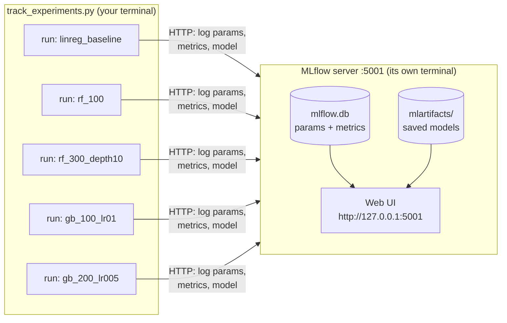

---

### Pre-Check — Port 5000 Is Taken on Macs

MLflow's default port is 5000. On macOS, **AirPlay Receiver** (process name `ControlCenter`) usually holds it:

```bash
lsof -nP -iTCP:5000 -sTCP:LISTEN
```
```
COMMAND    PID         USER   FD   TYPE ... NAME
ControlCe 1132 kumarshikhar   12u  IPv4 ... TCP *:5000 (LISTEN)
```

Two options: turn off AirPlay Receiver (System Settings → General → AirDrop & Handoff), or use another port. **We use port 5001 on this laptop.** Inside CI and Docker Compose (later tasks) MLflow still runs on 5000 — those are separate machines/networks where AirPlay doesn't exist.

---

### Step 1 — Start the MLflow Server (in Its Own Terminal)

The server must keep running while we work, so it gets a dedicated terminal window.

```bash
# NEW terminal window:
cd "/Users/kumarshikhar/MLOps Projects/NYC-Airbnb-Price-Prediction"
source .venv/bin/activate          # ⚠️ new terminal = activate again
which mlflow                       # must point into .venv/ — see the trap below

mlflow server \
  --backend-store-uri sqlite:///mlflow.db \
  --artifacts-destination ./mlartifacts \
  --host 0.0.0.0 --port 5001 \
  --allowed-hosts "localhost:*,127.0.0.1:*,host.docker.internal:*,mlflow-server:*"
```

Ready when you see:
```
INFO:     Uvicorn running on http://0.0.0.0:5001 (Press CTRL+C to quit)
```

**What each flag does:**

| Flag | Meaning |
|---|---|
| `--backend-store-uri sqlite:///mlflow.db` | Run details (params, metrics, later the model registry) go in a small database file |
| `--artifacts-destination ./mlartifacts` | Saved models go in `mlartifacts/`, **and the server hands them out over HTTP**. Clients never need direct access to the folder — that's what lets a Docker container download a model in Task 9 |
| `--host 0.0.0.0` | Accept connections from everywhere on this machine, including Docker containers (`127.0.0.1` would accept only this laptop's own programs) |
| `--port 5001` | Avoids AirPlay's port 5000 |
| `--allowed-hosts ...` | Security allow-list of names clients may use to reach the server |

> ⚠️ **The Anaconda trap.** If you see `ImportError: cannot import name 'service' from 'google.protobuf'`, your terminal is running **Anaconda's** `mlflow` (`/opt/anaconda3/bin/mlflow`), whose libraries are incompatible — not the project's. Check with `which mlflow`. Fix: `conda deactivate` (if the prompt shows `(base)`), then `source .venv/bin/activate`. Or bypass the question entirely by calling `.venv/bin/mlflow server ...`.

---

### Step 2 — Verify the Server From the Working Terminal

```bash
curl -s http://127.0.0.1:5001/health
# OK
```

Check that the allow-list really lets Docker-style names in and keeps strangers out:
```bash
for h in host.docker.internal:5001 mlflow-server:5000 evil.example.com; do
  curl -s -o /dev/null -w "$h -> %{http_code}\n" -H "Host: $h" \
    "http://127.0.0.1:5001/api/2.0/mlflow/experiments/search?max_results=1"
done
```
```
host.docker.internal:5001 -> 200
mlflow-server:5000 -> 200
evil.example.com -> 403
```

> 💡 **zsh gotcha:** quote URLs containing `?`. Unquoted, zsh treats `?` as a filename wildcard and fails with `no matches found`.

---

### Step 3 — `registry.py`: One Home for MLflow Names

```python
EXPERIMENT_NAME = "airbnb-price-prediction"
MODEL_NAME = "AirbnbPriceModel"
CHAMPION_ALIAS = "champion"


def require_tracking_uri() -> str:
    uri = os.environ.get("MLFLOW_TRACKING_URI")
    if not uri:
        sys.exit(
            "MLFLOW_TRACKING_URI is not set. Start the server (see implementation.md, Task 7) and run:\n"
            "  export MLFLOW_TRACKING_URI=http://127.0.0.1:5001"
        )
    return uri
```

**Why `require_tracking_uri`?** If `MLFLOW_TRACKING_URI` isn't set, MLflow doesn't complain — it silently writes to a local database file instead of your server. You'd then wonder why nothing appears in the UI. This check turns that silent mistake into a clear message. (Task 8 adds the model-promotion helpers to this file.)

---

### Step 4 — `track_experiments.py`: Five Runs, One Loop

The five configurations from the spec, as data:

```python
CONFIGS = {
    "linreg_baseline": (LinearRegression, {}),
    "rf_100": (RandomForestRegressor, {"n_estimators": 100, "n_jobs": -1, "random_state": RANDOM_STATE}),
    "rf_300_depth10": (RandomForestRegressor, {"n_estimators": 300, "max_depth": 10, "n_jobs": -1, "random_state": RANDOM_STATE}),
    "gb_100_lr01": (GradientBoostingRegressor, {"n_estimators": 100, "learning_rate": 0.1, "random_state": RANDOM_STATE}),
    "gb_200_lr005": (GradientBoostingRegressor, {"n_estimators": 200, "learning_rate": 0.05, "random_state": RANDOM_STATE}),
}
```

And one function that trains and logs any of them:

```python
def train_and_log(run_name, X_train, X_test, y_train, y_test):
    """Fit one config inside an MLflow run. Returns (run_id, metrics)."""
    model_class, params = CONFIGS[run_name]
    with mlflow.start_run(run_name=run_name) as run:
        model = build_model(model_class(**params)).fit(X_train, y_train)
        metrics = evaluate(model, X_test, y_test)
        mlflow.log_params(
            {"model_type": model_class.__name__, "target_transform": "log1p/expm1", **params}
        )
        mlflow.log_metrics(metrics)
        mlflow.sklearn.log_model(
            model,
            name="model",
            input_example=X_train.head(3),
            skops_trusted_types=SKOPS_TRUSTED_TYPES,
        )
    return run.info.run_id, metrics
```

**What each piece does:**
- `with mlflow.start_run(...)` — everything logged inside the `with` block belongs to one run. If the code crashes inside, MLflow marks the run `FAILED` instead of leaving it half-finished.
- `build_model(...)` — the **same** preprocessing and log-price wrapping as the baseline (Task 3). Only the regressor changes, so the comparison is fair.
- `log_params` — the settings, plus `model_type` and `target_transform` so anyone reading the run later knows what it is.
- `log_metrics` — RMSE/MAE/R² in dollars.
- `log_model(..., name="model")` — uploads the whole fitted model. Its address becomes `runs:/<run_id>/model`.
- `input_example` — three real rows saved alongside the model, documenting what input it expects.
- `n_jobs=-1` — random forests train on all CPU cores.
- `skops_trusted_types` — see Step 6; this line is the fix for a real crash.

---

### Step 5 — Test Without Touching the Real Server

Unit tests must never write junk runs to your real server. So `tests/conftest.py` gets a `local_mlflow` fixture: a **throwaway MLflow database inside a temporary folder** that pytest deletes afterwards.

```python
@pytest.fixture
def local_mlflow(tmp_path, monkeypatch):
    """A throwaway sqlite tracking store + registry, so unit tests never touch the real server."""
    previous_uri = mlflow.get_tracking_uri()
    uri = f"sqlite:///{tmp_path / 'mlflow.db'}"
    monkeypatch.setenv("MLFLOW_TRACKING_URI", uri)
    mlflow.set_tracking_uri(uri)
    experiment_id = mlflow.create_experiment(
        "test-experiment", artifact_location=(tmp_path / "artifacts").as_uri()
    )
    mlflow.set_experiment(experiment_id=experiment_id)
    yield uri
    mlflow.set_tracking_uri(previous_uri)
```

Tests (training on the 2,000-row sample, so they're fast):

| Test | What it proves |
|---|---|
| `test_configs_match_the_spec` | Exactly the 5 run names from the spec, in order |
| `test_train_and_log_records_params_metrics_and_model` | A run gets the right name, params, metrics — and its model loads back and predicts positive prices |
| `test_every_config_can_be_logged_and_loaded_back` (×5) | **Every** config — not just LinearRegression — survives a save → load round trip |

The last one was added *after* a real failure — which is the next step.

---

### Step 6 — The Crash: `UntrustedTypesFoundException` (and How We Debugged It)

The first real run died on the second model:

```
linreg_baseline  rmse=  83.54  mae= 47.08  r2=0.395
Traceback (most recent call last):
  ...
skops.io.exceptions.UntrustedTypesFoundException: Untrusted types found in the file: ['sklearn.tree._tree.Tree'].
mlflow.exceptions.MlflowException: The saved sklearn model references untrusted types.
```

**Root cause (found by reading MLflow's own source code, not by guessing):**

1. MLflow 3 saves scikit-learn models in the **skops** format by default. skops is a safer replacement for Python's `pickle` — a pickle file can run *any* code when loaded, so a malicious model file could take over your machine.
2. skops only loads object types on an **allow-list**. LinearRegression uses only allowed types. Random forests and gradient boosting store their trees in `sklearn.tree._tree.Tree`, which skops blocks by default (a crafted Tree could crash the process).
3. You can explicitly trust a type with `skops_trusted_types`. MLflow writes that list into the model's metadata (`MLmodel` file), and `mlflow.sklearn.load_model` reads it back automatically — so the fix belongs only at logging time. The API (Task 6) needs no change.

**Why didn't the tests catch it?** The original test only trained `linreg_baseline` — the one model without trees. Lesson: test *every* variant you'll actually use.

**Fix, test-first:**
1. Wrote `test_every_config_can_be_logged_and_loaded_back`, parametrized over all 5 configs → it reproduced the crash exactly: `4 failed, 1 passed` (every tree model failed, only `sklearn.tree._tree.Tree` flagged).
2. Trusted exactly that one type — nothing more:
   ```python
   SKOPS_TRUSTED_TYPES = ["sklearn.tree._tree.Tree"]
   ```
3. Re-ran → `7 passed`; full suite `33 passed`.

> ⚠️ **Trust only what you need.** The error message itself warns against trusting everything it reports "just to make a file load". We trust one type because we create these model files ourselves. Anything else unexpected would still be blocked.

> ⚠️ **Don't let a filter hide a crash.** The first run was piped through `grep`, which made the whole command report **exit code 0** even though Python crashed. Always check the real exit code of the program itself.

**Cleanup:** the crashed attempt left 2 runs on the server (a finished `linreg_baseline`, a `FAILED` `rf_100`). We soft-deleted both with `MlflowClient().delete_run(...)`, so the experiment shows exactly one clean set of five. (MLflow deletes are "soft" — runs move to a *Deleted* view and can be restored.)

---

### Step 7 — Run All Five Experiments

```bash
export MLFLOW_TRACKING_URI=http://127.0.0.1:5001
python track_experiments.py
```

Output (42 seconds):
```
linreg_baseline  rmse=  83.54  mae= 47.08  r2=0.395  run_id=3bc55499dfb64305a25185b1cd40ffc9
rf_100           rmse=  77.53  mae= 43.39  r2=0.479  run_id=d22d7f884d214953990e2cd4a3dceeaa
rf_300_depth10   rmse=  78.75  mae= 43.81  r2=0.463  run_id=23d6c14c4baf4fb1aa960a7fdcdc1fad
gb_100_lr01      rmse=  81.13  mae= 44.90  r2=0.430  run_id=22cd207e8654415cb2372bed6c144323
gb_200_lr005     rmse=  81.21  mae= 44.92  r2=0.429  run_id=8a766f1b85a241c18e357bdc6e258b83
```

Then open **http://127.0.0.1:5001** → experiment `airbnb-price-prediction`. Tick the runs and click **Compare** to see them side by side.

---

### Step 8 — Reading the Results

| Run | RMSE | MAE | R² | Saved model size |
|---|---|---|---|---|
| **rf_100** | **$77.53** | **$43.39** | **0.479** | **311 MB** |
| rf_300_depth10 | $78.75 | $43.81 | 0.463 | 38 MB |
| gb_100_lr01 | $81.13 | $44.90 | 0.430 | 3.7 MB |
| gb_200_lr005 | $81.21 | $44.92 | 0.429 | 7.1 MB |
| linreg_baseline | $83.54 | $47.08 | 0.395 | 0.3 MB |

**What this tells us:**
- **All four tree models beat the baseline** — they capture patterns a straight line can't (e.g. location effects that aren't linear in latitude/longitude).
- **RMSE and MAE agree on the ranking** here, so there's no metric conflict to resolve (with regression they don't always agree — Task 8 decides the rule).
- **The two gradient-boosting runs are nearly identical**: half the learning rate with double the trees lands in the same place.
- **The gains are real but modest** (RMSE $83.5 → $77.5). The features only describe location, room type and booking activity — no size, bedrooms or amenities — so no model can explain most of the price.
- **Size matters too.** `rf_100` grows 100 trees with **no depth limit**, so each tree is huge: 311 MB. `rf_300_depth10` is only $1.22 worse on RMSE but 8× smaller. The API downloads the champion at startup and keeps it in memory, so this trade-off is decided explicitly in Task 8.

Verified directly on the server (not just from the printout): 5 active runs, all `FINISHED`, params and metrics present, and every model downloads through the server and loads as a `TransformedTargetRegressor`.

> 💡 **Harmless warnings you'll see:** `Inferred schema contains integer column(s)...` (MLflow noting that integer columns can't hold missing values — fine, the API schema requires them) and `Failed to resolve installed pip version` (uv-made venvs don't include `pip`; MLflow just records it without a version).

---

### Step 9 — Commit

```bash
git add registry.py track_experiments.py tests/conftest.py tests/test_track_experiments.py
git commit -m "feat: MLflow experiment tracking for five regression configs"
# after the crash:
git commit -m "fix: trust sklearn Tree type so tree models can be logged with MLflow's skops format"
```

`mlflow.db` and `mlartifacts/` are **not** committed — they're in `.gitignore`. They're the server's data, not source code.

---

### What You Should Have at the End of Task 7

```
NYC-Airbnb-Price-Prediction/
├── registry.py                  ← MLflow names + require_tracking_uri
├── track_experiments.py         ← CONFIGS + train_and_log
├── mlflow.db                    ← server's run database, NOT in Git
├── mlartifacts/                 ← saved models (~360 MB), NOT in Git
├── tests/
│   ├── conftest.py              ← + local_mlflow fixture
│   └── test_track_experiments.py ← 7 tests
└── ... (Task 1–6 files)
```

**Running:** MLflow server on http://127.0.0.1:5001 (its own terminal)
**Tests:** 33 passed
**Commits:**
```
7d10a0e fix: trust sklearn Tree type so tree models can be logged with MLflow's skops format
2fae35a feat: MLflow experiment tracking for five regression configs
```

---

---

# TASK 8 — MLflow Model Registry: Promote the Champion

---

### What Problem This Solves

Task 7 gave us five runs. Now: **which one is "the" model the API should serve — and how does the API find it?**

The **Model Registry** is MLflow's catalogue of approved models:
- A **registered model** is a named slot: `AirbnbPriceModel`.
- Each time you register a run's model into it, it gets a new **version**: v1, v2, v3…
- An **alias** is a movable label pointing at one version: `@champion` → v1.

The API (Task 6) asks for `models:/AirbnbPriceModel@champion`. To ship a better model later, you register it as v2 and move `@champion` to it — the API code never changes.

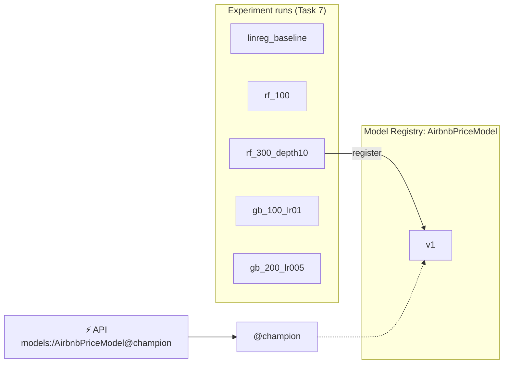

> 💡 **Aliases, not stages.** Older MLflow tutorials use "stages" (`Staging`, `Production`). That API is deprecated. Aliases do the same job with any name you like, and a version can have several.

---

### Step 1 — The Decision: Which Model Wins?

The spec says: pick the lowest RMSE, but sanity-check it. The sanity check found a real problem:

| Run | RMSE | Model size |
|---|---|---|
| rf_100 | **$77.53** | **326 MB** |
| rf_300_depth10 | $78.75 | 39 MB |

`rf_100` wins by $1.22, but its 100 unlimited-depth trees make it **8× bigger**. The API downloads the champion every time it starts and keeps it in memory; the Docker container (Task 9) and CI (Task 11) would pay that cost on every start. **We chose `rf_300_depth10`** — practically the same accuracy, far lighter.

**But a one-off manual pick isn't enough.** In Task 10, Prefect will retrain and promote *automatically*. So the decision has to be a written, testable rule:

> **Champion = the lowest RMSE among models no bigger than 100 MB.**

---

### Step 2 — Record Each Model's Size (`track_experiments.py`)

To apply a size rule, every run needs its size as a metric. MLflow already writes each model's exact size into its metadata file (`MLmodel`); reading that tiny file doesn't download the model:

```python
model_info = mlflow.sklearn.log_model(...)
size_bytes = Model.load(model_info.model_uri).model_size_bytes
metrics["model_size_mb"] = round(size_bytes / 1e6, 1)
mlflow.log_metric("model_size_mb", metrics["model_size_mb"])
```

The existing Task 7 runs didn't have this metric, so we soft-deleted them and re-ran `track_experiments.py`. Because every model uses `random_state=42`, the metrics came out **identical** — now with sizes:

```
linreg_baseline  rmse=  83.54  mae= 47.08  r2=0.395  size=   0.3MB
rf_100           rmse=  77.53  mae= 43.39  r2=0.479  size= 326.0MB
rf_300_depth10   rmse=  78.75  mae= 43.81  r2=0.463  size=  39.3MB
gb_100_lr01      rmse=  81.13  mae= 44.90  r2=0.430  size=   3.9MB
gb_200_lr005     rmse=  81.21  mae= 44.92  r2=0.429  size=   7.4MB
```

> 💡 **Why reproducibility pays off:** because the numbers matched exactly, re-running was safe — we changed *what we record*, not *what we train*.

---

### Step 3 — The Selection Rule (`registry.py`)

```python
SELECTION_METRIC = "rmse"
MAX_MODEL_SIZE_MB = 100


def pick_best(results: dict[str, dict[str, float]]) -> str:
    """results maps run_id -> metrics (incl. model_size_mb). Returns the winning run_id."""
    eligible = {
        run_id: m for run_id, m in results.items() if m["model_size_mb"] <= MAX_MODEL_SIZE_MB
    }
    if not eligible:
        raise ValueError(f"No model within the {MAX_MODEL_SIZE_MB} MB size budget")

    best = min(eligible, key=lambda run_id: eligible[run_id][SELECTION_METRIC])
    best_overall = min(results, key=lambda run_id: results[run_id][SELECTION_METRIC])
    if best_overall != best:
        print(f"note: {best_overall} has a lower RMSE but is over the {MAX_MODEL_SIZE_MB} MB budget")
    best_by_mae = min(eligible, key=lambda run_id: eligible[run_id]["mae"])
    if best_by_mae != best:
        print(f"note: lowest-RMSE run {best} differs from lowest-MAE run {best_by_mae}; RMSE decides")
    return best
```

**Why these choices:**
- **RMSE decides** — it punishes big dollar misses hardest. For a pricing tool, one $300 miss hurts more than three $100 misses.
- **MAE is still checked** — with regression, metrics can disagree. If they do, the script *says so* instead of silently picking.
- **Excluded winners are announced** — you always see when the size budget changed the outcome.
- **No eligible model → error**, not "promote nothing quietly" or "promote the oversized one anyway".

`best_run_id(experiment_name)` feeds this from the server: it searches only `FINISHED` runs, and treats a run with no `model_size_mb` metric as infinitely big — it can't prove it fits the budget.

---

### Step 4 — Register and Promote

```python
def logged_model_uri(run_id: str) -> str:
    """MLflow 3 stores a run's model as its own LoggedModel (models:/m-...), not as a run artifact."""
    outputs = MlflowClient().get_run(run_id).outputs.model_outputs
    if not outputs:
        raise ValueError(f"Run {run_id} has no logged model")
    return f"models:/{outputs[0].model_id}"


def register_and_promote(run_id: str) -> str:
    """Register the run's model and point @champion at it. Returns the new version."""
    version = mlflow.register_model(logged_model_uri(run_id), MODEL_NAME).version
    MlflowClient().set_registered_model_alias(MODEL_NAME, CHAMPION_ALIAS, version)
    return version
```

Run it:
```bash
python registry.py
```
```
Successfully registered model 'AirbnbPriceModel'.
Created version '1' of model 'AirbnbPriceModel'.
note: f0f529b7... has a lower RMSE but is over the 100 MB budget
registered AirbnbPriceModel v1 from run 63832c72... -> @champion
```

Result: **`@champion` → v1 = `rf_300_depth10`** (RMSE $78.75, 39.3 MB). In the UI: **Models → AirbnbPriceModel** shows version 1 with the `champion` alias.

> 💡 **Why `logged_model_uri` and not `runs:/<id>/model`?** Our first version registered `runs:/<run_id>/model` (the MLflow 2 style). It worked, but MLflow warned: *"Run … has no artifacts at artifact path 'model', registering model based on models:/m-… instead"*. In MLflow 3, a logged model is its own object with its own address (`models:/m-…`); the run just records which model it produced. Relying on a fallback is fragile, so we wrote a test that fails on that warning, then switched to registering the model's real address.

---

### Step 5 — Tests

Unit tests (throwaway `local_mlflow` database — never your real server):

| Test | What it proves |
|---|---|
| `test_pick_best_uses_lowest_rmse_within_size_budget` | A 326 MB model with the best RMSE is skipped; the 39 MB runner-up wins |
| `test_pick_best_prefers_rmse_when_mae_disagrees` | RMSE is the deciding metric |
| `test_pick_best_refuses_when_no_model_fits_the_budget` | Raises instead of promoting something oversized |
| `test_register_and_promote_sets_champion_alias` | `@champion` points at the new version and loads |
| `test_promoting_again_moves_the_alias` | A second promotion creates v2 and moves the alias |
| `test_register_uses_the_runs_logged_model_not_a_fallback` | No fallback warning; the version's source is `models:/m-…` |

**Real-registry tests** — `tests/test_model_registry.py` (spec Phase 9). These load the actual champion from your server through `models:/AirbnbPriceModel@champion` (not joblib) and check that predictions make economic sense:

| Test | What it proves |
|---|---|
| `test_manhattan_entire_home_costs_more_than_bronx_shared_room` | Direction makes sense |
| `test_predictions_are_plausible_dollar_amounts` (×2) | Prices are between $10 and $800 |

Regression has no "0.5 threshold" to test against like classification did, so direction and plausibility are the sanity checks.

They're **skipped** (with a clear reason) when `MLFLOW_TRACKING_URI` isn't set, so the rest of the suite still runs without a server:
```bash
MLFLOW_TRACKING_URI=http://127.0.0.1:5001 pytest tests/test_model_registry.py -v   # 3 passed
env -u MLFLOW_TRACKING_URI pytest tests/test_model_registry.py -v -rs             # 3 skipped
```

**Safety check:** we counted experiments, runs and model versions on the server before and after running the full suite with the server configured — identical (`experiments=2 runs=12 model_versions=1`). Unit tests don't leak into your real server.

---

### Step 6 — Definition of Done: Load From a Separate Process, Then Serve

The spec's Phase 7 test: a **brand-new Python process** — knowing nothing except the registry address — loads and predicts:

```bash
export MLFLOW_TRACKING_URI=http://127.0.0.1:5001
python -c "
import mlflow.sklearn, pandas as pd
from schemas import EXAMPLE_LISTING
m = mlflow.sklearn.load_model('models:/AirbnbPriceModel@champion')
print(type(m).__name__, round(float(m.predict(pd.DataFrame([EXAMPLE_LISTING]))[0]), 2))"
```
```
TransformedTargetRegressor 244.25
```

And through the real API:
```bash
uvicorn main:app --port 8000
```
```
INFO:     Loading models:/AirbnbPriceModel@champion from http://127.0.0.1:5001
INFO:     Model loaded
INFO:     Application startup complete.
```

| Listing | `/predict` |
|---|---|
| Midtown (Manhattan) entire home | **$244.25** — same as the separate process ✅ |
| Williamsburg (Brooklyn) entire home | $190.16 |
| Midtown (Manhattan) private room | $129.44 |
| Fordham (Bronx) shared room | $38.59 |

Manhattan > Brooklyn, entire home > private room > shared room — sensible. ✅

> 💡 **Try it yourself:** with the MLflow server running, in a terminal with the venv active:
> ```bash
> export MLFLOW_TRACKING_URI=http://127.0.0.1:5001
> uvicorn main:app --port 8000
> ```
> Open http://127.0.0.1:8000/docs → **POST /predict → Try it out → Execute**. Change the `room_type` or `neighbourhood_group` and watch the price move. Stop with Ctrl-C.

---

### Step 7 — Commit

```bash
git add registry.py track_experiments.py tests/test_track_experiments.py tests/test_model_registry.py docs/
git commit -m "feat: register best run as AirbnbPriceModel@champion with a 100 MB size budget"
```

---

### What You Should Have at the End of Task 8

```
NYC-Airbnb-Price-Prediction/
├── registry.py                   ← + size budget, pick_best, logged_model_uri, register_and_promote
├── track_experiments.py          ← + model_size_mb metric
├── tests/
│   ├── test_track_experiments.py ← 13 tests
│   └── test_model_registry.py    ← 3 tests against the real champion
└── ... (Task 1–7 files)
```

**MLflow registry:** `AirbnbPriceModel` v1 = `rf_300_depth10`, alias `@champion`
**Tests:** 42 passed with the server configured (39 passed + 3 skipped without it)
**Commit:** `772e04a feat: register best run as AirbnbPriceModel@champion with a 100 MB size budget`

---

---

# TASK 9 — Docker Image for the API

---

### What Problem This Solves

The API works on this laptop because the laptop has Python 3.11, a `.venv` with exactly the right libraries, and our code. Another machine — a cloud server, a teammate's laptop, CI — has none of that. "It works on my machine" is the classic deployment failure.

A **Docker image** is a sealed box containing an operating system, Python, the exact libraries and our code. Any machine with Docker runs it identically. A running copy of an image is a **container**.


---

### The Big Decision: Don't Put the Model in the Image

The spec asks us to decide: train during the build, copy a model file in, or neither? **Neither.** The image contains only code and libraries; the container downloads `@champion` from MLflow when it starts.

| Approach | New model means... | Our choice |
|---|---|---|
| Train inside `docker build` | Rebuild the image (slow; build needs the data) | ❌ |
| Copy `model.pkl` into the image | Rebuild the image | ❌ |
| **Load `@champion` from MLflow at startup** | **Just restart the container** | ✅ |

**Trade-off:** the container needs to reach the MLflow server when it starts. That's why the fail-fast settings (Task 6) matter, and why Docker Compose (Task 13) starts MLflow first.

---

### Step 1 — `requirements-serve.txt`: Only What the API Needs

The full `requirements.txt` includes training tools (Prefect, pytest, the full MLflow server). The API needs far less, so it gets its own file — same versions, fewer packages:

```text
# API image only. Versions must match requirements.txt (same sklearn that trained the model).
fastapi==0.141.1
numpy==2.4.6
pandas==3.0.6
pydantic==2.13.5
scikit-learn==1.9.1
uvicorn==0.53.0
mlflow-skinny==3.16.1
# mlflow-skinny doesn't include skops, but MLflow 3 saves our models in skops format.
skops==0.16.0
```

**What this does:**
- **Same scikit-learn version as training** — a model saved by one scikit-learn version may fail to load, or behave differently, in another.
- **`mlflow-skinny`** — MLflow's lightweight client: it can load models from a server, without the tracking server, UI and heavy extras of full `mlflow`.
- **`skops`** — see the bug in Step 5.

---

### Step 2 — `.dockerignore`: Keep the Build Small and Safe

Docker sends the project folder to the build (the "build context"). `.dockerignore` excludes what the image must never contain:

```
.venv
.git
.dvc/cache
.dvc/tmp
data
models
mlruns
mlartifacts
mlflow.db
mlflow.log
tests
docs
__pycache__
*.pyc
.pytest_cache
```

Without it, Docker would upload the 7 MB dataset, the ~700 MB of MLflow artifacts and the whole `.venv` on every build — slow, and it risks shipping data inside the image.

---

### Step 3 — The `Dockerfile`

```dockerfile
FROM python:3.11-slim

ENV PYTHONDONTWRITEBYTECODE=1 \
    PYTHONUNBUFFERED=1

WORKDIR /app

# Dependencies before code: editing main.py doesn't bust the pip layer cache.
COPY requirements-serve.txt .
RUN pip install --no-cache-dir -r requirements-serve.txt

COPY schemas.py main.py ./

ENV MLFLOW_HTTP_REQUEST_MAX_RETRIES=3 \
    MLFLOW_HTTP_REQUEST_TIMEOUT=10

RUN useradd --create-home appuser
USER appuser

EXPOSE 8000
CMD ["uvicorn", "main:app", "--host", "0.0.0.0", "--port", "8000"]
```

**Line by line:**

| Line | What it does |
|---|---|
| `FROM python:3.11-slim` | Start from official Python 3.11 on a minimal Debian — same Python as our `.venv` |
| `PYTHONDONTWRITEBYTECODE=1` | Don't write `.pyc` cache files (useless in a container) |
| `PYTHONUNBUFFERED=1` | Print logs immediately, so `docker logs` shows them in real time |
| `WORKDIR /app` | All following commands run in `/app` |
| `COPY requirements-serve.txt` → `RUN pip install` | Install libraries **before** copying code (see layer caching below) |
| `COPY schemas.py main.py ./` | Only the two files the API needs — `features.py`, `train.py` etc. aren't required to *serve* |
| `ENV MLFLOW_HTTP_REQUEST_...` | Fail fast if MLflow is unreachable (Task 6's finding) |
| `useradd` / `USER appuser` | Run as an ordinary user, not root — if the app were ever compromised, the attacker isn't root inside the container |
| `EXPOSE 8000` | Documents the port the app listens on |
| `CMD [...]` | What runs when the container starts. `--host 0.0.0.0` is essential: `127.0.0.1` inside a container is unreachable from outside it |

> 💡 **Layer caching.** Each Dockerfile instruction creates a *layer*, and Docker reuses unchanged layers on rebuild. Our layers:
> ```
> 506MB   RUN pip install --no-cache-dir -r requirements-serve.txt
> 16.4kB  COPY schemas.py main.py ./
> ```
> Because code is copied *after* the libraries, editing `main.py` only rebuilds the 16 KB layer — the 506 MB install is reused. Copy code first and every one-line edit would reinstall everything.

---

### Step 4 — Build the Image

```bash
docker build -t airbnb-price-api:local .
```

**What this does:** reads the `Dockerfile` in `.` (this folder) and names the result `airbnb-price-api` with tag `local`. First build: ~50 seconds.

```bash
docker images airbnb-price-api:local --format '{{.Size}}'
# 850MB
```

**Where the size comes from** — almost all of it is the scientific Python stack the model genuinely needs:

| Package | Size |
|---|---|
| scipy | 122 MB |
| pandas | 79 MB |
| scikit-learn | 59 MB |
| numpy | 42 MB (+29 MB libs) |
| mlflow (skinny) | 37 MB |

---

### Step 5 — Run It… and the First Two Surprises

```bash
docker run -d --name airbnb-api -p 8001:8000 \
  -e MLFLOW_TRACKING_URI=http://host.docker.internal:5001 \
  airbnb-price-api:local
```

**What the flags mean:**

| Flag | Meaning |
|---|---|
| `-d` | Run in the background ("detached") |
| `--name airbnb-api` | A name to refer to it by |
| `-p 8001:8000` | Mac port 8001 → container port 8000 |
| `-e MLFLOW_TRACKING_URI=...` | Environment variable inside the container |
| `host.docker.internal` | Docker Desktop's special name for **your Mac** as seen from inside a container. `127.0.0.1` inside a container means the container itself, not your Mac! |

**Surprise 1 — `port is already allocated`.** We first tried `-p 8000:8000`:
```
Bind for 0.0.0.0:8000 failed: port is already allocated
```
`docker ps` showed a container from a different project (`ai-engineering-bootcamp-api-1`) already publishing port 8000 — it restarted automatically when Docker Desktop opened. Rather than stop someone else's container, we use Mac port **8001**. Inside the container the API still listens on 8000; only the outside mapping changes.

> 💡 **Finding who holds a port:** `lsof -nP -iTCP:8000 -sTCP:LISTEN`. If it says `com.docker.backend`, a container owns it — run `docker ps` to see which.

**Surprise 2 — `No module named 'skops'`.**
```
INFO:     Loading models:/AirbnbPriceModel@champion from http://host.docker.internal:5001
ModuleNotFoundError: No module named 'skops'
ERROR:    Application startup failed. Exiting.
```

We had actually predicted this before building: checking dependencies showed `skops` is installed by the full `mlflow` package but **not** by `mlflow-skinny`. And since Task 7, MLflow saves our models in skops format. We built once without it anyway to *see* the failure rather than assume it.

Notice what the log also proves:
- The container **reached MLflow** through `host.docker.internal:5001` — networking and the `--allowed-hosts` list work.
- It **failed fast and clearly** instead of hanging.

**Fix:** pin `skops==0.16.0` (the venv's exact version) in `requirements-serve.txt`, with a comment explaining why, then rebuild.

---

### Step 6 — Verify the Container

After the rebuild:
```
INFO:     Loading models:/AirbnbPriceModel@champion from http://host.docker.internal:5001
INFO:     Model loaded
INFO:     Application startup complete.
```
Ready in about 2 seconds.

```bash
curl -s localhost:8001/health
# {"status":"ok","model_uri":"models:/AirbnbPriceModel@champion"}
```

| Listing | From the container | From Task 8 (laptop) |
|---|---|---|
| Midtown entire home | $244.25 | $244.25 ✅ |
| Midtown private room | $129.44 | $129.44 ✅ |
| Williamsburg entire home | $190.16 | $190.16 ✅ |
| Fordham shared room | $38.59 | $38.59 ✅ |
| `latitude: -75` | HTTP 422 | HTTP 422 ✅ |

Identical to the cent — the same model with the same library versions.

Hygiene checks:
```bash
docker exec airbnb-api whoami          # appuser            (not root ✅)
docker exec airbnb-api ls /app         # main.py requirements-serve.txt schemas.py   (no data/models ✅)
docker exec airbnb-api printenv MLFLOW_HTTP_REQUEST_MAX_RETRIES MLFLOW_HTTP_REQUEST_TIMEOUT
# 3
# 10
```

**Fail-fast check** — MLflow unreachable (wrong port on purpose):
```bash
docker run --name airbnb-api-dead -e MLFLOW_TRACKING_URI=http://host.docker.internal:5999 airbnb-price-api:local
```
```
INFO:     Loading models:/AirbnbPriceModel@champion from http://host.docker.internal:5999
ERROR:    Application startup failed. Exiting.
```
Exited with code 3 after **14 seconds** — exactly the retry budget we set — instead of the ~4-minute silent hang we measured in Task 6. ✅

Clean up test containers:
```bash
docker rm -f airbnb-api airbnb-api-dead
```

---

### Step 7 — Commit

```bash
git add requirements-serve.txt Dockerfile .dockerignore
git commit -m "feat: slim Docker image that loads the champion from MLflow at startup"
```

---

### What You Should Have at the End of Task 9

```
NYC-Airbnb-Price-Prediction/
├── Dockerfile                  ← python:3.11-slim, non-root, fail-fast env
├── .dockerignore               ← keeps data, models, venv, tests out of the image
├── requirements-serve.txt      ← API-only deps (+ skops)
└── ... (Task 1–8 files)
```

**Docker image:** `airbnb-price-api:local` (850 MB, of which our code is 16 KB)
**Run it:**
```bash
docker run -d --name airbnb-api -p 8001:8000 \
  -e MLFLOW_TRACKING_URI=http://host.docker.internal:5001 airbnb-price-api:local
# → http://localhost:8001/docs
```
**Commit:** `a1b9c73 feat: slim Docker image that loads the champion from MLflow at startup`

---

---

# TASK 10 — Prefect: Automated Retraining

---

### What Problem This Solves

Right now retraining means a person running `python track_experiments.py`, then `python registry.py`, in the right order, and remembering to do it at all. Real models go stale: new listings arrive, prices shift. We want the whole pipeline to run **by itself, on a schedule**. When a step fails (the data file is briefly unavailable, say), it should retry automatically, and afterwards we should be able to see what happened.

**Prefect** is an *orchestrator*: you mark Python functions as **tasks**, combine them in a **flow**, and Prefect handles retries, logging, a run history and scheduling. The **Prefect server** keeps that history and shows it in a dashboard.


We now have three long-running terminals:

| Terminal | Runs |
|---|---|
| 1 | MLflow server (`:5001`) |
| 2 | Your working terminal |
| 3 | Prefect server (`:4200`) |

---

### Step 1 — `scripts/trigger_deploy.py`: The Hand-Off to CD (Tested Now, Used in Task 12)

The last step of the flow asks GitHub Actions to build and publish a new image. GitHub has an API for "run this workflow now" (a `workflow_dispatch`):

```python
def trigger_deploy(model_version: str, repo: str, token: str, ref: str = "main") -> bool:
    response = requests.post(
        f"https://api.github.com/repos/{repo}/actions/workflows/{WORKFLOW_FILE}/dispatches",
        headers={
            "Accept": "application/vnd.github+json",
            "Authorization": f"Bearer {token}",
            "X-GitHub-Api-Version": "2022-11-28",
        },
        json={"ref": ref, "inputs": {"model_version": str(model_version)}},
        timeout=10,
    )
    # GitHub answers 204 (or 200 when returning run details) on success.
    if response.status_code not in (200, 204):
        print(f"deploy trigger failed: {response.status_code} {response.text}", file=sys.stderr)
        return False
    return True
```

We don't have a GitHub repo yet, so the tests replace `requests.post` with a fake (the same `monkeypatch` trick as the API's fake model) and check what *would* be sent:

| Test | What it proves |
|---|---|
| `test_trigger_deploy_dispatches_deploy_workflow` | Correct URL, `Bearer` token, and `model_version` input |
| `test_trigger_deploy_accepts_200_with_run_details` | Both of GitHub's success codes count as success |
| `test_trigger_deploy_reports_failure` | A `401 Bad credentials` returns `False` instead of pretending it worked |

---

### Step 2 — `orchestrate_training.py`: The Flow

```python
@task(retries=2, retry_delay_seconds=5)
def load_data():
    return features.clean_data(features.load_data())


@task
def split_data(df):
    return features.split_data(df)


@task
def train_and_log(run_name, splits):
    run_id, metrics = track_experiments.train_and_log(run_name, *splits)
    get_run_logger().info(...)
    return run_id, metrics


@task
def promote_best_model(results):
    run_id = pick_best(results)
    version = register_and_promote(run_id)
    ...
    return version


@task
def request_deploy(version):
    repo, token = os.environ.get("GITHUB_REPO"), os.environ.get("GITHUB_TOKEN")
    if not (repo and token):
        get_run_logger().warning("GITHUB_REPO/GITHUB_TOKEN not set; skipping deploy trigger")
        return False
    return trigger_deploy(version, repo, token)


@flow(name="airbnb-price-training")
def training_flow():
    require_tracking_uri()
    mlflow.set_experiment(EXPERIMENT_NAME)
    splits = split_data(load_data())
    results = {}
    for run_name in track_experiments.CONFIGS:
        run_id, metrics = train_and_log(run_name, splits)
        results[run_id] = metrics
    version = promote_best_model(results)
    request_deploy(version)
    return version
```

**What this does:**
- **The tasks are thin wrappers.** All the real logic already exists and is tested: `features.py`, `track_experiments.train_and_log`, `registry.pick_best` / `register_and_promote`. Prefect adds retries, logging and history *around* it, so there's no duplicated logic.
- **`@task(retries=2, retry_delay_seconds=5)` on `load_data` only** — loading data is the step most likely to fail temporarily (a network drive, a slow `dvc pull`). Retrying training wouldn't fix a bug in the code.
- **`MLFLOW_TRACKING_URI` comes from the environment** (`require_tracking_uri()`), never hardcoded.
- **The same size-budget rule as Task 8** picks the winner, so an automatic run makes the same choice you made by hand.
- **Deploy is optional.** No GitHub credentials → a clear warning, and the flow still succeeds.

---

### Step 3 — Pre-Check: Where Is Prefect's Server?

```bash
prefect config view
# PREFECT_PROFILE='local'
# PREFECT_API_URL='http://127.0.0.1:4200/api' (from profile)
```

This machine's Prefect profile (from an earlier project) already points at a server on port 4200, so even a one-off run needs that server running. It wasn't:

```bash
curl -s http://127.0.0.1:4200/api/health     # connection refused
```

> ⚠️ **The Anaconda trap, again.** Anaconda also ships a `prefect` (`/opt/anaconda3/bin/prefect`). In any new terminal, check `which prefect` points into `.venv/`.

Start the server in **terminal 3**:
```bash
cd "/Users/kumarshikhar/MLOps Projects/NYC-Airbnb-Price-Prediction"
conda deactivate          # only if the prompt shows (base)
source .venv/bin/activate # ⚠️ new terminal = activate again
which prefect             # .../.venv/bin/prefect
prefect server start
```

Dashboard: **http://127.0.0.1:4200**. It keeps its history in `~/.prefect/prefect.db`, shared across projects, so you'll also see runs from earlier ones.

---

### Step 4 — Run the Flow by Hand First

The spec says to schedule only after a manual run works:

```bash
export MLFLOW_TRACKING_URI=http://127.0.0.1:5001
python orchestrate_training.py
```

Output (47 seconds, trimmed):
```
Task run 'load_data-fdf' - Finished in state Completed()
Task run 'split_data-2e8' - Finished in state Completed()
Task run 'train_and_log-c11' - linreg_baseline rmse=83.54 mae=47.08 r2=0.395 size=0.3MB
Task run 'train_and_log-37d' - rf_100 rmse=77.53 mae=43.39 r2=0.479 size=326.0MB
Task run 'train_and_log-524' - rf_300_depth10 rmse=78.75 mae=43.81 r2=0.463 size=39.3MB
Task run 'train_and_log-82f' - gb_100_lr01 rmse=81.13 mae=44.90 r2=0.430 size=3.9MB
Task run 'train_and_log-4bf' - gb_200_lr005 rmse=81.21 mae=44.92 r2=0.429 size=7.4MB
Task run 'promote_best_model-184' - promoted run c12ba16c... as AirbnbPriceModel v2 @champion
Task run 'request_deploy-710' - GITHUB_REPO/GITHUB_TOKEN not set; skipping deploy trigger
Flow run 'loyal-cow' - Finished in state Completed()
note: 2d27675c... has a lower RMSE but is over the 100 MB budget
```

Verified separately (not just from the log):
```
@champion -> v2: rf_300_depth10 (run c12ba16c), rmse=78.75, size=39.3MB
prefect flow run: loyal-cow | COMPLETED | 44.5 s
```

> 💡 Prefect gives every run a random two-word name (`loyal-cow`, `hopeful-llama`…) so they're easy to tell apart in the dashboard.

---

### Step 5 — Prove the Retries Actually Work

Point the flow at a file that doesn't exist:

```bash
DATA_PATH=nope.csv python orchestrate_training.py
```
```
20:44:15.348 | Task run 'load_data-b32' - ... FileNotFoundError ... - Retry 1/2 will start 5 second(s) from now
20:44:20.357 | Task run 'load_data-b32' - ... FileNotFoundError ... - Retry 2/2 will start 5 second(s) from now
20:44:25.365 | Task run 'load_data-b32' - ... FileNotFoundError ... - Retries are exhausted
20:44:26.400 | Flow run 'russet-piculet' - Finished in state Failed("... No such file or directory: 'nope.csv'")
```

| Check | Result |
|---|---|
| Attempts | 3 (1 try + 2 retries) ✅ |
| Gap between attempts | exactly 5 seconds (15.3 → 20.4 → 25.4) ✅ |
| Flow outcome | `Failed`, exit code 1, real cause shown ✅ |
| MLflow before → after | 17 runs, 2 versions → 17 runs, 2 versions — nothing trained on bad data ✅ |

---

### Step 6 — Schedule It

```bash
python orchestrate_training.py --serve
```

which calls:
```python
training_flow.serve(name="weekly-retrain", cron="0 3 * * 1")  # Mondays 03:00
```

**What `.serve()` does:**
1. Registers a **deployment**, a named, scheduled version of the flow: `airbnb-price-training/weekly-retrain`.
2. Keeps running, polling the Prefect server for runs that are due, and executes them.

```
Your flow 'airbnb-price-training' is being served and polling for scheduled runs!
To trigger a run for this flow, use the following command:
        $ prefect deployment run 'airbnb-price-training/weekly-retrain'
```

**Reading the cron `0 3 * * 1`:** minute 0, hour 3, any day of the month, any month, weekday 1 (Monday). The timezone is empty, which means **UTC**.

We then triggered one run *through the deployment* to prove the scheduled path works end to end, not just a direct Python call:

```bash
prefect deployment run 'airbnb-price-training/weekly-retrain'
# Created flow run 'hopeful-llama'.
```
The serving process picked it up, retrained all five, and finished:
```
promoted run e40349c5... as AirbnbPriceModel v3 @champion
Flow run 'hopeful-llama' - Finished in state Completed()
```

> ⚠️ **The serving process must keep running for the schedule to fire.** When we stopped it, Prefect paused the schedule cleanly:
> ```
> prefect.runner - Pausing all deployments...
> prefect.runner - All deployments have been paused!
> ```
> A laptop that's asleep at 03:00 Monday won't retrain anyway. To keep it live on this machine, run `python orchestrate_training.py --serve` in its own terminal (venv active, `MLFLOW_TRACKING_URI` exported). In real deployments, the serving process lives on an always-on server.

---

### Step 7 — Known Issue: Disk Usage Grows With Every Retrain

After four full training rounds, `mlartifacts/` is **1.4 GB**. Each round saves about 377 MB, and 326 MB of that is `rf_100`, the unlimited-depth forest that the size budget never promotes. On a weekly schedule that's about 20 GB a year.

Possible fixes, not applied yet:
- Delete old, non-champion runs periodically, then run `mlflow gc` to free their files.
- Drop `rf_100` from the scheduled flow (a deviation from the spec's five configs).
- Cap its depth.

---

### Step 8 — Commit

```bash
git add orchestrate_training.py scripts/trigger_deploy.py tests/test_trigger_deploy.py
git commit -m "feat: Prefect training flow with retries, promotion and deploy trigger"
```

---

### What You Should Have at the End of Task 10

```
NYC-Airbnb-Price-Prediction/
├── orchestrate_training.py       ← Prefect flow + --serve schedule
├── scripts/
│   └── trigger_deploy.py         ← asks GitHub to run deploy.yml
├── tests/
│   └── test_trigger_deploy.py    ← 3 tests with a fake HTTP call
└── ... (Task 1–9 files)
```

**Running:** Prefect server on http://127.0.0.1:4200 (terminal 3)
**Prefect deployment:** `airbnb-price-training/weekly-retrain`, cron `0 3 * * 1` (UTC), currently **paused**
**MLflow registry:** `@champion` → **v3** (`rf_300_depth10`, promoted automatically by the flow)
**Tests:** 45 passed with the MLflow server configured
**Commit:** `d59e688 feat: Prefect training flow with retries, promotion and deploy trigger`

---

---

# TASK 11 — GitHub Actions CI

---

### What Problem This Solves

Our 45 tests only protect us if someone runs them. People forget, or run them with a server they've tweaked by hand. **Continuous Integration (CI)** runs the tests *automatically* on a clean machine for every proposed change, and shows a ✅ or ❌ on the pull request before anything is merged.

**GitHub Actions** is GitHub's built-in CI. A YAML file in `.github/workflows/` says *when* to run (a pull request is opened or updated) and *what* to run.

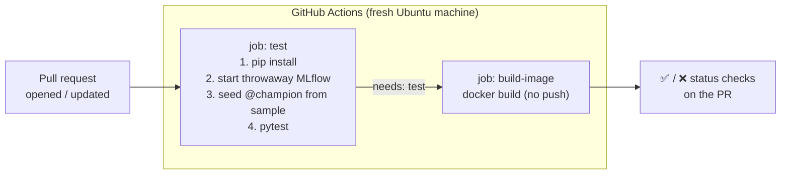

**The CI puzzle:** our tests include real-registry tests that need an MLflow server with a `@champion`, and training needs data. But the runner is a brand-new machine: no MLflow server, and no access to the DVC remote on this laptop. The workflow therefore builds everything it needs from scratch, every time:
- a **throwaway MLflow server**, started inside the job;
- a **quick champion**, trained on the committed 2,000-row sample (Task 3) by `scripts/ci_seed_model.py`.

---

### Step 1 — `scripts/ci_seed_model.py`

```python
def main():
    require_tracking_uri()
    mlflow.set_experiment(EXPERIMENT_NAME)
    run_id, metrics = train_and_log("linreg_baseline", *split_data(clean_data(load_data())))
    version = register_and_promote(run_id)
    print(f"seeded AirbnbPriceModel v{version} @champion (rmse={metrics['rmse']:.2f})")
```

It reuses the exact same `train_and_log` and `register_and_promote` as the real pipeline — no CI-only shortcuts. `load_data()` reads `$DATA_PATH`, which CI points at the sample. It uses LinearRegression because it's the fastest to train; CI checks that the *plumbing* works, not which model is best.

Run it as a module from the project root: `python -m scripts.ci_seed_model` (see the `-m` note in Task 3).

---

### Step 2 — `.github/workflows/ci.yml`

```yaml
name: CI

on:
  pull_request:

jobs:
  test:
    runs-on: ubuntu-latest
    env:
      MLFLOW_TRACKING_URI: http://127.0.0.1:5000
      # The DVC remote lives on a laptop; CI trains on the committed sample.
      DATA_PATH: tests/fixtures/listings_sample.csv
      MLFLOW_DISABLE_AGENT_HINT: "1"
    steps:
      - uses: actions/checkout@v7
      - uses: actions/setup-python@v7
        with:
          python-version: "3.11"
          cache: pip
      - run: pip install -r requirements.txt
      - name: Start ephemeral MLflow server
        run: |
          mlflow server --backend-store-uri sqlite:///mlflow.db \
            --artifacts-destination ./mlartifacts \
            --host 127.0.0.1 --port 5000 > mlflow.log 2>&1 &
          for i in $(seq 1 60); do
            curl -sf http://127.0.0.1:5000/health && exit 0
            sleep 2
          done
          cat mlflow.log
          exit 1
      - name: Seed AirbnbPriceModel@champion
        run: python -m scripts.ci_seed_model
      - run: pytest -v

  build-image:
    needs: test
    runs-on: ubuntu-latest
    steps:
      - uses: actions/checkout@v7
      - uses: docker/setup-buildx-action@v4
      - uses: docker/build-push-action@v7
        with:
          context: .
          push: false
          tags: airbnb-price-api:ci
          cache-from: type=gha
          cache-to: type=gha,mode=max
```

**Reading it:**

| Part | Meaning |
|---|---|
| `on: pull_request` | Run whenever a PR is opened or gets new commits. A plain push to `main` runs nothing |
| `runs-on: ubuntu-latest` | A fresh Linux virtual machine, thrown away afterwards |
| `env:` (job level) | Environment variables for every step. Port **5000** is fine here: no AirPlay on GitHub's Linux machines |
| `actions/checkout` | Downloads the repo's code into the machine |
| `setup-python` + `cache: pip` | Installs Python 3.11 and caches downloaded packages between runs, keyed on `requirements.txt` |
| `mlflow server ... &` | `&` runs the server in the background so the job can continue |
| The `for` loop | **Waits until the server is actually ready** (polling `/health`) instead of guessing with `sleep 30`. If it never comes up, it prints the server log and fails the job, so the error message is useful |
| `needs: test` | `build-image` only starts if `test` passed; no point building an image from broken code |
| `push: false` | Build the image to prove the `Dockerfile` works, but don't publish it. Publishing unreviewed PR code would be risky; that's Task 12's controlled job |
| `cache-from/to: type=gha` | Stores Docker layers in GitHub's cache so later builds reuse them |

> 💡 **Use current action versions.** Our original plan listed `checkout@v4`, `setup-python@v5` and so on. Before writing the file we checked each action's latest major version (`git ls-remote --tags https://github.com/actions/checkout.git`) and found newer ones: `checkout@v7`, `setup-python@v7`, `setup-buildx-action@v4`, `build-push-action@v7`. Old versions eventually stop working when GitHub retires the runtime they depend on.

---

### Step 3 — Rehearse CI Locally First

Pushing and waiting minutes to discover a typo is slow. We ran the same steps on the laptop against a throwaway server in a temporary folder (port 5055, so the real MLflow on 5001 is untouched):

```bash
T=$(mktemp -d)
(cd "$T" && exec mlflow server --backend-store-uri sqlite:///mlflow.db \
   --artifacts-destination ./mlartifacts --host 127.0.0.1 --port 5055 > mlflow.log 2>&1) &
until curl -sf http://127.0.0.1:5055/health >/dev/null; do sleep 2; done

export MLFLOW_TRACKING_URI=http://127.0.0.1:5055 DATA_PATH=tests/fixtures/listings_sample.csv
python -m scripts.ci_seed_model
pytest -q

pkill -f "mlflow server.*--port 5055"; rm -rf "$T"
```
```
seeded AirbnbPriceModel v1 @champion (rmse=93.98)
45 passed
```

**45 passed, none skipped**, so the real-registry tests ran against the seeded champion. The sample-trained model's RMSE ($93.98) is worse than the full-data one ($83.54), as expected: less data. That's fine, because it only needs to pass the "Manhattan costs more than the Bronx" and "$10–$800" sanity checks.

> 💡 **The parentheses matter.** `(cd "$T" && exec mlflow server ...) &` runs the `cd` inside a background subshell, so your own terminal stays in the project folder. Without them, a later `cd -` would jump somewhere unexpected; we caught exactly this bug in the plan during the Task 3 audit.

---

### Step 4 — Before Going Public: Review What You're Publishing

The repository is **public**, so before the first push we checked exactly what would be uploaded:

| Check | Result |
|---|---|
| Tracked files | 37, all code, config and docs |
| Dataset | Not included; only the `.dvc` pointer file (DVC's job) |
| Largest file | `tests/fixtures/listings_sample.csv`, 142 KB, model columns only (no names or IDs) |
| Secrets / tokens | None found |
| **Commit author email** | ⚠️ `kumarshikhar597@gmail.com` on every commit, which GitHub shows publicly |
| Local paths | `/Users/kumarshikhar/...` in 7 places (low risk) |

**Fixing the email *before* the first push.** GitHub gives every account a private "noreply" address: `<account-id>+<username>@users.noreply.github.com`. The account ID is public (`https://api.github.com/users/<username>` → `id`):

```bash
# 1. Use the noreply address for THIS repository only (other projects unaffected)
git config user.email "44173053+shikharkumar13@users.noreply.github.com"

# 2. Rewrite the author/committer email on all existing local commits
FILTER_BRANCH_SQUELCH_WARNING=1 git filter-branch -f --env-filter \
  "export GIT_AUTHOR_EMAIL='44173053+shikharkumar13@users.noreply.github.com' \
          GIT_COMMITTER_EMAIL='44173053+shikharkumar13@users.noreply.github.com'" -- --all

# 3. Remove filter-branch's local backup of the old commits
git update-ref -d refs/original/refs/heads/main
git reflog expire --expire=now --all && git gc -q --prune=now
```

We checked afterwards:
- **file contents identical** before and after (same Git tree), so only author details changed;
- **0** Gmail references left in the history.

> ⚠️ **Rewriting history is only safe before you push.** It gives every commit a new ID (hash). Nobody had a copy yet, so this was harmless. After pushing, rewriting would break everyone else's copy, and the old commits would already be public. It also changed the commit hashes quoted in this guide, so those were updated too.

---

### Step 5 — Connect and Push

```bash
git remote add origin https://github.com/shikharkumar13/-NYC-Airbnb-Price-Prediction-MLOps.git
git push --dry-run -u origin main   # checks your login without uploading anything
git push -u origin main
```
```
 * [new branch]      main -> main
branch 'main' set up to track 'origin/main'.
```

**What these do:**
- `remote add origin` stores the GitHub address under the short name `origin`.
- `--dry-run` goes through authentication and shows what *would* happen. On this Mac, Homebrew's git uses the macOS Keychain (`credential.helper = osxkeychain`), which already held a GitHub login.
- `-u` links local `main` to `origin/main`, so later a plain `git push` / `git pull` knows where to go.

---

### Step 6 — Definition of Done: A Real Pull Request

CI only runs on pull requests, so we made a small but useful change on a new branch (README sections explaining the tests and CI) and pushed it:

```bash
git switch -c ci-smoke-test
# ... edit README.md ...
git commit -am "docs: README sections for tests and CI"
git push -u origin ci-smoke-test
```

Then on GitHub: **Compare & pull request → Create pull request** → PR #1.

Result, watched live through GitHub's API:

| Job | Result | Time | Slowest steps |
|---|---|---|---|
| **test** | ✅ success | 2 m 31 s | `pip install` 55 s · `pytest -v` 58 s · MLflow start 12 s · seed 12 s |
| **build-image** | ✅ success | 1 m 16 s | `docker build` 58 s |

Every step of `test` succeeded: MLflow server started → `@champion` seeded → `pytest -v` passed. The PR page shows both checks green.

Pushing another commit to the PR re-ran CI, and the caches kicked in:

| Job | 1st run | 2nd run (cached) |
|---|---|---|
| test | 2 m 31 s (pip install 55 s) | 2 m 05 s (pip install 43 s) |
| build-image | 1 m 16 s | **31 s** — Docker layers reused from GitHub's cache |

The Docker build halved because the 506 MB dependency layer (Task 9) was unchanged and reused.

After merging, GitHub's **"Delete branch"** button removes the PR branch on GitHub; locally, `git fetch --prune` then `git branch -d <branch>` tidies up.

> 💡 **See the logs yourself:** on the PR, click **Details** next to a check → the **test** job → the **Run pytest -v** step. You'll find `tests/test_model_registry.py ... PASSED`, which proves the registry tests really ran in CI (they only skip when `MLFLOW_TRACKING_URI` is unset, and CI sets it). GitHub only shows job logs to signed-in users.

---

### What You Should Have at the End of Task 11

```
NYC-Airbnb-Price-Prediction/
├── .github/workflows/
│   └── ci.yml                  ← test + build-image on every PR
├── scripts/
│   └── ci_seed_model.py        ← CI-only: train on sample, promote @champion
└── ... (Task 1–10 files)
```

**GitHub:** https://github.com/shikharkumar13/-NYC-Airbnb-Price-Prediction-MLOps
**Commit identity (this repo):** `44173053+shikharkumar13@users.noreply.github.com`
**PR #1:** `ci-smoke-test` → `main`, both checks ✅

---

---

# TASK 12 — Continuous Deployment: Publish the Image to Docker Hub

---

### What Problem This Solves

CI (Task 11) *checks* every change. **Continuous Deployment (CD)** *ships* it: builds the API image and publishes it to a **registry** (here Docker Hub) that any server can pull from. And in MLOps, a release isn't only triggered by new code — it's triggered by **a new model**. So the loop we want is:

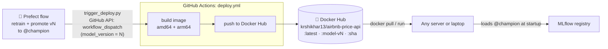

The image itself stays model-free (Task 9). The `model-vN` tag records *which promotion caused this release*.

---

### Step 1 — `.github/workflows/deploy.yml`

```yaml
name: Deploy

on:
  workflow_dispatch:
    inputs:
      model_version:
        description: "AirbnbPriceModel version just promoted to @champion"
        required: true
        type: string

jobs:
  build-and-push:
    runs-on: ubuntu-latest
    steps:
      - uses: actions/checkout@v7
      # QEMU lets this amd64 runner also build the arm64 (Apple Silicon) image.
      - uses: docker/setup-qemu-action@v4
      - uses: docker/setup-buildx-action@v4
      - uses: docker/login-action@v4
        with:
          username: ${{ secrets.DOCKERHUB_USERNAME }}
          password: ${{ secrets.DOCKERHUB_TOKEN }}
      - uses: docker/build-push-action@v7
        with:
          context: .
          # One tag, two builds: Docker picks the right one for each machine.
          platforms: linux/amd64,linux/arm64
          push: true
          tags: |
            ${{ secrets.DOCKERHUB_USERNAME }}/airbnb-price-api:latest
            ${{ secrets.DOCKERHUB_USERNAME }}/airbnb-price-api:model-v${{ inputs.model_version }}
            ${{ secrets.DOCKERHUB_USERNAME }}/airbnb-price-api:${{ github.sha }}
          labels: |
            org.opencontainers.image.revision=${{ github.sha }}
            airbnb.model-version=${{ inputs.model_version }}
          cache-from: type=gha
          cache-to: type=gha,mode=max
```

**Reading it:**

| Part | Meaning |
|---|---|
| `on: workflow_dispatch` | **Only runs when asked** — from the Actions tab or via GitHub's API. Never on every push |
| `inputs.model_version` | A value passed in when triggered; used in a tag and a label |
| `secrets.DOCKERHUB_...` | Encrypted values stored in the repo settings; GitHub hides them in logs |
| `login-action` | Logs in to Docker Hub with the token (never a password) |
| `push: true` | Unlike CI, this job **publishes** |
| Three tags | `latest` = newest release · `model-vN` = which champion triggered it · `<sha>` = exact code |
| `labels` | Metadata baked into the image itself (`docker image inspect` shows them) |

> 💡 **A `workflow_dispatch` workflow must be on the default branch** before it can be triggered. That's why `deploy.yml` went through a PR (#2) and was merged first.

---

### Step 2 — Secrets: Docker Hub Token

Done by you in the browser — tokens never pass through code or chat:

1. **hub.docker.com → Account settings → Personal access tokens → Generate new token** — Read & Write. Copy it once.
2. **GitHub repo → Settings → Secrets and variables → Actions → New repository secret:**
   - `DOCKERHUB_USERNAME` = `krshikhar13`
   - `DOCKERHUB_TOKEN` = the token

---

### Step 3 — First Deploy, by Hand

**Actions → Deploy → Run workflow**, branch `main`, `model_version` = **`3`** (the champion at the time).

Result on Docker Hub:
```
latest                                    pushed 16:16:11 UTC
model-v3                                  pushed 16:16:13 UTC
9f00579b44ef1469ad8de6e3afff3d28a4f2ccb3  pushed 16:16:15 UTC   ← = main's commit
```
Size: 180 MB compressed download (≈850 MB unpacked).

> ⚠️ **API rate limits.** While watching runs we polled GitHub's API without logging in every 20–30 s and hit the limit — **60 requests/hour** for anonymous calls (`remaining 0/60`). Poll gently (once a minute), stop watchers you no longer need, or authenticate.

---

### Step 4 — The Platform Surprise: `no matching manifest for linux/arm64`

Pulling the published image on the Mac failed:
```
docker pull krshikhar13/airbnb-price-api:model-v3
no matching manifest for linux/arm64/v8 in the manifest list entries
```

**Why:** GitHub's runners are Intel/AMD (`amd64`), so the image was built only for `amd64`. This Mac is Apple Silicon (`arm64`). It *could* run with `--platform linux/amd64` (Docker Desktop emulates an Intel CPU — slower), but a plain `docker pull` fails for any Apple Silicon user.

**Fix (PR #3):** build a **multi-architecture** image — `setup-qemu-action` (an emulator that lets the amd64 runner build arm64 too) plus `platforms: linux/amd64,linux/arm64`. One tag now points at two builds, and Docker picks the right one automatically. Cost: the deploy went from ~1 minute to **~5 minutes**, because the arm64 half is built under emulation.

---

### Step 5 — Let the Flow Trigger Deploys: GitHub Token

`scripts/trigger_deploy.py` (Task 10) calls GitHub's API, which needs a token:

**GitHub → Settings → Developer settings → Personal access tokens → Fine-grained tokens → Generate new token**
- Repository access: **Only select repositories** → this repo
- Repository permissions → **Actions: Read and write**

Used only from your own terminal:
```bash
export MLFLOW_TRACKING_URI=http://127.0.0.1:5001
export GITHUB_REPO=shikharkumar13/-NYC-Airbnb-Price-Prediction-MLOps
export GITHUB_TOKEN=<your fine-grained token>
python orchestrate_training.py
```

---

### Step 6 — A Silent Failure, Found and Fixed

The first full run looked perfect:
```
promoted run 3f9000a1... as AirbnbPriceModel v4 @champion
Flow run 'gabby-coot' - Finished in state Completed()
```
…but **no deploy appeared on GitHub.** Investigation:

1. The Prefect log had **no** "skipping deploy trigger" warning → the env vars were set, so GitHub *was* called.
2. GitHub showed no new run → GitHub **refused** the request.
3. Yet `request_deploy` said **COMPLETED** — because `trigger_deploy` only *printed* the error to the terminal and *returned `False`*. Prefect never knew.

**The actual cause** (from the terminal): 
```
403 Resource not accessible by personal access token
```
The fine-grained token didn't have **Actions: Read and write**. Fine-grained tokens start with *no* permissions; each must be granted explicitly. Fixed by editing the token's permissions.

| Error | Usual cause |
|---|---|
| `401 Bad credentials` | Token not exported in *that* terminal, expired, or copied incompletely |
| `403 Resource not accessible by personal access token` | Token lacks **Actions: Read and write** ← *our case* |
| `404 Not Found` | Token not granted this repo, or a typo in `GITHUB_REPO` (ours starts with `-`!) |

**The code fix (PR #4), test-first:** a failed trigger must *fail*, loudly:

```python
class DeployTriggerError(RuntimeError):
    """GitHub refused to start the deploy workflow."""

...
    if response.status_code not in (200, 204):
        raise DeployTriggerError(
            f"GitHub refused to start {WORKFLOW_FILE} for {repo}: "
            f"{response.status_code} {response.text}"
        )
    return True
```

New tests:

| Test | What it proves |
|---|---|
| `test_trigger_deploy_raises_with_githubs_reason` | A 403 raises, and the message includes GitHub's reason |
| `test_request_deploy_task_fails_when_github_rejects` | The real Prefect `request_deploy` task (called via `.fn`) raises — so the flow ends **Failed**, with the reason in Prefect's log |

> 💡 **Lesson:** "returns `False` and prints something" is how errors get lost in automated systems — nobody reads the terminal of a scheduled job at 03:00. In a pipeline, failures should *raise*, so the orchestrator records them.

---

### Step 7 — Verify the Published Multi-Arch Image

After the permission fix, `python -m scripts.trigger_deploy --model-version 4` started a deploy (4 m 53 s, both architectures):

```
latest     archs ['amd64', 'arm64']
model-v4   archs ['amd64', 'arm64']
f664d6b…   archs ['amd64', 'arm64']
```

The real test — what a user would do — with **no `--platform` flag**:
```bash
docker pull krshikhar13/airbnb-price-api:latest        # works now; Docker picked arm64
docker run -d --name airbnb-hub -p 8001:8000 \
  -e MLFLOW_TRACKING_URI=http://host.docker.internal:5001 \
  krshikhar13/airbnb-price-api:latest
```
```
local arch=arm64 | model-version label=4 | revision=f664d6b
INFO:     Loading models:/AirbnbPriceModel@champion from http://host.docker.internal:5001
INFO:     Model loaded
Midtown entire home -> {"predicted_price":244.25,"currency":"USD"}
```
Ready in ~2 s, running natively, same prediction as every earlier check. ✅

---

### Step 8 — The Full Loop: The Flow Deploys By Itself

The deploy in Step 7 was started by a one-off command. The real goal is that **nobody has to click anything**: the flow promotes a model, then triggers the deploy itself. One more run, same terminal:

```bash
git pull                        # includes the loud-failure fix (PR #4)
python orchestrate_training.py
```

| Time (UTC) | What happened | Where |
|---|---|---|
| 17:26:47 | Flow `ruby-aardwolf` starts retraining | Prefect |
| 17:27:29 | `promoted run b5f34b8e... as AirbnbPriceModel v5 @champion` | Prefect → MLflow |
| 17:27:29 | `request_deploy` → **COMPLETED** (no warning, no error) | Prefect |
| 17:27:30 | Deploy run created, `model_version = 5` | GitHub Actions |
| 17:27:57 | `model-v5` pushed, `amd64` + `arm64` | Docker Hub |

The deploy took only **35 seconds** (vs ~5 minutes for v4): the code hadn't changed, so every Docker layer came from GitHub's build cache, and it mostly just added the new `model-v5` tag.

Docker Hub now:
```
latest     pushed 17:27:55 UTC  archs ['amd64', 'arm64']
model-v5   pushed 17:27:57 UTC  archs ['amd64', 'arm64']
model-v4   pushed 17:20:33 UTC  archs ['amd64', 'arm64']
```

---

### What You Should Have at the End of Task 12

```
NYC-Airbnb-Price-Prediction/
├── .github/workflows/
│   ├── ci.yml                  ← PRs: test + build
│   └── deploy.yml              ← on demand: build amd64+arm64, push to Docker Hub
├── scripts/
│   └── trigger_deploy.py       ← raises DeployTriggerError if GitHub refuses
└── ... (Task 1–11 files)
```

**GitHub secrets:** `DOCKERHUB_USERNAME`, `DOCKERHUB_TOKEN`
**Your terminal only:** `GITHUB_TOKEN` (fine-grained, this repo, Actions: Read and write), `GITHUB_REPO`
**Docker Hub:** `krshikhar13/airbnb-price-api` — `latest`, `model-v3`, `model-v4`, `model-v5`, plus commit-SHA tags
**MLflow:** `@champion` → **v5**
**Tests:** 46 passed
**PRs merged:** #2 deploy workflow · #3 multi-arch · #4 fail loudly

---

# TASK 13 — Docker Compose: MLflow + API Together (Optional)

*Written when Task 13 is built.*

**Preview:** a `docker-compose.yml` that runs the MLflow server and the API as two services on one private network. It uses `MLFLOW_TRACKING_URI=http://mlflow-server:5000` as the single setting every component reads, and a healthcheck so the API only starts once MLflow is actually ready.
