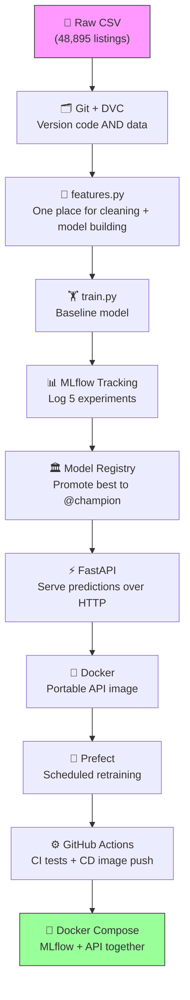
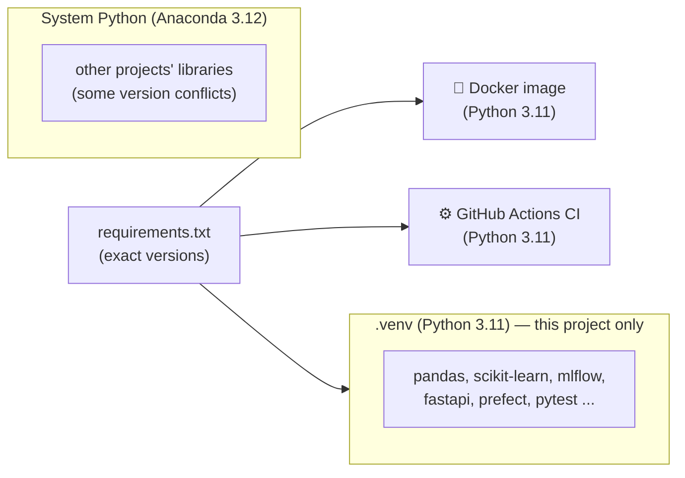
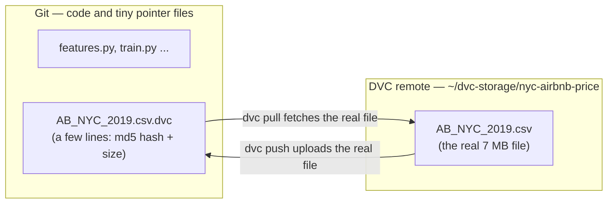
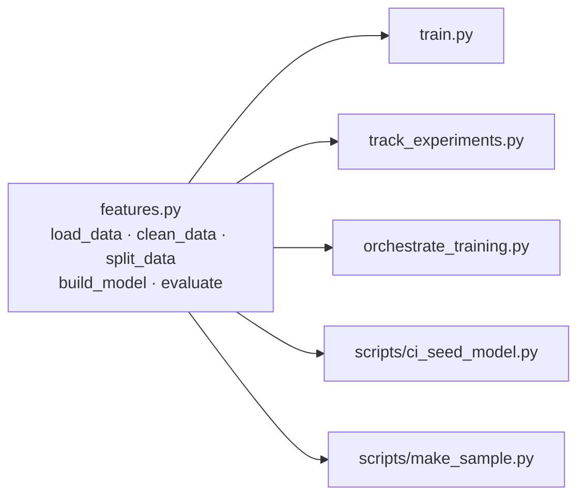
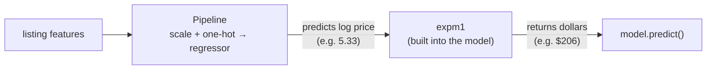
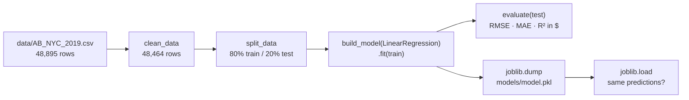
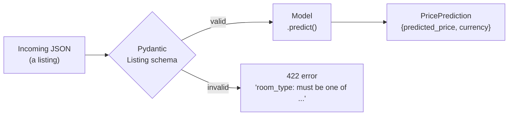

# MLOps Implementation Guide — NYC Airbnb Price Prediction

> **Project:** Predict the nightly price (USD) of a New York City Airbnb listing
> **Dataset:** New York City Airbnb Open Data 2019 — Kaggle / Inside Airbnb (`AB_NYC_2019.csv`, 48,895 rows, 16 columns, **regression**)
> **Goal:** Build the full MLOps flow — Git → DVC → training → FastAPI → MLflow → Docker → Prefect → GitHub Actions → Docker Compose — on a real, messy regression problem, and understand every step.

---

## Roadmap at a Glance

| Task | Tools | What You Build | Status |
|---|---|---|---|
| **1** | Git, uv, pip | Project scaffold, virtual env, pinned requirements | ✅ Done |
| **2** | DVC | Versioned dataset with a local remote | ✅ Done |
| **3** | pandas, scikit-learn, pytest | Shared cleaning + model-building module, tests, CI sample | ✅ Done |
| **4** | scikit-learn, joblib | Baseline training script (`train.py`) | ✅ Done |
| **5** | Pydantic | Input/output schemas with validation | ✅ Done |
| **6** | FastAPI | Prediction REST API | ⏳ Next |
| **7** | MLflow Tracking | Five logged experiments on an MLflow server | ⬜ |
| **8** | MLflow Registry | Best model promoted to `@champion` | ⬜ |
| **9** | Docker | Slim API image that loads the champion at startup | ⬜ |
| **10** | Prefect | Automated, scheduled retraining flow | ⬜ |
| **11** | GitHub Actions | CI — tests on every pull request | ⬜ |
| **12** | GitHub Actions, Docker Hub | CD — push the image when a new model is promoted | ⬜ |
| **13** | Docker Compose | MLflow + API running together (optional) | ⬜ |
| **14** | — | Definition-of-done check + README | ⬜ |

> **How to use this guide:** Each task's section is written once that task is built, using the real commands and outputs from this project, so the guide always matches the code. The step-by-step build plan (with every code file) lives in `docs/superpowers/plans/2026-09-24-nyc-airbnb-price-prediction.md`.

---

## What We Are Building — Big Picture



### Why this project is a step up

Every earlier project in the series was **binary classification** (yes/no). This one is **regression** — the model outputs a number (a price). That changes a few things everywhere:

| Classification (before) | Regression (now) |
|---|---|
| Accuracy, precision, recall | **RMSE, MAE, R²** |
| "Is the prediction above 0.5?" | "Is the price in a sensible dollar range? Does Manhattan cost more than the Bronx?" |
| Balanced-ish labels | **Heavily skewed target** (most listings ~$100, a few up to $10,000) |

The data is also genuinely messy: missing values, `$0` prices, huge outliers, and a column (`neighbourhood`) with 221 different values.

---

### Key decisions made up front

| Decision | Why |
|---|---|
| Train on `log1p(price)`, report in dollars | Price is heavily right-skewed; the log makes it well-behaved for the model. |
| Put the log/exp conversion **inside** the model (`TransformedTargetRegressor`) | Nobody downstream (API, tests) can forget to convert back to dollars. |
| Drop `price == 0` and `price > 800` | 11 rows are `$0` (data errors); 800 ≈ the 99th percentile ($799), removing 420 extreme outliers. |
| One shared module, `features.py` | Four different scripts train models; they must all clean data identically. |
| API loads the model from the MLflow registry, not from a file | Promoting a new model needs a restart, not a code change or rebuild. |
| CI trains on a small committed sample | GitHub's servers can't reach the DVC storage on this laptop. |

---

---

# TASK 1 — Project Scaffold, Virtual Environment, Pinned Requirements

---

### What Problem This Solves

Before writing any ML code we need three foundations:

1. **Git** — a history of every code change, so we can always go back.
2. **An isolated Python environment** — so this project's libraries don't clash with anything else on the machine.
3. **Pinned requirements** — an exact list of library versions, so the code runs the same on this laptop, in Docker, and in CI.

Why the virtual environment matters *on this machine specifically*: the default Python here is Anaconda's 3.12, and pandas already warns about mismatched `numexpr`/`bottleneck` versions in it. Installing MLflow, Prefect, etc. there risks breaking other projects. Also, the Docker image (Task 9) uses **Python 3.11** — the laptop should match, so a model trained here unpickles cleanly there.



---

### Pre-Check — Make Sure These Are Installed

```bash
git --version
# Expected: git version 2.x.x   (this machine: 2.49.0)

uv --version
# Expected: uv 0.x.x            (this machine: 0.9.28)
```

**What is `uv`?** A very fast Python package and environment manager. It creates virtual environments and installs packages like `pip`, but much faster — and it can download Python 3.11 for you if it isn't installed.

---

### Step 1 — Initialize Git on the `main` Branch

```bash
cd "/Users/kumarshikhar/MLOps Projects/NYC-Airbnb-Price-Prediction"
git init -b main
```

**What this does:**
- Creates the hidden `.git/` folder — Git's internal database of every change.
- `-b main` names the first branch `main` (GitHub's default), avoiding a later `master` → `main` rename.

Output:
```
Initialized empty Git repository in /Users/kumarshikhar/MLOps Projects/NYC-Airbnb-Price-Prediction/.git/
```

---

### Step 2 — Create and Activate the Virtual Environment

```bash
uv venv --python 3.11 .venv
source .venv/bin/activate
python --version
```

Expected:
```
Python 3.11.14
```

**What this does:**
- `uv venv --python 3.11 .venv` creates a self-contained Python 3.11 in the `.venv/` folder.
- `source .venv/bin/activate` makes `python` and `pip` in *this terminal* point to `.venv`. Your prompt usually shows `(.venv)`.

> ⚠️ **Activation is per terminal.** Every new terminal window starts *without* the venv. Whenever you open one (for example for the MLflow server or Prefect server later), run `source .venv/bin/activate` from the project folder first.

---

### Step 3 — Install Libraries, Then Pin the Versions Actually Installed

```bash
uv pip install scikit-learn pandas numpy joblib fastapi uvicorn pydantic mlflow prefect pytest requests httpx
uv pip freeze | grep -iE '^(scikit-learn|pandas|numpy|joblib|fastapi|uvicorn|pydantic|mlflow|prefect|pytest|requests|httpx)==' > requirements.txt
cat requirements.txt
```

Result — `requirements.txt`:
```
fastapi==0.141.1
httpx==0.28.1
joblib==1.6.0
mlflow==3.16.1
numpy==2.4.6
pandas==3.0.6
prefect==3.8.6
pydantic==2.13.5
pytest==9.1.1
requests==2.34.2
scikit-learn==1.9.1
uvicorn==0.53.0
```

**What this does:**
- First we install the latest versions, **then** read back exactly what got installed and write those versions down. We never guess version numbers.
- `grep` keeps only the 12 libraries we use directly (the freeze lists ~200 sub-dependencies too).

**What each library is for:**

| Library | Used for |
|---|---|
| pandas, numpy | Loading and cleaning data |
| scikit-learn | Preprocessing + models |
| joblib | Saving the baseline model to disk |
| mlflow | Experiment tracking + model registry |
| fastapi, uvicorn, pydantic | The prediction API and its input validation |
| prefect | Orchestrating/scheduling retraining |
| pytest, httpx | Tests (httpx powers FastAPI's test client) |
| requests | Triggering the GitHub deploy workflow |

---

### Step 4 — Install DVC (Deliberately *Not* in `requirements.txt`)

```bash
uv pip install dvc
dvc --version
# 3.67.1
```

**Why not in `requirements.txt`?** DVC is a tool *you* use on your laptop to fetch data. CI never runs DVC (it uses a committed sample instead — see Task 3), so installing it there would only slow CI down.

---

### Step 5 — Create `.gitignore`

```gitignore
# Python
.venv/
__pycache__/
*.pyc
.pytest_cache/

# Local artifacts (models live in the MLflow registry, data lives in DVC)
models/
mlruns/
mlartifacts/
mlflow.db
mlflow.log

# Misc
.DS_Store
.env

# NOTE: do NOT add data/ here. `dvc add` writes data/.gitignore for the CSV,
# and ignoring the whole folder would stop git from tracking the .dvc pointer file.
```

> ⚠️ **The `data/` trap.** It's tempting to ignore the whole `data/` folder. Don't: Git would then also ignore `data/AB_NYC_2019.csv.dvc` — the small pointer file that DVC *needs* in Git. DVC writes its own precise `data/.gitignore` in Task 2 instead.

---

### Step 6 — Create `pytest.ini`

```ini
[pytest]
pythonpath = .
testpaths = tests
```

**What this does:**
- `pythonpath = .` lets tests `import features`, `import main`, etc. from the project root.
- `testpaths = tests` tells pytest where to look, so plain `pytest` just works.

---

### Step 7 — Commit

```bash
git add .gitignore requirements.txt pytest.ini README.md Implementation_Plan_NYC_Airbnb_Price_Prediction.md docs/
git commit -m "chore: project scaffold, pinned requirements, pytest config"
```

---

### What You Should Have at the End of Task 1

```
NYC-Airbnb-Price-Prediction/
├── .git/                                        ← Git's database
├── .venv/                                       ← Python 3.11 env, NOT in Git
├── .gitignore
├── pytest.ini
├── requirements.txt                             ← 12 pinned libraries
├── README.md
├── Implementation_Plan_NYC_Airbnb_Price_Prediction.md   ← the original spec
└── docs/superpowers/plans/2026-09-24-nyc-airbnb-price-prediction.md  ← build plan
```

**Git tracks:** everything above except `.venv/`
**Commit:** `4318ee4 chore: project scaffold, pinned requirements, pytest config`

---

---

# TASK 2 — DVC: Versioning the Dataset

---

### What Problem This Solves

The dataset is a 7 MB CSV. Putting data in Git is the wrong tool: every version is stored forever, clones get slow, and GitHub rejects large files. But we still need to answer: *"Which exact data was this model trained on?"*

**Git** tracks code. **DVC** tracks data: it stores a tiny *pointer file* (with a fingerprint of the data) in Git, and the real file in separate storage.



---

### Step 1 — Copy the Dataset In Under Its Canonical Name

The Kaggle download on this machine is called `Airbnb NYC 2019.csv` (with spaces). We give it the standard name the spec uses:

```bash
mkdir -p data
cp ~/Downloads/"Airbnb NYC 2019.csv" data/AB_NYC_2019.csv
python -c "import pandas as pd; df = pd.read_csv('data/AB_NYC_2019.csv'); print(df.shape); print(list(df.columns))"
```

Output:
```
(48895, 16)
['id', 'name', 'host_id', 'host_name', 'neighbourhood_group', 'neighbourhood', 'latitude', 'longitude', 'room_type', 'price', 'minimum_nights', 'number_of_reviews', 'last_review', 'reviews_per_month', 'calculated_host_listings_count', 'availability_365']
```

**What we confirmed about the data** (checked against the real file, not assumed):

| Quirk | Actual value |
|---|---|
| Missing values | `name` 16, `host_name` 21, `last_review` 10,052, `reviews_per_month` 10,052 |
| `reviews_per_month` missing exactly when `number_of_reviews == 0` | ✅ True for every row |
| `$0` prices | 11 rows |
| Price median / 99th percentile / max | $106 / $799 / $10,000 |
| Distinct `neighbourhood` values | 221 |
| Latitude / longitude range | 40.4998 – 40.9131 / -74.2444 – -73.7130 |

---

### Step 2 — `dvc init`, Then `dvc add` — Before Any `git add`

```bash
dvc init
dvc add data/AB_NYC_2019.csv
git status --short -uall
```

Output:
```
A  .dvc/.gitignore
A  .dvc/config
A  .dvcignore
?? data/.gitignore
?? data/AB_NYC_2019.csv.dvc
```

**What DVC does behind the scenes:**
1. Computes an MD5 hash (a unique fingerprint) of the CSV.
2. Writes `data/AB_NYC_2019.csv.dvc` — the pointer file with that hash.
3. Copies the CSV into its cache, `.dvc/cache/`.
4. Writes `data/.gitignore` containing `/AB_NYC_2019.csv`, so Git never sees the real file.

> ⚠️ **Order matters (the Article 7.5 lesson).** If you ran `git add -A` *before* `dvc add`, Git would stage the real CSV and it would end up in history forever. Always `dvc add` first, then check that `git status` does **not** list the CSV itself.

The pointer file:
```bash
cat data/AB_NYC_2019.csv.dvc
```
```yaml
outs:
- md5: f772a1d8d29bae6e7a9beac0ae880a2b
  size: 7077973
  hash: md5
  path: AB_NYC_2019.csv
```

Double-check that Git ignores the CSV and *why*:
```bash
git check-ignore -v data/AB_NYC_2019.csv
# data/.gitignore:1:/AB_NYC_2019.csv	data/AB_NYC_2019.csv
```

---

### Step 3 — Set Up a Local DVC Remote and Push

A **remote** is where DVC keeps the real files outside Git. We use a folder in the home directory (outside the project, so deleting the project doesn't delete the data backup). In a cloud setup this would be an S3 bucket.

```bash
mkdir -p ~/dvc-storage/nyc-airbnb-price
dvc remote add -d localremote ~/dvc-storage/nyc-airbnb-price
dvc push
```

Output:
```
Setting 'localremote' as a default remote.
1 file pushed
```

**What `-d` means:** make this the *default* remote, so `dvc push` / `dvc pull` need no extra arguments. The setting is saved in `.dvc/config`:

```ini
[core]
    remote = localremote
['remote "localremote"']
    url = /Users/kumarshikhar/dvc-storage/nyc-airbnb-price
```

---

### Step 4 — Verify: Delete the CSV and Get It Back

This simulates a teammate (or future you) cloning the repo fresh:

```bash
rm data/AB_NYC_2019.csv
ls data/
# AB_NYC_2019.csv.dvc          ← only the pointer is left

dvc pull
wc -l data/AB_NYC_2019.csv
md5 -q data/AB_NYC_2019.csv
```

Output:
```
A       data/AB_NYC_2019.csv
1 file added
   49081 data/AB_NYC_2019.csv
f772a1d8d29bae6e7a9beac0ae880a2b
```

The MD5 matches the pointer file exactly — it's the same data, byte for byte.

> 💡 **Why 49,081 lines but 48,895 rows?** Some listing names contain line breaks inside quotes. `wc -l` counts raw lines; pandas counts real rows.

---

### Step 5 — Commit the Pointer and Config (Not the Data)

```bash
git add .dvc .dvcignore data/AB_NYC_2019.csv.dvc data/.gitignore
git commit -m "data: track AB_NYC_2019.csv with DVC and a local remote"
```

---

### What You Should Have at the End of Task 2

```
NYC-Airbnb-Price-Prediction/
├── .dvc/
│   ├── config                  ← remote settings, IN Git
│   ├── .gitignore              ← keeps cache/ and tmp/ out of Git
│   └── cache/                  ← DVC's local copy, NOT in Git
├── .dvcignore
├── data/
│   ├── AB_NYC_2019.csv         ← real file, NOT in Git
│   ├── AB_NYC_2019.csv.dvc     ← pointer file, IN Git
│   └── .gitignore              ← written by DVC
└── ... (Task 1 files)
```

**Git tracks:** `.dvc/config`, `.dvc/.gitignore`, `.dvcignore`, `data/AB_NYC_2019.csv.dvc`, `data/.gitignore`
**DVC remote stores:** `AB_NYC_2019.csv`
**Commit:** `8457c35 data: track AB_NYC_2019.csv with DVC and a local remote`

---

---

# TASK 3 — `features.py`: One Place for Cleaning and Model Building

---

### What Problem This Solves

Four different scripts will train models in this project:

| Script | Task |
|---|---|
| `train.py` | 4 — baseline |
| `track_experiments.py` | 7 — five MLflow experiments |
| `orchestrate_training.py` | 10 — Prefect flow |
| `scripts/ci_seed_model.py` | 11 — CI |

If each one had its own copy of the cleaning code, they would slowly drift apart ("oh, I changed the outlier cutoff in one place but not the other"). So every rule lives **once**, in `features.py`, and everything else imports it.



---

### The Feature Set

| Type | Columns | What happens to them |
|---|---|---|
| Numeric (7) | `latitude`, `longitude`, `minimum_nights`, `number_of_reviews`, `reviews_per_month`, `calculated_host_listings_count`, `availability_365` | `StandardScaler` (rescaled to mean 0, std 1) |
| Categorical (3) | `neighbourhood_group` (5 values), `neighbourhood` (221 values), `room_type` (3 values) | `OneHotEncoder(handle_unknown="ignore")` |
| Dropped (5) | `id`, `name`, `host_id`, `host_name`, `last_review` | Identifiers or free text/personal data — not useful inputs |
| Target | `price` | Trained as `log1p(price)` |

> 💡 **High-cardinality categoricals.** `neighbourhood` has 221 values, so one-hot encoding creates 221 columns for it alone. That's fine for these models, but it creates a real risk: the API will one day receive a neighbourhood the model never saw in training. `handle_unknown="ignore"` turns an unknown value into all zeros instead of crashing — and we have a test proving it.

---

### The Log-Price Trick, Explained

Most listings cost ~$100, but a few cost thousands. A model trained on raw prices gets dragged around by those few expensive listings. Taking the log squeezes the scale:

| Price | `log1p(price)` |
|---|---|
| $50 | 3.93 |
| $150 | 5.02 |
| $800 | 6.69 |

The model learns on the log scale, and predictions are converted back with `expm1` (the exact inverse of `log1p`).

**The danger:** forgetting to convert back. You'd report "RMSE = 0.5" (log units) or serve a price of "$5.3". So we don't do the conversion by hand anywhere — scikit-learn's `TransformedTargetRegressor` does it **inside the model**:



When this model is saved to MLflow and loaded by the API, the conversion travels with it.

---

### Step 1 — Write the Tests First (Test-Driven Development)

TDD means: **write a test that describes what the code should do, watch it fail, then write the code to make it pass.** Watching it fail proves the test actually tests something.

`tests/test_features.py` builds a tiny six-row fake dataset containing the real quirks — a `$0` price, a `$10,000` outlier, and a listing with no reviews (so `reviews_per_month` is missing):

```python
prices = [0, 50, 150, 300, 800, 10000]
```

and checks:

| Test | What it proves |
|---|---|
| `test_clean_data_drops_zero_and_outlier_prices` | Only `[50, 150, 300, 800]` survive cleaning |
| `test_clean_data_fills_missing_reviews_per_month_with_zero` | Missing review rate → `0`, not the average |
| `test_clean_data_keeps_only_model_columns` | `id`, `name`, etc. are gone |
| `test_log_target_inversion_matches_hand_computed_value` | Predictions are in dollars (see below) |
| `test_evaluate_returns_dollar_scale_metrics` | RMSE is in dollars, not log units |

**The hand-computed check.** A `DummyRegressor(strategy="mean")` simply predicts the average of whatever it was trained on. Trained on log prices, it predicts `mean(log1p(prices))`. So the dollar prediction must be:

```python
expected = np.expm1(np.mean(np.log1p([50, 150, 300, 800])))   # ≈ $206
assert model.predict(X.iloc[[0]])[0] == pytest.approx(expected)
```

If the `expm1` conversion were missing, the model would return ~5.3 and the test would fail.

Run the tests before `features.py` exists:
```bash
pytest tests/test_features.py -v
```
```
E   ModuleNotFoundError: No module named 'features'
```
✅ Failing for the right reason.

---

### Step 2 — Write `features.py`

The key parts (full file in the repo):

```python
MAX_PRICE = 800
RANDOM_STATE = 42

def load_data(path=None):
    """Read the raw CSV. With no path, honour $DATA_PATH (CI uses the sample)."""
    path = path or os.environ.get("DATA_PATH", DEFAULT_DATA_PATH)
    return pd.read_csv(path)

def clean_data(df):
    df = df.copy()
    # reviews_per_month is missing exactly when number_of_reviews == 0:
    # no reviews means a review rate of 0, not the average rate.
    df["reviews_per_month"] = df["reviews_per_month"].fillna(0.0)
    df = df[(df[TARGET] > 0) & (df[TARGET] <= MAX_PRICE)]
    return df[FEATURES + [TARGET]].reset_index(drop=True)

def split_data(df):
    """80/20 split -> (X_train, X_test, y_train, y_test)."""
    return train_test_split(df[FEATURES], df[TARGET], test_size=0.2, random_state=RANDOM_STATE)

def build_model(regressor):
    preprocessor = ColumnTransformer([
        ("num", StandardScaler(), NUMERIC_FEATURES),
        ("cat", OneHotEncoder(handle_unknown="ignore"), CATEGORICAL_FEATURES),
    ])
    pipeline = Pipeline([("preprocess", preprocessor), ("regressor", regressor)])
    return TransformedTargetRegressor(regressor=pipeline, func=np.log1p, inverse_func=np.expm1)

def evaluate(model, X, y):
    """RMSE / MAE / R² on the original dollar scale."""
    predictions = model.predict(X)
    return {"rmse": ..., "mae": ..., "r2": ...}
```

**Why these choices:**
- `fillna(0.0)` — a listing with zero reviews genuinely has a review rate of zero. Filling with the mean would invent reviews that never happened.
- `random_state=42` — the same split every run, so results are comparable across experiments.
- `build_model(regressor)` takes *any* regressor, so Task 7 can plug in RandomForest or GradientBoosting with identical preprocessing.
- `DATA_PATH` environment variable — lets CI point training at the small sample without changing code.

Run the tests again:
```
tests/test_features.py::test_clean_data_drops_zero_and_outlier_prices PASSED
tests/test_features.py::test_clean_data_fills_missing_reviews_per_month_with_zero PASSED
tests/test_features.py::test_clean_data_keeps_only_model_columns PASSED
tests/test_features.py::test_log_target_inversion_matches_hand_computed_value PASSED
tests/test_features.py::test_evaluate_returns_dollar_scale_metrics PASSED
5 passed
```

---

### Step 3 — Create the CI Sample (`scripts/make_sample.py`)

**The problem:** our DVC remote is a folder on this laptop. GitHub Actions runs on GitHub's servers, which can't reach it — so CI can't `dvc pull` the data.

**The fix:** commit a small, random 2,000-row sample of the data to Git, with only the model columns (no names, no ids — no personal data).

```bash
touch scripts/__init__.py
python -m scripts.make_sample
```
```
wrote 2000 rows to tests/fixtures/listings_sample.csv
```

What's in it:
```
(2000, 11)
{'Manhattan': 858, 'Brooklyn': 827, 'Queens': 259, 'Bronx': 42, 'Staten Island': 14}
missing reviews_per_month: 424 | price==0: 0 | price>800: 15
```

All five boroughs are present, and it still has the real quirks (missing values, outliers) — so cleaning is tested on realistic data. File size: 142 KB.

> 💡 **Why `python -m scripts.make_sample` and not `python scripts/make_sample.py`?** Running a file directly puts `scripts/` first on Python's import path, so `import features` (which lives in the project root) would fail. `-m` runs it as a module from the project root. The empty `scripts/__init__.py` makes `scripts` a proper package.

---

### Step 4 — Shared Test Fixtures (`tests/conftest.py`)

pytest automatically loads `conftest.py`. Fixtures defined there are available to every test:

```python
SAMPLE_PATH = Path(__file__).parent / "fixtures" / "listings_sample.csv"

@pytest.fixture(scope="session")
def sample_path():
    """Absolute path, so tests pass no matter which directory pytest runs from."""
    return SAMPLE_PATH

@pytest.fixture(scope="session")
def sample_splits(sample_path):
    """(X_train, X_test, y_train, y_test) from the committed 2,000-row sample."""
    return split_data(clean_data(load_data(sample_path)))
```

`scope="session"` means the sample is loaded once for the whole test run, not once per test.

Two more tests use them:

| Test | What it proves |
|---|---|
| `test_split_data_is_reproducible_80_20` | 80/20 ratio, correct columns, same split every time |
| `test_model_tolerates_unseen_neighbourhood` | A neighbourhood the model never saw (`"Nowhere Heights"`) gives a price, not a crash |

```bash
pytest -v
# 7 passed
```

---

### Step 5 — Audit: Do the Tests Actually Catch Bugs?

A passing test suite only matters if it *fails* when the code is wrong. We deliberately broke `features.py` in nine ways, one at a time, and checked that the tests noticed:

| Deliberate bug | Caught? |
|---|---|
| Removed the `expm1` conversion back to dollars | ✅ |
| Removed the log transform entirely | ✅ |
| Filled missing review rates with the mean instead of 0 | ✅ |
| Kept `$0` prices | ✅ |
| Kept outliers above $800 | ✅ |
| Kept `id` / `name` columns | ✅ |
| 50/50 split instead of 80/20 | ✅ |
| Non-reproducible split (no `random_state`) | ✅ |
| Removed `handle_unknown="ignore"` | ✅ |

We also cloned the repo into a fresh folder, ran `dvc pull`, and ran the tests there — everything passed. That proves the project can be rebuilt from Git + DVC alone.

**Bug the audit found and fixed:** the split test originally used the relative path `"tests/fixtures/listings_sample.csv"`, so it failed if pytest ran from any folder other than the project root. It now uses the `sample_path` fixture, which builds an absolute path from the test file's location.

---

### Step 6 — Commit

```bash
git add features.py scripts/__init__.py scripts/make_sample.py tests/
git commit -m "feat: shared cleaning/pipeline module with log-target model and CI sample"
# after the audit:
git commit -m "test: cwd-independent sample path, cover unseen categories; fix CI rehearsal in plan"
```

---

### What You Should Have at the End of Task 3

```
NYC-Airbnb-Price-Prediction/
├── features.py                        ← all cleaning + model-building rules
├── scripts/
│   ├── __init__.py
│   └── make_sample.py                 ← regenerates the CI sample
├── tests/
│   ├── conftest.py                    ← sample_path, sample_splits fixtures
│   ├── fixtures/
│   │   └── listings_sample.csv        ← 2,000 rows, IN Git (142 KB, no personal data)
│   └── test_features.py               ← 7 tests
└── ... (Task 1–2 files)
```

**Tests:** 7 passed, 0 warnings
**Commits:**
```
1661398 test: cwd-independent sample path, cover unseen categories; fix CI rehearsal in plan
1122c44 feat: shared cleaning/pipeline module with log-target model and CI sample
8457c35 data: track AB_NYC_2019.csv with DVC and a local remote
4318ee4 chore: project scaffold, pinned requirements, pytest config
```

---

---

# TASK 4 — Baseline Training Script (`train.py`)

---

### What Problem This Solves

Before bringing in MLflow, Docker, or anything fancy, we need proof that the **whole pipeline works end to end** on the real data: load → clean → split → train → score → save → reload. That's the job of a *baseline*: the simplest reasonable model, giving us a number every later model has to beat.

We use **LinearRegression** — fast, simple, and hard to get wrong. If something is broken, it's in the pipeline, not in a fancy model.



---

### Understanding the Three Regression Metrics

| Metric | Plain meaning | Good direction |
|---|---|---|
| **RMSE** (root mean squared error) | Typical error in dollars, but big misses count extra (errors are squared before averaging) | Lower |
| **MAE** (mean absolute error) | Average miss in dollars — "on average we're off by $X" | Lower |
| **R²** | Share of the price variation the model explains. 1.0 = perfect, 0 = no better than always guessing the average, negative = worse than that | Higher |

RMSE is always ≥ MAE. The gap between them tells you how much of the error comes from a few large misses.

---

### Step 1 — Write `train.py`

```python
from pathlib import Path

import joblib
from sklearn.linear_model import LinearRegression

from features import build_model, clean_data, evaluate, load_data, split_data

MODEL_PATH = Path("models/model.pkl")


def main():
    df = clean_data(load_data())
    X_train, X_test, y_train, y_test = split_data(df)
    print(f"rows after cleaning: {len(df)}  (train={len(X_train)}, test={len(X_test)})")

    model = build_model(LinearRegression()).fit(X_train, y_train)
    for name, value in evaluate(model, X_test, y_test).items():
        print(f"{name}: {value:.3f}")

    MODEL_PATH.parent.mkdir(exist_ok=True)
    joblib.dump(model, MODEL_PATH)
    reloaded = joblib.load(MODEL_PATH)
    assert (reloaded.predict(X_test.head()) == model.predict(X_test.head())).all()
    print(f"saved and reloaded {MODEL_PATH}")
```

**What this does:**
- The whole script is ~15 lines because every rule lives in `features.py` (Task 3). `train.py` only *wires the steps together*.
- `evaluate` scores on the **test set** — data the model never saw during training. Scoring on training data would flatter the model.
- `joblib.dump` saves the fitted model (preprocessing + regressor + log/dollar conversion, all in one object) to a file.
- The reload-and-compare line proves the saved file really works — not just that *something* was written to disk.

> 💡 **Where's the `expm1`?** There isn't one in this file, on purpose. The model returned by `build_model` converts log-price back to dollars inside `.predict()` (see Task 3), so `evaluate` already sees dollars.

---

### Step 2 — Run It

```bash
python train.py
```

Output:
```
rows after cleaning: 48464  (train=38771, test=9693)
rmse: 83.545
mae: 47.077
r2: 0.395
saved and reloaded models/model.pkl
```

It takes about 1.4 seconds, and `models/model.pkl` is 9.6 KB.

**Where 48,464 comes from:** 48,895 raw rows − 11 rows at `$0` − 420 rows above `$800` = 48,464.

---

### Step 3 — Are These Numbers Sane?

**Check 1 — Right scale?** RMSE $83.5 is "tens of dollars". ✅ If it had printed `0.5` we'd be scoring log prices. If it had printed `4,000` the conversion back would be broken.

**Check 2 — Better than guessing?** We compared against a model that ignores every feature and always predicts the same typical price:

| Model | RMSE | MAE | R² |
|---|---|---|---|
| Always guess the typical price | $110.91 | $71.07 | -0.065 |
| **LinearRegression baseline** | **$83.55** | **$47.08** | **0.395** |

The baseline cuts the average miss from $71 to $47 — the features carry real signal.

> 💡 **Why is the "always guess" R² slightly negative instead of exactly 0?** It's trained on log prices, so its single guess is the *log-average* (about $110), which is lower than the plain dollar average. R² measures against the plain dollar average, so this guess scores a little worse than zero.

**Check 3 — Do individual predictions make sense?** Same host details, different location and room type:

| Listing | Predicted price |
|---|---|
| Midtown Manhattan, entire home | $284.37 |
| Midtown Manhattan, private room | $142.57 |
| Fordham (Bronx), shared room | $36.18 |

Entire home > private room > shared room in the Bronx — exactly the order you'd expect. ✅

**How good is R² = 0.40?** It's a modest start. We only have location, room type and booking activity; nothing about size, bedrooms, photos or amenities. The tree-based models in Task 7 should do better, and now we have the number they have to beat.

---

### Step 4 — Commit (the Code, Not the Model)

```bash
git add train.py
git commit -m "feat: baseline LinearRegression training script (log-price target)"
```

`models/model.pkl` is **not** committed — `models/` is in `.gitignore`. It's a quick local sanity artifact only. From Task 7 onwards, models are stored and versioned in the **MLflow registry**, which is what the API will load from.

---

### What You Should Have at the End of Task 4

```
NYC-Airbnb-Price-Prediction/
├── train.py                  ← baseline training script, IN Git
├── models/
│   └── model.pkl             ← 9.6 KB saved model, NOT in Git
└── ... (Task 1–3 files)
```

**Baseline to beat:** RMSE $83.55 · MAE $47.08 · R² 0.395
**Commit:** `3eb494b feat: baseline LinearRegression training script (log-price target)`

---

---

# TASK 5 — Pydantic Schemas (`schemas.py`)

---

### What Problem This Solves

Soon (Task 6) anyone will be able to send a listing to our API and get a price back. People — and other programs — send bad data: a typo in `room_type`, `minimum_nights: 0`, a latitude with the sign flipped. A machine-learning model **never complains** about bad input: it just returns a confident-looking, meaningless price.

**Pydantic** is a Python library that checks data against a declared shape *before* it reaches the model. We describe what a valid listing looks like once, and every request is checked automatically. FastAPI uses these schemas directly, so a bad request gets a clear `422` error explaining what's wrong.



---

### The Rules We Enforce

The schema's fields match the **model's 10 features exactly** — not the raw CSV. No `id`, `name`, `host_name` or `last_review`: the model doesn't use them, so the API doesn't ask for them.

| Field | Rule | Why |
|---|---|---|
| `neighbourhood_group` | One of Manhattan, Brooklyn, Queens, Bronx, Staten Island | Only 5 boroughs exist |
| `room_type` | One of Entire home/apt, Private room, Shared room | Only 3 types in the data |
| `neighbourhood` | Any non-empty text | 221 values is too many to list; unknown ones are safely ignored by the model (tested in Task 3) |
| `latitude` | 40.49 – 40.92 | NYC's bounding box, slightly padded around the real data (40.4998 – 40.9131) |
| `longitude` | -74.26 – -73.70 | Same (real data: -74.2444 – -73.7130) |
| `minimum_nights` | ≥ 1 | A booking is at least one night |
| `number_of_reviews` | ≥ 0 | Counts can't be negative |
| `reviews_per_month` | ≥ 0 | Rates can't be negative |
| `calculated_host_listings_count` | ≥ 1 | The host has at least this listing |
| `availability_365` | 0 – 365 | Days in a year |

> 💡 **Why bound latitude/longitude at all?** Without bounds, `latitude: -75` (Antarctica) or `longitude: 73.98` (a flipped sign — that's China) would be accepted, and the model would happily return a price for them. The model has never seen anything outside NYC, so its answer would be meaningless.

---

### Step 1 — Write the Tests First

`tests/test_schemas.py`:

```python
def test_valid_listing_is_accepted():
    listing = Listing(**EXAMPLE_LISTING)
    assert listing.room_type == "Entire home/apt"


def test_listing_fields_match_model_features_exactly():
    assert set(Listing.model_fields) == set(features.FEATURES)


@pytest.mark.parametrize(
    "field, value",
    [
        ("room_type", "Castle"),
        ("neighbourhood_group", "New Jersey"),
        ("neighbourhood", ""),
        ("minimum_nights", 0),
        ("number_of_reviews", -1),
        ("reviews_per_month", -0.5),
        ("calculated_host_listings_count", 0),
        ("availability_365", 366),
        ("latitude", -75.0),    # Antarctica
        ("longitude", 73.98),   # sign flipped: that's China
    ],
)
def test_invalid_value_is_rejected(field, value):
    with pytest.raises(ValidationError):
        Listing(**{**EXAMPLE_LISTING, field: value})
```

**What this does:**
- `@pytest.mark.parametrize` runs one test function 10 times, once per `(field, value)` pair. Each run takes a *valid* listing and breaks exactly **one** field — so if the test fails, we know precisely which rule is missing.
- `{**EXAMPLE_LISTING, field: value}` copies the valid example and overwrites one field.
- `pytest.raises(ValidationError)` means "this test passes only if Pydantic rejects the input".
- `test_listing_fields_match_model_features_exactly` ties the schema to `features.FEATURES`. If someone adds a feature to the model but forgets the API, this test fails.

Two more tests: a listing with a missing field is rejected, and `PricePrediction` defaults its currency to `"USD"`.

Run before `schemas.py` exists:
```
E   ModuleNotFoundError: No module named 'schemas'
```
✅ Failing for the right reason.

---

### Step 2 — Write `schemas.py`

```python
from typing import Literal

from pydantic import BaseModel, Field

NYC_LAT_MIN, NYC_LAT_MAX = 40.49, 40.92
NYC_LON_MIN, NYC_LON_MAX = -74.26, -73.70

EXAMPLE_LISTING = {
    "neighbourhood_group": "Manhattan",
    "neighbourhood": "Midtown",
    "latitude": 40.7549,
    "longitude": -73.9840,
    "room_type": "Entire home/apt",
    "minimum_nights": 2,
    "number_of_reviews": 20,
    "reviews_per_month": 1.0,
    "calculated_host_listings_count": 1,
    "availability_365": 180,
}


class Listing(BaseModel):
    model_config = {"json_schema_extra": {"examples": [EXAMPLE_LISTING]}}

    neighbourhood_group: Literal["Manhattan", "Brooklyn", "Queens", "Bronx", "Staten Island"]
    neighbourhood: str = Field(..., min_length=1)
    latitude: float = Field(..., ge=NYC_LAT_MIN, le=NYC_LAT_MAX)
    longitude: float = Field(..., ge=NYC_LON_MIN, le=NYC_LON_MAX)
    room_type: Literal["Entire home/apt", "Private room", "Shared room"]
    minimum_nights: int = Field(..., ge=1)
    number_of_reviews: int = Field(..., ge=0)
    reviews_per_month: float = Field(..., ge=0)
    calculated_host_listings_count: int = Field(..., ge=1)
    availability_365: int = Field(..., ge=0, le=365)


class PricePrediction(BaseModel):
    predicted_price: float
    currency: str = "USD"
```

**Reading the syntax:**
- `Literal[...]` — the value must be exactly one of these strings.
- `Field(...)` — the `...` means "required, no default".
- `ge` / `le` — "greater than or equal" / "less than or equal".
- `min_length=1` — no empty strings.
- `model_config = {"json_schema_extra": ...}` — puts `EXAMPLE_LISTING` into FastAPI's auto-generated docs page, so the "Try it out" button starts with a valid request (Task 6).
- `EXAMPLE_LISTING` lives here (not in the tests) so the tests, the API docs, and later tasks all share one known-good listing.

Run the tests:
```bash
pytest tests/test_schemas.py -v
# 14 passed
```

---

### Step 3 — Break a Rule on Purpose and Watch It Fail

A test that has never failed might not be testing anything. So we deliberately weakened one rule — `minimum_nights: ge=1` → `ge=0` — and re-ran:

```
E       Failed: DID NOT RAISE ValidationError
FAILED tests/test_schemas.py::test_invalid_value_is_rejected[minimum_nights-0]
1 failed, 13 passed
```

Exactly the one matching test failed, and its name tells us which field and value. After reverting: `14 passed`. ✅

---

### Step 4 — Make Sure We Don't Reject Real Listings

Strict validation has the opposite risk too: bounds so tight they reject real data. We ran every one of the 48,464 cleaned training listings through `Listing`:

```
validated 48464 real listings, rejected 0
```

The rules block nonsense without blocking anything the model was trained on. ✅

---

### Step 5 — Commit

```bash
git add schemas.py tests/test_schemas.py
git commit -m "feat: Listing/PricePrediction schemas with NYC bounds and tests"
```

---

### What You Should Have at the End of Task 5

```
NYC-Airbnb-Price-Prediction/
├── schemas.py                ← Listing, PricePrediction, EXAMPLE_LISTING
├── tests/
│   └── test_schemas.py       ← 14 tests
└── ... (Task 1–4 files)
```

**Tests:** 21 passed (7 features + 14 schemas)
**Commit:** `afa4887 feat: Listing/PricePrediction schemas with NYC bounds and tests`

---

---

# TASK 6 — FastAPI Prediction Service (`main.py`)

*Written when Task 6 is built.*

**Preview:** a web API with `GET /health` and `POST /predict`. It loads the model once at startup from the MLflow registry (`models:/AirbnbPriceModel@champion`), not from a file path. Until MLflow exists (Task 7), we test it with a stand-in "fake model", so the API logic is proven independently of MLflow.
